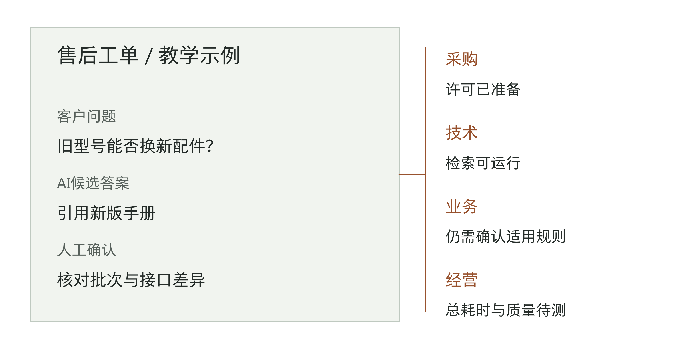
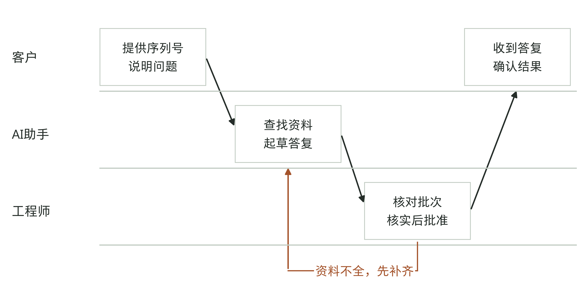
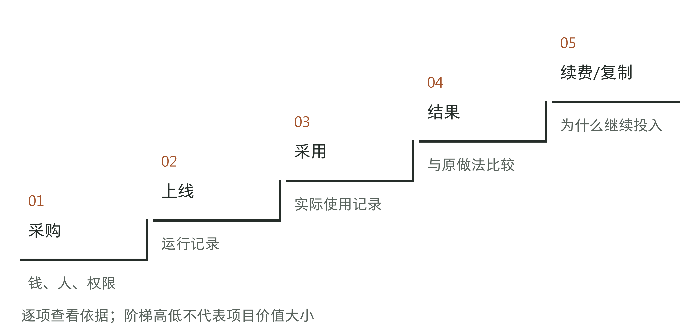
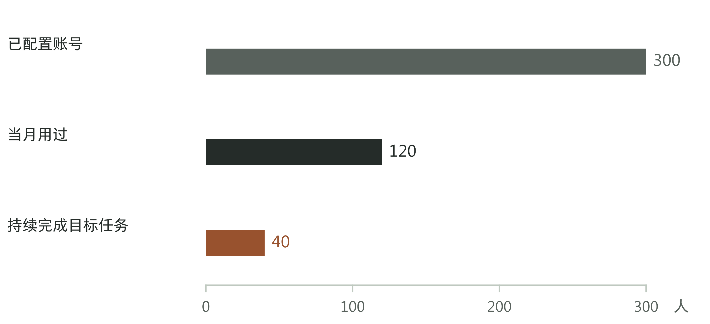
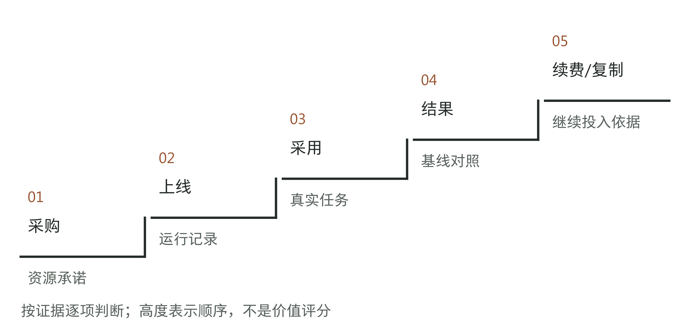

# 第1章 模型很强，为什么企业还没有结果

## AI已经回答，为什么还要打那个电话

一家工业设备公司的售后工程师收到客户询问：旧型号设备能不能换用新配件？他把问题交给刚试用的AI助手。系统很快给出答案，列出适配条件，还附上了产品手册的出处。工程师读完，仍拿起电话找了一位老师傅。

老师傅提醒他，某批旧设备的接口与新设备不同。AI引用的是新版手册，手册本身没有错，却未必适用于客户手里的那台设备。要答复客户，还得核对设备序列号和生产批次。

这是一个虚构的售后场景，用来讨论企业引入AI后可能遇到的问题。公司已经买了账号、接了知识库，也能演示问答，但客户的设备能不能换配件，最后仍要问老师傅。

如果你是老板，很容易怀疑模型不够聪明，或者员工还不会用。可在这个例子里，系统找到了真实资料，工程师也确实用了工具。缺少的是一条关键规则：不同批次的设备，分别可以使用哪些配件。过去，大家遇到这种问题就找老师傅；现在想让AI帮忙判断，就得先把这些规则整理出来。

图1-1｜同一张工单，采购、技术、业务与经营负责人关心的问题不同。作者虚构教学示例。

在批次没有核实之前，工程师还得请老师傅把关。配件一旦装错，可能需要返工，甚至损坏设备。判断AI有没有帮助，要看两个人的工作怎样变了：如果工程师不用再翻遍手册，老师傅也只需核实设备批次，这个工具就可能省下时间。如果老师傅仍要从头查资料，还得纠正AI的答案，反而可能比以前更费事。

所以，有人复核，并不说明AI没有价值；AI给出了答案，也不说明事情已经办完。客户需要知道自己的设备究竟能不能换配件，公司要对答复负责。评价这次投入，就要从客户提出问题一直看到答复得到确认，算清工程师和老师傅各花了多少时间，有没有增加返工。

我建议企业在追加AI投入前，先把这样一项任务从头到尾看一遍。问题究竟出在模型、资料，还是没人有权作决定，往往要看过实际处理过程才分得清。否则，下一笔钱可能只让演示更好看，员工依然得打同样的电话。

## 下一笔钱该换模型，还是补规则

继续看这家公司的售后项目。技术团队想换一个更强的模型，售后主管则希望先整理旧设备的批次与配件规则。两件事都要花钱或占用时间，老板该先支持哪一件？

可以先选几张已有明确处理结论的工单，做两组对照。一组让系统按平常的方式查资料、作答；另一组把经售后人员确认的设备批次、适用手册和批准规则直接提供给它，再看答案有什么变化。尽量保持模型、提问方式等条件不变，才能判断补齐资料有没有帮助。这只是查找问题的起点，几张工单不能证明整个系统已经可靠。

资料给全了仍反复答错，就要继续检查系统是否读懂了限制条件，以及这类任务是否超出了它的能力。补齐资料后能答对，按日常方式却容易出错，则应先查系统有没有拿到正确资料、有没有分清适用范围。这些结果能帮助团队缩小排查范围，还不能据此认定只有一种原因。无论换不换模型，哪条规则适用于哪批设备，都需要售后部门先确认。

表1-1｜同一张配件工单，三种问题需要不同的处理办法。作者教学示例。

| 观察到的情况 | 先查什么 | 查清以前为什么不宜扩大使用 |
|---|---|---|
| 批次与规则都已给出，系统仍用错条件 | 系统是否理解限制条件，任务是否超出能力 | 资料齐全时仍会答错 |
| 能找到手册，却不知道哪版适用 | 谁确认批次规则，系统怎样找到适用资料 | 多放几本手册不一定能解决版本混用 |
| 建议可用，但没有人能批准更换配件 | 谁有批准权，申请该交给谁 | 工程师仍无法给客户确定的答复 |

查清问题，才能安排下一步工作。如果缺的是批次规则，可以先请老师傅和售后主管把一类常见设备的规则整理出来，再请有权批准的人确认。暂时说不清的批次继续由人处理。系统则应指出还缺哪些信息，让工程师知道该问什么，不必每次都请老师傅从头检查。

整理规则也要付出成本：业务骨干得抽出时间，产品变化后还得有人更新。以前大家靠打电话、找熟人解决问题，同样花了时间，只是公司未必单独记过这笔账。现在要让系统使用这些规则，就得明确由谁维护。如果暂时安排不了人，系统就只能处理那些已有可靠资料的任务。

图1-2｜售后流程设计示例：AI查资料、起草答复，工程师核对后按权限批准；资料不足时先补充。这里假设工程师有相应批准权，否则还需交给有权批准的人。作者虚构教学示例。

按这个分工，工程师仍要对答复负责，但可以少做一些查找和整理资料的工作。试点要检验这种分工是否可行，就得比较一张工单从接收到答复所花的总时间、答复质量，以及哪些情况仍需要老师傅介入。只看AI几秒钟就生成了答案，还看不出这些变化。

对照以后，也可能发现某类任务暂时不适合交给AI。那就先缩小范围，等问题解决后再试。比起继续买账号，弄清楚哪些工作现在做不了，更能帮助老板决定下一笔钱花在哪里。

## 项目到底做到哪一步了

采购负责人说账号已经买齐，技术负责人说系统已经接通，售后主管却说工单仍不好处理。他们对同一项目的评价不同，是因为各自看的事情不同。老板需要分清这些进展，才能判断还缺什么。

本书把这些进展分为采购、上线、采用、结果、续费或复制，称为“五道闸门”。这是我用来判断项目进展的框架。[1] 后一步需要回答的问题，不能靠前一步的成绩来回答。企业自建工具时，“采购”也包括预算有没有落实、人员是否到位、需要的使用权限是否取得。

图1-3｜五个阶段分别要查看哪些依据。作者分析框架；阶梯高低表示讨论顺序，不表示项目价值大小。

采购解决的是资源问题。上线则要看工具能否在实际工作环境中运行：员工能不能登录，能看到哪些资料，出了错找谁处理。在演示电脑上运行成功，并不能说明这些问题都已解决。

“采用”指员工开始在日常工作中使用工具。一个工程师每天登录，却仍靠电话处理所有工单；另一个用系统查资料，只把少数例外交给老师傅。两个人的登录次数可能一样，只有后者说明AI已经参与了工单处理。

再往下看，才是结果。答复质量有没有下降？一张工单总共快了多少？新增的资料维护和复核工作占用了多少时间？这些问题还没查清，就可以如实报告已经上线、有人使用，但不能急着说公司已经获得回报。

有了结果，再考虑继续用、扩大到更多人，还是推广到另一个部门。一个部门用得好，可能因为资料齐全、任务合适，也有人负责维护；把同一套系统搬过去，未必具备相同条件。试点也不必都长期做下去。如果它原本只为完成一项限时任务，任务结束后关闭就很正常。

公开项目记录也要分开看。美国联邦紧急事务管理局曾开展名为PARC的试点，探索用生成式AI辅助地方政府编制灾害缓解计划。[2] 2025年1月，主管部门公告称，包括该机构在内的三个生成式AI试点已经完成。后来，美国政府问责局的审计报告记载，官员在2026年2月报告PARC已经退役、不再使用。[3][4] 现有材料没有解释它为什么退役，因此不能据此判定项目失败。但“试点已经完成”显然不能用来证明它此后一直在用。

这样区分，老板就不必对一个项目只说“成功”或“失败”。售后助手已经能检索资料，可以肯定这部分工作；如果还没有减轻工单负担，就继续查原因。承认已经做到的事，与追问尚未解决的问题，并不矛盾。

## 员工凭什么敢把真实工作交给AI

从系统上线到员工愿意使用，中间还有一道实际的难题：出了错谁承担后果？对售后工程师来说，项目组一句“模型表现很好”，不足以让他放心答复客户。他需要知道哪些答案可以用，哪些还得找人核实。

摩根士丹利的公开材料介绍了它怎样检验AI助手。公司2023年的报告说，内部助手用于查找研究、产品和流程信息。[5] OpenAI后来发布的案例描述了具体做法：顾问和提示词工程师给AI摘要的准确性、连贯性评分，团队根据反馈调整；上线后，团队还每天用一组样例问题做回归测试，检查原来能答好的问题是否仍能答好。[6]

这其中，业务人员要做的远不止参加一次演示。他们得指出摘要漏了什么、哪些内容不能用于实际工作，技术人员才能据此修改。改完再用原来的问题检查一遍，是为了防止解决了一个问题，却让另一个问题重新出现。

这也是业务部门不能把判断全部交给供应商的原因。系统可以由供应商开发，回答能不能用于本公司的工作，却需要熟悉业务的人来判断。回到配件工单：在不知道设备批次时，系统最好明确提示“请先补充批次信息，目前还不能判断能否更换”，而不是写出一段看似完整的更换建议。这样，工程师才知道还要核实什么。

表1-2｜售后助手需要检查哪些情况。以下为作者设计的测试思路，不是摩根士丹利的测试题。

| 给系统的任务 | 要检查什么 |
|---|---|
| 设备批次明确，适用规则齐全 | 能否找到正确依据，给出适用于该设备的答复 |
| 同时存在新旧手册 | 能否区分适用范围，避免只选日期更新的手册 |
| 缺少设备序列号或批次 | 能否指出缺少的信息，提示补充后再判断 |
| 规则更新后重做旧工单 | 是否按新规则处理，原先答对的问题是否仍能答对 |

第一轮测试可以先选一类任务，不必覆盖整个售后业务。但在这一类任务里，既要有资料齐全的正常工单，也要有批次不明、手册冲突等情况。只反复演示容易答对的题目，看不出系统遇到麻烦时会怎样处理。

工程师反复指出某批设备资料不全，未必是不愿改变工作习惯。他可能确实遇到了一个没解决的问题。团队应让他看到后续处理：缺的规则补上了没有，原来答错的问题能不能答对，仍然无法判断时该找谁。员工培训能教会操作，但要让人愿意继续用，还得在实际工作中解决这些顾虑。

OpenAI的同一案例披露，超过98%的顾问团队使用摩根士丹利的内部助手。[6] 这里统计的是顾问团队，不是每位员工，也不是所有任务。仅凭这份供应商案例，还不能判断高采用率在多大程度上来自上述测试。其他企业可以借鉴测试方法，至于有没有用，仍要拿自己的任务来验证。

## 省下来的时间，最后去了哪里

假设售后助手开始被员工使用，项目会上有人汇报：“我们已经给300名员工各开通了一个账号。”老板追问后得知，当月有120人用过，其中40人持续用它处理配件工单。下面用这组虚构数据算一笔账。

图1-4｜300名员工各有一个账号，其中120人当月用过，40人持续用它处理目标工单。横轴从零开始，三组人数按同一比例绘制。作者教学数据。

三个数都可能准确，但回答的是三个不同的问题：给多少人开通了工具，多少人试过，多少人用它处理工作。不能只凭300人与40人的差距，就认定员工不配合。有的人当月没有这类工单，有的人试过以后发现需要返工，还有的人用得顺手，只是任务不常发生。先查清原因，才知道该把工具放到更方便使用的位置、修正功能，还是减少闲置账号。

接着看这40名持续使用者。假设每人当月处理20张工单，共800张。用AI起草答复，每张比原来少花10分钟，总共节省约133小时；但核对和修改又比原来多花4分钟，合计新增约53小时。两项相抵，这批工单净省80小时。

算式是：40×20×（10－4）÷60＝80小时。这里容易漏算的，是多出来的4分钟：项目汇报写上了起草快了多少，工程师花在检查上的时间却没记进去。

图1-5｜起草节省约133小时，扣除新增复核约53小时，净省80小时。柱上数字取整显示，计算使用未取整数据。作者教学算例，单位为小时。

这笔账有几个前提：比较的是难度相近的任务，答复质量没有下降，其他步骤的用时不变，新增核对与修改也都计入了那4分钟。如果客户因错误又打来电话，返工时间就要补算；如果失败后只能重新交给人处理，也不能把这类工单排除在统计之外。已经计入那53小时的工作，则不能再扣一次。

那为什么财务还可能看不到支出下降？因为省下80小时，并不会自动少发80小时的工资。还得看员工腾出的时间能做什么。

如果员工手里有积压工单，就可能用这些时间多处理几张，让客户少等一会儿。但如果时间零散地分在一天里，下一项工作又必须等别人批准，就未必能多完成多少任务。同样是80小时，能不能用来做别的事，会影响它给公司带来的好处。单把工时乘上平均工资，看不出这种差别。

表1-3｜省下的时间用在哪里，就到哪里看结果。作者教学分析，未假定已取得收益。

| 时间用在哪里 | 怎样检查结果 |
|---|---|
| 处理积压工单 | 积压是否减少，客户是否少等，返工是否增加 |
| 承接原计划外包的工作 | 同类任务的质量、完成量和实际外包支出怎样变化 |
| 多与客户沟通，或减轻员工负担 | 服务体验或工作负担是否改善，不直接折算成现金 |
| 时间太零散，暂时没用上 | 能否通过排班、合并任务或调整交接，把时间利用起来 |

维持系统运行还会产生费用。新配件上市后谁更新资料，错误反馈由谁处理，系统不可用时谁来接手？这些工作未必记在800张工单的处理时间里，但同样需要安排人手。判断是否长期使用，还要把维护、软件许可、系统集成和培训的费用一起算进去。

所以，我不会仅凭“节省80小时”就建议扩大使用，也不会因为工资总额没变就说项目无效。如果这些时间确实用来处理了积压，新增运行费用也可以接受，就有理由继续用。如果节省时间的同时增加了差错，则应先解决质量问题。倘若老师傅多做了检查却没被计时，还得先重算那80小时，不能拿漏算后的数字作决定。

老板需要先明确，这次投入希望改善什么：少花钱、多处理工单、减少差错，还是减轻员工负担。目标不同，要看的结果也不同；比较使用AI前后的变化时，任务范围和计算方法则要一致。第12章会进一步讨论怎样验证经营结果。这里先把时间省了多少、用到了哪里、实际增加了哪些费用分清，就能避免把节省工时直接当成利润。

## 下一次项目会，先拿出一张真实工单

回到开篇的售后项目。前面的80小时只是算例，这家公司还没有测出自己的结果：旧设备的批次规则没补齐，也没有持续记录员工怎样处理工单、总共花了多少时间。此时再做一次顺利的演示，仍然回答不了该不该全员推广。

我建议先选一类有实际需求、业务负责人也愿意参与的配件工单，整理资料，明确批准人，再跟踪处理过程。比较时既看正常工单，也看批次不明等容易出错的情况。

项目负责人可以用下面这张表，把各部门知道的情况放在一起讨论。

表1-4｜这家售后公司下一轮要解决什么。作者虚构填写示例。

| 查看哪一步 | 目前知道什么 | 下一步由谁做什么 |
|---|---|---|
| 采购 | 账号已开通 | 项目负责人核对所需账号数量 |
| 上线 | 可以测试问答，旧设备适用规则未补齐 | 售后主管确认规则；技术负责人让系统按批次选用资料 |
| 采用 | 持续用它处理哪些工单，还不清楚 | 工程师记录处理过程及求助原因 |
| 结果 | 尚未比较完整工单的处理情况 | 业务负责人比较质量、总用时及新增工作 |
| 继续投入 | 还没有足够依据支持扩大使用 | 老板安排修正，复盘后再定范围 |

表里还没查清的事，要逐项安排人去查。谁确认旧设备规则，何时给出结论；谁记录工单，观察多久，都要在散会前说定。下次再检查查到了什么、还卡在哪里。如果没人有权确认规则，老板就得先明确谁来作决定，不能让技术团队靠改答案解决授权问题。

复盘后的决定可以不同。规则补齐后仍反复答错，就先缩小系统处理的范围，或继续由人处理；质量没变差、总用时也少了，但员工找工具很麻烦，就把它接到常用的工作界面；现有工单处理顺利，却没有更多需求，就不必再买账号。下一步做什么，应由查到的问题决定。

随章的“AI项目真实状态五问”可供填写。带上一张实际工单，填清下一步做什么、谁负责、什么时候再检查。

从核实批次规则、把规则交给系统，到检查实际效果，需要有人把业务和技术两边的工作接起来。前线部署工程师（Forward Deployed Engineer，简称FDE）就是承担这类工作的角色之一。下一章从这个角色的来历说起，看看工程师进入业务现场后，工作有什么不同。

## 资料与说明

[1] 五道闸门是作者综合研究提出的分析框架，用于区分资源是否到位、系统能否运行、员工是否使用、工作有何变化，以及是否继续投入。项目可以暂停、缩小或结束，不必一路扩大。售后公司、配件工单、测试思路和工时数字均为教学设计，不是真实客户项目记录。

[2] DHS，Federal Emergency Management Agency AI Use Cases，PARC（DHS-254）条目。本章据此说明项目用途，以及存档条目标注的Retired（已退役）状态；该状态不能说明退役原因或确切停用日期。https://www.dhs.gov/ai/use-case-inventory/fema

[3] DHS，2025年1月17日年度工作公告，生成式AI试点段落。公告涉及三个试点，没有单独说明PARC取得了什么成效。https://www.dhs.gov/archive/news/2025/01/17/dhs-strengthened-and-innovated-leveraged-new-partnerships-and-invested-workforce

[4] GAO，Artificial Intelligence Acquisitions: Agencies Should Collect and Apply Lessons Learned to Improve Future Procurements，GAO-26-107859，2026年4月13日，印刷页34（PDF第38页），表4。2026年2月是官员报告退役状态的月份，不能据此认定系统就在该月停用。https://files.gao.gov/reports/GAO-26-107859/index.html

[5] Morgan Stanley Wealth Management，Insights & Outcomes，Volume 6，2023年，印刷页36—37（PDF第19页）。本章据此说明Assistant用于内部信息检索。https://www.morganstanley.com/cs/pdf/FOR-Insights-and-Outcomes-VOL6-layout-ebook-digital.pdf

[6] OpenAI，Morgan Stanley uses AI evals to shape the future of financial services，2026年9月17日核查。评价与测试做法见Building a foundation和Strengthening trust两节；超过98%的统计对象是顾问团队。文章为供应商案例，未提供可独立核对采用率的原始数据，也未完整说明统计时段或评测做法与财务结果之间的关系。https://openai.com/index/morgan-stanley/
