# 第2章 FDE从哪里来：把工程师送到业务现场

## 需求已经写清，为什么还在返工

销售演示结束时，客户点了头。需求评审结束时，双方签了字。等到系统真正交到使用者手里，新的问题却一个接一个出现：这张报表没有说清退款怎么算，那条审批遇到特殊客户不能照常走，几个系统里的同一个名字竟然指向不同对象。项目组觉得客户不断变更需求，业务人员觉得系统始终没有理解自己的工作。

这是一个虚构的交付场景。双方可能都认真做了自己的事：售前判断产品是否适合，实施按约定完成配置，业务负责人照常处理业务。但任务交给下一组人时，往往只剩下“要做什么”，没说清为什么这样做、遇到什么情况要例外处理，以及该由谁决定。

需求文档可以写明“按门店统计收入”，但退款算在哪家店、闭店期间的订单怎样处理，仍要逐项确定。老员工平时知道怎样处理，写需求时却未必意识到这些细节也要交代。工程师隔着几层人听需求，收到的可能是一张张修改工单，看不出它们其实来自同一个没有说清的问题。

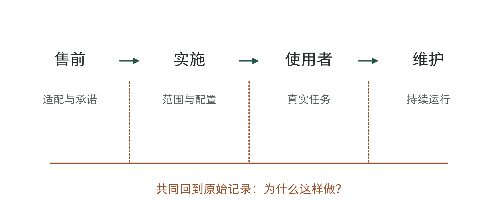

图2-1｜交接如何丢失问题的来由。作者绘制的交接断点图。每一环都可能完成局部任务；虚线标出需要共同核对真实记录的位置，不表示传统岗位必然失效。

前线部署工程师（FDE，Forward Deployed Engineer）的做法，是让能构建和修改系统的工程师直接与使用者工作。他们看到实际问题，修改系统，再把发现的问题交给产品团队讨论。本书保留FDE这个简称，因为“驻场”只说明人在哪里，没说明他有权改什么、负责交付什么。

这样安排也有代价。工程师到客户现场，就会少一些开发通用产品的时间；一个客户接连提出的要求，也可能占满他的日程。老板需要权衡：为了少几次转述、早一点弄清问题，值得投入多少工程时间？这些现场工作能否帮助下一个项目，还是每来一个客户都得重做一遍？

下面回看FDE的历史，重点看两件事：现场工程师怎样了解问题、修改系统，以及这些工作怎样帮助产品和团队。岗位名称能提供线索，具体职责才说明这家公司怎么做。

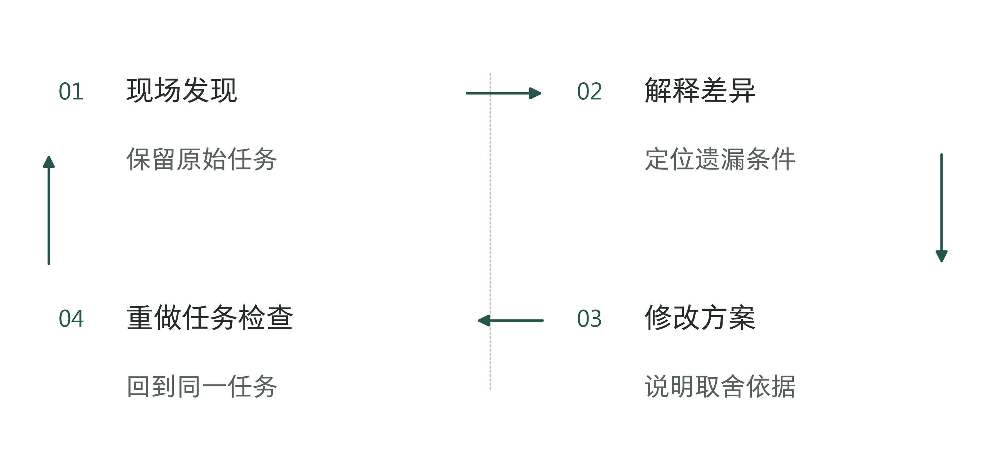

图2-2｜返工时先查原来的需求。作者分析工具；发现返工时先核对原来的问题，不能只让下一组人修补。

## 名称的历史，要从能核对的记录说起

在本书研究所核验的公开材料中，数据分析软件公司Palantir是最早能确认正式使用FDE名称的公司。互联网档案馆保存的2009年3月31日招聘目录，已经列出面向澳大利亚的Forward Deployed Engineer职位。[1] 这意味着该名称至迟在这个快照时间已经用于公开招聘；快照日期并不是岗位设立日，也不能当作词语诞生日。

同年美国劳工部披露的一宗Palantir申请，也使用完整FDE职位名称。[2] 招聘与正式申报相互补充；两者都不能给出岗位设立日或员工总数。

2010年的会议手册已在多位具名人员的介绍中使用FDE头衔，同时列出其他工程和分析岗位。[3] 这说明FDE没有只出现在一则招聘里；原件出处见章注。

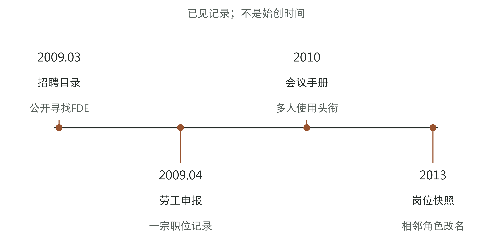

图2-3｜早期FDE名称的公开记录。历史节点依据招聘快照、劳工部数据和会议原件整理。[1][2][3][4] 节点等距用于阅读，不代表时间长度；“已见记录”不等于“始创日期”。

2013年一对招聘快照中，同一记录从Embedded Analyst（嵌入式分析师）改名为Deployment Strategist（部署策略师），职责延续且仍强调与FDE合作。[4] 这提示现场部署已有不同分工，不能推断全公司同时改名。

这些记录说明，现场工作不全由一个岗位承担。有的人负责构建系统，有的人负责与业务人员确定问题、帮助用户使用，两边需要配合。企业可以学习这种分工，但不能因为一个岗位历史悠久，就认定招聘同名人员会带来同样的结果。

对经营者来说，这段历史说明FDE并非大模型热潮之后才出现。复杂软件要用于客户的实际工作，早就需要工程师到现场解决问题。AI能处理更多任务，却仍需要可靠资料、明确流程和使用权限。这些条件没准备好，模型再强也可能卡在同样的地方。

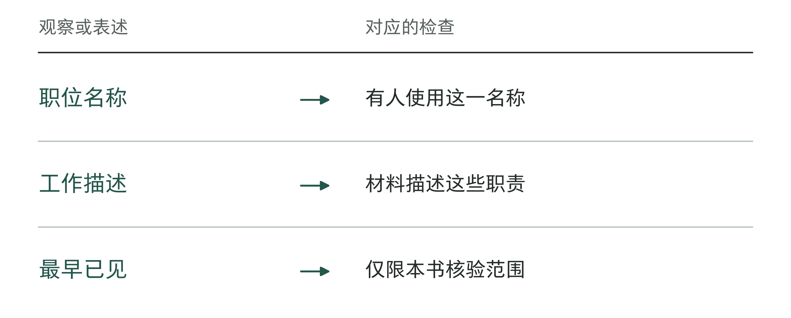

图2-4｜历史记录的读法。作者分析工具；名称、工作方式和起源结论需要不同强度的证据。

## 工作方式不只属于一个名字

把工程师送到客户身边，并非只有Palantir做过。Aster Data早期工程负责人Chris Neumann在多年后的回顾中写到，他从2008年底开始安排核心工程师去客户现场，以较长时间的共同工作理解问题。[5] 这是一位参与者对工作方式的回忆，说明其他企业也曾尝试类似做法；它不是当时使用FDE正式名称的同期证据。

这个区别值得保留。即使没有一个叫FDE的岗位，一家公司也可能安排产品工程师与用户共同工作；即使招聘名称叫FDE，实际工作也可能主要是售前验证和技术支持。到2014年，MemSQL的历史招聘页面已经使用FDE名称，职责同时涉及概念验证、客户支持、关系维护与产品反馈。[6] 同一个名字跨出一家企业以后，工作组合就可能发生变化。

老板没有必要先问“谁最正宗”。更实用的做法，是拿一个即将发生的具体问题来问候选团队：客户说结果不对，你们能看到原始工作记录吗？能和实际操作的人直接核对吗？能修改系统吗？需要核心产品改进时，有没有明确的反馈通道？修改以后，由谁确认它真的进入了日常工作？

表2-1｜读历史材料时分开名称、机制与结果。作者归纳，不是对材料价值的简单排名。

| 看到的材料 | 可以据此判断 | 还不能据此判断 |
|---|---|---|
| 早期招聘与正式申报 | 当时已使用岗位名称 | 谁发明名称、团队总人数 |
| 参与者多年后的回顾 | 当事人如何解释经历 | 每个细节均有同期证明 |
| 不同公司的同名招聘 | 名称已扩散、职责有交集 | 工作方式相同、经济效果相同 |

了解这些不同做法，也能帮助企业选择适合自己的安排。中型制造企业未必需要照搬大型软件公司的编制。两名现有工程师，加上一位有时间参与的业务负责人，可能就足以减少需求转述。如果问题已经清楚，企业需要的也可能只是稳定的实施服务，额外派探索团队反而增加成本。

专业服务和实施团队也能理解业务、帮助员工使用工具，并把发现的问题反馈给产品团队。这里要比较的是职责和权限怎样安排，不是哪一种岗位应该被淘汰。同样的工作，可以由不同形式的团队完成。

表2-2｜比较工作方式时保留哪些差异（作者检查工具）

| 比较维度 | 核对问题 |
|---|---|
| 现场接触 | 是否能接触原始任务与使用者？ |
| 改变权限 | 能改配置、代码还是只能提出建议？ |
| 反馈路径 | 现场发现的问题怎样影响产品修改？ |

## 现场到底改变了什么

回到开头那类项目。假设一家配送企业要减少异常订单的处理时间，这是本章的虚构教学例子。需求文档写的是“发现地址异常后自动提醒”。工程师第一次坐在调度员旁边观察，才看见提醒并没有结束工作：调度员还要判断是不是老客户、是不是园区内部的新楼号、是否可以联系司机先确认，最后才决定让客服重新询问。

这些判断未必都值得自动化。工程师先要弄清，哪些是稳定规则，哪些依赖临时信息，哪些必须由有权的人决定。若只把原来的一次提醒改成AI生成的一段解释，调度员仍得做同样的确认，甚至需要多读一段话。

跟着调度员做一次工作，工程师就能少猜一些。他可以看到记录从哪来、卡在哪里、谁补充了信息，也能问清调度员为什么不愿点某个按钮。例如，点击后会覆盖原有备注，而这些备注交班时还要用。只看点击率，很容易误以为员工不会操作。

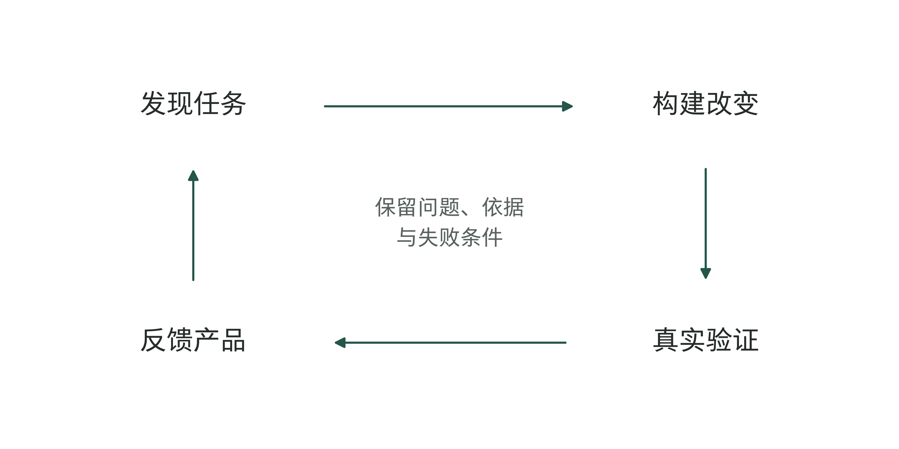

图2-5｜从现场发现到产品改进。作者归纳的现场改进过程。每次修改都经过真实任务验证；回到产品的应是可解释的共性问题，而非客户原始数据的任意复制。

工程师随后可以把问题改写得更准确：保留调度员原备注，自动补齐已有地址信息，只把不能确定的部分交回人工。这个版本的功能看起来更小，却更接近实际任务。是否值得继续，仍要观察处理总时间、错误和人工接管，不能用“现场人员很喜欢”替代结果。

现场还会改变工程判断的顺序。团队原先可能想先接入所有地图与客户系统，再训练一个复杂模型；看到实际任务以后，也许发现最大的等待来自没有人认领异常队列。此时先明确认领规则，可能比增加模型能力更有效。工程师能够当场检验这个假设，就能减少按错误顺序建设的投入。

共同工作不一定要每天坐在同一间办公室。远程跟看一张工单、参加一次交班，或者回看经过授权的操作记录，也能帮助工程师了解现场。要紧的是能看到具体过程、能向实际使用者提问，不能用出差天数代替对业务的理解。

了解现场也不意味着可以随意取用客户数据。调查订单异常，未必需要复制整库客户资料；复现问题，也可以先在测试环境进行。团队应与客户确定访问范围，能用脱敏样本或受控环境解决的问题，就不必扩大访问权限。

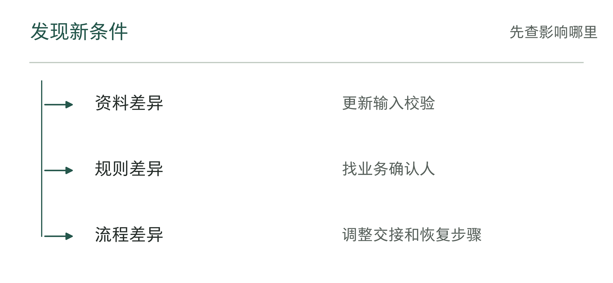

图2-6｜现场差异改变了什么。作者分析工具；以差异类型确定改动位置，不把所有问题都归给模型。

## 一个人能连接两端，也会被两端拉扯

FDE这个角色容易被描绘成全能的人：会写代码，懂业务，能沟通，还能推动老板拍板。这样的能力组合有价值，但如果所有职责都集中到一个人身上，项目也会随他的离开而失去连续性。

Palantir的历史材料里，与FDE配合的岗位一直存在。上述2013年招聘记录把业务部署和FDE协作放在一起；本书保存的Deployment Strategist招聘页面也强调理解重要问题、数据和用户，推动使用与培训，并与工程角色合作。[4][7] 这给我们的启发，是现场部署需要一组互补职责，而不必强迫每个人以相同深度承担全部工作。

在配送企业的例子中，业务负责人应当决定哪些异常必须升级，工程师负责让系统按规则处理；产品负责人判断哪些需求应该进入通用能力，运维人员负责处理上线后的问题。FDE可以推动几方坐到一起，但不应悄悄替客户做所有经营决定。

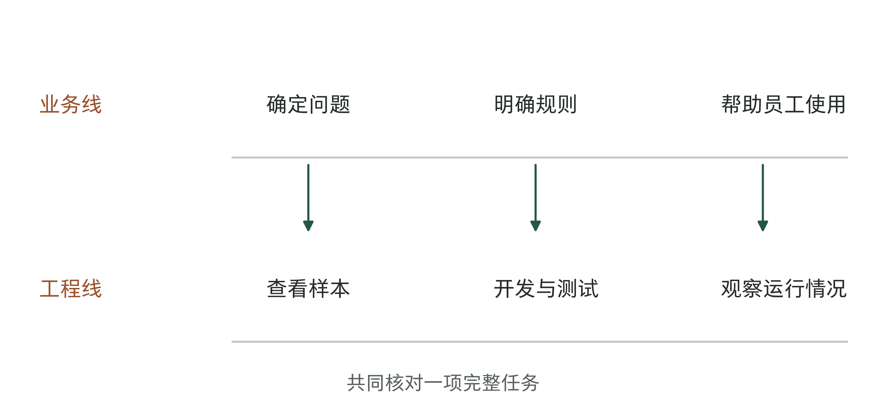

图2-7｜现场部署中的两条工作线。作者的职责示意，不是Palantir组织架构复刻。业务线确定问题与采用条件，工程线修改系统并测试；共同在真实任务上验收。

有些团队长期驻场，公司仍没积累多少经验。工程师不断接修改单，业务人员不断提要求，却没人决定哪些需求可以暂缓；产品团队又只在严重故障时介入。结果是待做的需求越来越多，大家却还是说不清主要问题是什么。

老板可以旁听一次普通的变更会：这项修改要解决什么问题，会影响哪些旧规则，为什么现在要做？只回答“客户要求”还不够。如果每件事都必须等老板本人决定，就该检查团队到底获得了哪些决策权限。

团队也应该允许工程师提出“现在不宜做”。例如，自动改写异常地址看似方便，但如果没有人核实，就可能把错地址写回主系统。可以先让系统提出建议，再由人核对；等确认办法可靠以后，再考虑自动写回。

安排现场团队时，同时写明三件事：能够接触哪些真实任务，能够修改哪些系统，不能自行决定哪些业务事项。职责写得再宽，如果没有访问、发布和升级的具体安排，工程师仍然只能传话。

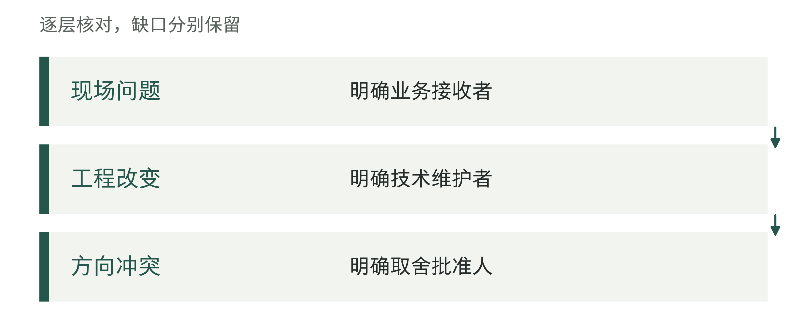

图2-8｜双重责任需要怎样的支持。作者分析工具；连接两端的人需要制度支持，不能承担所有批准权。

## 定制怎样留下可复用的东西

现场工作最容易被质疑的，是它看起来像一门人力生意。每个客户都要派人，每个项目都有特殊要求，收入增长是否意味着人员必须同步增长？这个问题不能靠“我们的工程师效率很高”回答，要看重复劳动能否真正减少。

在配送例子里，某客户的异常地址名单具有很强的专属性；“自动识别信息缺口、生成待确认项、保留人工修改、记录批准者”却可能是跨客户的共性能力。两者都来自现场，进入产品的方式不同。直接把客户名单复制给下一个项目既不合适，也不能说明复用能力；把确认流程做成可配置组件，才可能减少后续重复开发。

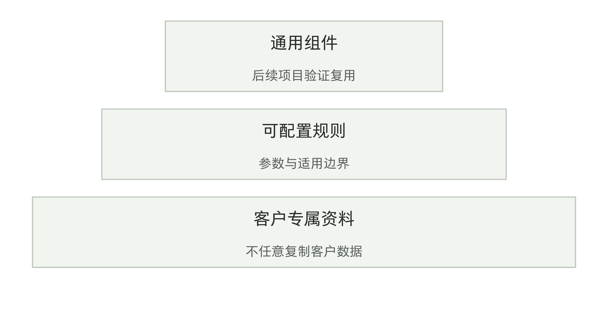

图2-9｜哪些现场成果可以带回产品。作者的复用分层。由下到上是客户专属、可配置规则、通用组件；上层的可复用性需要后续项目验证，不能由命名决定。

怎样检查缺失数据、测试时怎样安排异常样本、人工接手后怎样把结果写回系统，也可能帮助后续项目。先记录各自的用途、限制和失败情况，再由产品团队决定哪些值得做成共用组件。换一位同事能不能用起来，第14章会介绍怎样检验。

并非所有需求都值得产品化。一个客户要求很复杂，但其他客户没有同样需要，强行做成通用配置会让产品更难维护。反过来，几个客户反复遇到同一类问题，如果团队仍然逐个复制脚本，也在浪费现场投入。产品负责人和部署团队应定期讨论哪些差异应该保留，哪些重复应该消除。

项目复盘先分出两张清单：哪些产物可能供后续使用，哪些工作仍须逐客户完成。授权、数据核对和采用安排属于后者，仍要计入后续预算。

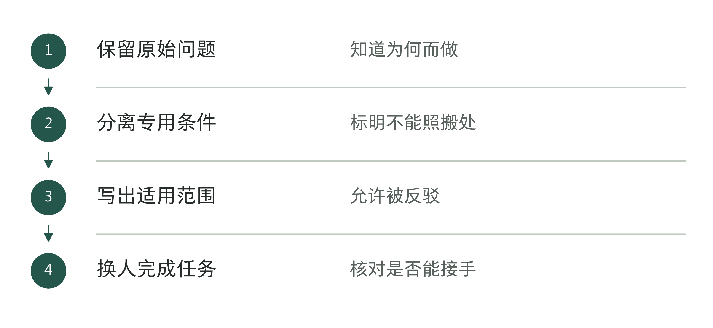

图2-10｜怎样确认定制成果可供下个项目使用。作者分析工具；完成文档只是中间一步，还要让接手的人试着完成任务。

## 客户要求与产品方向冲突时怎么办

客户有明确要求时，现场团队仍可能遇到难题：产品团队认为这个要求不适合做进通用产品。继续看虚构配送企业：一个大客户要求在异常页面上增加一套只有自己使用的审批字段。销售认为这是续约条件，现场工程师知道可以很快做出来，产品团队担心从此要长期维护两条不同流程。每个人看到的成本都不同。

这时，把问题交给职位最高的人拍板，并不能替代必要的解释。团队需要先确认，客户真正要的是特殊页面，还是某项审批信息能够被保留；现有配置是否已经能满足；若必须开发，谁承担以后升级和测试的工作。需求的表面形式与业务目的分开后，才可能找到代价更小的办法。

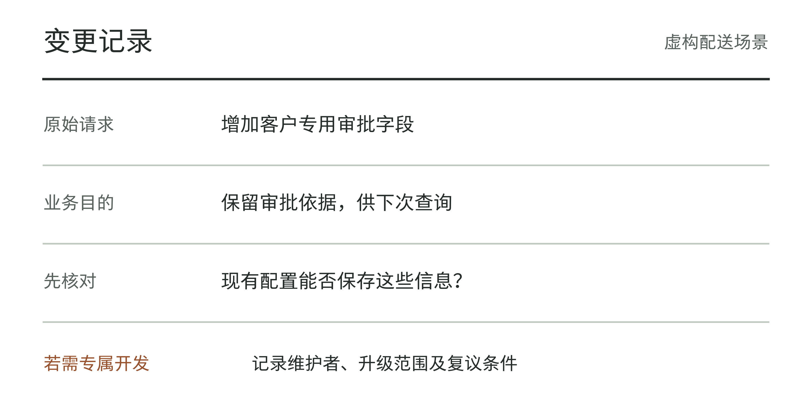

图2-11｜一份能解释取舍的变更记录。作者的虚构变更单示例。业务目的、方案取舍、维护者和复议条件放在同一页；用于记录讨论，不表示真实客户已经确认该方案。

假如现有配置就能保留审批信息，应当把配置方法交给客户，不必为展示工程能力再写一套代码。假如它确实是客户特有的要求，可以单独实现，但应说明维护范围和退出方式。如果其他客户也有类似需要，而且团队能说清这项功能在哪些条件下通用，才更有理由把它做进产品。

复盘时也不能只看成果是否进入通用产品。为一个客户单独开发，可能有明确的商业理由；把功能加进通用产品，也可能让其他客户用起来更复杂。要看原问题是否解决、后续维护是否做得起，以及其他用户是否承担了不必要的麻烦。

现场工程师需要能把这些取舍带回团队讨论。只奖励签约和新增功能，大家就容易答应所有要求，却不愿提出哪些暂时不做。只追求产品统一，也可能忽略客户确实存在的差异。公司需要明确由谁在什么会议上决定，并把开发和维护两方面的成本说清。

变更记录要保存当时为何选择配置、专属实现或通用产品，以及什么条件改变后需要重新讨论。

还有一类需要主动结束的现场工作。若几轮核对后发现客户无法提供必要资料，或者问题的真实收益不足以支持继续建设，团队应当提出暂停。工程师已经投入很多时间，并不是继续投入的充分理由。留下已经确认的限制、可保留的成果和重启条件，比用更多功能掩盖项目失去方向更有价值。

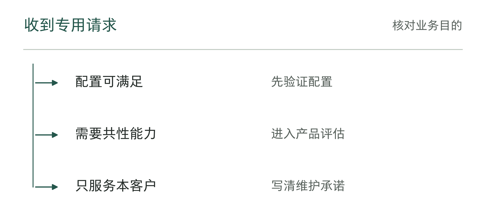

图2-12｜客户要求怎样影响产品决定。作者分析工具；不同去向要留下选择理由与复议条件。

## 算清现场工作花了多少时间和钱

对客户来说，付给现场团队的钱只是部分投入。业务人员参加访谈、整理样本、处理例外，同样花时间。部门骨干连续几周配合项目，就会少做其他工作。这些投入值不值，要看团队是否逐渐查清问题，以及实际任务有没有改善。

对供应商来说，一次部署可能包括调查问题、客户专属开发、共用功能开发和运行支持。如果只记一个“服务费”总数，就很难看出时间花在哪里、哪些工作有助于下一次交付。下面按工作内容分账，只用于分析投入，不讨论会计上怎样确认费用或资产。

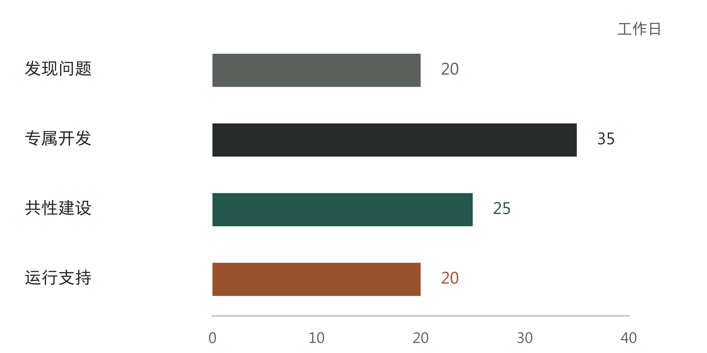

图2-13｜一次部署的工作投入如何拆开。虚构教学算例：一个月共投入100个工作日，分别用于发现20、专属开发35、共性建设25、运行支持20。数字仅演示分类，不是行业基准；共性建设不等于已经取得复用收益。

图中的25个工作日，只说明花了多少时间开发共用功能。要判断这部分投入值不值，还要看人员成本、合同收入、支持期限，以及后续项目究竟少做了什么。尤其要查清，工作是真减少了，还是交给客户或支持人员做了。第15章会继续讨论这些投入怎样影响交付生意。

对技术负责人来说，投入分类可以帮助解释为什么要做一些客户看不见的工作。把测试和升级路径补齐，当月未必增加功能，却可能减少下一次部署的返工。但这个理由也需要后续记录来支持：减少的是哪类缺陷，在哪些项目重用了什么，而不是把所有内部整理都称为平台建设。

比较两个交付方案时，要把供应商的工作、客户需要配合的工作，以及上线后的支持都算进去。低报价可能要求客户投入更多人手，少驻场几天也可能只是把问题留到上线以后。应在相同任务范围下比较总投入，不能只看工程师每天的报价。

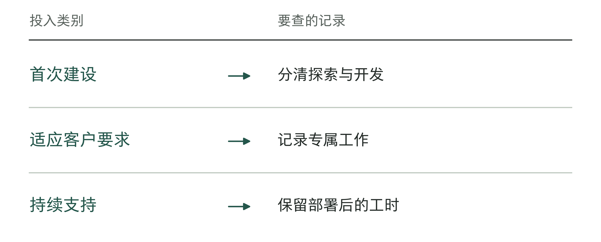

图2-14｜部署投入要查哪些记录。作者分析工具；单次报价不能替代完整投入记录。

## 老板怎样判断自己买到了什么

假设两家供应商都说自己提供FDE服务。A公司答应派两名资深工程师驻场，按月报告工时；B公司答应先跟踪一类实际任务，交付可运行的流程、异常记录和维护说明。单凭这些承诺还选不出来：A公司可能有成熟的交付办法，B公司也可能只是提案写得好。

需要进一步要求两家拿出同一类证据：过去或计划中的一项具体变更，如何从业务问题变成系统修改，谁批准上线，如何观察使用，怎样交给下一位维护者。涉及客户隐私的材料可以脱敏，尚未发生的项目则提供可审查的交付设计。不要因为对方有案例，就默认那些结果能无条件复制到自己公司。

表2-3｜作者设计的交付检查表。检查成果的实际内容，不能只核对文档名称是否齐全。

| 希望团队做到什么 | 应留下的可检查成果 | 缺少时先补什么 |
|---|---|---|
| 理解问题并收窄范围 | 真实任务、限制与放弃项 | 让业务负责人参与核对 |
| 修改系统并确认能够运行 | 修改记录、测试与发布说明 | 明确环境、权限和复核 |
| 员工实际使用，有人负责维护 | 使用、异常与维护移交记录 | 确定接管人和复查安排 |

这张表也能反过来检查客户自己。没有业务负责人能确定范围，没有管理员能提供必要权限，没有人愿意接手运行，即使供应商派来很强的工程师，项目仍可能困在临时协调中。采购交付能力并不意味着把所有内部责任一并外包。

还要询问退出安排。一个依赖原工程师记忆的系统，表面上已经交付，实际上尚未脱离个人。新的维护者至少应能知道：数据从哪来，规则为什么这样写，哪些异常不能自动处理，什么情况下需要恢复旧流程。离场日期本身不是完成标准，接手者能否继续工作才是。

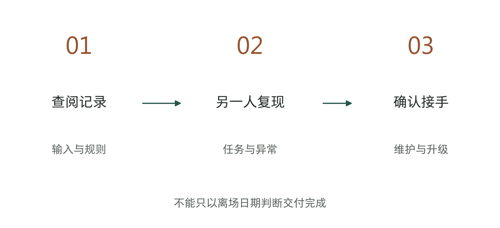

图2-15｜让下一位维护者能够接手。作者的移交检查路径。由另一位维护者按记录复现一项任务、处理一次异常，再核对升级联系人；用于安排检查，不表示任何真实项目已完成演练。

表2-4｜离开现场后的接手演练（作者检查工具）

| 演练任务 | 怎样确认接手成功 |
|---|---|
| 重建同一环境 | 能找到版本、依赖和配置说明 |
| 完成一笔任务 | 由接收人独立完成并留下结果 |
| 处理一次异常 | 能按步骤恢复，并找到负责处理的人 |

本章的空白检查表可用于供应商交流，也可用于内部组队。只选一个项目，写清要处理什么任务、需要留下哪些成果。例如，“让接手者按说明处理一张异常订单”比“赋能业务”更容易核对。

了解FDE的历史，是为了决定要不要让工程师更早参与业务问题，以及该给他哪些权限、怎样反馈和交接。下一章还要分清几种容易混淆的对象：招聘中的FDE是人，同名软件是产品，数字岗位则涉及企业怎样分配工作。这会影响企业究竟该招聘、采购，还是重新安排职责。

## 资料与说明

[1] Palantir招聘目录，互联网档案馆2009-03-31快照（S257）：https://web.archive.org/web/20090331102704id_/http://www.palantirtech.com/careers/positions 。定位International栏目。最早为本书已核验范围，不宣称全球首创。

[2] 美国劳工部FY2009 H-1B数据（S247），案件I-09093-4887487：https://www.dol.gov/sites/dolgov/files/ETA/oflc/pdfs/H-1B_Case_Data_FY2009.xlsx 。申报案件不等于员工普查。

[3] Palantir《GovCon 6 Program Guide》，2010（S237）：https://www.wikileaks.org/hbgary-emails//fileid/7654/2783 。公司原件由公开档案保存，用于核对岗位名称。

[4] Palantir同一招聘记录的两次快照（S261、S260）：https://web.archive.org/web/20130116134716id_/http://www.palantir.com/careers/OpenPosDetail?id=a0m80000000gtfMAAQ ；https://web.archive.org/web/20130219045039id_/http://www.palantir.com/careers/OpenPosDetail?id=a0m80000000gtfMAAQ 。不推断全公司统一改名日期。

[5] Chris Neumann，Aster Data工作经历回顾，2026-07-15（S245）：https://chrisneumann.com/archives/what-is-a-forward-deployed-engineer 。第一人称多年后回忆，非同期命名证明。

[6] MemSQL FDE招聘，2014-09-21快照（S262）：https://web.archive.org/web/20140921060337id_/http://boards.greenhouse.io/memsql/jobs/16862 。只用于职责和名称扩散。

[7] Palantir，Deployment Strategist招聘（S241）：https://jobs.lever.co/palantir/e0ab8226-b928-4e3a-bf87-08fe7b1ea595 。岗位可随招聘调整；本章按已保存的页面说明职责，不作为全行业标准。

本章配送企业及100个工作日为虚构教学设计。图示和经营判断为作者归纳，不代表受访者原话、真实客户结果或行业统计。
