# 第3章 谁把AI带进企业：FDE、智能体与数字岗位

## 同一个名字，可能在卖不同的东西

老板准备启动AI项目，收到三份方案。第一份建议招聘FDE，第二份演示名叫AI FDE的软件，第三份说可以交付十个数字员工。三份材料都在谈理解业务、使用工具和交付结果。如果不先辨认对象，讨论很快就会变成价格比较：一个工程师一年多少钱，一个软件账号多少钱，一个数字员工多少钱。

这是一个虚构的采购场景。三份方案用了相近的说法，卖的却可能分别是人的服务、软件和一套工作安排。即使列在同一张报价表里，也不能直接比较单价。

本书把这三类对象分开讨论。人类FDE是负责调查问题、开发和交付的工程人员；软件智能体（Agent）是能在指定环境中处理任务、调用工具的软件；数字岗位则是一套工作安排，要说清任务、权限、输入输出，以及谁复核、谁接手异常。“数字员工”有时指这套安排中的软件执行者，有时只是产品名称。采购时仍需问清具体交付什么。

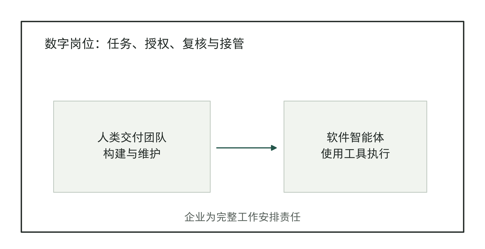

图3-1｜人、智能体与数字岗位的关系。作者的对象辨认图。人类团队构建和维护软件，企业决定软件承担哪些工作、由谁负责；一项数字岗位可能使用多个工具，也可能只使用规则自动化。

以财务对账为例：先读账单，再匹配记录、标出差异，最后通知财务人员复核。智能体可以做其中几步，但这项工作能不能完成，还取决于账单能否按时取得、异常由谁处理、结果怎样写回账务系统。买到会调用工具的软件，只解决了其中一部分。

同样，招聘一位很强的FDE，也不会自动获得所有部门的授权。他可以搭建对账流程，但不能仅凭技术职位决定哪些差异可以核销。对老板而言，先分清对象，才能分别讨论能力、权限、价格和验收。

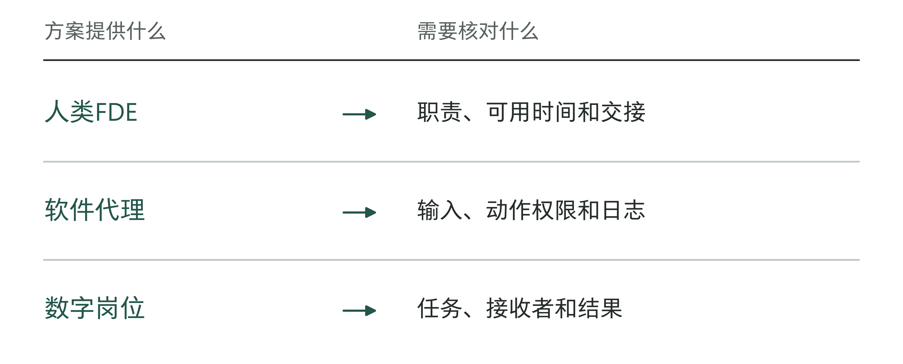

图3-2｜购买对象决定要检查的承诺。作者分析工具；先识别对象，再比较价格和效果。

## 人类FDE要与哪些人配合

一项对账改造需要有人解释差异，有人构建匹配流程，也需要有人组织使用。职位名称未必与这些工作一一对应。前线部署软件工程师（Forward Deployed Software Engineer，简称FDSE）通常侧重系统开发；部署策略师（Deployment Strategist）侧重弄清业务问题、解释数据和帮助用户使用；应用AI工程师（Applied AI Engineer）则可能强调把模型能力做成应用。不同公司会重新组合这些职责，不能用一张行业通用职位表代替具体招聘说明。

Palantir的Deployment Strategist岗位材料明确提到与FDE合作。[1] 这说明业务人员与工程人员要共同交付。企业照搬职位名称以前，不妨先问：现在是没人把问题问清，没人把方案接进系统，还是上线后没人安排使用？

以下仍用虚构对账任务说明。一位业务负责人熟悉差异类型，却不会编写数据接口；工程师能做匹配，却不知道为什么同一笔业务允许跨日入账。他们必须共同确定处理规则，并找有权决定的人批准。可以由不同的人牵头，但处理规则必须一起确认。

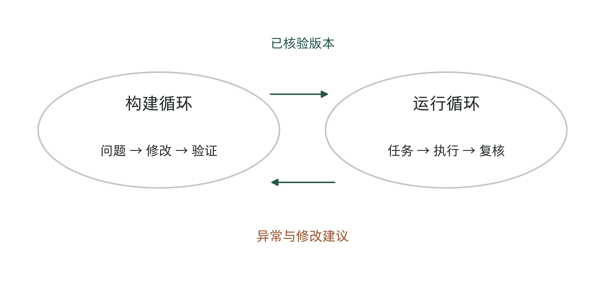

图3-3｜构建工作与日常运行。作者的双循环图。构建循环改变系统，运行循环处理任务；运行中的异常进入修改清单，修改后的版本再次核验，不能未经复核直接改变业务规则。

评价人类FDE，不能只数他写了多少代码。他可能发现某类差异交给人处理更省事，也可能发现现有系统已经够用，只需规范输入资料。这些判断虽然减少了开发量，却可能让项目更早投入使用。

要求工程师“对结果负责”，不等于让他保证所有经营结果。客户有没有安排人员配合、源数据是否可靠、业务规则有没有获批，都会影响交付。应把这些条件逐项列出，明确由谁解决。第6章会详细讨论责任怎样分配，先别让一个职位名称掩盖这些具体工作。

老板面试候选人或选择服务团队时，可以让对方讲一次真实变更的经过：问题怎样发现，谁不同意，最后如何验证。涉密经历可以换成经过脱敏的结构说明。比起列举熟悉多少模型，这种叙述更能展示对方是否真正处理过工程和业务之间的分歧。

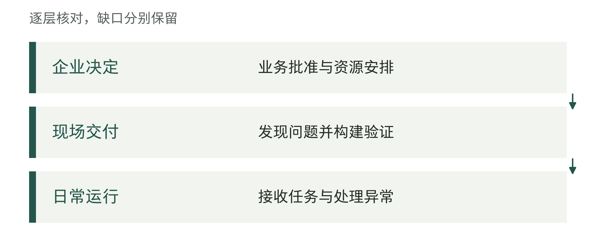

图3-4｜人类FDE负责什么，企业负责什么。作者检查工具；参与跨部门工作，不等于获得企业的全部决定权。

## Palantir的AI FDE，是一个具体软件产品

Palantir官方文档把AI FDE定义为通过对话操作其数据与应用平台Foundry的交互式智能体。用户提供请求和上下文后，它可以调用平台工具完成数据转换、代码及本体相关操作；本体在这里指把业务对象、关系和可执行动作组织起来的模型。文档同时说明，操作遵守用户已有权限，并通过分支或代码审查提案呈现修改，让变更可以先在独立版本中核对，再决定是否合入。[2] 这是截至本章核验时的产品说明，具体可用能力取决于客户环境和功能配置。

这里的AI FDE指软件，不能据此把全行业的人类FDE岗位划分成“传统版”和“AI版”两大类。招聘中的“AI FDE”也可能指为AI应用提供现场交付的人。读到这个短语时，先看上下文：对方在招聘人员，还是在出售软件？在描述交付团队，还是在展示一个产品界面？

这个产品说明，工程师的一部分操作可以交给软件：生成转换代码、查看运行结果，再根据报错修改。但会执行这些步骤，不等于知道企业为什么要做这项工作，两件事要分别检查。

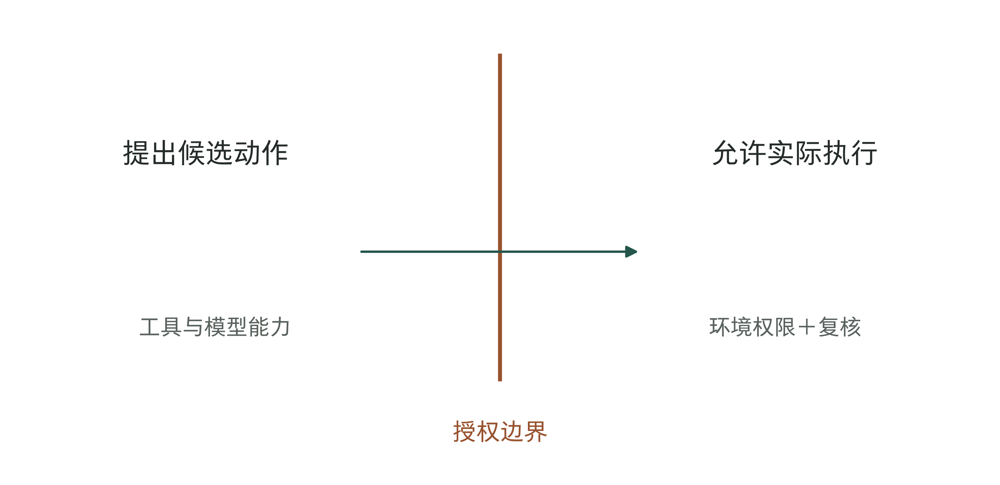

图3-5｜能力与授权是两道不同的边界。作者的权限切面示意，非Palantir界面或完整安全架构。能够生成动作，不等于已有执行权限；真正执行仍取决于环境授权与企业设定的复核要求。

在对账例子中，软件可以生成代码，匹配两个系统里的记录。代码跑通了，还要拿样本检查匹配是否符合业务规则；匹配出的差异能不能自动冲销，则要查批准权限。界面上的一个“完成”，不能代替这些判断。

企业采购这类工具时，还应知道工具的工作范围。某个智能体擅长操作特定平台，不等于它能够直接理解和修改企业的所有系统。跨平台接入、身份与权限、数据语义和异常处理，都需要具体设计。可以把它看作人类团队可能使用的一种工程工具，再检验它在自己的任务上能减少哪些劳动。

评估这类软件是否值得购买，需要拿同一范围的交付任务作比较：它减少了哪一步操作，又增加了多少复核与返工。产品文档可以告诉团队从哪里试，效益仍要靠本企业的任务记录判断。

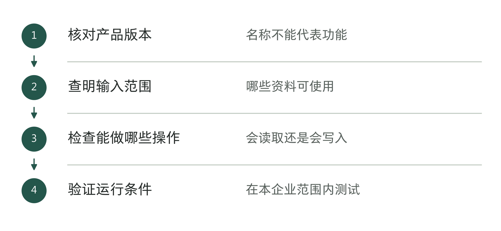

图3-6｜购买软件前要检查什么。作者分析工具；产品宣传中的能力，需要在具体版本和环境中确认。

## 数字岗位的边界，沿一次任务画出来

“数字员工”容易让人以为软件能承担一个完整的人类岗位。更稳妥的办法，是沿着一项任务问清楚：什么时候开始，要哪些资料，能做什么，结果交给谁，遇到什么情况必须停下。这样才知道软件做了哪部分，还留下什么工作。

湖南省工信厅《2026年度湖南省人工智能供给能力清单》第116页，收录了中国银行湖南省分行的数字员工方案。材料描述了数据采集、分析、判断、补漏、申报和预警等流程，并说明运营中心人员仍要校验、修改异常信息。[3] 这段说明让人看见，自动流程之外仍有人工工作。

清单还列示累计开发200多个数字员工，预计节省23人/年效能。这是申报方的预计值，不能理解成已经节省了23名员工的工作量。材料没有给出足以独立核对的异常率、完整人工工时和净节省计算式；政府清单收录不能被解释为这些效果已经获得独立审计。[3]

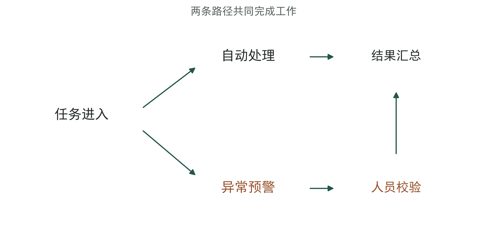

图3-7｜正常任务与异常任务如何分流。依据中行湖南申报材料的职责关系绘制，省略具体业务字段。[3] 自动处理与人工异常校验共同构成工作；分流不表示实际比例，箭头宽度没有数量含义。

在这个例子里，自动流程生成预警后，任务可能还在等人处理。如果只记软件成功运行的次数，就会漏掉后半段。企业还要查异常有没有人接、是否按时处理，以及修改以后能否继续往下做。

数字岗位也未必全部需要生成式模型。规则明确的录入和搬运可以采用流程自动化；非结构化资料可能需要识别或语言模型；涉及重要判断的部分仍可保留人工。技术组合应该服务任务，不必为了产品名称带有“AI”而把每个步骤都改成模型推理。

给数字岗位画边界时，把人工复核也画在同一张流程里。否则，开发团队容易只交付自动部分，经营者却误以为整项工作已经被覆盖。异常队列的负责人、处理时限和恢复条件，需要与正常路径一起讨论。

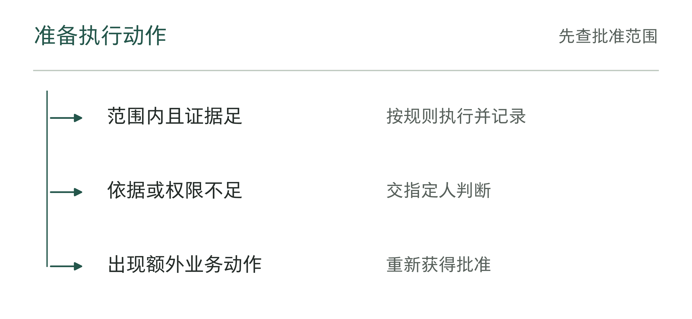

图3-8｜数字岗位是否越过了任务边界。作者分析工具；不能从生成答案自动推导出执行权限。

## 采购文件怎样把“员工”变成可检查的工作

梧州市社会保险事业管理中心2025年的社保机器人流程自动化（RPA）数字员工采购，为这种辨认提供了另一种材料。RPA是按预设规则执行重复操作的软件技术，名称中有“机器人”并不表示一定使用生成式AI。成交公告列示成交金额60.8万元；磋商文件进一步列出业务流程、软件配置、授权、人工接管和运行观察等要求。[4][5] 公告可以证明采购成交，文件可以说明采购方要求什么，两者都不能代替实际运行记录。

其中，三套设计端和八套代理端是软件配置数量，不是三名开发人员和八名业务员工。五类业务流程也不是五个自然人的完整工作职责。把工具、实例、流程和人员混为一谈，会使单位成本和替代人数的计算从分母开始就出错。

表3-1｜作者的计量单位对照。梧州配置依据采购文件，解释规则适用于本章的对象辨认。[5]

| 要数的对象 | 适合回答的问题 | 不应直接换算成 |
|---|---|---|
| 设计端、代理端或许可 | 购买了哪些运行资源 | 实际活跃任务、员工人数 |
| 流程及任务完成量 | 哪些工作被覆盖、处理多少 | 无需人工的完整岗位 |
| 人工复核与接管工时 | 系统仍需要多少人力参与 | 可裁减编制或现金净节省 |

采购文件还要求业务管理员配置授权范围，操作人员能够核对原业务系统的数据，并可暂停、接管流程。[5] 验收时就应检查这些操作能不能做、权限是否正确，以及有没有留下运行记录，不能只看界面上有没有一个“数字员工”图标。

但纸面有接管要求，不等于接管已经有效。若日常没有人查看告警，若接管后无法知道前面已经执行了哪几步，操作人员仍可能无法及时恢复工作。验收可以安排代表性异常演练：先让任务在约定位置停下，再由接手人员辨认已完成动作，并按记录恢复。是否能做到，需要实际验证。

梧州的材料尚缺公开的终验报告、实测成功率、接管率和节省工时，因此本书把它作为采购设计样本。它与中行湖南清单的作用也不同：前者提供较细的采购约束，后者描述申报方的运行方式。不能把一个案例的控制条款移到另一个案例身上，拼成看似完整的成功故事。

## 出错以后，谁来接手

继续用虚构对账任务。系统把两笔金额相同、日期接近的记录判为同一业务。人工复核发现，实际上它们来自不同客户。现在需要做的，不只是告诉模型“以后更仔细”，而是查清已经发生了哪些动作。

如果系统只生成建议，可以撤回候选结果；如果已经写入对账状态，就要更正状态并保留记录；如果下游已经据此触发付款或客户通知，还需要找对应负责人处理后续影响。不同权限带来不同恢复成本，不能在上线以后才发现系统没有留下操作记录。

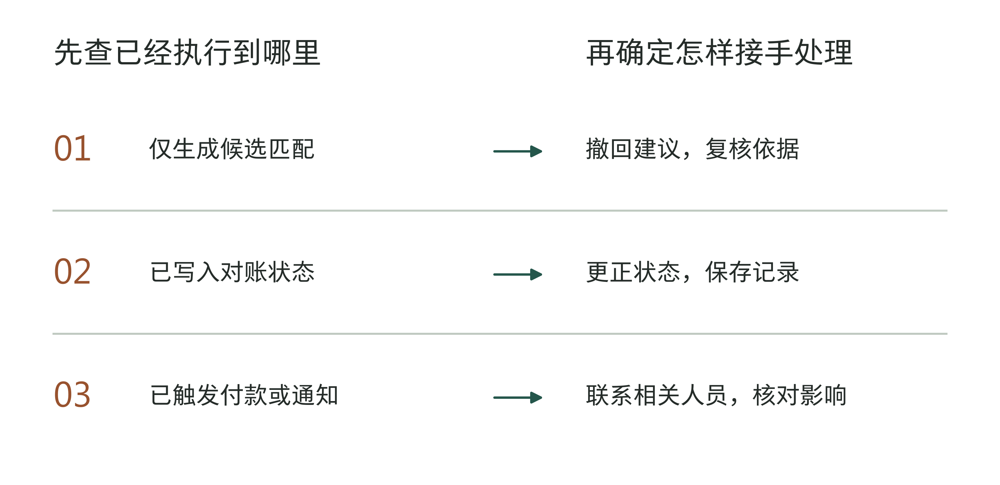

图3-9｜不同执行状态需要不同的接管。作者的虚构接管对照。同一错误停在“仅有建议”“已改状态”“已触发下游”时，处置不同；图中不规定法律责任，也不是行业统一操作规程。

这时，交付团队需要与业务负责人一起处理，软件本身不能决定企业应承担什么损失或向谁作出承诺。对老板而言，安排一名“AI负责人”还不够；应当知道业务处置、技术恢复和外部沟通分别由谁发起。具体制度须结合企业已有职责，本章不把一张示意图当成法律责任划分。

用这笔错配任务来看三类对象，分工就清楚了：人类FDE查明为什么匹配时漏查了客户标识，并修正系统；软件使用获准的数据重新提出匹配建议；整项对账工作还包括把冲突交给财务确认、记录处理结果。多开几个软件实例，并不能代替后面这些职责。

软件接手部分任务以后，留下的人工工作也可能变难。原来逐条录入的人，可能开始专门处理复杂异常，每件事都更费精力。即使总工时减少了，也要看负责异常的人是否忙得过来、是否需要培训。只数软件处理了多少条记录，看不出这些变化。

比较使用前后时，要选同类任务、相同的统计时段，并把所有人工步骤都计入。软件实例增加，不代表收益增加。省下的时间用在哪里，是否少了外包或加班，是否多完成了工作，都要另作记录，不能直接把工时折算成现金收益。

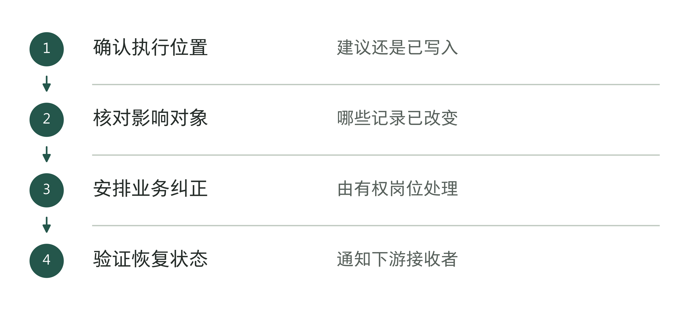

图3-10｜接手前先查系统已经做了什么。作者分析工具；软件停下以后，还要确认业务是否恢复。

## 助手多了，怎样避免互相影响

假设虚构企业先上线了一个对账助手，后来又增加催办、报表和资料核验助手。演示时，它们各自完成一段任务；放进同一工作链后，却可能共同使用客户编号、结算状态和联系人。一个字段修改，会影响多个软件执行者。数量增加以后，管理重点不能只停留在每个助手的提示词。

先查这些助手共同使用什么。如果它们读取同一张规则表，更新时就要确保各自拿到同一有效版本，否则同一笔业务可能被作出不同处理。如果几个助手都能通知客户，还要防止同一事项重复发送。分别测试每个助手，也不能代替把整段流程连起来测试。

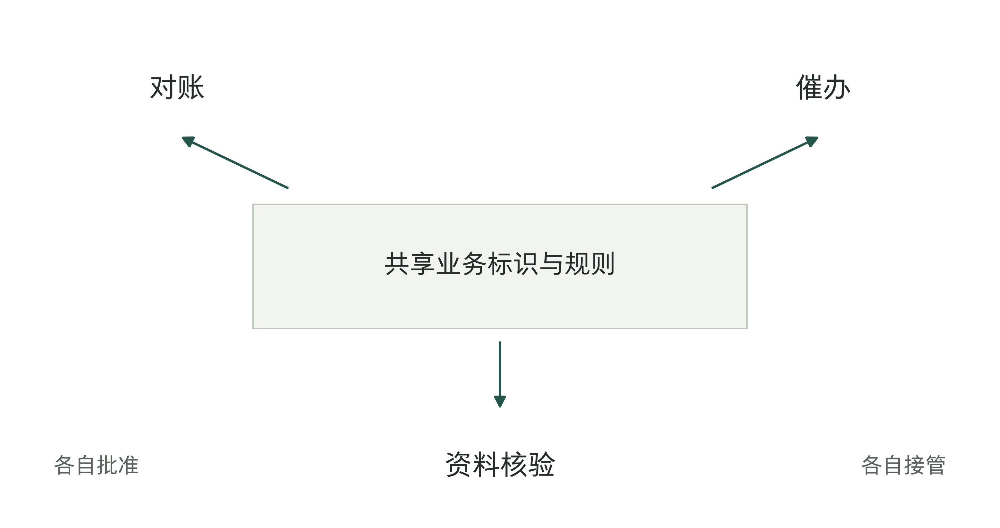

图3-11｜多个数字岗位的共享依赖。作者的虚构多岗位关系图。三个任务共享业务标识和规则，并分别拥有批准与接管安排；连接线表示依赖，不表示实际调用频率。

规则版本、任务编号和修改记录都要能查到来源，才能追查哪个助手按什么规则做过什么。第9章会说明数据字段怎样关联批准记录，第10章再讨论出错后怎样恢复和验证。

两个助手如果会互相催办，要先明确谁负责处理同一事项、怎样算办完，再由技术人员防止重复执行。否则，软件可能不停发送催办，事情却没人处理。

这些工作可以由FDE、平台工程、安全与业务团队共同承担。企业不必为了新工具立即新增一整套部门，但需要把共同规则和日常处置落实到现有职责里。团队较小时，一个人可以承担几项角色；随着任务增加，再按实际负担拆分。

准备增加数字岗位时，老板可以问：“如果共用的接口今天坏了，哪些任务会停，谁能收到消息，原来的工作怎样继续？”这比列出更多助手名称，更能看出团队是否准备好扩大使用。

把软件复制到另一个部门以前，还要重新确认资料、规则和批准人。对账助手在一个部门有效，换了账单格式或审批要求，就未必还能照常工作。下一章讨论怎样选择试点；先选清楚任务范围，才方便以后比较哪些条件变了。

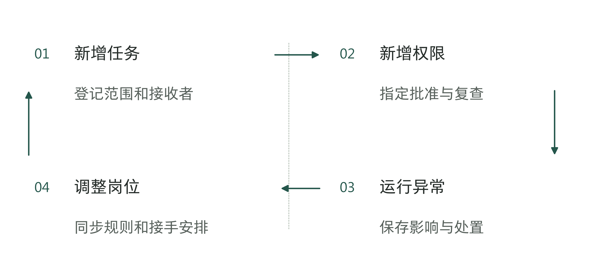

图3-12｜增加岗位后，重新确认负责人。作者分析工具；每次扩大使用，都要更新谁负责什么的记录。

## 一份方案，先写清人、软件与工作安排

面对开头的三份方案，老板可以先不谈“替代多少人”，而请对方分别说明：谁负责开发系统并让员工用起来，哪些软件在运行，系统到底承担哪一段工作。若一份方案提供完整服务，这三项可能同时存在，但仍应分别写清。

例如，一份对账方案应分别写清：服务团队交付接口和测试记录；软件读取约定数据、提出候选匹配；财务批准差异处理，运维人员处理故障。随后分别核对服务范围、软件权限和工作安排，才能看见报价漏掉了哪一项。

图3-13｜三种对象对应三类验收问题。作者的识别工具示例。交付团队、软件、数字岗位各有不同检查对象；图中问题用于启动核对，完整记录见章末空白工具。

这三类对象的区分，也有助于看清报价。软件许可、持续部署服务、包含人工复核的业务服务，所需人员和后续费用都不同。方案写着“数字员工”，并不说明交付和服务成本就消失了。

设计系统时，区别同样重要。“让Agent完成对账”没有说清权限；改成“提出匹配建议，财务批准后按约定接口写回”，工程师才知道要设计哪些数据接口、测试哪些情况、出错后恢复什么。以后扩大权限，也应先验证并留下批准记录。

表3-2｜采购方案中的对象混用检查（作者检查工具）

| 方案说法 | 需要补充的对象说明 |
|---|---|
| “配备一名FDE” | 是人员投入还是软件许可，承担哪些工作？ |
| “增加一个岗位” | 任务、权限、接收者和工作产物是什么？ |
| “自动完成业务” | 哪些动作自动执行，哪些仍需人工批准？ |

企业可以先用一段有边界的工作检验这种组合。如果软件确实减少了交付操作，而复核和运行支持仍在可承受范围内，再讨论扩大使用。若接手责任不清，增加软件实例只会增加待处理任务。

把交付团队、软件和工作职责分别说清，才能选择第一项任务。第一个AI项目不必覆盖最多岗位或使用最多智能体，但要能回答一个具体问题：做完之后，凭什么判断这笔投入值得继续？

## 资料与说明

[1] Palantir，Deployment Strategist（S241）：https://jobs.lever.co/palantir/e0ab8226-b928-4e3a-bf87-08fe7b1ea595 。用于说明两个岗位怎样合作，不作为行业统一职位标准。

[2] Palantir，AI FDE Overview（S002），2026-09-06回查：https://www.palantir.com/docs/foundry/ai-fde/overview 。定位定义、操作机制、权限和分支说明；功能可变化，未据此认定交付效果。

[3] 湖南省工信厅，《2026年度湖南省人工智能供给能力清单》（S179），PDF第116页、序号429：https://gxt.hunan.gov.cn/gxt/xhtml/pdfjs/web/images/pdf_rgzn02.pdf 。数字与运行说明来自申报材料，预计效能未经独立审计确认。

[4] 中国政府采购网，梧州社保RPA数字员工服务采购成交公告，2025-05-20（S181）：https://www.ccgp.gov.cn/cggg/dfgg/cjgg/202505/t20250520_24621872.htm 。成交金额不等于实际付款或已实现收益。

[5] 梧州市社会保险事业管理中心，同项目竞争性磋商文件（S182）：https://oss-gxhlw.unicloudgov.com/guangxi-gov-open-doc/1023FP/undefined/450406/10007282919/20255/d3a6b151-9124-4e3a-b81d-c02860bb0557.doc 。定位采购需求中的配置、授权、运行监控和接管条款；本书未获得实际验收报告。

对账任务、采购场景和三类对象工具均为作者教学设计。中国案例的公开材料未披露正式FDE团队，本章仅讨论相近职责，不据此认定职位设置。
