# 第4章 先选问题：第一个AI项目从哪里开始

## 五个部门，五个第一优先

一家区域连锁企业准备做第一个AI项目。营运想要门店问答助手，财务希望核对促销结算，采购希望自动补货，市场部提议生成活动内容，老板则想随时询问经营数据。每个方向都能演示，每个部门也都能讲出自己的痛点。

这家连锁企业是本章的虚构教学例子，不是书亦或作者的真实客户。它不缺想法，缺的是比较这些想法的办法。如果只看会上谁讲得好，最先获批的可能是演示最顺、支持者最多的方案，实际最需要解决的问题反而被放到后面。

老板可以请每个部门带一份近期的工作记录来开会：一张迟迟核不完的结算单，一次反复确认的政策问答，或一份曾让人作出错误判断的数据。先看事情怎么处理，再讨论AI能帮哪一步。只说“提升财务效率”，很难估计投入；看到具体单据，才知道涉及哪些资料和人员。

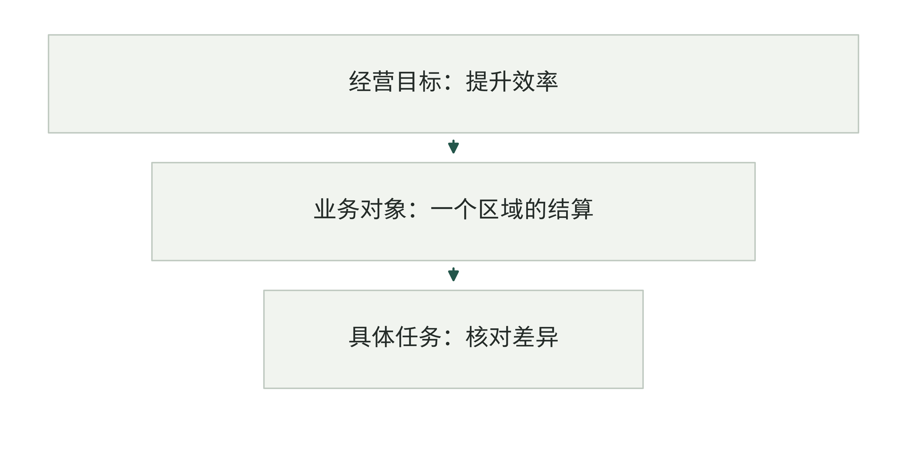

图4-1｜把大愿望缩成一项可观察任务。作者绘制的任务范围示意。虚构企业把“提升经营效率”逐步收窄到特定人员、对象和动作；收窄用于建立观察边界，不等于问题越小越好。

第一个项目还要帮助企业学会判断AI有没有用。范围太广，变化可能来自多种因素，很难查清该改哪里；任务太轻，又可能只做出一个演示，没检验真正的数据和配合问题。合适的起点，应有值得改善的工作，也能找到记录来判断变化。

选择可以分两轮。先排查必要数据、授权和接手安排是否具备；条件过关后，再比较价值、技术可行性、风险可控性、数据准备和组织配合。这个顺序能避免一项看起来收益很高、实际上无人能够启动的项目占据榜首。

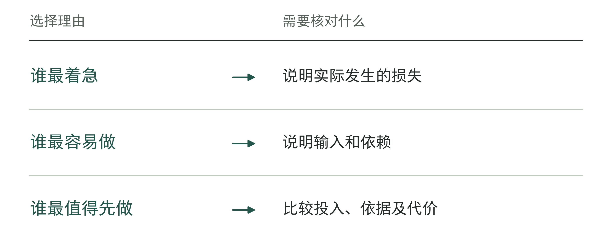

图4-2｜五个项目怎样比较优先级。作者分析工具；紧急、容易和重要是三个不同问题。

## 书亦先处理的，是“门店”到底指什么

中国连锁经营协会收录的书亦烧仙草Data Agent（数据智能体）申报案例中，有一个很容易被技术架构图掩盖的细节：不同部门说的“门店数”，并不是同一个数。对外发布关注签约门店，营运关注订货门店，招商和营建关注新开门店。[1] 各部门未必算错，只是回答了不同的问题。

如果老板向智能体问“我们有多少家门店”，系统即使准确找到数据库中的一个数字，也可能没有回答老板真正的问题。要判断扩张进展，签约与开业之间的差异很重要；要安排供应链，实际订货和经营状态可能更重要。能用自然语言提问，并不意味着这些统计定义已经一致。

材料描述，项目从管理成熟度较高、指标口径和数据质量较好的门店营运场景进入，以门店为主体，协调财务、招商、营建和供应链，用一个半月形成口径共识并在线发布。项目整体持续四个半月。[1] 这些时间来自企业申报，不是所有Data Agent项目的工期基准。

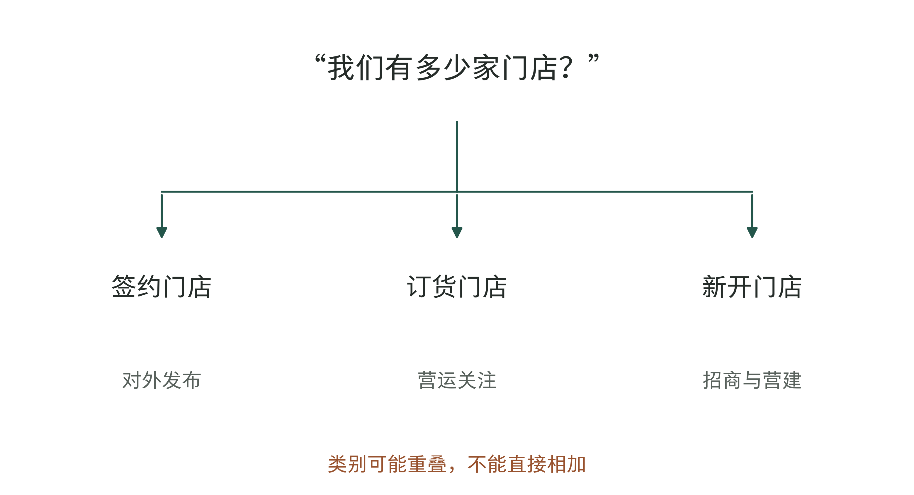

图4-3｜同一个门店问题，需要不同口径。依据书亦申报案例整理的概念分支。[1] 几种门店分类可能重叠，不能直接相加；具体怎样统计，应由企业确认。

更早的材料也能提供线索。供应商数势科技刊载的书亦首席信息官（CIO）分享提到，团队调研出600多个指标后，与高层讨论，先聚焦主要经营域的200多个指标；业务部门参与建设，分歧交由指标委员会共同决定。[2] 这份演讲材料不是独立审计，却把范围收缩和组织决策写得相当具体。

两份材料分别介绍了统一指标定义和缩小项目范围，不能拼成同一次项目的前后变化。对选题有帮助的是这个做法：先选定要研究的业务对象，再找齐能解释它、决定统计方法的人。这样才知道要处理哪些数据、需要哪些部门配合。

协会材料还称年运维投入成本下降60%，并预计带来近千万元经济收益。[1] 预计收益不是已经兑现的现金，成本变化也缺少足以独立复算的底稿。这里选择这个案例，主要是因为它公开了问题选择与交付过程；本章不以这些财务数字证明方法的收益率。

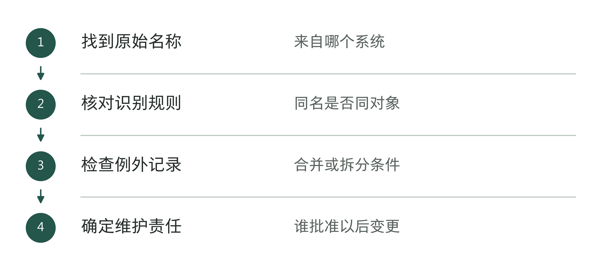

图4-4｜统一一个业务对象之前要核对什么。作者分析工具；统计定义不清，后续报表和判断也会受影响。

## 从一个问题进入，不等于只动一个系统

书亦的做法容易引出两种相反误读。一种认为，做AI前必须先完成全公司的数据治理；另一种认为，只要选一个小场景，就不需要碰数据和组织问题。两种理解都太简单。

先选清要解决的问题，团队才知道哪些数据必须优先整理。围绕门店营运，可以先统一相关指标，不必同时整理全公司的数据。但财务、招商或供应链掌握的资料仍可能要用。范围小不等于只涉及一个部门，应逐项确认这些资料为什么必需、由谁提供。

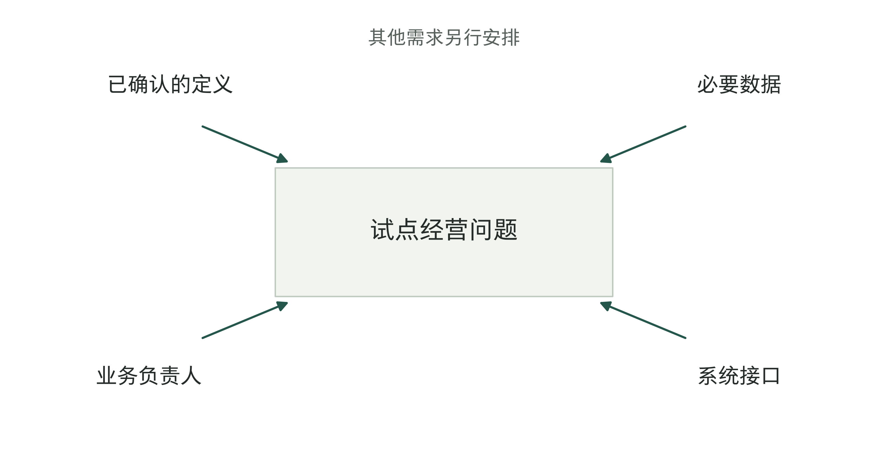

图4-5｜收窄范围，也保留必要依赖。作者依据案例方法绘制的范围图，非书亦实际系统拓扑。中心保留试点问题，周边只接入必要的口径、数据和业务配合；外围候选需求暂不进入。

回到虚构连锁企业。老板想每天直接问“哪家门店最需要关注”。这个问题涉及销售、毛利、库存、投诉和异常原因，第一次就要求系统给出综合经营建议，范围可能过大。但可以先缩成“在一个区域内，按已有认可口径列出昨日销售显著变化的门店，由营运主管核对原因”。这样仍有实际业务意义，也能看见数据是否按时到达、口径是否一致、主管是否愿意使用。

把综合建议拆到这里，团队就能检验下一步需要的条件。若第一步连变化名单都不能稳定生成，直接建设自动经营决策没有坚实起点；若名单准确但主管从未采取任何行动，就需要重新理解它为什么不够有用，而不是继续添加模型能力。

项目范围也需要写出明确的放弃项。例如，当前不预测下月收入，不自动调整门店考核，不向门店直接发布经营指令。它们可能以后再做，也可能并不适合这个项目。把放弃项写出来，可以减少不同部门把自己的全部期待塞进一个“智能经营助手”。

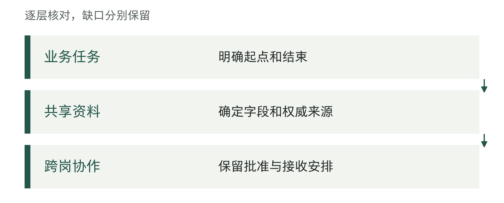

图4-6｜单点问题下面的依赖。作者分析工具；试点范围可以小，必要依赖仍要完整。

## 先写问题卡，再谈技术方案

一张能用于决策的问题卡，至少包含工作对象、发生频率、当前处理方式、希望改善的结果和观察期。这五项并不复杂，但必须能被另一位同事核对。所谓“每月很多结算差异”，还不如写清最近一个结算周期共有多少张待核对单、差异怎样定义、由谁处理。

还不知道原来怎样、花了多少时间时，可以先写“待测”，并注明准备查哪批记录。这样的记录能告诉团队接下来做什么，比凭印象填一个节省比例更有用。立项表格有空缺，也不能拿估计冒充统计。

表4-1｜作者的问题卡示例。没有填写节省金额，因为尚未取得足够基线；第5章继续建立预算与判断依据。

| 问题卡字段 | 虚构填写示例 | 立项前需要核对 |
|---|---|---|
| 对象与使用者 | 区域财务的促销结算单 | 是否包含全部差异类型 |
| 当前负担与结果 | 核对等待较长；希望缩短完整处理时间 | 一批真实记录和人工环节 |
| 范围与观察期 | 一个区域、一个结算周期、保留人工批准 | 数据可得、人员有时间、例外有人处理 |

问题卡应当围绕业务结果，而不是功能名称。“建设一个RAG知识库”是一种技术方向，尚未说明为什么值得做。RAG即检索增强生成：先查找相关资料，再让模型据此组织回答；“让门店负责人更快找到现行促销规则，并减少过期规则的误用”才指向具体问题。最终是否使用检索增强、规则引擎或现有搜索，需要通过样本判断。

同时，不要把结果写成团队无法控制的宏大指标。一个辅助核对工具可能改善处理时效，却很难单独承担全公司利润增长的目标。选择接近任务的结果指标，有助于判断项目是否起作用；更远的经营影响可以跟踪，但需要考虑其他因素。

问题卡最好由业务负责人和工程人员一起填。业务人员说明工作怎样做、出错会怎样；工程人员查需要接哪些系统、怎样验证；财务人员帮助区分可能节省的工时和实际费用。老板负责决定先做哪项、安排多少资源，不必替所有人猜细节。

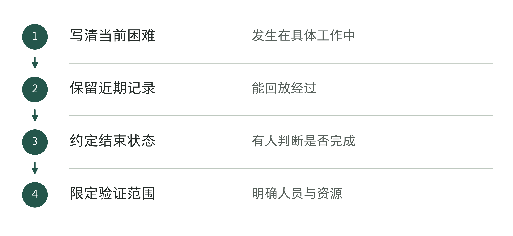

图4-7｜问题卡怎样变成可验证的任务。作者分析工具；每一步产生下一步需要的输入。

## 五个维度，分别寻找证据

有了问题卡，再比较候选项目。本章采用价值、技术可行性、风险可控性、数据准备和组织配合五个维度。它们是作者的讨论框架，不是经过行业验证的预测模型。每个维度都要有理由和待补材料，不能只留下一个分数。

看价值，先问谁会受益、具体改善什么。少等几天、少返工几次、多处理一些订单，都可能值得做，但是否增加收入或减少支出，还要另外查。涉及的业务规模大，不代表一个试点就能获得同样大的收益。

看技术可行性，要查输入资料能否处理、结果能否核对、必要系统能否接入。模型在演示材料上答得好，是一个信号，但真实资料的缺失、版本冲突和输入变化也需要进入检验。不要让一次精心选择的演示成为唯一依据。

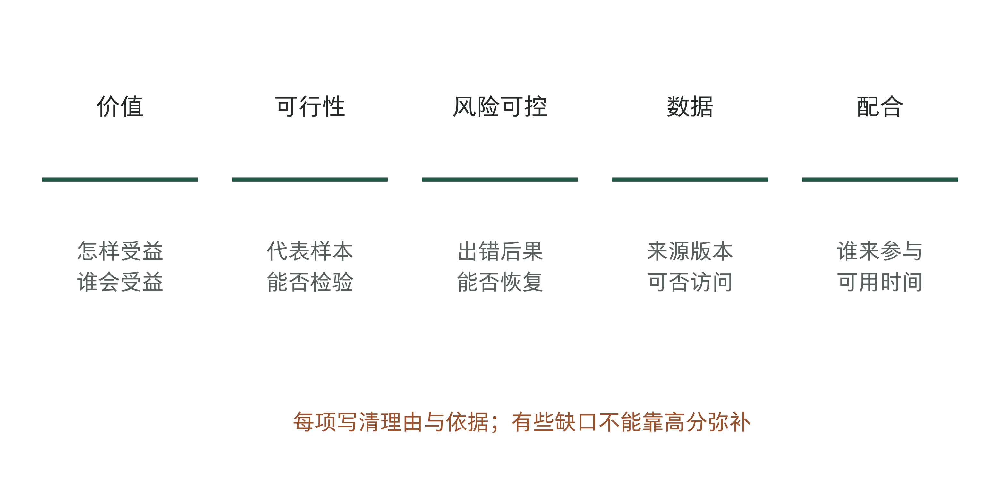

图4-8｜五个维度各自需要什么证据。作者的五维证据表。五列分别检查收益路径、样本表现、出错后果、数据可得和实际配合；彼此不能完全补偿，不使用雷达面积表示总体优劣。

风险可控性关注出错以后会发生什么，以及能否发现、停止和恢复。内部草拟一份待复核摘要，与直接修改付款信息，后果不同；不能因为两者都使用语言模型，就设置相同的批准条件。这里不制定行业法律标准，具体约束需由企业的相关负责人核对。

数据准备不等于文件总量。关键是当前任务所需的资料是否有合法、明确的访问安排，能否追溯版本，是否有足够代表性的样本。企业有很多数据，却找不到决定某类异常的字段，仍然可能不适合立即做这个项目。

部门说“支持AI”，还要进一步问谁有时间参加。使用者能不能提供记录，业务负责人能不能确认规则，管理员能不能安排接口，出错以后谁处理？这些安排比会上有多少人举手，更能说明项目能否启动。

这五方面要一起比较。容易开发，但没人需要的项目，不一定应该先做；预计价值大，但出错后无法控制影响的项目，需要先补条件。比较是为了决定下一步把调查和试验资源花在哪里，不是让每个方案都马上立项。

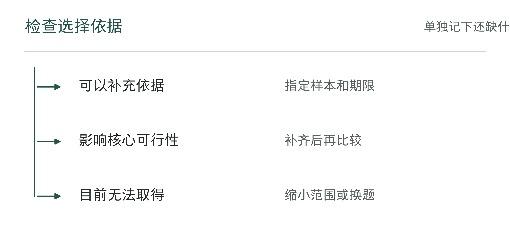

图4-9｜某个维度没有证据时怎样处理。作者分析工具；未知不应自动填写成中间分数。

## 有些缺口，不能靠高分抵消

先处理必要条件，再谈排序。若团队无法获得任务所需数据，若拟执行的重要动作没有授权，若出现错误后没有可接受的处理办法，就应暂停相关范围，或改成受控的只读、辅助阶段。高价值不能使这些缺口自动消失。

这些是本章建议在启动前确认的条件，企业还要按具体任务细化。风险较高的问题也可以探索，但试验方式要控制后果。例如，先用历史记录测试能否发现异常，不直接执行真实业务；测试通过以后，仍要再检查正式运行的条件。

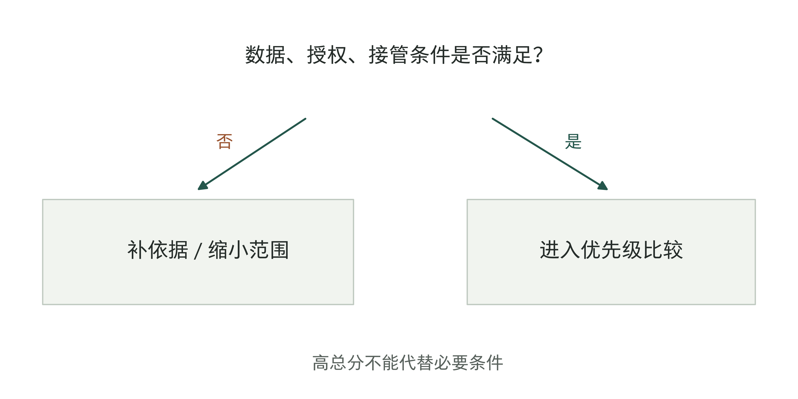

图4-10｜先检查进入条件，再比较优先级。作者的选择分支。必要条件不齐时，先补充依据或缩小权限；条件具备后再排序。图中的“暂停”针对当前范围，不等于永久放弃该问题。

在虚构连锁企业里，自动补货可能涉及采购额度、库存占用和供应商约束。若尚未确定批准方式，就不宜因为预计价值最高而直接让系统下单。可以先做补货建议，并与原流程对照；如果连可靠库存也拿不到，则先处理数据问题。每次收窄都应说明还能验证什么，避免把一个无法落地的项目无限改名后继续投入。

与之相比，门店问答助手可能看起来风险较低，但若资料中混有过期食品安全或促销规则，错误回答仍有实际后果。不能简单用“只读”代替风险判断。需要确定有效资料、展示依据，以及使用者何时必须转交人工确认。

必要条件也包括人员安排。没有人复核的“人工复核”，只是流程图上的文字。如果当前负责人确实没有时间，可以调整试点时间、减少范围或安排另一位有能力的人；不应把这项缺口默认为上线以后自然解决。

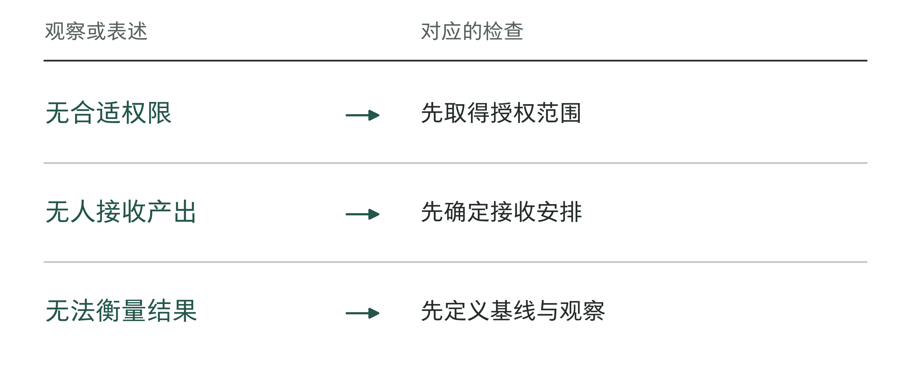

图4-11｜哪些条件没满足就不宜启动。作者分析工具；不能用其他维度的高分抵消这些缺口。

## 分数帮助讨论，不能代替判断

候选项通过必要条件以后，可以用简单的分级评分帮助比较。本章示例各维度采用1至5分，分数越高表示启动条件越有利；风险维度评的是可控性，避免把风险越高误算成越值得做。权重应在看结果前讨论，并允许根据企业目标调整。

以下纯属虚构：促销结算核对在价值、可行性、风险可控性、数据、配合上分别得4、4、4、3、5分；门店规则问答分别为3、4、3、4、4分。若依次使用30%、20%、20%、15%、15%的权重，总分为4.00与3.50。这些数字只是示范算法，不是对真实公司的评估。

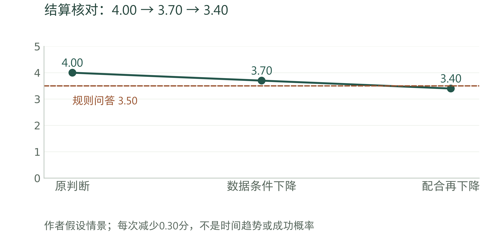

图4-12｜假设变化怎样改变项目排序。虚构敏感性示意。结算核对由4.00降至3.70，再降至3.40；规则问答保持3.50作为对照，满分5。情景变化不是时间趋势或成功概率；自动下单因授权条件未满足，不进入比较。

在这组假设下，结算核对暂时领先。财务负责人愿意配合、样本比较容易取得，都会影响评分。如果团队还没同样认真检查问答项目的资料，就不能把暂时不了解的情况当成劣势，应先补查再比较。

可以做一次简单的敏感性检查：假设结算项目的数据条件从3降到1，其总分会下降0.30，变为3.70；如果又发现配合从5降到3，总分再下降0.30，变为3.40，排序就可能改变。分数变化没有预测未来，它只是提醒老板，当前选择依赖哪些尚不稳固的判断。

对于接近的候选项，不必继续争论小数点。安排短时间补充依据，往往比增加评分维度更有效：各取一批有代表性的真实任务，核对样本、系统依赖与负责人可投入时间，再做决定。若两个方向仍然接近，可以选择能更快形成有效证据、且不挤占关键业务资源的一个。

评分比较的是当前是否值得先做，预算还要依据实际成本和原有工作记录。4分不等于80%的成功概率，高价值评分也不代表已经确认的收益。第5章会继续讨论预算怎样定、花到哪一步需要再作决定。

表4-2｜评分相近时继续查什么（作者检查工具）

| 当前分歧 | 补查记录 | 影响的选择 |
|---|---|---|
| 收益估计接近 | 基线任务量与损失 | 哪项更值得优先验证 |
| 实施难度接近 | 权限、资料与接手人员可投入的时间 | 哪项能在受限范围完成 |
| 总分相同 | 停止条件与机会成本 | 是否分阶段而非同时启动 |

## 访谈最近的事情，别只问理想需求

要让评分有依据，访谈方式很重要。“你最想让AI做什么”容易得到愿望清单；“最近一次遇到这个问题是什么时候”更容易找到可检查的工作。请使用者从实际输入开始讲，展示当时查过的资料、转交过的人、等待的环节，以及最终怎样结束。

这里不要求把所有客户或员工资料复制到项目组。可以在已有权限下共同查看，保留必要的脱敏样本，或先记录流程与字段结构。访谈的目标是理解任务，不是为了方便开发就无边界收集数据。

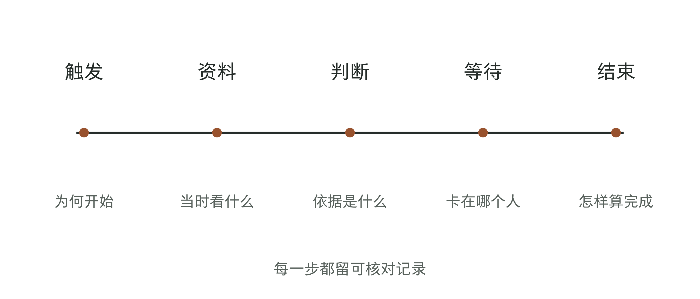

图4-13｜沿最近一次任务追问。作者的任务回放线。依次追问触发、资料、判断、等待与结束；在每个位置记录可查看的证据。它是一种访谈次序，不假定实际流程总是直线。

访谈中应当区分处理时间与等待时间。财务人员花十分钟核对，可能等了两天才拿到门店解释。若目标是缩短结算周期，模型把十分钟降为五分钟，未必触及主要瓶颈；若目标是减少财务加班，这五分钟又可能值得研究。先明确要改善什么，再决定测量哪一段。

还要问使用者：“你怎么知道这个结果错了？”有的判断有明确规则，有的依赖经验，也有些分歧在公司内部还没决定。最后一种情况需要业务负责人作决定，让模型答得更肯定也没有用。把分歧记下来，才能分清是系统答错，还是公司还没有规则可供它执行。

取样不要只收集最顺利的任务。至少考虑常见情况、资料缺失、规则冲突、转交人工和最终失败的情况。具体需要多少样本取决于任务差异与判断目的，本章不把某个固定数量当作充分证明。若只看最近几件，仍应检查是否遗漏月末、促销高峰或其他季节性变化。

画完流程以后，再请当事人检查一遍。工程师可能漏掉看似非正式、实际却少不了的一步，例如门店先打电话确认，再提交书面说明。把这些遗漏补上，流程图才可以用来设计系统。

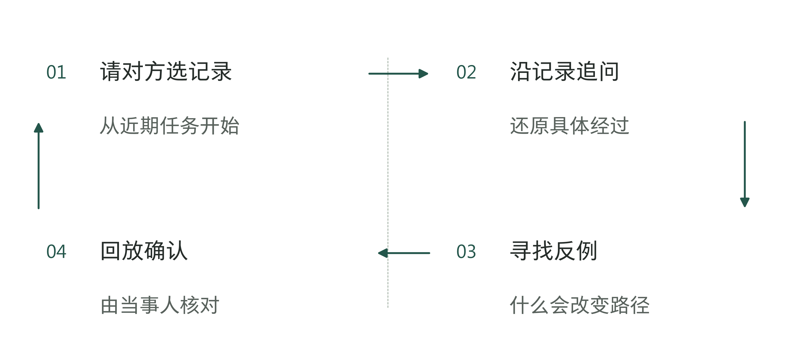

图4-14｜一次访谈怎样接到真实工作。作者分析工具；访谈结论应能回到原始记录。

## 第一个试点的范围怎样定

风险较低、出错后能控制影响的任务，可以先选一个部门、一段流程、两至五名使用者。这是为了方便观察和沟通的建议，并非证明项目会成功的门槛。如果需要覆盖轮班或不同类型的门店，就应按实际情况调整人数和范围。

小范围也必须包含完整任务。只让几位同事随手问几个问题，不足以检验采用；让他们在真实工作中按约定使用，记录何时不用、为何转回原流程，才能看见实际障碍。使用者数量少，只是降低组织复杂度，不应降低证据要求。

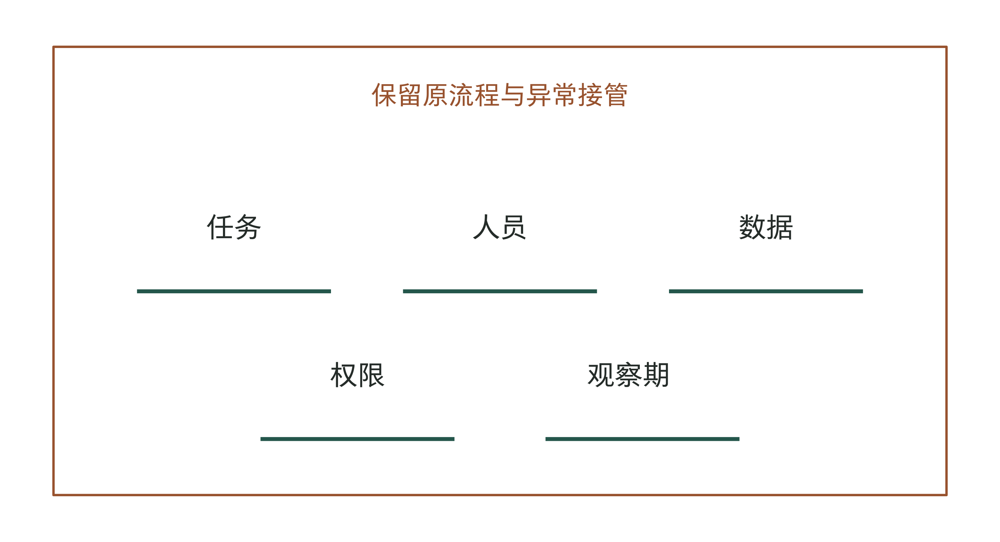

图4-15｜试点范围要写清五件事。作者的试点范围框。任务、人员、数据、权限和观察期共同定义试点；外侧保留原流程与异常接管，避免把试点做成无法退出的孤立系统。

观察多长时间，要看业务节奏。按月结算的工作，只看几个工作日就不完整；每天发生的任务，也可能受节假日或促销影响。应选一段能反映这些情况的时间，而不是到了预定截止日就宣布成功。

启动前还要约定何时继续、何时修正、何时停止。可以先写出判断原则：结果有改善且人工负担可接受，继续观察或小范围扩大；问题集中在可修复的输入或规则，先修正；必要条件无法满足，暂停当前范围。具体阈值要结合基线制定，本章不替企业凭空给出准确率和节省比例。

项目暂时没测出收益，却发现一个重要的数据问题，可以如实记录这两件事，再判断是否值得补数据后继续试。不要把发现问题写成已经取得收益，也不要用“还在学习”让项目无限延期。

## 第一项选择，也有机会成本

同一批业务骨干和工程师去做这个项目，就会少做其他事情。比较项目时，除了预计收益，还要看它占用谁的时间。一项任务如果长期需要老板、财务负责人和系统管理员同时参加，即使软件便宜，也未必排得出人手。

虚构连锁企业如果恰好进入年度结算高峰，财务虽然支持核对试点，却未必能提供足够复核时间。此时不必把它重新解释为“价值不高”。可以保留价值判断，调整启动时点，或者先完成历史样本的离线核验。把项目本身与当前时机分开，能使排序讨论更诚实。

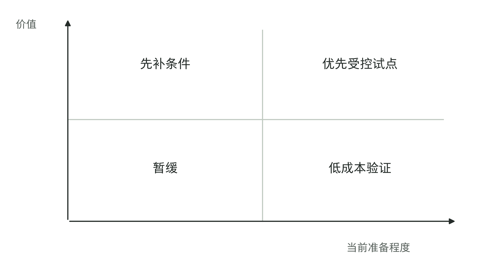

图4-16｜价值与当前准备程度分开看。作者的定性二维图。用于讨论立即试点、先补条件、低成本验证或暂缓；坐标无统计刻度，不把位置解释为成功概率。真实候选项需按证据重新放置。

另一个容易忽略的替代方案，是改善原有流程。在结算例子中，如果等待主要来自门店没有统一提交模板，先规范模板就可能减少大量往返。团队可以把这种改进作为比较方案，检验加入AI还能带来多少额外帮助。不能因为项目预算名叫AI预算，就排除成本更低的办法。

当然，有些能力只有试过才知道，但要先说清试验想回答什么。例如，资料缺失时，系统能否准确列出需要补查的项目？如果做不到，团队应讨论换方法、补资料还是停止，不能默认再多开发一些就会解决。

还可以分开“最先验证”和“最先正式上线”。一个高价值但不确定的问题，可能值得先投入少量资源做离线检验；另一个条件成熟的问题，则可以先进入受控试点。两者不能混用状态，也不能为了同时开很多项目而重复占用同一位业务负责人。

首批资源应当有所集中。多个部门都得到一个没有充分支持的小演示，表面公平，却可能没有任何一个方向获得足够证据。老板需要解释为什么先选这一项，以及其他候选项何时重新讨论。明确复查条件，比笼统承诺下一轮都做更容易维护协作。

作出选择时，要把当时知道和不知道的事一并记下。如果一个月后发现接口不能用，就能查清是后来发生变化，还是立项时漏查了。否则，出了问题容易全怪执行人员，却没人修正当初的判断。

项目清单可以为每个候选项保留一条重新进入的条件。例如，门店规则完成版本核对后再评问答助手，库存数据可得且下单批准方式确定后再评补货。下一次讨论就能从变化的条件开始，不必重新比较一遍演示。

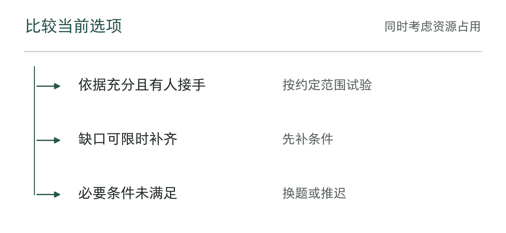

图4-17｜批准试点前的三个去向。作者分析工具；保留未选项目的理由，便于条件变化时复查。

## 这次选择，最终留下什么

回到开篇的五个方案，下面用一份编号为S04-01的教学记录说明怎样作决定。核查结果、人员安排和工时上限都是假设。前面的4.00与3.50，只示范必要条件具备时怎样评分；这次若查出资料或授权还没落实，就应先补条件，不能照搬原分数放行。

在这份教学记录中，财务已获准查看一个区域、一个结算周期的历史记录，也有人负责核验。原流程总耗时尚未测量，因此先选促销结算核对来调查和试验，暂不允许写入生产系统。其他四项也分别记录暂缓的理由，不能只写“以后再做”。

老板应当收到的，不只是“结算项目排名第一”，还包括选择理由、关键未知项、投入与退出边界。没有被选中的候选项也应保留原因，避免下一次会议又从头争论。条件变化后可以重新排序，不需要为了维护最初判断而强行坚持。

表4-3｜五个候选项目的取舍记录（已填教学示例）

| 候选问题 | 本次核对及决定 | 重新进入的条件与责任人 |
|---|---|---|
| 促销结算核对 | 样本访问已获准，核验人已确定；先做历史核验，净节时未知 | 财务负责人交完整基线、例外和接管记录，再决定受控试用 |
| 门店规则问答 | 混有未确认版本；先补资料，不因演示顺畅放行 | 营运负责人确认现行规则、停用材料和例外接收者后再评 |
| 自动补货 | 库存口径及下单批准未明确；不允许自动下单 | 采购与信息技术部门确认可靠库存和授权；另外讨论是否先验证补货建议 |
| 活动内容生成 | 暂无证据表明生成是瓶颈；先沿用模板和人工审核 | 市场部在日常工作保留起草、修改和审核耗时，若瓶颈仍在再提案 |
| 老板经营数据查询 | “门店”等关键指标口径未统一；暂缓综合建议 | 指标负责人确认少量核心指标、来源和更新责任后，再审只读查询 |

S04-01还限定了这次调查的投入：未来10个工作日内，业务核验8小时、工程测试12小时、财务复算4小时，合计24人时，只用于结算样本。市场部继续记录日常工作，不同时借用这些工程人员另开试点。第10个工作日，财务负责人提交原流程耗时和例外清单，工程师报告资料是否找得到、建议能否核实。老板再决定继续试验、先改提交模板，还是暂停。关键条件没补齐，就不自动增加开发时间。

如果发现主要时间都在等门店补交材料，就先改提交模板，再测一次；如果资料能读取，但复核人没时间，就另选时段或暂停。输入资料、接管人和统计范围确定以后，再进入第5章的预算讨论。这里的24人时只是本次调查上限，不是后续项目总预算，也不供五个候选项目共同使用。

读者可用工具04-1保存入选问题，用工具04-2给每个未选项各留一条记录。下次会议只讨论哪些条件改变了，以及是否足以改变排序；没有变化的候选不必重新比一次演示。

表4-4｜第一项试点的范围确认表（作者检查工具）

| 范围项 | 批准前写清 |
|---|---|
| 包含 | 任务种类、目标人员、允许动作 |
| 排除 | 暂不处理的分支和禁止动作 |
| 变更入口 | 谁能批准扩范围，依据什么记录 |
| 结束安排 | 何时复查，未完成的工作由谁接手 |

保留这份记录，下次就能查到当时为什么选、按什么条件选。条件变化了，可以重新决定。

下一章继续把当前状态和投入边界记清：原来耗时多少，允许花多少钱，什么算有结果。这些账应当在项目开始前就能共同核对。

## 资料与说明

[1] 中国连锁经营协会，《2025年度中国零售数字化及新技术应用创新案例集》，书亦案例（S078），PDF第21—23页、印刷页17—19：https://pdf.dfcfw.com/pdf/H3_AP202512041793604795_1.pdf?1764843573000.pdf= 。协会收录的企业申报材料；过程、成本主张与预计收益分别处理，不推定独立审计。

[2] 数势科技，书亦烧仙草CIO王世飞分享，2024-11-12（S084）：https://www.digitforce.com/newsinfo/655/ 。定位“项目目标范围”“业务部门参与配合”。供应商刊载客户分享，不当作独立成效核验；与后续案例统计范围不直接拼接。

五维框架、评分权重、试点初始尺度和访谈工具为作者方法建议。区域连锁企业、候选项目、评分及最终选择均为虚构教学设计，评分工具不具有统计预测意义。
