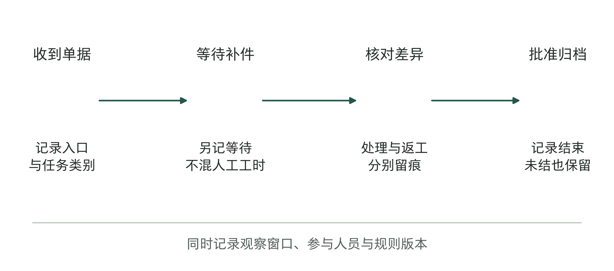
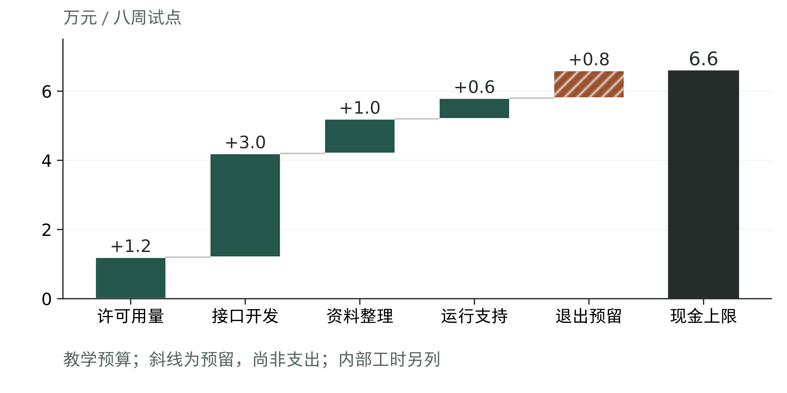
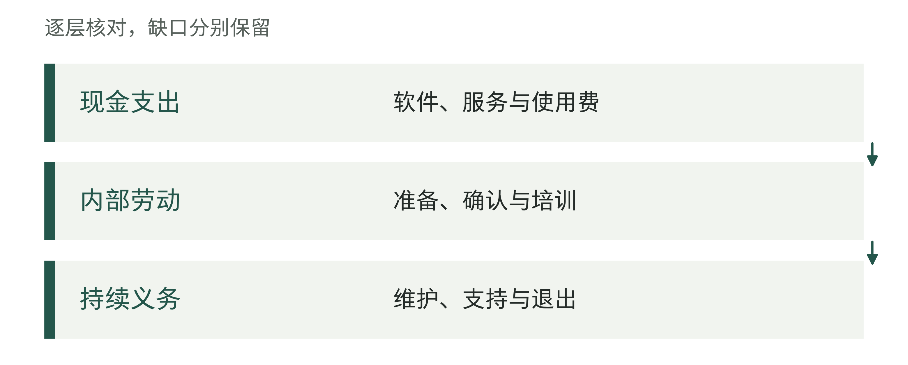
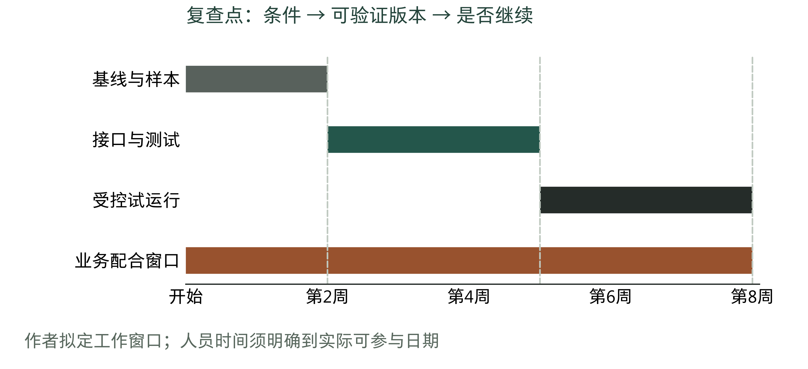
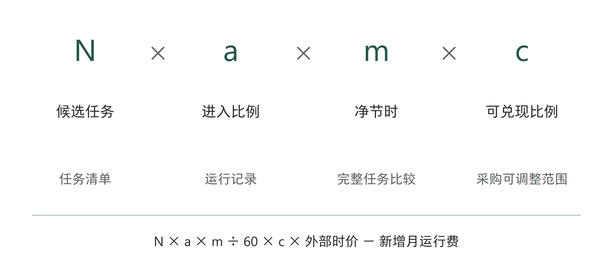
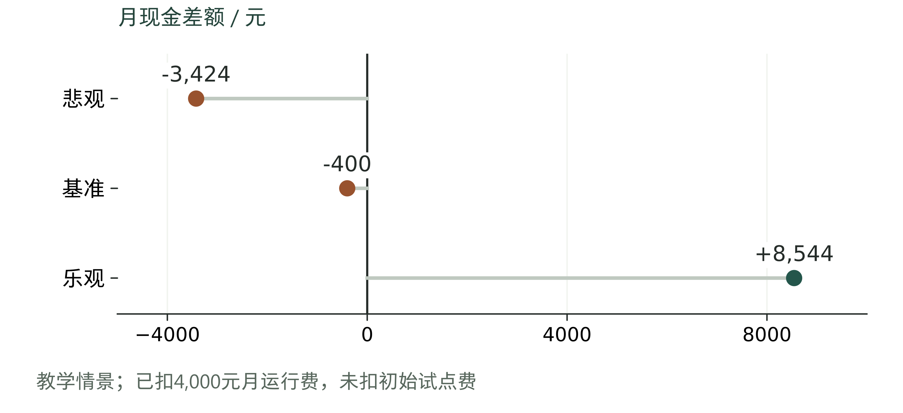
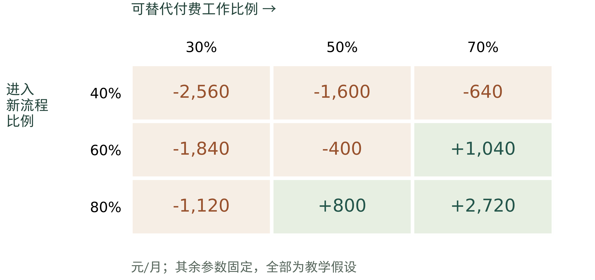
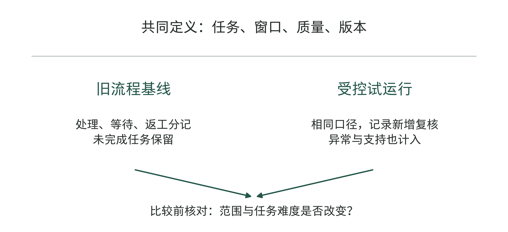
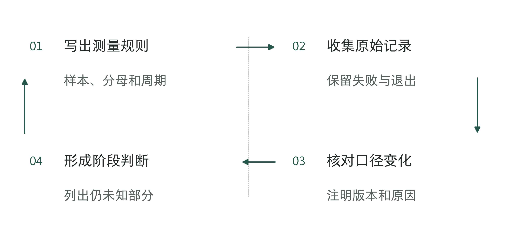

# 第5章 先算清账：投入多少，怎样才算赢

## 90%之后，还有一行小字

一份英国政府采购平台公开的合同附件，把分析与AI解决方案的效果列为月度考核项。达到良好等级，需要同时满足模型准确率至少90%、能够展示洞察如何支持业务决策、AI方案带来可测量的改善，以及响应时间符合服务约定。相关脚注又写明，每个AI或机器学习方案的服务水平协议，在交付时另行商定。[1]

这个条目比一句“保证效果”具体得多。但如果我们准备把90%抄进自己的预算申请，问题才刚开始。核对发票上的一个字段，判断整张结算单是否正确，回答一条业务规则，是三种任务。同样十次中对九次，剩下那一次可能只需改一句话，也可能使一笔款项被付错。

这份附件能证明双方约定了哪些指标，不能证明项目已经达标。我们没有取得后续协议和履行记录，也不能因此断定双方没有进一步约定。企业准备自己的预算时，要继续问清：这个百分数衡量什么任务，怎样测，由谁确认。

图5-1｜一个指标需要配上怎样的测量说明。作者根据指标阅读问题设计的标注页，非合同截图或原条款复刻。左侧展示数字，右侧提示本企业需要补充的测量字段；不推荐统一采用90%门槛。

批准预算时，老板还要知道：公司准备投入哪些资源，原来的工作做到什么水平，试点之后怎样比较，以及什么情况下继续或停止。只写金额，这次可以批，下次追加投入时却可能仍然没有判断依据。

第4章已经选定问题。本章继续用那家虚构的区域连锁企业来算账：先在一个区域试做促销结算核对，由软件提示可能存在的差异，财务人员核实后批准。下文的金额、样本和情景都是教学假设，不是真实报价、行业均值或作者客户的经营记录。我们将逐项检查，这笔投入为什么值得试、花到哪里需要再作决定。

图5-2｜读一个准确率承诺时同时看三处。作者分析工具；高阈值本身不能证明已经达到。

## 先记录原来的工作怎样做

假如预算申请写着“结算效率提高30%”，财务负责人首先要知道，30%的起点在哪里。过去处理一张单用了多久，是系统日志记下的，还是同事凭印象估计的？计算的是人工操作时间，还是从门店提交到最终完成的日历时间？如果没有答案，下个月得到一个更快的数字，也难以确认它改善了什么。

这份原流程的记录，就是后面比较用的基线，不必一开始就做得很复杂。可以选定一个完整结算周期，保存该区域进入流程的任务清单，并沿实际工作记录几类信息：任务类型，何时进入，何时完成，哪些人花了多少处理时间，发生过什么更正。某张单还没完成，就保留未完成状态，不从清单里消失。

最容易被遗漏的是退回和等待。假设一张单人工核对只用十分钟，却等门店补资料用了两天。如果经营目标是更快结账，先要查两天的等待；如果主要负担是核对人员频繁加班，十分钟才是重要的测量对象。两者可以同时记录，但不能把“少操作五分钟”写成“结账提前两天”。

图5-3｜基线记录要覆盖处理与等待。虚构任务的记录示意，横向位置表示工作顺序，不按时间长短绘制。处理工时、等待时长及返工分别记录，未完成任务也保留在范围内。

记录原流程时，也要记下当时的条件。月末大促与普通月份，老员工与新员工，资料齐全与缺失严重的单据，处理难度可能不同。如果只测平时的简单单据，却把节省比例用于促销高峰，就可能高估收益。先记清样本来自哪里、哪些情况尚未覆盖，不必为此先搭建全公司的数据平台。

员工的回忆仍然有用。有人说“每到周五最难做”，这是选择观察期的线索；有人说“这个客户总需要额外确认”，这是划分任务类别的线索。线索应当引导下一次查看记录，而不是直接乘上全年任务量写成年度收益。

记录之前，业务和技术人员还要商定什么叫“完成”。技术人员可能认为系统返回结果就结束了，财务却要等差异获得批准。双方拿同一张单，核对从哪一步开始计时、到哪一步结束。这个定义不一致，测得再精确也无法比较。

表5-1｜作者设计的基线记录字段。表内没有预填“原来平均耗时”，因为教学企业也应先测量，不能用预算愿望倒推起点。

| 基线字段 | 教学填写示例 | 为什么需要它 |
|---|---|---|
| 范围与观察期 | 一个区域，一个完整结算周期 | 与试运行保留可比范围 |
| 任务入口和结束 | 收到结算单至差异获批并归档 | 避免只量系统中的一小段 |
| 时间分开记 | 人工处理、等待补件、返工 | 看见工作减少还是转移 |
| 质量与未完成 | 错误类别、退回原因、期末未结事项 | 防止只统计顺利结束的单据 |
| 确认与版本 | 财务确认口径，保留规则版本 | 新旧比较有共同依据 |

如果过去完全没有记录，预算可以先批准一段有限的测量工作，交付可核对的基线和样本。能从现有记录取得的数据，直接取用；缺失且会改变投入判断的数据，才值得专门补测。测量安排应当减少后续猜测，而非增加例行审批。

图5-4｜基线记录怎样支持后续比较。作者分析工具；条件不可比时，不能直接宣布改善了多少。

## 报价之外，谁还在投入

现在看这家虚构企业的八周试点。软件许可和用量预计1.2万元，接口开发3万元，外部资料整理1万元，运行支持0.6万元，另留退出和移交准备0.8万元。现金预算上限合计6.6万元，其中准备金不一定支出。

此外，财务要投入60小时解释和复核，技术人员要投入100小时配合接口和测试。为比较资源占用，暂按每小时100元和150元作内部估值，分别是0.6万元和1.5万元。两个费率只是教学参数，不是市场工资标准。这2.1万元意味着公司要为人员安排时间，不意味着会新增同额现金支出。

图5-5｜一笔试点的现金预算怎样组成。八周试点的虚构现金预算，单位万元；五项合计6.6。斜线表示0.8万元预留，尚非实际支出。内部工时另列，不在瀑布图中重复相加。

若把现金预算与内部资源估值放在一起，本次资源规模是8.7万元；若问本次最多需要安排多少现金，答案仍是6.6万元。这两个数字回答的是不同问题。前者帮助比较同一批骨干能否同时承担其他项目，后者帮助安排付款与资金。讨论时应把名称写完整，避免一个“总成本”在会议里来回换含义。

同样要检查收费项目是否重叠。供应商的接口开发费已经包含了数据映射，另一项资料整理服务就应说明增加了什么工作；运行支持费已经覆盖故障处理，临时支持是否还要另付，也应问清。内部人员若已经被列入专职项目预算，就不能在同一资源口径里再加一次全额工资。

有些工作不会列在供应商报价上：业务规则谁来确认，权限谁来开，旧资料谁来更新，版本更新后谁重新测试？现有团队可以承担这些工作，但要排得出人和时间。合同只写“由客户配合”，还不能说明企业已经安排好了。

表5-2｜虚构预算的两种口径。表中估值只用于比较经营投入，不构成会计确认或资本化处理建议。

| 本次投入 | 八周教学预算 | 管理时怎样使用 |
|---|---|---|
| 外部现金及预留 | 上限6.6万元 | 核对付款条件；预留未用则不支出 |
| 财务配合 | 60小时；资源估值0.6万元 | 确认人员与结算高峰是否冲突 |
| 技术配合 | 100小时；资源估值1.5万元 | 核对接口、测试和支持任务 |
| 两类资源合看 | 8.7万元 | 比较项目占用，不当新增现金金额 |

预算还应包含停止后的工作。退出时，数据和记录要怎样取得，接口由谁关闭，原流程如何恢复，下一位维护者需要哪些说明？如果这些工作到了停用当天才报价，公司可能被迫继续付费。预先留出移交安排，并不表示预期项目失败，而是让“停止”成为做得到的决定。

图5-6｜报价下方还要找的投入。作者分析工具；将预算口径写清，避免只比较首笔付款。

表5-3｜八周试点与后续运行的费用边界（作者教学时间线）

| 期间 | 本例费用口径 | 防止怎样重复计算 |
|---|---|---|
| 第1—8周试点 | 现金上限6.6万元，含0.8万元退出移交预留；内部资源估值另列2.1万元 | 以已列试点服务范围核对，不再叠加后文每月4,000元 |
| 试点结束复查 | 清点已付、已承诺未付及未用预留；确认后续服务从哪天计费 | 未用预留不算已经支出，已发生义务不能因暂停消失 |
| 后续稳定运行 | 新增运行现金假设4,000元/月，按另行批准的服务期计算 | 与试点许可或支持重叠时先扣重叠部分，不能同时收费两遍 |
| 全项目累计 | 按各期实际现金及义务汇总，初始投入另列回收进度 | 月净额与一次投入分开；内部工时估值不当作现金 |

## 将一笔大承诺拆成几个可复查的决定

八周预算不意味着第一天就把所有费用付完。教学企业可以先安排基线和样本准备，确认能取得必要资料后再开发接口，之后进入受控试运行。每一步使用什么资源，下一步凭什么启动，应当一起讨论。

这里需要区分内部投入批准与合同付款。内部可以规定“样本条件确认后再承诺下一阶段投入”；对外何时付款，仍要看实际合同和已完成的交付义务。不能因为内部判断变化，就默认可以不支付已经按约完成的工作。第7章会把两套安排接起来。

图5-7｜预算分期与人员占用同时排。作者设计的八周计划。条带表示拟安排的工作时段，不表示已经发生的进度；复查点决定是否进入下一步。图中没有把试点通过自动连接到全公司扩张。

分期也不能被设计成“每过一周重新审批一遍”。复查应针对会改变选择的事实：必要数据是否存在，接口能否在限定权限内使用，测试中是否出现不可接受的错误，业务人员是否确有时间参与。已经核实且未变化的事项不必反复证明。

有的软件只能按年购买许可，接口开发又需要较大的前期投入，分期批准也省不下这些已承诺的费用，应在预算中明确列出。老板还可以比较另一种做法：先用脱敏样本离线验证，确认关键技术和资料问题后，再决定是否购买全年许可。离线测试花费可能较少，却看不到员工在日常工作中是否愿意使用。比较两种做法，要看各自能回答什么问题，还有什么必须留到正式试运行时检查。

人员时间也要分期安排。若财务60小时主要集中在月末，平均到八周只有每周7.5小时的写法会隐藏冲突。更有用的安排是标出需要业务人员参与判断的具体时段，让负责人确认是否能到场。没有足够时间，可以缩小本轮范围，也可以调整时点；不能把时间缺口藏进“各部门积极配合”。

图5-8｜下一阶段投入批准依据。作者分析工具；时间到点只触发复查，不自动触发放行。

## 收益假设必须能拆开

投入有了边界，接下来解释为什么值得花这笔钱。这里暂以一种最容易复算、也最容易被误用的路径作例子：减少已经计划付费的外部核对工作。只有外部采购确实能够减少，释放时间才有机会沿这条路径变成现金变化。

设每月有N项候选任务，实际进入新流程的比例为a，每项完整任务净节省m分钟，其中能够替代付费外部工作的比例为c，假设外包按工时收费，每小时120元。这里的净节时已经扣除该任务新增的复核和返工，不能在后面再扣一次。月度潜在现金节约为：N×a×m÷60×c×120。

这个算式把一句“效率提高”拆成了几项可以分别查的条件。N看真实任务清单；a看任务是否持续进入，而不是开通了多少账号；m要比较完整任务；c需要核实外部工作的可替代范围和采购安排。外部单价也必须来自本企业合同或可核实的报价，不能从软件宣传中找一个人均工资代入。

图5-9｜从任务到现金，每个乘数都需要依据。作者教学模型。各乘数分别有对应记录，末端还要扣新增运行现金费用。箭头表示计算关系，不证明企业已经发生了节约。

假设每月新增运行现金费用为4,000元。我们不把八周试点费硬塞进同一个月，而是先问：项目进入稳定运行后，每月可能增加还是减少现金负担？初始投入能否回收，随后结合运行期限再判断。

基准情景取每月1,000项候选任务，60%进入新流程，每项净节约6分钟，其中50%能够替代付费外部工作。共释放60小时，其中30小时对应可减少的外部工作，潜在节约3,600元。扣除4,000元新增运行费用，月净现金差额为负400元。

这个结果没有说项目毫无价值。它说明，仅按目前这条现金路径，稳定运行还不能覆盖新增运行费。若企业真正想购买的是更短的结算等待、更可追溯的差异记录，应该另设结果指标，并明确愿意为它付出多少。不能为使公式转正，再把同一批工时记成一次工资节约、一次外包节约和一次新增收入。

算式也能帮助看清谁能影响结果。供应商可以改进软件和接口，却未必能决定财务是否减少外包采购。英国政府的风险配置指导提出，应让最能管理某项风险的一方承担相应风险；付款若取决于对方无法控制的结果，可能影响报价和交付。[3] 在本例中，软件效果由交付团队改进，采购能否减少则需要企业确认。先分清各自能做什么，再商定共同目标。

图5-10｜把收益预测拆成可查假设。作者分析工具；每个环节都要保存口径和假设来源。

## 看三种情景，重点看差在哪里

预算通常会列悲观、基准和乐观情景。它们应当呈现几种不同的运行条件，而不是把一个收益数字上下浮动20%。如果三张表只是统一打折，老板仍然不知道该先核实哪一个假设。

本例将任务量、进入比例、净节时和可兑现比例同时列出来。新增运行费用暂固定4,000元，外部价格固定120元/小时；现实中这些费用也可能随用量变化，正式预算需要补上收费阶梯和最低承诺。

表5-4｜全部为虚构假设。悲观、基准和乐观没有附发生概率；“乐观”不是供应商承诺，“基准”也不是已经测出的均值。

| 条件与结果 | 悲观 | 基准 | 乐观 |
|---|---:|---:|---:|
| 月候选任务数 | 600 | 1,000 | 1,400 |
| 进入新流程比例 | 40% | 60% | 80% |
| 每项净节时，分钟 | 4 | 6 | 8 |
| 可替代付费工作比例 | 30% | 50% | 70% |
| 潜在现金节约，元/月 | 576 | 3,600 | 12,544 |
| 减运行费后差额，元/月 | −3,424 | −400 | 8,544 |

图5-11｜三种运行条件下的月现金差额。与表5-4使用同一模型的正负点图，单位元/月。零线区分是否覆盖假设运行费；没有包括初始试点费，也不代表全项目投资回报率。

看过三个结果后，真正需要讨论的是，哪个条件有根据。假如1,400项任务只是把其他区域未来的工作加进来，乐观情景就需要扩张投入，不能继续沿用只接入一个区域的费用。假如8分钟节时来自最熟练员工的少量顺利任务，它也不能直接代表全部任务。

即使乐观条件能保持，每月8,544元正差额也不是立刻收回6.6万元试点预算。用预算上限作简单相除，约需7.7个月这样的正差额才覆盖初始现金；这还没有考虑爬坡、停机、收费变化和资金时间价值。它只能帮助检查数量级，不能作为回收期承诺。基准情景每月仍为负差额，则没有这条现金路径上的回收期可算。

基准情景下，每月现金支出仍比节约额多400元，企业若要批准试点，就要说明这笔试验费准备查清什么，或者愿意花多少钱换取质量提高、等待缩短。不能写成已经证明能够降本。教学企业可以在八周预算内核查这些条件；如果外包采购无法减少，也没有确认其他值得投入的价值，就不再承诺后续运行费。若改以质量为目标，应当时明确负责人、成本上限和验收方法，不能到了结项时再换一套成功标准。

对首次试点而言，结果往往是“值得花有限成本核实”，尚不是“值得大规模投入”。批准时可以写清，本轮要检验的是任务进入比例与完整净节时，以及外包采购能否减少。这样，八周后即使没有形成满意回报，也能检查承诺取得的证据是否得到，而不是临时把所有困难解释为“长期价值”。

图5-12｜情景差异对应哪些先查工作。作者分析工具；情景表的用途是找到决定差异的假设。

## 找到最值得先查的那个假设

三情景适合看整体变化，却不容易看出单一因素怎样改变选择。进一步可以固定每月1,000项任务、每项净节时6分钟，只改变进入比例和可替代付费工作比例。模型仍沿用每小时120元和每月4,000元新增费用。

图5-13｜进入比例与兑现条件如何影响月差额。虚构双因素敏感性表，单元格为元/月。行是进入新流程比例，列是可替代付费工作比例；颜色只辅助区分正负，数值保留。其余条件固定，不是实测热力分布。

在60%进入比例下，如果只能替代30%的付费工作，月差额是负1,840元；如果能替代70%，变为正1,040元。两种情况下软件能力完全相同，变化来自企业怎样安排工作和采购。因此，下一次访谈可能应当先找外包采购负责人，核对哪些工作量真能减少，而不是继续要求模型把回答写得更漂亮。

反过来，若合同有最低采购量，减少30小时外部工作未必降低账单。c就不能按“理论上能接回来多少”填写，而要按可实际调整支出的条件重新估计。实在无法确认，可以先把这条收益留为零，记录仍需核实的材料，另看其他有依据的价值是否足以支持试点。

也可以倒推一个数量级。在基准参数不变时，覆盖每月4,000元运行费约需1,112项候选任务。若目前可靠记录只有600项，就不应继续拿1,000项的基准表作结论；若存在2,000项，也要先核对其中多少属于当前可处理范围。这个盈亏平衡点只在上述假设下成立，其中任何参数变化，都要重算。

这张表最有用的地方，是帮助团队决定下一步先查什么。参数变化的范围还不清楚，就不必做精密的概率模拟；没有可比较的样本，也不必画风险收益曲线。预算里可以有暂时不知道的事，但要写清由谁查哪份记录，查清以后重算哪一项。

表5-5｜关键假设核查优先表（作者检查工具）

| 假设 | 核对记录 | 核查后更新什么 |
|---|---|---|
| 任务量 | 近期业务流水 | 适用数量 |
| 净节省 | 完整任务时间记录 | 收益情景 |
| 实际采用 | 目标人群完成任务记录 | 可兑现规模 |
| 复核负担 | 异常与人工处理记录 | 容量及持续成本 |

## 把“怎样才算赢”写成测量安排

有了收益模型，还需要规定怎样判断试点是否值得继续。采用、质量、风险和经营结果最好分别看。它们相互影响，却不适合混成一个总分：更多使用者不能抵消未经批准的付款，更高准确率也不能补偿无人接管的异常。

教学企业可以先把质量目标放在“候选差异是否有可核对依据”，而不是要求AI自动决定最终结算。错误分类由财务参与定义：漏报差异、错误提示差异、引用不适用规则，以及输出无法核实。不同错误的后果不同，需要分别记录。全部混成“回答正确率”，可能看不见某类少见却重要的失败。

测量之前要说清：每次判断一个字段还是一张单，哪些任务计入统计，谁确认对错，有争议的样本怎样处理，使用哪个版本，以及何时复查。英国通用合同模板也把服务水平与绩效监督分别列出。[2] 这里针对AI任务提出的具体问题，是作者的建议，不是该模板统一规定的条款。

图5-14｜从基线到试运行，保留同一把尺。作者设计的比较路径：先确认共同口径，分别记录旧流程与受控试运行，再检查范围差异。两组记录即使采用相同字段，也要检查人员、任务难度等其他条件是否可比；统计与运行评测在第10、12章继续展开。

用于调试的样本和用于验收的样本，要分开。反复用同一批例子修改系统，再拿它们证明系统可靠，容易高估效果。可以留出一批没有参与调试的任务，由业务方按事先商定的标准复核；进入真实试运行后，再检查有没有出现新类型。需要多少样本，要看任务差异、错误后果和本次判断的目的，不能从书里抄一个固定数。

如果真实任务按月发生，观察期应能覆盖相应周期。结束日期到了，却没有足够任务进入，应当报告证据不足，而不是只用最后几次成功演示凑齐验收。是否追加观察，要看多等一段时间能够解决什么问题、还需占用多少资源。

人员负担也要进入测量。财务为了协助试点，可能每天整理大量样本，工程师可能在背后人工修正输出。如果这些工作没有记录，试点中的体验会比正常运行显得更好。交付团队可以提供额外支持，但应把试点支持和长期需要的工作分别列出来。

零次事故也要谨慎解释。一个小样本里没有发生错误付款，只能说明这段观察中没有看见，不证明扩到更多任务后风险为零。对无法承受的动作，应靠权限和批准方式限制影响，再用记录检验控制是否有效。这里不为所有企业设相同的风险阈值，企业需要结合自身业务和责任要求确定。

图5-15｜测量安排怎样随项目运行。作者分析工具；测量方式改变后，不能直接拼接两段结果。

## 停止条件要在钱花下去以前写

预算最难写的部分，常常不是多少钱，而是什么情况承认当前路径不值得继续。等投入了很多时间再讨论，很容易把“已经做了这么久”变成下一笔投入的理由。更稳妥的做法是在开始前区分几种触发条件。

一类是立即收窄或暂停的条件，例如出现未授权的外部动作、关键记录无法追溯，或异常发生后无人处理。另一类是有明确修复路径的偏差，例如一类资料版本未统一，导致特定任务不能正确处理。还有一类是经济条件不成立：真实任务量不足，新增支持费高于预期，外部采购不能按原设想减少。

三者需要不同的后续工作。暂停高影响动作后仍要处理已发生的任务；修资料需要负责人和复测范围；经济假设落空则应重新比较替代方案。不能把每一个问题都归结为再训练一次模型，也不能因为一个指标低于预期就丢掉所有可用成果。

图5-16｜复查后分别处理风险、缺陷和经济假设。作者设计的预算复查方法。类别不是自动决策规则，同一项目可能需要同时采取几种动作；每种处理方式都要指定负责人，保留已发生事项及下一次判断条件。

修复也应有边界。比如只允许在现有预算内补齐一个明确字段，再用未参与调试的样本复查；若关键数据仍不可得，就结束当前范围。这个约定比“优化到满意为止”更容易执行。允许继续观察，也应写明要补多少有效任务、由谁确认、何时再次讨论，避免无限延期。

停止当前试点后，可以在取得所需授权、处理好资料的前提下，保留已经确认的定义、测试记录、不适用的范围和重新启动的条件。下一次遇到相似问题，团队就有记录可查。至于这些资料带来多大收益，还要看后续是否用得上，不能把本次花掉的钱全部算成“知识资产”的收益。

图5-17｜触发停止条件之后。作者分析工具；决定暂停或退出时，也要指定谁处理尚未完成的任务。

## 这次到底批准什么

回到这家教学企业，本轮可以批准的范围是：一个区域、八周、现金上限6.6万元，另安排财务60小时和技术100小时。软件只提示可能存在的结算差异，最终仍由财务核实、批准。

基准现金情景仍为每月负400元。团队要验证哪些条件可以改变判断，或提供其他值得投入的结果依据，再决定是否扩大。

表5-6｜阶段承诺签下前的核对（作者检查工具）

| 项目 | 本轮必须写清 |
|---|---|
| 允许工作 | 做哪些任务，使用哪些资料；不含什么 |
| 资源上限 | 现金、人员时间、调用量分别记录 |
| 继续依据 | 样本、口径、负责人及复查日期 |
| 停止后安排 | 未完成的任务、资料、费用和接手人 |

使用附后工具时，先填投入范围，再填基线、测量和继续条件；不清楚的事项写明由谁核查、何时复查。

第6章接着安排有权判断、有能力交付的人，让这些承诺有人落实。

## 资料与说明

[1] UK Contracts Finder，RM6100 Technology Services 3 Agreement，公开合同附件，277页，第24页KPI4“Analytics & AI Solutions Effectiveness”及脚注4。该页已于2026年9月9日依据官方原件核对。相关KPI须结合逐方案议定的SLA理解，不据此判断其他合同条款或实际履行结果。 https://www.contractsfinder.service.gov.uk/Notice/Attachment/9eb13f50-d293-49cf-b9ff-b096599ce4e1

[2] UK Government Commercial Function，Call Off Schedule Templates，Call Off Schedule 6，服务水平及绩效监督部分，2026年9月6日核查。该材料为通用模板，不是本章教学企业的合同。 https://www.gov.uk/government/publications/simplified-bidder-pack-split-terms/call-off-schedule-templates

[3] UK Government Commercial Function，Risk Allocation and Pricing Approaches guidance note，2026-06-15版，2.1及4.1.2—4.1.4。关于风险与控制能力的公共采购指导，用于解释管理取舍，不当作中国企业通用法律规则。https://www.gov.uk/government/publications/the-sourcing-and-consultancy-playbooks/risk-allocation-and-pricing-approaches-guidance-note-html

预算、工时费率、情景参数、表格和行动工具均为作者教学设计，不代表真实客户数据、投资建议或行业标准。金额统一为人民币；运行情景不含初始试点投入，现金支出与内部资源估值分别列示。
