# 第6章 组建团队：谁决策，谁交付，谁承担结果

## 项目群里的人都在，工作还是推进不了

预算已经通过，接口也已经接通。进入试运行前，工程师发现一类促销结算规则存在两个版本：财务沿用旧口径，运营认为应按新活动方案处理。供应商可以在当天改完系统，却无法决定哪个版本才是公司认可的规则。项目经理催上线，两位部门负责人都说还要再确认。相关人员都在群里，事情却还是停住了。

这仍是前两章那家虚构连锁企业的教学情景。项目缺的不是一个新头衔，而是有权确认这条规则的人。增加一位AI负责人，或让工程师“端到端负责”，都不能替公司决定结算规则。

修改一条规则，要先确认它是什么意思、适用于哪些任务，再写入系统、测试影响、批准发布。上线后还要检查实际处理结果。同一个人可以做其中几项，但接到下一步工作时，他需要哪些资料、有权决定什么，必须说清。出现分歧，也要知道找谁作决定。

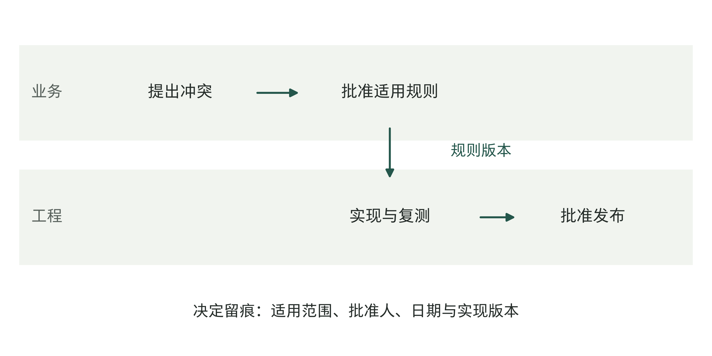

图6-1｜业务和工程怎样配合修改规则。作者为虚构情景绘制的规则变更流程。业务规则批准与技术发布分别安排，连线表示需要移交的材料；不是某家公司的现行制度或法定责任图。

第3章已经区分人员、软件和数字岗位。本章不继续比较头衔，而是把第5章的投入安排变成能工作的团队。无论采用自建、外购还是共建，都要有人确定任务，有人能够实现，有人批准它进入生产，也有人处理系统没能完成的任务。

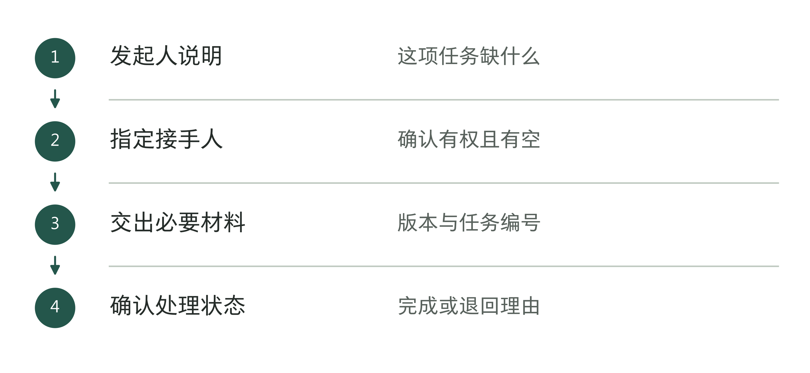

图6-2｜把群消息变成一次交接。作者分析工具；消息发出以后，还要确认对方已经接手。

## 从几份岗位说明，看见职责怎样拆开

在本书核查过的Anthropic招聘材料中，可以看到几种职责怎样分工。售前项目负责人先筛选机会、排定优先级，决定由内部团队、合作伙伴还是双方共同交付，再组织范围确认、提案及法律、财务等签约流程，并做好与后续交付团队的交接。岗位说明还提到，当时的需求超过团队能够服务的范围，需要作出选择。[1]

这份安排先决定有限的工程人手用在哪些项目上。客户愿意购买，不代表所有项目都应立即进入同一支工程团队。若缺少这一层选择，FDE可能在多个项目间来回救急，最需要连续工作的部分反而得不到时间。

进入交付后，技术部署负责人（Technical Deployment Lead）负责范围、里程碑、依赖、成功标准、价值假设和日常推进，并承担基线、指标及结果测量等工作。岗位明确写到，不要求其编写生产代码；他与构建技术方案的FDE一起工作。[2] 对老板来说，值得留意的是，安排工程顺序的人需要理解技术，但不必把全部代码也揽到自己手里。

FDE岗位则强调在客户系统中构建生产应用，交付可用于实际流程的技术成果，并将可重复的部署模式反馈给产品和工程团队。[3] “在客户系统构建”要求工程师到实际业务环境中工作，但这份岗位说明没有披露各项目的代码库权限、发布批准和回滚安排。回滚是把软件或配置退回已确认的旧版本，已发生的业务动作仍需另行核对。每个项目都要另行确认这些安排。

另一份FDE经理岗位说明，把人员配置、架构与代码审查、工程师培养，以及可复用材料的建设放在管理职责里。[4] 当交付压力上来时，有人需要为质量标准和人员能力保留时间，不能只靠每位工程师在项目间隙自发完成。

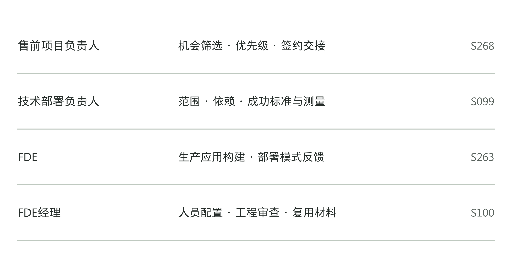

图6-3｜岗位说明支持哪些职责判断。依据四份公开岗位材料归纳的职责索引。[1][2][3][4] 图只列有明示依据的工作，横向排列便于比较，不表示实际汇报层级、固定人数或每个项目都经过同一路线。

招聘材料说明公司希望这些岗位做什么，不能当作客户项目已经成功的证明，也不足以拼出完整的实际组织图。但它们提醒企业检查几件具体的事：谁选择项目，谁确认范围，谁开发，谁检查质量，谁负责持续运行？如果都只写成“项目组负责”，出问题时仍然找不到能处理的人。

中型企业不必照搬这些岗位。业务主管可以牵头，内部工程师承担部分开发，供应商补充所需能力。先把事情分清、交接安排好，再决定哪些职责需要专人承担。

表6-1｜岗位说明怎样转成项目安排（作者检查工具）

| 岗位描述 | 本项目需要补写 |
|---|---|
| 连接业务与技术 | 哪些任务由谁提出和接收？ |
| 衡量价值 | 谁提供基线，谁确认实际变化？ |
| 推动采用 | 谁负责培训、权限与工作调整？ |

## 先确定哪些决定必须留在企业里

对开篇那条结算规则，供应商可以展示两种实现方式，说明每一种会影响哪些任务，也可以提示规则之间的冲突。但最终哪一种解释代表公司的经营安排，需要由企业有权确认的人决定。把这项判断外包出去，供应商可能只能依据项目经理的即时口头指令，形成一套无人正式认可的规则。

企业也需要自己决定愿意承担怎样的经营后果。例如，某类差异是否允许自动核销，哪种客户通知必须复核，哪些例外需要暂停；这些问题不能只由模型置信度来回答。技术团队负责说明能力和限制，业务负责人决定任务边界，财务、合规等相关人员按各自职责参与。

对资源的承诺同样要留在有权安排资源的人手里。财务愿意试，不代表技术部门能够在本周开出接口；项目经理可以协调，却未必能改变另一个部门的优先级。老板或获得授权的项目发起人需要在冲突时作出取舍，并承担由此挤占其他工作的后果。

表6-2｜作者的决定与材料对照。表内不是法律责任转移安排；一个决定包含多个专业批准时，应拆开记录，不能用“老板同意”替代全部程序。

| 需要作出的决定 | 交付团队应提供什么 | 企业应明确谁来确认 |
|---|---|---|
| 规则采用哪个版本 | 冲突样本、影响范围及实现选项 | 有权批准该业务规则的人 |
| 哪些动作可以自动执行 | 错误后果、权限方案与接管方法 | 业务与相应控制责任人 |
| 是否进入生产环境 | 测试、发布及恢复材料 | 获授权的生产发布负责人 |
| 是否追加投入或扩大范围 | 结果记录、剩余缺口及资源需求 | 有预算及范围决策权的人 |

企业保留决定权，不等于老板亲自审核每张单。可以先明确授权：已批准的规则和预算内，由负责人推进；超出范围时，由他列出选项、影响和需要谁决定。只写“重大事项报老板”，不说什么算重大，大家遇事就容易等着老板表态。

授权还需要有人能够使用它。财务规则负责人若没有时间查看样本，名称再准确也解决不了停顿。预算中已经安排的60小时，应当落实到具体人员、参与时间及替补安排，而非停在上一章的表格里。

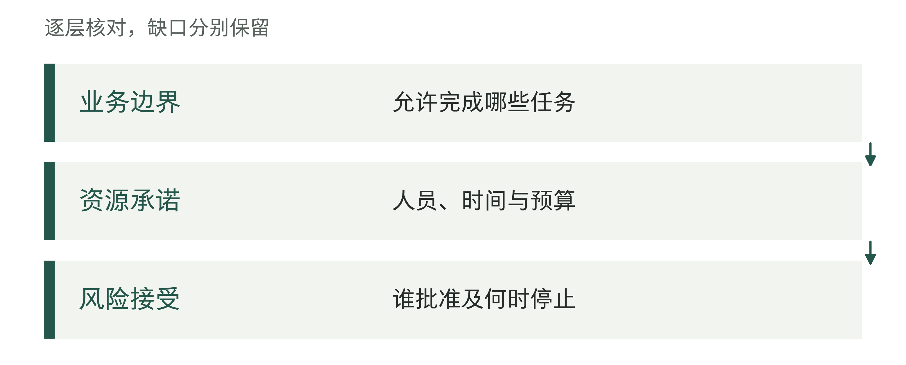

图6-4｜企业必须保留的决定。作者分析工具；外部团队可以提供依据，决定仍须有企业责任人。

## 一张责任表，要写到能够被验证

很多企业会使用RACI表。R表示执行，A表示对该项决定最终负责，C表示事前需要征询，I表示结果需要知会。它适合把一项工作中的不同参与方式摊开看，但四个字母本身不能解决决策权。

先看一个过粗的写法：“上线结算助手，项目经理A，供应商R，财务C，技术C。”财务发现规则错误时，只能提出意见，还是可以阻止上线？技术部门是否仍要批准发布？表里都没有答案。项目经理被放在最终负责的位置，却可能无权作出这两项决定。

可以把工作拆细。规则确认由业务负责人最终决定；构建与修复由交付负责人组织；业务验收由获授权的业务负责人确认，交付团队提供样本和测试记录；技术发布由生产负责人批准。图中的A/R表示同一角色同时负责决定与执行。每一行只保留一个A，是本书为明确具体事项采用的设计约束。事项无法如此安排时，先检查是否把两种不同决定混在了一行。

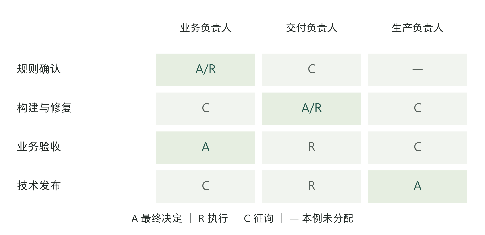

图6-5｜将一个含糊的上线任务拆成具体责任。作者为教学项目设计的精简责任矩阵。A为该事项的最终决定者，R为执行者，C为事前征询；横线表示本示例未分配职责。角色可以兼任，相应判断仍须分别完成；采用不同复核制度的企业应调整人员安排。

小团队可把四类职责落在三个人身上。以下为教学安排：老板甲负责范围与追加资源，财务主管乙负责规则和业务验收，工程负责人丙兼任构建与技术发布；丙兼任不意味着自己的测试可以替代乙的业务确认。若新规则不适用于上月账单，乙可叫停该业务路径，丙冻结相关发布并修复，甲只在需要调整预算或范围时作决定。高影响技术发布若需独立复核，再安排具备能力与授权的人员，不能用三人示例省略既有要求。

填写后，拿一条真实变更试走一次。如果财务说新规则不能用于上个月的结算，谁修改适用日期，谁检查历史数据，谁决定延期上线？若表中找不到答案，应当改表，而不是要求同事“严格遵循RACI”。

对同一人兼任多个角色的情况，还要检查复核是否失去作用。小团队很难为每一步配置独立人员，但可以让另一位有能力的人抽查关键样本，或在高影响发布前安排额外审查。需要什么程度的分离，取决于任务后果和已有制度；不能仅因一张表有两个名字，就认定风险已受到控制。

责任表还要配合日常任务清单使用。最终负责人不用亲自做完所有细节，执行者也可以分工，但遇到自己决定不了的问题，要知道交给谁。开项目会时，不必再背一遍角色定义，应查清哪项工作还缺资料、哪项批准尚未完成、谁需要在几个方案之间作选择。

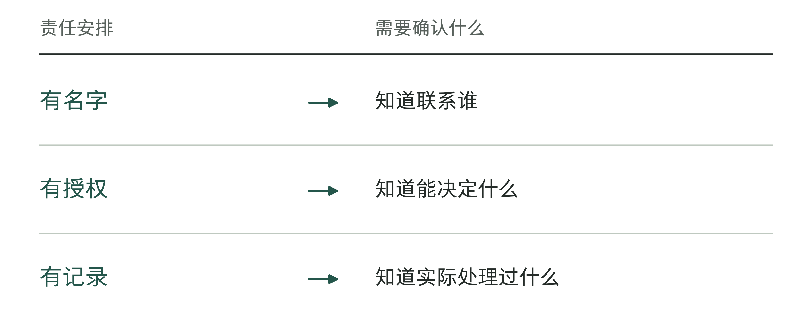

图6-6｜责任表中的三种证据。作者分析工具；名单、授权和实际履行应分别核对。

## 决定权与停止权一起安排

项目经理希望按期上线，工程师发现测试仍有一类重要错误。这时谁能说“今天不能发布”？如果停止权没有事先说明，质量问题就容易被解释成态度问题：有人太保守，有人不配合，有人只顾进度。

停止权可以按事项分别安排。生产负责人可以暂停不符合发布条件的版本，业务负责人可以停止使用未经确认的规则，发现越权动作的人员可以启动约定的紧急处置。暂停以后，谁查影响、谁修复、谁批准恢复，也要一并确定。

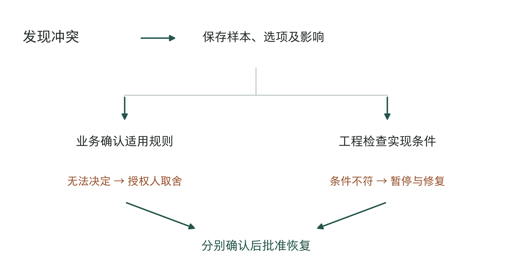

图6-7｜分歧从记录走向决定。作者的规则争议处理路径。升级材料包括冲突样本、可选处理及影响；工程和业务判断分别留下记录，紧急情况按已定处置安排先限制影响。

停止权应当能够及时使用，也应接受复核。它不适合成为无期限搁置项目的理由。若暂停依据是某条规则尚未确认，应说明缺少谁的判断；若依据是数据问题，应给出受影响的任务和可恢复条件。这样，团队能够围绕事实解决阻塞，而不是围绕谁更有权威争论。

恢复权常被遗漏。负责修复的人说“已经好了”，不一定足以恢复运行。原先的暂停如果涉及业务规则，业务方应确认规则；涉及技术缺陷，发布负责人应检查复测材料。某些事项需要多个专业确认，应逐项记录，而不是找一个人总签字后假定全部问题消失。

老板需要处理的是越过现有授权边界的冲突。例如，修复需要增加预算，延期会影响另一项经营安排，或业务部门对规则一直无法达成一致。升级时应带来可比较的方案：保留人工处理这一类任务、推迟整体上线，还是缩小试点。只有一句“请领导协调”，很难作出有依据的选择。

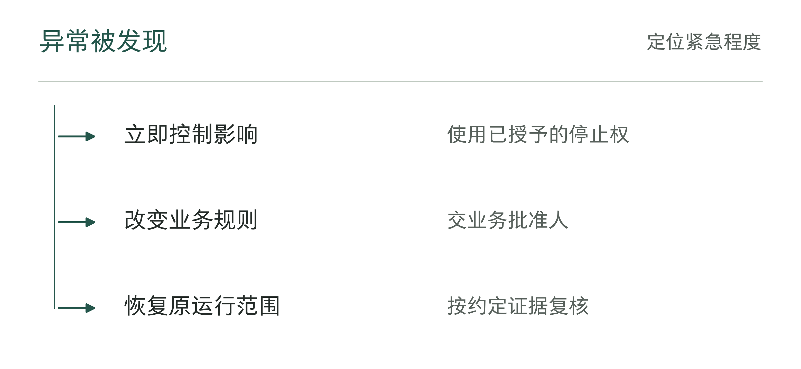

图6-8｜出现异常时谁可以先行动。作者分析工具；先控制影响的权限应在启动时写清。

## 自建、外购、共建，各自要安排什么

团队名单明确之后，才适合讨论哪些能力由内部承担。自建的吸引力是公司可以持续修改系统，积累业务理解；相应地，也要持续安排工程、测试、运行和人员培养。不能把第一位工程师的招聘成本当成全部投入。

外购成熟能力可以减少某些构建工作，但企业仍需确认适用范围、准备资料、安排权限、验证输出并组织使用。若购买的是标准产品，不应默认供应商负责改造所有内部流程。若购买的是交付服务，应进一步核对实际交付物和维护责任。两者的比较不能只用一个账号价格完成。

即使都叫“FDE服务”，买到的也可能不同。一种是工程师加入客户团队，由客户安排日常工作；另一种是服务商自己带队，按约定范围组织交付。前者适合内部已有工程负责人、需要补充某项能力的企业。若公司连需求先做什么、成果由谁检查都还没安排好，增加外部工程师也可能增加自己的管理负担。选择后一种，则要核实服务商谁带队、谁处理返工、交付后谁维护，企业仍负责业务规则和使用范围的确认。第15章会用公开服务安排比较这两种生意。

共建适合需要现场理解，又希望内部逐渐接手的工作。它通常要同时安排交付进度和知识移交：内部人员参与规则及接口决定，跟随处理代表性异常，使用自己的环境复现构建或配置。仅把内部人员抄送到项目群，并不会形成接手能力。

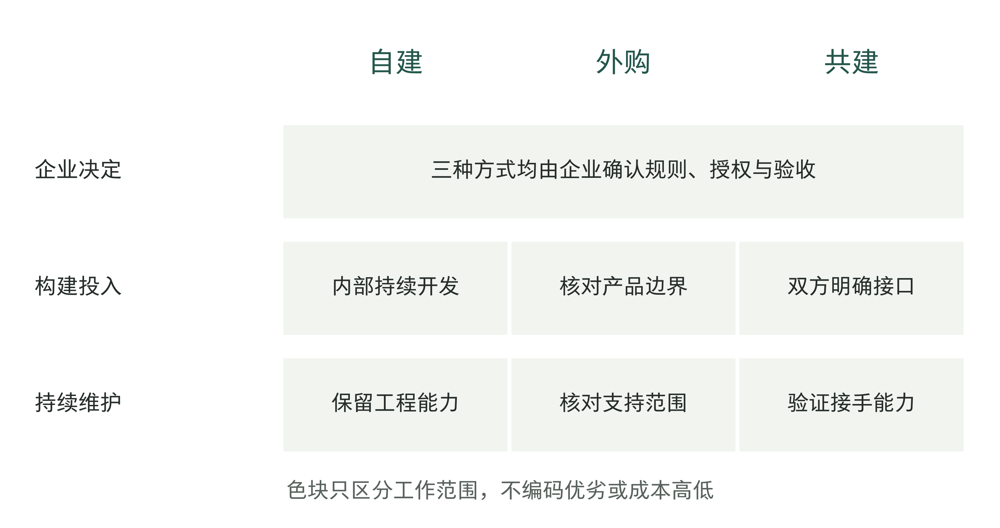

图6-9｜三种组织方式的持续投入在哪里。作者的定性组织比较。色块表示需要重点安排的能力，不是成本高低评分；三种方式都保留企业的业务决定与验收责任。

具体选择应当回到几项条件。任务是否经常变化，变更是否影响公司的核心判断，现成产品是否已能满足要求，内部有没有持续维护的人，以及停用或更换供应商时能否接回工作。这些条件可以使同一家公司对不同任务作出不同选择。

例如，教学企业可能外购通用的单据识别，内部确认结算规则，由双方一起开发发现和复核差异的流程。它无需在所有层面坚持同一种模式。真正需要检查的是接口两侧：识别错误由谁反馈，规则变化由谁更新，某个组件不可用时完整任务怎样继续。

也要考虑维护者的连续性。自建系统若只有一人理解，员工离开时同样可能难以接手；供应商如果有完整的移交材料和可验证的退出安排，外购也未必意味着失去所有控制。控制能力应从能否查看记录、修改必要部分和恢复工作来判断，而不只看代码属于哪一方。

比较三种方式的成本，要把同样的工作都算进去。外购报价不含的内部工作要补上，自建预算遗漏的运行支持也要补上。共建期间双方同时投入，费用可能更高；如果目的是逐步由内部接手，就要检查后来是否真的减少了外部支持，不能先把未来的节约算成已实现收益。

## 有名字，还要有可用的时间

一位业务骨干同时参加三个AI项目，每个项目只需要他每周八小时。分别看，似乎都不多；加起来已经是24小时。假设他每周40小时中，原有工作占28小时，例会与支持占6小时，真正可安排给新项目的只有6小时。三个项目合计超出了18小时。

这些数字是教学假设，不是工作时长建议。它们暴露的是一个常见的预算口径问题：项目计算了自己需要多少时间，却没有核对同一个人的总承诺。最终缺口可能通过加班、延误、降低复核质量，或挤占原业务工作显现出来。

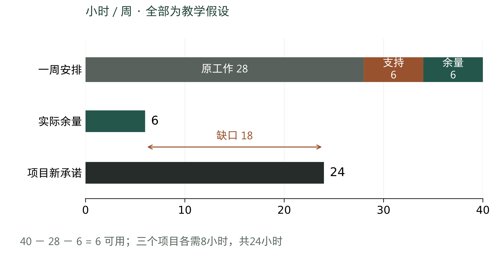

图6-10｜项目需要的时间，要与实际余量比较。虚构人员容量对照，单位小时/周。已分配34小时，剩余6小时；三个项目新承诺合计24小时，超出余量18小时。共同零基线用于比较，不把40小时画成行业标准。

解决办法未必是继续招聘。可以先决定哪个项目优先，缩小本轮试点，错开需要业务人员参与判断的时间，或者把部分准备工作交给能够胜任的同事。若核心判断确实只能由这位骨干完成，就应为他减少其他任务，而不是把所有冲突都交给个人消化。

工程人员也存在同样问题。一个已经上线的项目仍需维护，新的试点又需要构建。如果只记录新功能开发时间，运维支持会变成不被承认的负担。FDE经理或交付负责人需要看到同时运行的项目、正在排队的需求和必要的质量检查，才能合理承诺下一项交付。

人员安排应随项目阶段变化。早期更需要业务解释与样本确认，构建期需要工程连续时间，试运行期需要使用者和接管人员。把每个角色从第一天到最后一天都平均配置，可能既浪费时间，又在关键时刻缺人。第5章的分期预算因此要与本章的具体角色一起排。

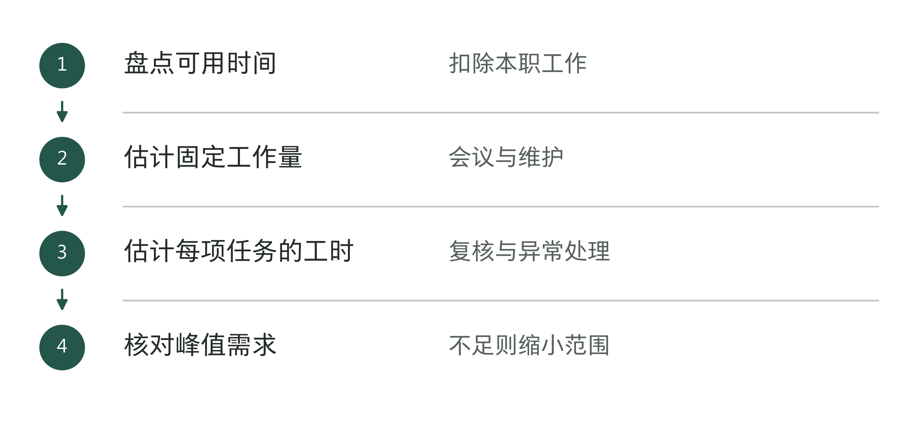

图6-11｜怎样按可用时间安排工作。作者分析工具；安排人手时要算实际工作量，不能只数人数。

## 找到内部带头人，还要安排好替补

一位懂业务、愿意尝试的同事，可以帮助团队找到真实问题、组织试用和收集反馈。这样的内部带头人很有价值，但他的热情无法代替正式授权，也无法长期补齐所有培训、答疑和规则维护。

企业应当明确他承担哪一段工作。可以负责整理代表性样本，协助同事试用，记录问题并联络交付团队；涉及改变规则、扩大权限和额外投入，则交给相应负责人决定。若所有问题都只能先找这个人，系统规模越大，他越容易成为新的排队点。

安排好替补以后，要让他按说明独立完成一次同类任务，再处理一次真实或受控模拟的异常。如果某一步仍要原带头人口头解释，就把缺少的说明补上，或者继续训练。通过这次检查，只能说明他能接手当前范围的工作，不能推定所有场景都没问题。

表6-3｜作者的内部能力检查。人员替补需要合适授权与能力，不能以“已经培训”代替实际完成任务的验证。

| 常见依赖 | 容易出现的后果 | 可以验证的改进 |
|---|---|---|
| 只有带头人知道哪些任务适用 | 他不在时没人敢用或错误扩大范围 | 第二位使用者能按说明判断适用范围 |
| 问题只在个人聊天中解决 | 同类异常重复询问 | 记录处理依据，并由别人复现 |
| 规则维护与培训没有正式时间 | 采用增加后支持负担失控 | 明确维护时间、负责人及疑难问题找谁 |

这位带头人也能帮助业务人员把问题说清楚。只说“系统不好用”，工程师很难复现；记下当时的任务、规则版本、预期结果和实际结果，才便于排查。但业务人员不需要先猜出技术原因，工程团队应提供方便的反馈方式，并说明处理进展。

表6-4｜关键人员缺席时的替补检查（作者检查工具）

| 要接替的工作 | 预先保留什么 |
|---|---|
| 判断异常任务 | 适用规则、反例与批准边界 |
| 恢复运行 | 版本、步骤和演练结果 |
| 向业务交接 | 联系人、所需资料和未完成任务的状态 |

## 从销售交接到运行交接，检查交过去的是什么

一个项目在签约时，可以有很完整的提案，却缺少开始构建所需的资料。演示采用哪批样本，哪些效果只是计划，哪些接口尚未获准，谁会提供业务判断，如果没有交给交付团队，后者就会重新发现这些限制。

销售人员交接时，要把已经承诺的范围和仍需验证的假设分开说明。交付团队可以利用此前的访谈记录，但不能把尚未确认的事直接当成事实。合同签了，开工所需的资料和权限未必已经齐全，还要逐项检查。

从开发转入运行时，需要交出当前版本、适用的输入资料、已知限制、监控与异常记录位置、恢复步骤和维护联系人。接手者还要知道怎样检查变更是否生效。判断资料够不够，要看他能不能据此完成工作，不能只数交了多少份文件。

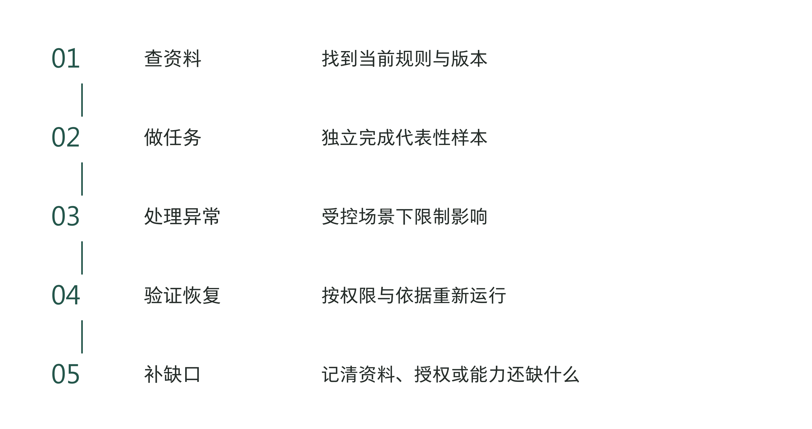

图6-12｜用一次接手演练检查移交。作者设计的移交验证序列：接手者查资料、完成任务、处理异常、确认恢复，再记录仍需补充的内容。演练场景应受控，图示不声称任何真实客户已完成演练。

教学企业可以选一张规则冲突的单据，让日常维护者先判断是否需要暂停，再按记录找到已批准的适用版本。若必须联系原工程师才能知道它用了哪条规则，移交就还缺少信息。若知道规则却没有必要权限，缺的是授权。两种缺口要分别处理，不能统一写成“加强培训”。

交接由实际接手者确认材料是否够用；业务和技术部分，分别由有能力的人核对。确认后仍可保留已知限制和支持安排。演练通过，说明当前范围有人能接手；换场景或换版本后的适用性，还要按第14章重新检验。

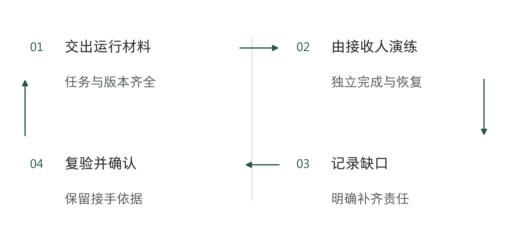

图6-13｜交接完成后怎样证明能接手。作者分析工具；接收签字应建立在实际演练之上。

## 启动会上，先完整检查一项任务

下一次启动会，可以沿开篇那条规则变更走一遍：谁拿出冲突样本，谁批准适用范围，谁构建，谁复核，谁发布，出错后谁接手。将答案填入章末工作表，同时检查这些人是否有权限和可用时间。

如果某一步仍写着“项目组共同负责”，就继续分清具体事项和负责人。同一人承担多项关键判断时，检查是否需要额外复核或替补。老板应在启动前解决资源与授权冲突，让该作决定的人有权作决定，也有时间处理。

团队安排清楚后，对外采购仍有最后一层需要核对：口头说由供应商负责的事，是否也写进了交付、验收和运行约定。第7章将把这些承诺落实到合同材料中。

## 资料与说明

[1] Anthropic，Pre-Sales Program Lead, Forward Deployed Engineering，About the role及Key responsibilities，2026-09-06回查。机会筛选、优先级、伙伴路由和销售交接为岗位明示职责，不推断实际产能与签字额度。https://job-boards.greenhouse.io/anthropic/jobs/5391012008

[2] Anthropic，Technical Deployment Lead，Responsibilities及任职要求，2026-09-06回查。范围、依赖与价值测量为职位设计，不是独立客户结果报告。https://job-boards.greenhouse.io/anthropic/jobs/5017903008

[3] Anthropic，Forward Deployed Engineer，Responsibilities，2026-09-06回查。工程构建与交付物范围，不证明客户生产权限已全部授予。https://job-boards.greenhouse.io/anthropic/jobs/5302966008

[4] Anthropic，Manager, Forward Deployed Engineering，About the role及Responsibilities，2026-09-06回查。用于质量、人员和复用职责，不代表披露实际编制或部署成效。https://job-boards.greenhouse.io/anthropic/jobs/5385634008

岗位材料反映核查时可见的职责，可能随招聘调整。教学企业、责任矩阵、自建外购共建比较、人员容量及工具均为作者设计，不用于认定具体当事人的法律责任，也不代表行业统一制度。
