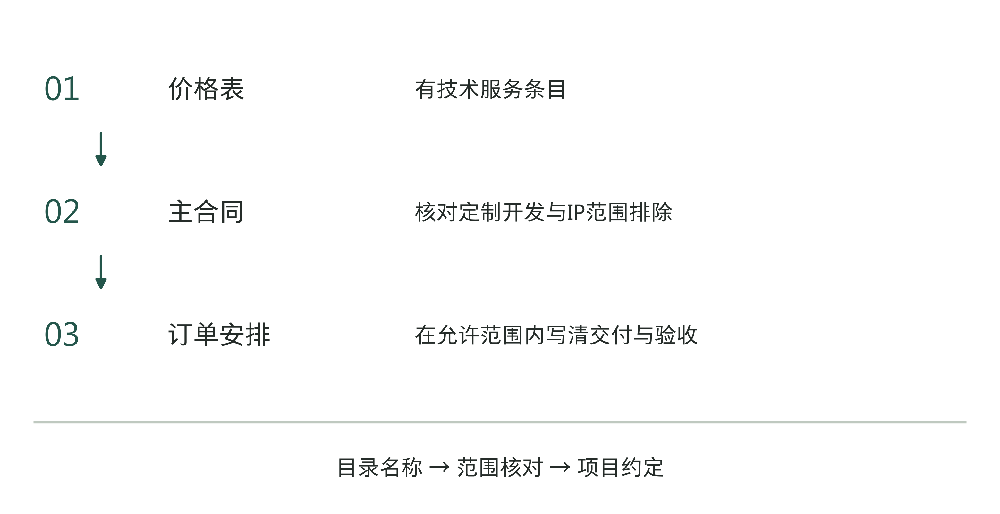
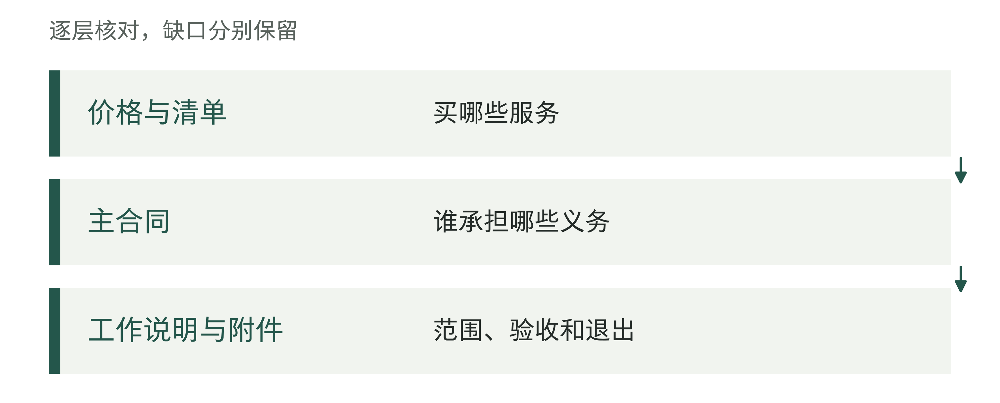
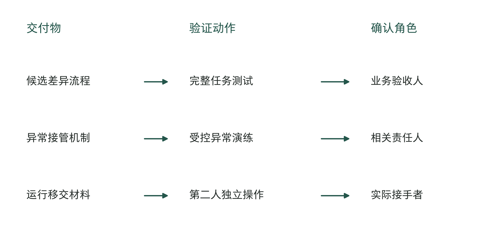
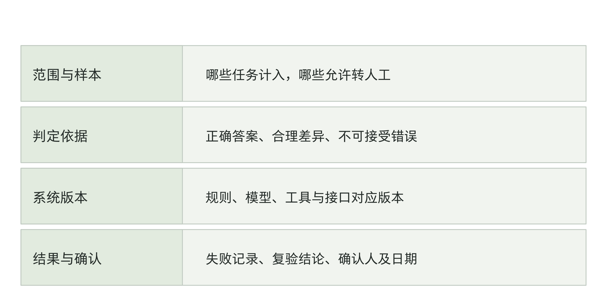
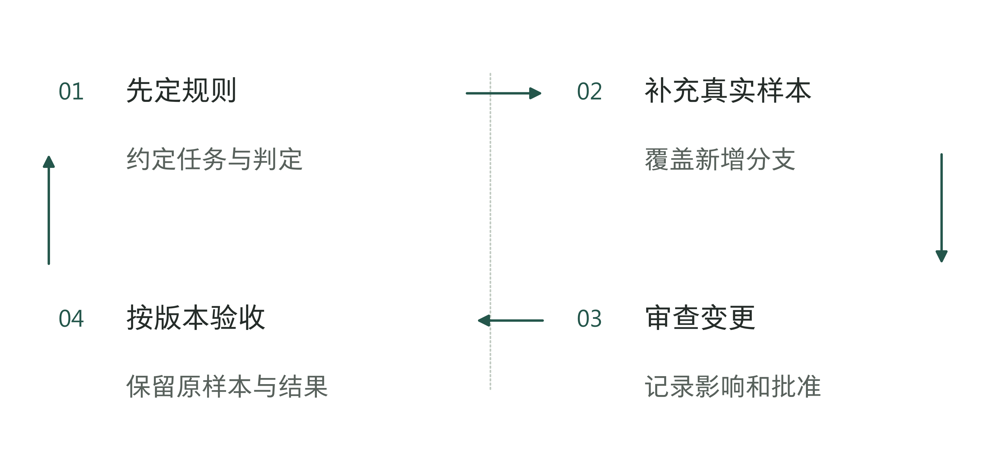
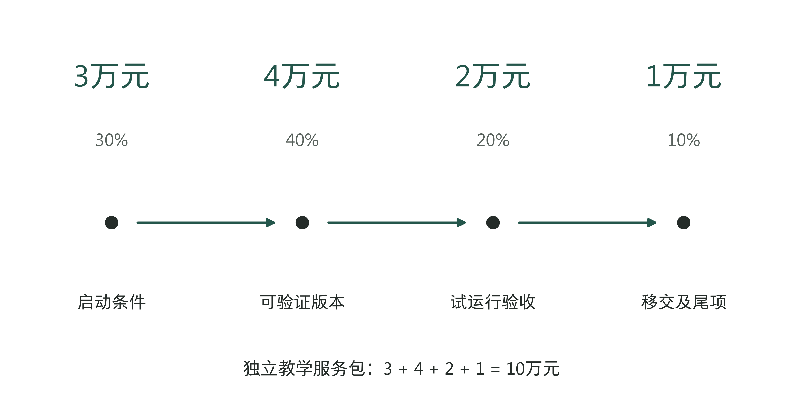
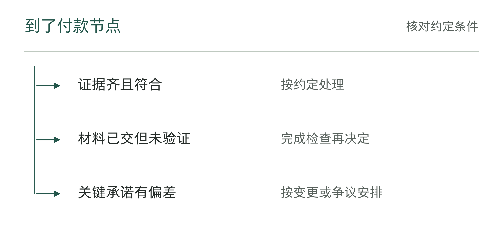
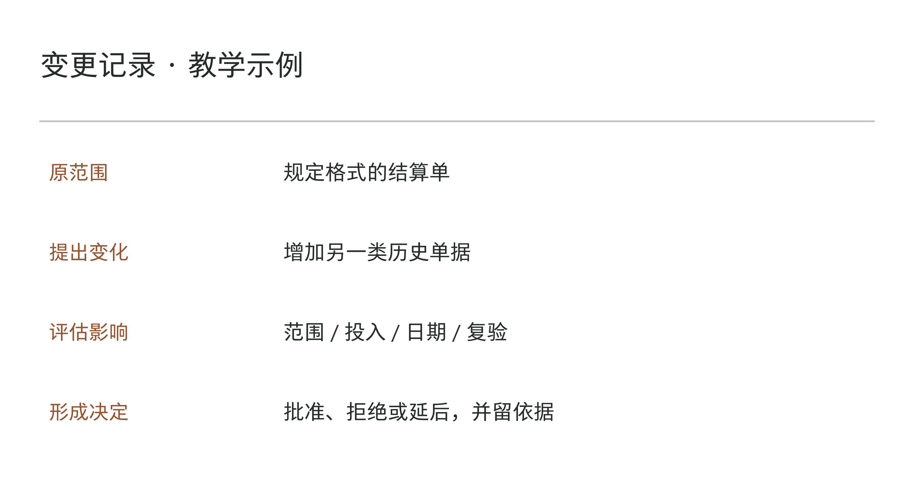
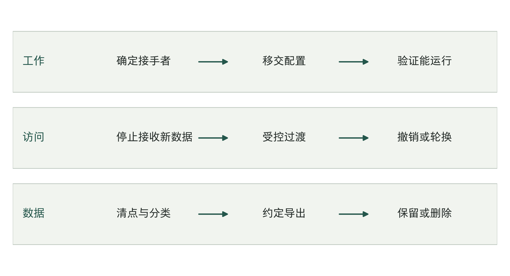

# 第7章 签好合同：交付、验收、事故与退出

## 价格表里有技术服务，为什么还要翻主合同

一张采购价格表上列着软件、实施、配置、集成和工程师服务。企业准备购买的AI项目恰好也需要这些工作，看起来，采购路径已经找到了。然而，同一套文件的主合同里，可能还有一条足以改变方案的范围限制。

美国得克萨斯州信息资源部（DIR）的DIR-CPO-5687号合同提供了这样的对照。其价格表列出Anthropic软件及厂商相关技术服务与支持，另有面向全品牌的实施、配置、集成、数据迁移、业务分析等服务。但主合同明确排除定制软件、产品、服务的开发或采购，以及知识产权（IP）的形成；价格表末页也列出开发、核心软件定制等范围排除。[1]

这几页应该放在一起读。目录中的“工程师服务”并不能单独证明，客户可以通过这份合同采购专属代码开发。需要进一步确定实际工作属于标准配置、集成支持，还是越过了文件明示的范围。前者和后者都可能需要工程师，采购依据却未必相同。

图7-1｜服务名称要放回整套文件核对。依据DIR-CPO-5687归档文件绘制的阅读索引。[1][2] 表示核对顺序与范围约束，不是所有法域通用的合同优先级图。

通用附录还允许客户与供应商就订单的工作说明书、服务水平、救济、验收以及信息安全要求协商书面安排，同时规定订单条款不能与主合同冲突。[2] 因而，发现价格表没有写清验收，并不意味着这些要求不能补；但把定制开发写进订单，也不会自动消除主合同已经列出的限制。

本章依据的是已归档的合同文件，不能据此判断读者某笔交易的法律效力。采购前，团队应拿实际要做的工作，逐项核对适用文件。供应商在采购目录里、报价上有技术服务，还不足以说明这项工程就在允许采购的范围内。

图7-2｜采购承诺要核对哪些文件。作者分析工具；阅读次序不能代替条款之间的对应核对。

## 从“交付一个助手”写到能够检查的工作

沿用前两章的虚构结算项目。如果工作说明书只有一句“建设AI结算助手，支持单据识别、差异核对和智能问答”，双方很容易带着不同预期签字。企业想要的是员工可以接着工作的流程，供应商理解的可能是几个功能入口和一次演示。

先看一张单据怎样处理：什么格式可以提交，缺页和重复件怎么办，采用哪版促销规则，软件是否只提示可能的差异，谁批准核销，结果写到哪里，失败以后谁接手。逐项回答，才能看清供应商要做哪些工作，企业又要提供什么条件。

工作说明书（Statement of Work）通常简称SOW。它不必把所有实现细节预先锁死，但应让双方知道本轮要完成什么、什么明确不做，以及怎样判断做到了。实现可以迭代，完成条件不能一直等到最后才讨论。

图7-3｜给含糊的交付描述补上边界。作者模拟的范围标注页，不是真实合同截图。把“建设助手”展开为输入、动作、输出、例外与排除项，具体规则仍须由双方确认。

对于教学项目，本轮可以只处理指定门店、规定格式的结算单，生成候选差异清单；有争议的规则转给财务，系统不自行核销，也不直接发出付款指令。这样写以后，企业能够讨论范围是否太小，供应商能够估算工程量，验收者也知道应当看什么。

同时写出客户需要提供的条件：经确认的规则、可使用的样本、接口环境和业务人员参与确认的时间。条件未按时具备时，团队怎样记录影响、调整顺序和重新确认日期，也要事先约定。若把所有客户依赖都留成一句“甲方应积极配合”，延期时很难分清究竟缺了什么。

排除项要能被普通业务人员看懂。“不含第三方系统改造”可能意味着供应商只交接口说明，企业仍须另找人修改财务系统。若这个接口是任务完成的必要条件，就应在整体计划里安排责任和预算，而不能因为它被排除在某份合同外，就假定它不再需要完成。

图7-4｜从服务名称走到验收动作。作者分析工具；承诺的每个关键词都应对应可执行检查。

表7-1｜把模糊承诺改成可核对问题（作者检查工具）

| 承诺词 | 要求补齐的问题 |
|---|---|
| 可用 | 在哪些任务、人员和资料范围可用？ |
| 及时 | 从哪个时点起算，到什么状态结束？ |
| 交付完成 | 交什么成果，用什么样本，由谁验收？ |

## 每项交付物都要说明怎样验证

文件清单很长，并不保证验收容易。交了操作手册，不能证明接手者能处理异常；交了测试报告，不能证明报告所测版本就是准备发布的版本。验收需要的是交付物、版本、验证动作与结果之间的对应关系。

例如，供应商交付一套发现和复核结算差异的流程，应该能够指出它调用了什么规则、使用了哪些接口、在什么样本上测试，以及遇到不确定单据时怎样停止自动处理。企业不必阅读每行代码，但应能请有能力的人核对这些记录是否指向同一个系统。

图7-5｜从交付物追到一次可重复的验证。作者设计的交付与验证对照。每条线对应“交什么、怎样检查、谁确认”，不以文件数量或报告页数代替验收。

表7-2｜作者教学对照。不同交付需要不同验证，不把一次演练当成所有安全与质量要求已经满足。

| 交付对象 | 验收时实际做什么 | 保留的证据 |
|---|---|---|
| 候选差异流程 | 用约定样本完成一次端到端任务 | 输入、输出、规则及系统版本 |
| 异常接管机制 | 用受控异常触发暂停与人工接回 | 触发记录、接手人和处置结果 |
| 运行移交材料 | 由接手者独立查版本、做任务 | 演练记录及仍需补齐的缺口 |

验收还要查看未完成和被拒绝的任务。系统若把困难单据都挡在入口之外，进入流程的部分可能表现很好，员工需要处理的工作却没有减少。约定中应说明哪些输入在范围内，哪些可以拒绝，以及拒绝后留下什么理由、谁接回任务。

交付团队可以提出怎样测试，结果由获授权的验收人员确认。第6章已经确定了这些人，本章还要写清各人查看什么材料、确认哪项结果。业务和技术判断应分别完成，不能让不了解测试含义的项目经理一人签下全部验收意见。

图7-6｜交付物与证据怎样配对。作者分析工具；清单写了名称，还要检查成果是否符合约定。

## 验收标准在开工前商定，样本随工作逐步完善

只约定“准确率达到目标”仍不够。要说明什么任务进入统计、谁提供正确答案、怎样处理多种合理结果、哪些错误不可接受，以及测试使用什么版本。第5章已经讨论测量口径；到合同阶段，这些口径需要成为双方都能找到的验收依据。

样本不必在第一次讨论时就全部齐备。可以先约定范围、抽样和判定方式，再在基线阶段共同确认样本版本。需要特别防止的是，交付快结束时才由一方临时挑样本、改分母或增加从未讨论过的标准。那会把原本可以提前处理的差异变成验收争议。

验收也应保留代表性异常。例如规则冲突、缺失字段、重复输入、接口失败和不适用任务。这些样本的作用是检验已承诺的边界处理，不是把所有难题无条件交给系统。测试时允许系统转人工，与系统悄悄丢弃任务，是完全不同的结果。

图7-7｜验收依据需要共同固定哪些要素。作者设计的验收记录剖面：范围与样本、判定依据、系统版本、结果与确认相互对应。图中没有预设成功率或行业统一门槛。

第一次未通过以后，验收方提供可复现的缺陷清单，供应商说明修复范围和时间，再使用约定方法复验。例如，为新促销规则修正了适用日期，还要检查旧活动的单据；只展示原来失败的那一张单已经成功，还不能说明其他相关任务没有受到影响。

有条件通过适合范围明确、影响可接受且已安排处理的遗留项。记录应指出哪些工作仍不能开放、由谁在何时补齐以及如何复查。若存在越权动作或不可接受的关键错误，就不应借“有条件通过”把它们包装成普通尾项。

对已经通过的版本，后续更换模型、规则、工具或接口仍可能改变行为。双方应约定哪些变更触发何种复查、由谁提供记录，以及原有验收能覆盖到哪里。这里确定责任与触发条件，具体测试设计在第10章展开。

图7-8｜验收样本怎样更新而不偷换标准。作者分析工具；增加样本与改变验收标准应分别管理。

## 付款节点，应当跟着可验证的进展走

合同付款首先要适合实际交付。标准软件许可、按月服务和定制工程的成本发生方式不同，很难共用一套比例。企业希望保留对未完成工作的约束，供应商也需要支付启动和人员成本；讨论付款时应同时看到两侧的投入与风险。

为说明结构，假设一项独立工程服务包总价10万元，双方讨论分为3万、4万、2万和1万元四笔。这只是本章算例，不是第5章试点预算，也不是推荐报价。关键不在于比例，而在于每一笔对应的条件是否能够被双方识别。

第一笔可以对应双方完成启动约定和必要准备；第二笔对应约定范围的可验证版本；第三笔对应受控试运行验收；最后一笔对应运行移交及约定尾项完成。每个节点都应说明所需材料、确认人及付款程序。日期到了与条件满足可能并不同时发生，需要在安排里讲清。

图7-9｜一笔服务费怎样对应交付条件。作者独立付款算例，总额10万元，四笔3、4、2、1万元，合计100%。节点为条件顺序，不按日历等距承诺；不代表实际项目比例或法定支付规则。

如果某阶段尚未达到约定条件，要能区分交付缺陷、客户依赖未满足、范围已经变化和对判定有争议。它们都可能导致节点推迟，却需要不同处理。对已完成部分如何确认、争议部分怎样复核、后续是否继续，也应留下安排。

把全部费用压到最后，并不会自动改善质量。供应商可能无法持续投入，企业也可能在较长时间内得不到可信的中间成果。更有用的讨论是：在下一笔承诺前，双方需要看到什么进展，尚存什么风险，继续投入的依据是什么。

付款条件满足了，也不等于经营收益已经实现。系统可能已按约交付，员工却还没熟练使用；收益还可能受业务量、人员安排或其他项目影响。合同应写清双方能控制的交付和工作条件，至于经营变化有多少来自这套系统，要结合第12章的方法另行检验。

图7-10｜付款节点上的三种证据状态。作者分析工具；图示用于核对付款依据，具体权利义务以适用合同为准。

## 变更会发生，先安排怎样改变承诺

试点开始时约定识别规定格式的结算单，运行中业务部门希望加入另一类历史单据。新增需求可能有经营价值，但不应直接混进原验收样本，再认定供应商原来就没有完成。先确认这是原范围内的缺陷、遗漏，还是一项新增工作。

变更记录不需要写成长报告。记录原约定、提出的变化、原因、受影响任务、工时与费用、时间及测试影响，再由有权的人确认。技术团队负责说明实现与风险，业务方判断是否值得做，采购和预算责任人核对承诺的变化。

图7-11｜一次变更至少留下哪些决定依据。作者模拟变更记录。新增历史单据仅为教学例，不是真实客户变更单；变化须分别落实到范围、投入、日期与复验。

变化也可能来自供应链。模型或外部服务更新、接口策略改变、原组件停止支持，都可能影响任务。企业应在签约时知道哪些部分由谁控制、供应商会怎样通知、什么情况下需要替代方案，以及相关成本由谁评估和确认。

发现问题来自第三方服务，也不能只留下这一句解释。即便故障不是交付供应商造成的，仍要有人查清影响、协调支持、安排临时处理。商业责任按具体约定核对，眼前的任务则要先安排人处理，不能等所有争议解决后再说。

紧急修复可以采用与一般变更不同的路径，但仍要留痕。先限制影响后，补记变更内容、授权、版本与复测结果。否则临时绕行会逐渐成为无人维护的正式系统，下次故障发生时，交接材料和实际环境已经不是一回事。

图7-12｜批准变更时还要改哪些安排。作者分析工具；不能只在聊天中同意却仍按旧标准验收。

## 有人回复、业务恢复、问题解决，是三件事

英国政府数字市场上，Credera的Generative AI Acceleration服务给出一组清楚的区分：对其列为P1（最高优先级）的服务完全丧失事件，目标响应为30分钟、恢复为2小时、解决为1个工作日；这些目标在约定服务时段内生效，支持费用按客户所需服务量单独确定。[3]

这组数值是供应商公开披露，不能当成客户已签署或已经执行的服务级别协议（SLA）。服务级别协议约定响应、恢复等服务标准及双方责任。本章借用的是字段之间的区别，不建议读者把30分钟、2小时和1个工作日原样抄进自己的项目。不同任务能够容忍的中断、支持时段和替代手段可能差别很大。

图7-13｜响应、恢复、解决分别怎样计时。依据公开服务字段区分响应、恢复和解决。[3] 数值为该供应商P1披露目标；三条独立记录带不按统一时间比例绘制，1个工作日不换算成固定小时。

对于结算流程，有人接到工单并开始调查，是响应；员工可以通过已认可的替代路径继续处理，是业务恢复；修复缺陷，再通过验证确认问题已消除，才算解决。恢复可以先于永久修复，但临时路径的质量、权限和工作负担应当明确。

计时也要有依据。从用户第一次报告、系统自动告警还是供应商确认收到开始，可能带来不同结果。服务时段之外怎样处理，等待客户材料时是否暂停，谁能够同意暂停，恢复以谁的确认为准，都应能回到记录。只把数字写得很短，却不定义起止事件，难以判断是否达标。

AI还有一类情况：服务在线，输出却持续出错。若事件等级只按系统是否可用划分，未经批准的核销或错误客户通知可能被低估。企业需要针对任务后果安排质量及权限事件的分类，明确什么时候先暂停有关动作，而不是继续等待可用性故障出现。

事件处理中还应说明沟通频率、升级联系人、临时接管和复盘材料。服务抵扣或其他补救安排可以处理商业后果，却不能替代紧急停止和接管。老板要确认的是，发生问题时谁有权先控制影响，而非只有月底一张没有达标的统计表。

图7-14｜服务恢复的三种时点。作者分析工具；三个时点分别记录，不能互相代替。

## 退出时，企业究竟拿回什么

Beamtree在RippleDown Coding服务的退出说明中，列出停止摄取数据、撤销传输密钥、关闭应用访问，以及按客户选择复制或删除所存数据；选择删除时，在合同结束后60天内提供删除确认函。[4] 这也是供应商披露，并无本章能够核实的客户执行记录。

这份材料提醒我们，结束合同包含一组动作。关闭账号只处理访问，未必说明数据已经交还；导出一个文件也未必说明规则、配置和运行记录已经移交。企业在采购时就需要知道，结束服务后由谁继续完成原来的任务。

图7-15｜退出安排要分别处理工作、访问和数据。作者设计的退出检查流程，受到公开服务退出动作启发。[4] 导出、保留与删除取决于数据类别和适用要求；不把所有材料设为同一期限。

先明确需要接回哪些资产。可能包括业务规则、配置、客户提供的资料、必要运行记录、评测材料和约定的代码交付物。它们并不必然都属于同一种权利或都能完整导出，应在工作范围及权利安排中逐项确认，不能到合同结束时才依据“数据归客户”一句话推定全部归属。

再检查拿到之后能否使用。文件格式、字段说明、规则版本、依赖条件和必要权限，会影响接手者能否重建工作。可以约定在受控环境中由接手者复现一项代表性任务，记录无法复现的部分及补齐安排。第6章的接手演练由此成为可验收的移交动作。

表7-3｜作者退出对照。日志、备份和派生材料需按实际架构列清，涉及法定保留或第三方权利时单独确认。

| 退出对象 | 需要确认的去向 | 可以检查的记录 |
|---|---|---|
| 业务工作与配置 | 谁继续处理，哪些能力可以移交 | 接手演练及配置版本 |
| 账号、密钥与连接 | 哪些关闭或轮换，何时停止新增数据 | 授权撤销与连接检查 |
| 客户数据及副本 | 哪些导出、依法保留或删除 | 清单、格式、期限及证明 |

“删除全部数据”还需要一张具体清单。原始资料、输出、日志、缓存、备份、向量或其他派生材料可能存放在不同环境，分别由客户、供应商或第三方管理。负责人应按真实架构说明去向、期限和证明方式，避免主库已经删除，其他副本仍无人处理。

退出安排需要考虑工作连续性。若先撤销全部访问，再发现导出材料不完整，接手会更困难；若无限期保留所有权限等待迁移，又可能留下不必要的访问。顺序应围绕已获批准的交接计划安排，明确有限的过渡访问、负责人和到期处置。

图7-16｜退出交付按什么顺序核对。作者分析工具；先确认接手，再按约定关闭支持与访问。

## 签字前，沿一项承诺追到最后

签字前，让项目组沿“候选差异流程投入使用”追一遍：范围、证据、确认人、未通过处理和退出移交是否对应。把答案填入章末工具，再与第5章预算、第6章责任表并排核对：所需工作有人、有时间、有权限，必要接口也有人承担。

这些材料帮助双方明确工作，具体条款仍依适用法律与签署文件确定。

以下把本章10万元独立服务包填成工作说明S07-01。全部为教学约定，用来检查各项约定是否一致，不是现成法律合同，也不沿用第5章6.6万元预算。

表7-4｜一页教学交付约定：范围、验收、付款与退出

| 项目 | S07-01示例约定 |
|---|---|
| 交付与排除 | 指定区域、规定格式结算单的候选差异流程；不核销、不付款、不改第三方系统 |
| 开工依赖 | 客户提供获准样本、有效规则、接口测试环境及财务人员确认规则的时间；缺项登记影响，双方重排相关工作 |
| 样本与判定 | 开工后共同冻结样本清单S1，分别覆盖常见、缺字段、规则冲突和超时；关键判定标准未确定前不进入最终验收 |
| 验收动作 | 对同一版本V1完成端到端任务、异常接管与移交演练；财务确认业务结果，生产负责人确认是否具备发布条件 |
| 不通过与复验 | 验收方提供可复现的缺陷记录，双方确认修复时间；修复原缺陷，再用未参与调试的样本复测，关键越权不作普通尾项 |
| 付款条件 | 3万启动准备、4万可验证版本、2万受控试运行验收、1万移交及约定尾项完成；各笔按确认记录和约定程序办理 |
| 变更与退出 | 新单据类型另记范围、费用及复验影响；退出前接收者复现任务，逐项交还约定资料，按清单撤销访问和处理副本 |

样本S1尚未确定，就不能以“V1已经交付”为由跳过验收；客户后来要求增加一种单据，也不能倒过来修改S1，认定原版本没有完成。发生争议时，S07-01让双方有约定的范围和版本可查。实际签署还需补全双方主体、日期、服务时段、具体指标和适用条款。

约定落实到一项任务后，还要回到现场检查它能否执行。第8章将核对纸面流程与员工实际工作之间的差别。

## 资料与说明

[1] Texas DIR，DIR-CPO-5687 Contract，第1页1.3、第9页12；Appendix C Pricing Index per Amendment 5，第2、32页。2026年9月6日依据9月3日保存的原件核对；当次在线PDF读取失败，未确认全部现行条件。 https://txdir.widen.net/view/pdf/6jiakmgdgw/DIR-CPO-5687-Contract.pdf https://txdir.widen.net/view/pdf/7wqikzkpbg/DIR-CPO-5687-Appendix-C-Pricing-Index-per-Amendment-5.pdf

[2] Texas DIR，DIR-CPO-5687 Appendix A Standard Contract Terms and Conditions，PDF第8页（印刷第7页），4.2C—D。原件与核查时点同第7章注1。用于解释订单协商与主合同约束，不外推为所有交易的文件层级。 https://txdir.widen.net/view/pdf/aczuxgeosr/DIR-CPO-5687-Appendix-A-Terms-and-Conditions.pdf

[3] Credera，Generative AI Acceleration，G-Cloud 14服务876206332147316，User support及Support levels，2026-09-06官网回查。目标在服务时段内生效，支持量单独计价；公开披露不证明已签署或实际履行。https://www.applytosupply.digitalmarketplace.service.gov.uk/g-cloud/services/876206332147316

[4] Beamtree，RippleDown Coding，G-Cloud 14服务198321167423991，End-of-contract process，2026-09-06官网回查。60天为选择删除时的确认函安排，不是所有AI服务通用期限。https://www.applytosupply.digitalmarketplace.service.gov.uk/g-cloud/services/198321167423991

结算企业、范围标注、验收记录、10万元付款算例、变更及退出工具均为作者教学设计，不代表真实客户合同或执行记录，不替代针对具体交易的专业审查。
