# 第8章 走进现场：还原员工真正怎样工作

接入一个新数据源，为什么要等一个多月？

在Corteva与Databricks联合发布的会议材料里，这件事曾需要30—45天。把它简称为“接数据”，很容易让人以为瓶颈在传输速度。展开旧流程，里面却有识别来源、编写接入管道、数据建模、配置权限、跨环境发布以及测试验证。搬运数据只是其中一部分。材料披露，新流程把总周期缩短到4—7天，降幅约85%；这是一项联合案例陈述，并非独立审计结果。[1]

这个案例提醒老板，一个很短的任务名称，可能包含许多不同的工作。采购清单和进度汇报都可以只写“完成数据接入”，交付团队却不能止于这六个字。他们还得知道找谁提供资料、在哪一步等待批准，以及怎样才算接入后的数据可以使用。

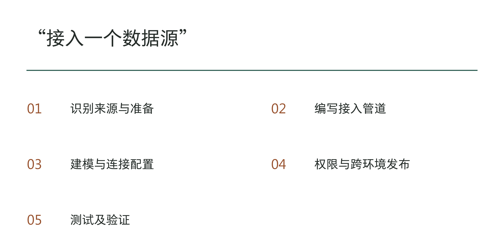

图8-1｜一个任务名称下面藏着不同的工作。依据Corteva原流程重新归类；不按时间比例绘制。来源：本章注1所列幻灯片，第10页。

前面三章已经确定投入、人员和对外约定。现在要进入更细的一层：企业准备交给AI的那项工作，在最近一次实际发生时，究竟怎样完成？本章要产出的，是一张能拿回现场核对的流程图，以及支持它的记录。下一章的系统设计应当从这里开始。

## 先解释工作怎样发生，再讨论用什么产品

Corteva的材料对旧问题描述得很具体：一些管道手工搭建，连接信息写死在代码里；接入所需知识保存在个人经验中，不同数据源又有不同表现。团队采用以元数据驱动的方式组织接入，把可重复部分做成框架。[2]元数据在这里可以先理解为“描述数据和处理方式的信息”：来自哪里、按什么规则处理、去往何处。关键变化是把原先分散在人和代码里的约定，变成可以被一致使用的配置和规则。

这并不能推出“凡是流程慢，换同款平台就能解决”。该团队已有的系统、治理基础和工程投入，未必与另一家企业相同。材料的前后流程还提醒我们：某一阶段标作零天，不等于相关能力没有建设成本，更不等于此后无需维护。若只抄周期数字，而不看哪些工作被提前完成、被复用或仍需判断，就会把案例当成采购承诺。

还要防止另一种误读。幻灯片把生成式AI辅助建模列在后续计划中。[3]因此，这个案例不能被讲成模型独自把几十天的工作压成几天。对于本书，它首先说明现场工作能够被重新组织；是否使用模型、在哪一步使用，要从实际任务出发判断。

老板可以把这件事变成一次很简单的检查：让业务负责人和工程负责人分别解释“接入完成”指什么。如果一方说能看到表，另一方说下游报表稳定可用，两个人并没有谈同一个终点。此时先统一任务的结束条件，比立即讨论接口或模型更有价值。

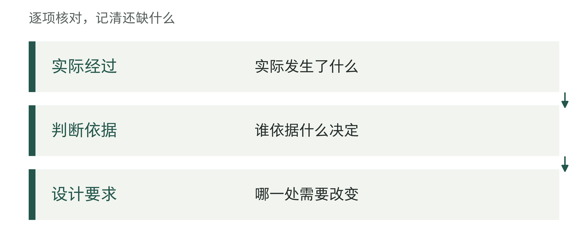

图8-2｜工作观察的三个记录层。作者分析工具；观察、解释与设计建议应能够相互追溯。

## 拿一笔近期任务，对着记录还原过程

“我们平时怎样做”适合了解概貌，却不适合直接作为设计依据。讲述者会把熟悉的步骤合并，把罕见情况省略，也会用制度规定代替自己上一次的实际动作。这未必是隐瞒；人通常不需要记住每一次补问、找文件和切换系统，才能完成工作。

现场观察因此要找一个具体对象。可以从最近7—30天内已经办完的一笔任务开始；这个时间窗是便于找到记录的工作建议，不是统计标准。高频工作可以选得更近，低频审批则应追溯到最近实际发生的一次。先确定任务编号、触发时间、结束条件和经手人，再请员工按照当时留下的记录还原经过。

选样也有区别。如果第一笔就选最严重的事故，容易把特殊救火方式当成常态；只选最顺利的一笔，又看不到流程依赖。可先用一笔普通任务画出主要步骤，再补一笔因资料、规则或授权问题走过回头路的任务。两笔能帮助发现差异，不能证明已经覆盖全部情况。数量是否足够，要看是否仍在发现会改变设计的新分支。

以下沿用结算工作作教学演练，记录均为假设，不是作者客户实录。给这笔观察编号O08-017：财务收到一张门店结算表，系统账单与表中金额不一致。制度流程只有“接收、核对、确认”三步。要追踪它，起点应是资料实际到达，而不只是财务开始录入；终点应是差异得到有依据的处理，而不只是AI输出了一段解释。

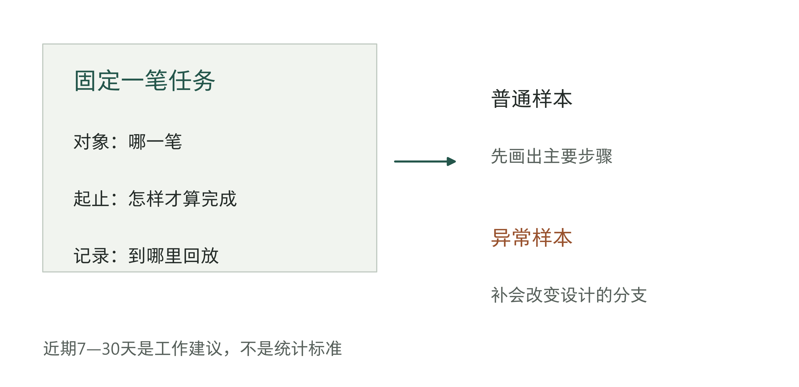

图8-3｜用一笔任务建立可回放的观察范围。作者方法示意。先固定对象、起止与记录，再增加异常样本；不是抽样数量的统计要求。

具体提问应当跟着动作走。看到员工打开一个文件，先问这个版本从哪里来、为什么用它；看到一笔金额被跳过，再问这次为什么暂不处理。不要在尚未看清动作时就问“你希望AI怎样帮你”。后一个问题容易把观察会变成愿望收集会，员工开始描述想象中的功能，真实工作再次退到背景里。

观察者也会改变现场。有人会在被观看时多做一次检查，有人会为了省时间省略解释。可以在工作结束后请另一位经手人用记录复述关键交接，或让员工独立完成一次再回放。不同说法出现时，先记下差异及对应任务条件，不急着裁决谁的记忆更可靠。

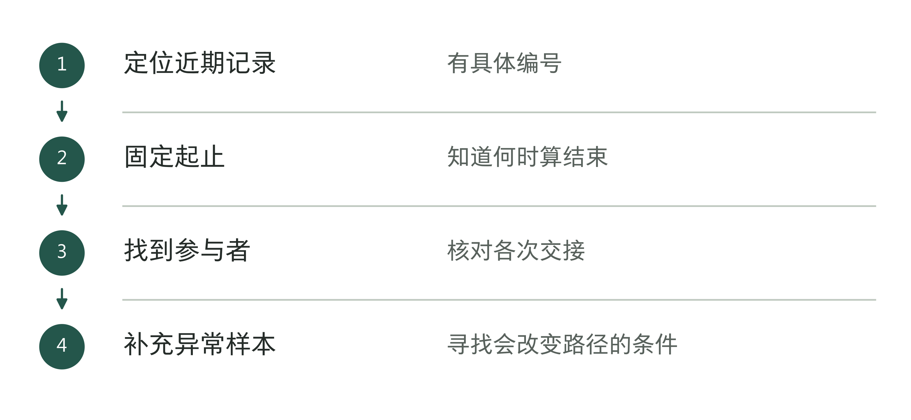

图8-4｜选择一笔能回放的任务。作者分析工具；样本用于解释工作机制，不自动代表总体分布。

表8-1｜O08-017的观察记录定位（作者教学示例）

| 记录编号 | 本次记录 | 用于哪项判断 |
|---|---|---|
| O08-017/A | 门店提交表、系统账单及所用版本 | 输入从哪里来，金额差异是否真实 |
| O08-017/B | 首日9:20补问、次日9:20回复；记录接收岗位 | 哪条交接造成24小时等待 |
| O08-017/C | 次日9:45判断完毕、10:00完成记录与确认 | 完整任务何时结束，劳动合计60分钟 |
| O08-017/D | 当前政策缺适用活动编号，由业务负责人确认 | 设计必须提示具体缺项，未补齐不得猜测 |

## 流程图必须画出退回去的路

回到这笔假设结算。财务发现差异后，先去查系统账单，再找业务人员确认活动政策。业务人员没有立即回复，财务把记录放进待办。次日拿到说明后，才判断这笔差额如何归类，补记依据并提交确认。制度中的“核对”其实包含查询、提问、等待、判断和记录五种动作。

如果只把制度的三个框自动化，AI可能会在资料缺失时继续猜测，也可能把一笔仍在等待说明的差异标为完成。流程图的价值，就在于让这种遗漏在开发之前暴露出来。图上不必出现每一次鼠标点击，但必须出现会改变输出、责任、权限或等待状态的动作。

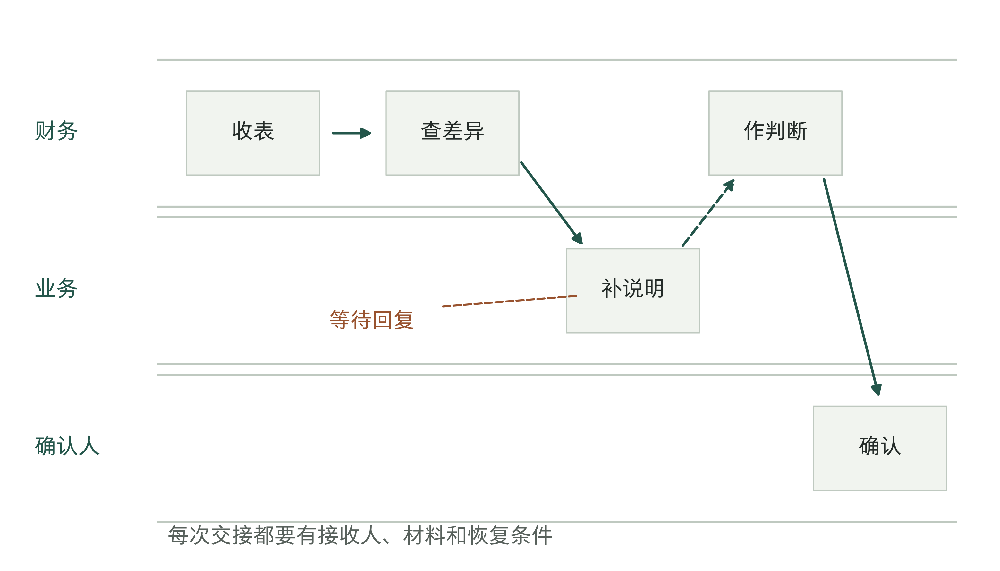

图8-5｜差异处理跨越了三条工作线。对应O08-017的虚构教学流程。虚线表示待回复，最终判断与确认仍由企业授权人员完成。

画泳道时，按实际承担工作的人或岗位分线，比按软件菜单分线更容易发现交接。每条跨线箭头都要回答三个问题：交出去的是什么，接收方何时知道需要处理，未收到回复时谁继续负责。邮件发出后，还要确认对方是否接手。这里往往藏着“系统没有错，但事情没有往下走”的原因。

再把实际使用的材料贴到动作旁。正式系统以外的Excel、聊天附件和手写清单，应当作为当前工作的一部分进入观察。不要因为它们不在信息技术资产列表里，就假定它们不存在；也不要看见它们就立刻要求全部迁移。有些临时表确实重复搬运数据，有些却保存了正式系统尚未容纳的判断依据。先弄清功能，才能决定保留、替代或取消。

流程中还可能出现互相抵触的做法。一个门店按交易日期归属活动，另一个门店按结算日期。画图的人不能私自选一种，把另一种写成“错误操作”。应记录两种条件和当前依据，交给有权制定业务规则的人确认。第6章确定的权力分配，到这里开始影响每一条具体分支。

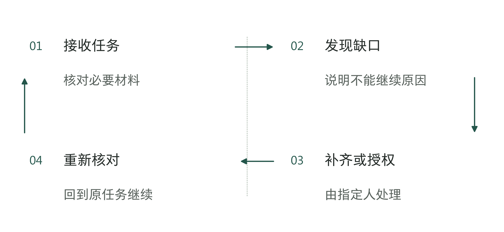

图8-6｜被退回的任务怎样恢复。作者分析工具；退回箭头必须有恢复条件。

## 把等待时间和劳动时间分开

“这笔账花了一天”，至少有两种含义：员工实际处理了一天，或者从收到到结束经过了一天。两者会导致完全不同的改善方案。若大部分时间花在等回复，把模型回答从十秒压到两秒，几乎不会改变客户什么时候拿到结果。

O08-017的教学记录可以这样还原：第一天9:00开始，9:20发出补充材料请求；次日9:20收到回复，9:45完成判断，再用15分钟记录并确认，10:00结束。总历时25小时，实际处理20＋25＋15＝60分钟，其余24小时处于等待。这里包含夜间，不能把24小时乘员工时薪，算成可节省的工资。

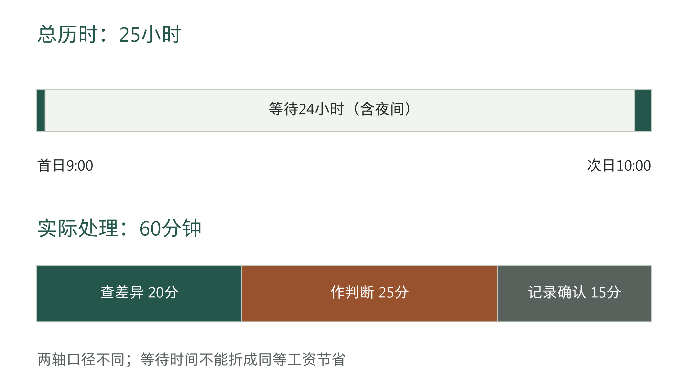

图8-7｜历时25小时，不等于投入25个人工小时。虚构教学数据。上轴显示总历时，下图拆分实际处理60分钟；等待包含非工作时段。

这组记录提示两条不同的改善路径。减少查找和记录动作，可能释放财务工时；减少等待，可能提前完成结算。但后者需要查看请求是否清楚、接收者是否有权回复、有没有约定何时处理。AI可以协助整理待补字段或提醒，无法仅靠生成文字让没有依据的人作出可靠判断。

实际测量时，还应记下一个人在等待期间是否处理别的任务。把多个任务各自的历时相加，会重复计算同一时段。观察者可以记录任务开始和结束的时间，判断总共用了多久，也可以请员工按活动记录工时来估算劳动投入，但两套数字应分栏保留。第5章的财务判断需要的是这种区分后的基线。

没有时间戳也可以开始，只是精度要如实标记。员工回忆“通常半小时左右”，应写成估计，并说明尚未观测；不能在表里填成精确的30分钟，再画到小数点后一位。先用少量记录确认瓶颈位置，比制造一套整齐而不可复核的数字更有用。

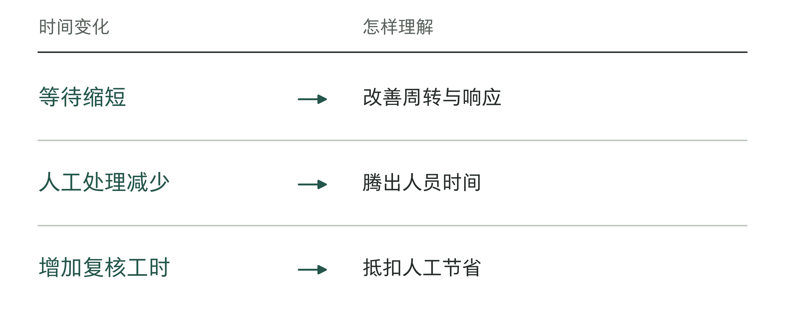

图8-8｜两种时间对应两种改进。作者分析工具；不同时间量不能直接加总为现金收益。

## 异常不是流程图上的一个“其他”

设计者很容易把顺利的路径画得很细，把所有剩余情况合成“转人工”。这只能说明有人兜底，不能说明兜底怎样发生。如果每次都要人工重新找全部资料，系统也许只是把入口数字化了，并没有减轻处理负担。

至少应区分三种不同的异常。资料缺失，需要补齐明确的字段；规则冲突，需要业务负责人确定采用哪项规则；权限不足，需要有权的人决定是否继续。三者的接收人、处理时限和恢复条件不同。把它们混成一个异常队列，最有可能发生的是所有人都看见任务，却没人知道自己应该先做什么。

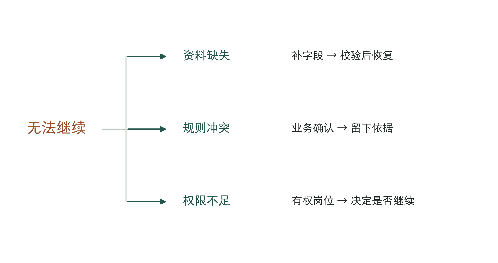

图8-9｜相同的“不能继续”，需要不同的下一步。作者列出的三类情形，不涵盖所有异常。每个分支记录接收人、待补证据及恢复条件。

异常样本应由风险和设计差异来挑选。金额很小、发生频繁的格式缺失，可能适合整理标准输入；偶发但会导致错误付款的规则争议，可能必须保留人工决定。不能用“出现得少”来证明可以忽略，也不能因为存在一个高风险例外，就否定全部辅助工作。关键是把这个例外从可自动处理的范围里清楚分出去。

表8-2｜虚构结算场景中的异常记录示例。用途是发现设计条件，不是代替企业规则。

| 现场发现 | 需要保留的证据 | 对设计的影响 |
|---|---|---|
| 缺少活动编号 | 原始请求与补充记录 | 先提示补字段，未补齐不进入判断 |
| 两份规则日期重叠 | 版本、生效范围及责任人确认 | 提交规则冲突，不由模型自行选一份 |
| 经手人无权确认 | 授权范围及实际交接记录 | 交给有权处理的人员，保持任务未完成 |

同时保留一份尚未观察到但后果严重的情形清单，例如关键负责人缺席、资料无法恢复、任务重复提交。这些是假设风险，不能混入真实样本发生次数。进入第10章时，可以据此设计测试；现场观察与风险推演可以互相补充，但要分清哪些发生过、哪些只是设想。

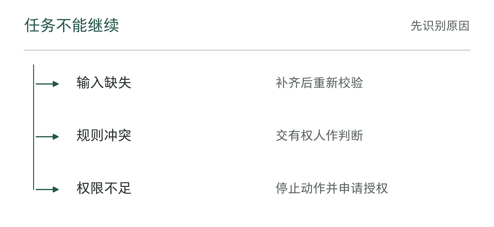

图8-10｜异常交给谁、怎样处理，要写具体。作者分析工具；不同原因使用不同恢复路径。

## 把“凭经验知道”追到可检查的依据

企业最难迁移的知识，往往不是一条复杂公式，而是员工何时知道该停一下。财务看到某个差额，不直接归类，而是先问业务；客服看到一种投诉措辞，先查历史；技术人员看到某种数据变化，先确认上游是否换过口径。这些判断依赖当时看到的线索、能够找到的人和对后果的了解。

本书用“工作情境”概括这些条件：任务发生时，人掌握哪些材料、受到什么限制、与谁协作，以及出错后由谁承担后果。这是分析现场的方法，不是给流程另贴一个理论标签。同一个动作在不同情境里可能有不同含义。把聊天中的一句“按上次处理”抽出来存进知识库，未必知道上次对应哪个客户、哪个政策版本和谁的授权。

先记录一次具体判断，但暂时不要把它定成规则。从最终决定往回查：员工注意到了什么，查过哪些材料，什么情况会让他改用另一种处理方法？如果他说“熟悉了就知道”，就请他比较两笔处理方法不同的任务。这样得到的是待确认的经验。个人经验怎样经过验证和批准，成为公司可以采用的规则，第17章会继续讨论。

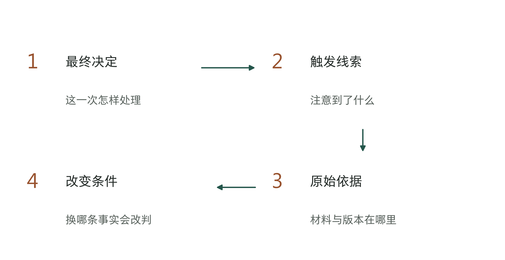

图8-11｜从一个决定追到条件和反例。作者观察方法。箭头表示追问顺序；线索与解释仍须由记录和业务负责人核对。

有些经验无法当场写成稳定规则：制度可能还没规定，员工可能只是在按个人偏好处理，也可能有几个条件需要综合判断。此时可以先让系统整理资料、提出建议，交给指定人员确认，不必强求自动执行。观察仍然有用，因为它说明了哪一步需要人、需要人判断什么。

还要区分知道一件事和有权使用它。观察中看到客户资料，并不意味着可以把它复制到开发环境；能够读取账户信息，并不意味着系统可以发起付款。应在记录旁标出可观察、可复制、可用于测试和可执行动作的边界，由企业相应负责人确认。权限实现留给下一章，此刻先阻止需求描述把这些差别抹掉。

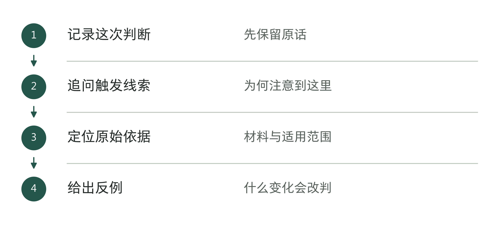

图8-12｜什么条件变化会让经验不再适用。作者分析工具；找出规则不适用的情况，才便于检验和维护。

表8-3｜追问经验时的反例提示（作者检查工具）

| 原有说法 | 继续追问 |
|---|---|
| “这种情况一直如此” | 哪些对象、版本或时间条件会例外？ |
| “一看就知道” | 最先注意到的是哪条可见线索？ |
| “换个人就不行” | 缺少的是材料、权限还是判断依据？ |

## 什么时候可以结束观察，进入设计

现场工作很容易走向两个极端。一种是听完一次介绍就开工，另一种是不断补访谈，始终不敢设计。判断是否够用，不在于会议开了多少场，而在于关键设计问题是否已有证据，以及尚不确定的地方是否能被限制在明确范围内。

可以拿一笔没有参与最初讲解的已完成任务，让流程负责人按新图走一遍。图上的步骤能否对应记录，异常能否找到接收人，结束条件能否得到一致解释？若图只能用于讲解者挑选的那一笔，就还需要补观察。若主要路径已经可回放，剩余疑问可以作为小范围设计假设记录下来，并约定验证方式。

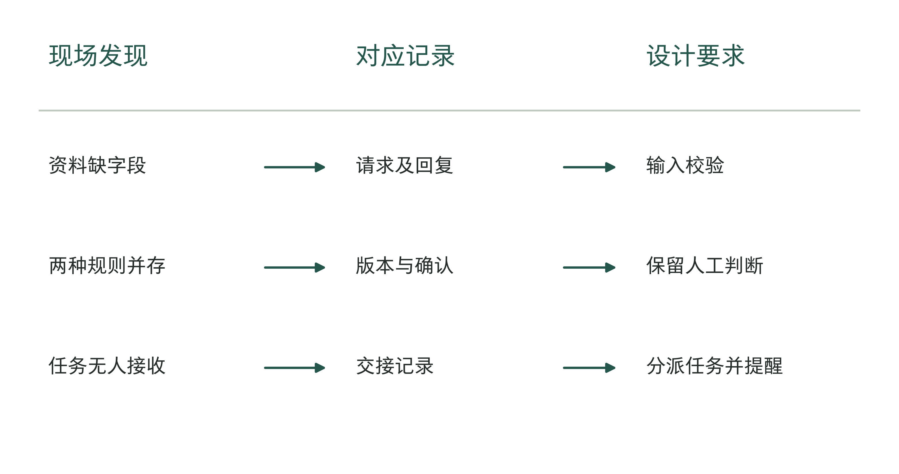

图8-13｜现场发现必须能回到记录，也能进入设计。作者交付对应图。每项设计要求都要说明依据，以及哪些条件还没确定，不把猜测包装成已确认需求。

在O08-017中，图8-5画出了补问和等待回复的过程，记录B标出了等待时间，记录D说明缺少活动编号。因此，工程师得到的需求应是：“列出缺少活动编号的单据，发给有权确认的业务人员处理。”这比“让回答更快”具体得多。它能否缩短24小时的等待，还要用新流程中的同类任务比较，不能把发现问题当作已经解决问题。

观察的交付不宜只是厚厚一份会议纪要。至少要让下一位工程师看见：任务从哪里开始、何时结束，实际经历哪些步骤和异常，哪些资料可以作为依据，哪些地方需要人工判断，原来的处理和等待时间有多长，以及还有什么尚未确认。每个重要发现附上记录定位和确认人。没有必要把敏感原件到处复制，记录可访问位置及脱敏摘要即可。

表8-4｜作者现场验收检查。通过表示已有资料足以支持在限定范围内开始设计，不代表已覆盖所有未来情形。

| 进入设计前的检查 | 可接受的证据 | 未满足时的动作 |
|---|---|---|
| 普通任务能否回放 | 图中动作与实际记录对应 | 补跟一笔，不靠会议纪要推断 |
| 例外是否有人处理 | 分类、接收人、恢复条件 | 缩小试点范围或补责任安排 |
| 判断依据是否清楚 | 版本、适用条件及业务确认 | 保留人工判断，标记待确认 |
| 基线与边界能否解释 | 工时与历时分栏，数据用途明确 | 先观测或限制使用，再设计 |

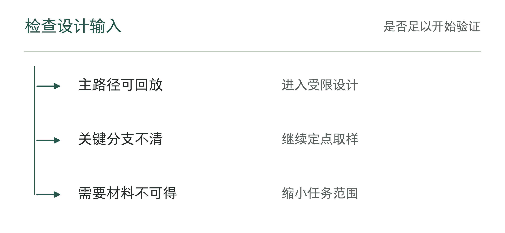

图8-14｜什么时候可以结束本轮观察。作者分析工具；资料足以支持下一步设计，才可以结束观察。

老板不必看完每一步操作，但可以参加最后一次核对。请团队指出一条原流程图漏掉、这次已经确认的关键步骤，说明它会怎样影响设计。如果图只是画得更漂亮，却说不出观察发现了什么，就需要继续追问。

Corteva案例开篇提出的问题，现在可以换一种方式回答：接入数据源耗时多久，取决于这个名字下面有哪些工作，以及这些工作怎样被组织。企业交给AI的任务也一样。先还原它，才知道哪些地方适合用模型，哪些需要规则或工具，哪些应继续由人决定。下一章将把这份现场记录转成一套能完成任务、限制权限并查清处理过程的系统。

## 资料与说明

[1] Databricks与Corteva，Accelerating Corteva’s Data Source Onboarding With Lakeflow，2026年官方会议条目及幻灯片第6、10、12页，2026年9月6日核查。分阶段区间之和与公布总周期不完全一致，材料未交代并行与取整口径，不据此重算精确降幅。 https://www.databricks.com/dataaisummit/session/accelerating-cortevas-data-source-onboarding-lakeflow

[2] Databricks与Corteva，Accelerating Corteva’s Data Source Onboarding With Lakeflow，2026年会议幻灯片，第8页。依据已保存的28页官方原件重绘工作类别，未复制幻灯片。 https://microsites.databricks.com/sites/default/files/dais/2026/D26B1873.pdf

[3] Databricks与Corteva，Accelerating Corteva’s Data Source Onboarding With Lakeflow，2026年会议幻灯片，第24页。GenAI辅助建模列于后续计划，不能归为已实施成果。观察方法、结算记录与时间算例为作者教学设计，不代表作者客户成效。 https://microsites.databricks.com/sites/default/files/dais/2026/D26B1873.pdf
