# 第10章 进入生产：评测、试运行与安全边界

一份演讲材料可以同时给老板信心，也留下尚未回答的问题。2026年6月，会计与专业服务机构CLA与数据平台公司Databricks分享了一套用于SOC报告抽取的评测方案。这里的SOC指系统与组织控制相关鉴证报告，涉及服务机构的控制情况，抽取结果仍需专业人员核对。幻灯片称，处理时间由八小时以上缩短至不足十分钟，F1达到0.95。F1综合查准率与查全率，分别关注找出的结果有多少正确、应找到的结果有多少被找到；它不是整体准确率。[1]

看到这两个数字，还要继续问：原来的人工审阅和新的机器抽取，是否包含相同的工作？人工核对、修改又花了多久？F1对应哪些字段、多少份报告？会议材料没有完整回答这些问题。因此，0.95不能改写成“所有工作都有95%的准确率”，也不足以计算一家企业能节省多少工时。

这个案例值得借鉴的，是把抽取、专家纠错和离线评分放在同一套流程里。发现一个错误之后，还要检查同类问题会不会反复出现。准备上线时，企业也要这样问：哪些任务已经经过验证，哪些仍然需要人判断，出了问题能否及时处理？

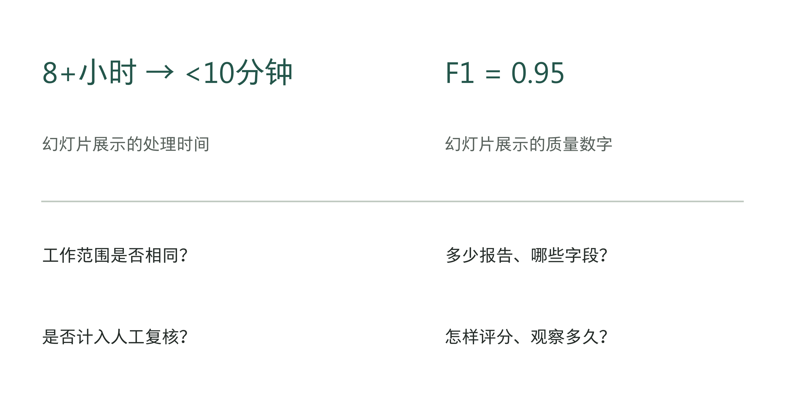

图10-1｜从演示数字到上线判断。作者设计的指标核查问题。CLA幻灯片中的数字为来源方展示；下方问题用于核查口径，不表示已获得答案。

第9章已经画出系统的资料、权限与动作边界。本章要把这些设计变成能反复执行的检查，再决定是否扩大使用范围。评测无需一次证明系统永远不犯错，但必须足以支撑眼前这一项放行决定。

## 先说清楚什么算一笔任务做对了

“回答正确”往往只是业务任务的一部分。沿用前章的虚构结算助手：它读取账单、识别候选差异、附上依据，再提交财务确认。评测对象至少包括差异是否找对、依据是否适用、是否读取了获准范围，以及候选记录是否正确进入待办。文字解释很好，却把待办送错门店，整笔任务仍然失败。

因此，评测前要固定起点和终点。起点是什么材料、什么身份、什么系统状态；终点应当产生哪种记录，哪些状态必须保持不变；遇到缺证或权限不足时，怎样停止才算正确。只有把这些条件写清楚，技术团队和业务负责人才能对同一次运行作出相同判断。

Anthropic的评测工程文章区分了任务、一次试验、评分器与最终环境结果。智能体说已经完成，不等于业务系统里存在相应结果；同一任务也可能需要重复运行，以观察不稳定性。[2] 对老板来说，这一区分最直接的用处，是要求演示者打开结果所在的系统，而不只展示助手的最后一句话。

表10-1｜作者分层检查。一次任务可能同时接受多项检查；不能用内容得分抵消越权或错误写入。

| 评测层面 | 结算教学任务中检查什么 | 单看什么容易误判 |
|---|---|---|
| 内容 | 差异对象、金额与依据是否成立 | 只看措辞像专业人员 |
| 动作 | 待办对象、字段及执行状态是否正确 | 只看模型说“已提交” |
| 边界 | 无权资料未读、禁用动作未执行 | 只看答案没有泄露文字 |
| 接管 | 未决任务是否交给指定人员并可追踪 | 只看界面出现“转人工” |

遇到问题时按要求停止，也要算作正确处理。资料不足时留下一条有接收人的待办，可能比编出一个完整答案更符合要求。反过来，所有任务都转人工，虽然减少了机器作出错误决定的机会，却没有完成预定的自动化职责。评测既要认可适当停止，也要检查本应由系统完成的任务是否被无故推回去。

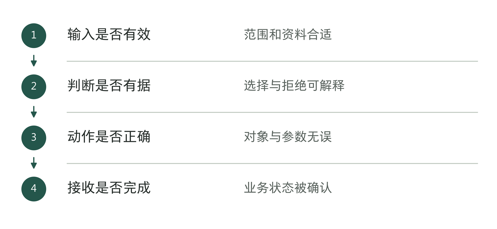

图10-2｜完整任务的评价链。作者分析工具；仅检查答案片段会漏掉任务后半程。

## 一个很高的准确率，也可能漏掉最重要的事

下面用一组明确虚构的数据说明分母。假设评测集有1,000笔结算任务，其中20笔确实存在需要核查的异常，980笔正常。助手找出16笔真异常，漏掉4笔；另把30笔正常任务报成异常，其余950笔正常放行。

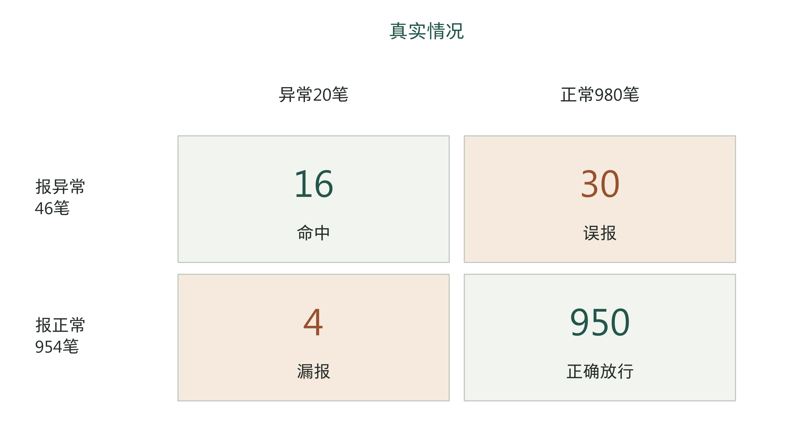

图10-3｜异常识别计数矩阵。虚构教学数据，单位为笔。四格合计1,000；真实异常20，模型报异常46。计数不是任何企业实测结果。

如果只报总体准确率，正确的16笔异常加950笔正常，共966笔，得到96.6%。这个数字看起来不错。可是一个从不检查、把全部任务都报成正常的程序，也能得到98%的准确率，因为正常任务占了绝大多数。后一个系统漏掉所有异常，分数却更高。

此时至少需要再问两个问题。助手报出的46笔异常中，只有16笔是真的，查准率约为34.8%；全部20笔真实异常中找到16笔，查全率为80%。查准率让老板看见复核队列里有多少误报，查全率让老板看见真正的问题还漏掉多少。两者的分母不同，不能互相替代。F1把查准率与查全率合成一个指标；它仍不能说明错在何处、代价多大，也不能替代权限检查。

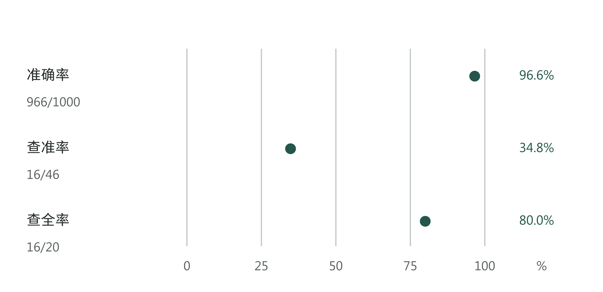

图10-4｜同一批任务的三个分母。虚构教学计算。准确率966/1,000，查准率16/46，查全率16/20；三项指标回答不同问题，不应取平均后作为准入分数。

下一步也不是一味提高查全率。把更多正常任务送去复核，可能找回一部分漏报，也可能让财务被无效提醒淹没。真正的取舍要回到后果：漏掉一笔异常会影响什么，误报一笔需要多少复核劳动，接手人是否有时间处理，哪些错误一经发现就应停止放行。

同样的平均成绩还可能掩盖不同类型的错误。金额算错、归属门店错误、引用失效政策，即使在表上都记作“一次错误”，经营后果也不相同。应分别看关键字段和关键任务，不让大量容易处理的记录冲淡少数重要失败。若某类任务证据不足，可以先把这一类留给人工，批准其他已验证的范围。

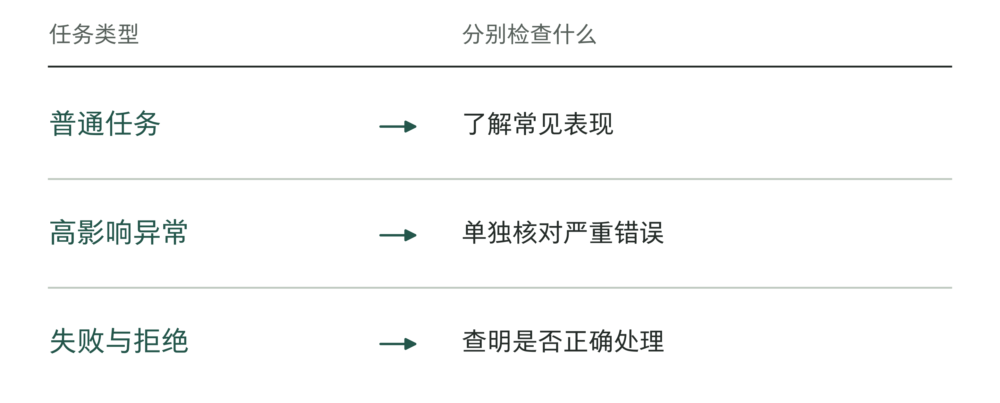

图10-5｜整体高分下面仍要展开什么。作者分析工具；不能用大量普通样本掩盖关键分支。

表10-2｜评测报告的缺口检查（作者检查工具）

| 缺失内容 | 会漏掉什么 |
|---|---|
| 只报总分 | 关键异常和高影响错误 |
| 不列拒绝 | 正确停止与误拒绝的区别 |
| 没有任务分母 | 无法判断比例究竟代表什么 |
| 无版本与期间 | 无法与生产或其他轮次比较 |

## 样本要覆盖真实工作，也要保留难题

第8章留下的现场记录，是建立评测集的起点。选入常见任务，才能知道日常工作是否做得动；加入例外和既有失败，才能看见系统在哪里失效。两种样本都需要，但用途应分开。刻意增加难例的测试集，很适合寻找薄弱点，却不能直接代表日常异常发生率。

例如，团队可以把实际任务抽样形成一组代表性样本，再单列权限不足、资料冲突、过期政策和接口超时等挑战样本。报告既呈现日常样本成绩，也逐类列出挑战样本结果。不要把两组随意混合，再用一个总通过率宣称生产表现；更不能因为难题拉低分数，就把它们悄悄移出测试集。

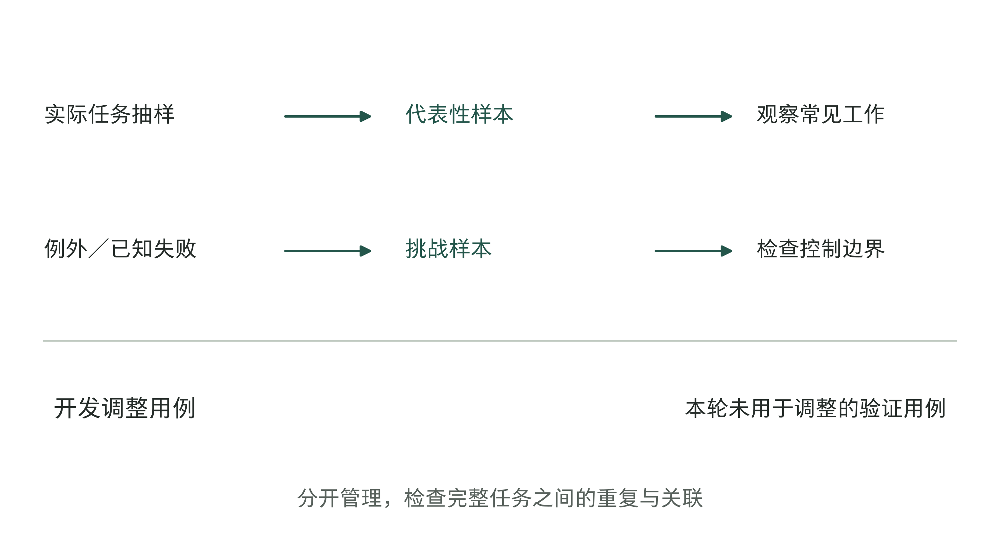

图10-6｜评测材料的两种用途。作者样本组织示意。代表性样本用于观察常见任务，挑战样本用于验证边界；开发调整用例与最终验证用例分开管理。

评测材料还要分清是否已被用于调试。工程师反复看过并据此修改的题目，适合检验已知问题有没有修复；它们不能独自证明系统面对新任务仍有同样表现。应保留一组未用于本轮调整的验证材料，注明来源和版本。若验证结果被用来继续修改，它就已经进入开发过程，需要补充新的验证证据。

这种分开不只是文件夹不同。来自同一张账单的多个相近片段，若分散到开发和验证两组，可能让成绩看起来比实际更好。可以按完整任务、门店或时间段检查重复与关联，再按业务差异选择合适的划分方式。新门店和旧门店、规则变更前后，也可能需要分别看结果。

样本量则取决于准备作多大的决定。少量任务足以暴露明显设计问题，却很难证明罕见的严重错误已经消失。报告应写“本次样本未观察到”，并保留样本数量和覆盖范围。扩大权限、增加门店或引入新资料类型时，不能沿用一次小范围测试的结论而不补充验证。

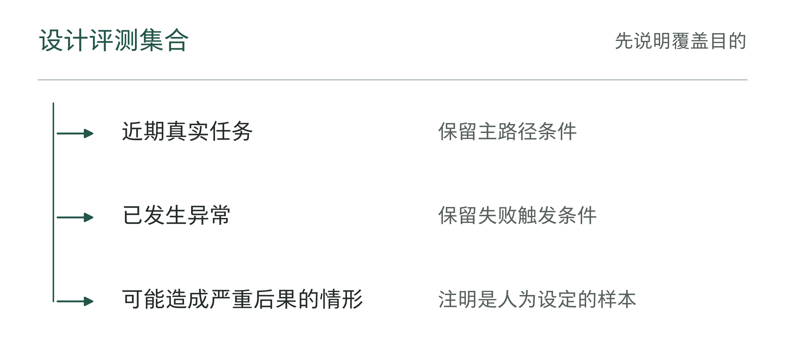

图10-7｜新增测试样本来自哪里。作者分析工具；不同来源的样本要留下标签与适用范围。

## 评分规则也需要被检查

若同一份输出交给两位熟悉业务的人，得到完全相反的结论，问题可能先出在标准。什么算金额一致，什么算同一机构，缩写能否接受，引用只需相关还是必须支持结论，都应在评分前说清楚。否则，所谓模型提升，可能只是换了一个更宽松的评分方法。

对于确定字段，可以使用可复算的程序检查；语义表达可以用明确的评分规则辅助判断，再以人工样本校准。CLA案例中的结构化抽取就涉及列表对象匹配与等价表达：先要知道输出中的哪一个对象对应参考答案中的哪一个对象，才有意义比较字段。[1] 对不上对象而直接逐行计分，可能把正确答案判错，也可能把不同对象的相同数值判对。

参考答案本身也可能错。业务专家意见冲突时，应保存分歧及裁定依据；规则后来修订，应更新答案版本，并区分历史任务应使用哪一版。不能在看见某次系统结果后临时改答案，然后仍把修改前后的分数称作同一项比较。

有模型参与评分时，还要防止评分器只偏爱更长、更自信或更像标准答案的文字。可以拿已由业务人员确认的正确、错误及边界样本，检查它是否给出合理判断。尤其要看“语言很顺但事实错了”的样本，而不只检查明显胡言乱语。评分器升级后，也需要重新校准，不能默认为一把永远不变的尺。

同一任务应按需要重复运行，并记录每次结果。下面的教学图展示四个任务各运行四次；有的始终通过，有的偶尔通过，有的始终失败。只挑每行最好的一次，会让后两类问题消失。

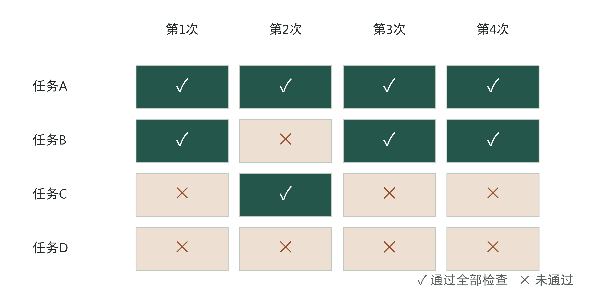

图10-8｜重复运行不能只保留最好一次。虚构试验记录。格内符号表示该次任务是否通过全部既定检查；同一行反复失败与偶发失败需要不同排查，不从四次试验外推长期概率。

如果业务允许生成多个候选供人工选择，应按这种真实用法评测，并计入筛选和重试成本。如果业务要求每笔任务一次稳定完成，就不能用“试了多次总有一次成功”替代稳定性证据。评测方式要贴近交付承诺，而不是挑选最容易得到好分数的口径。

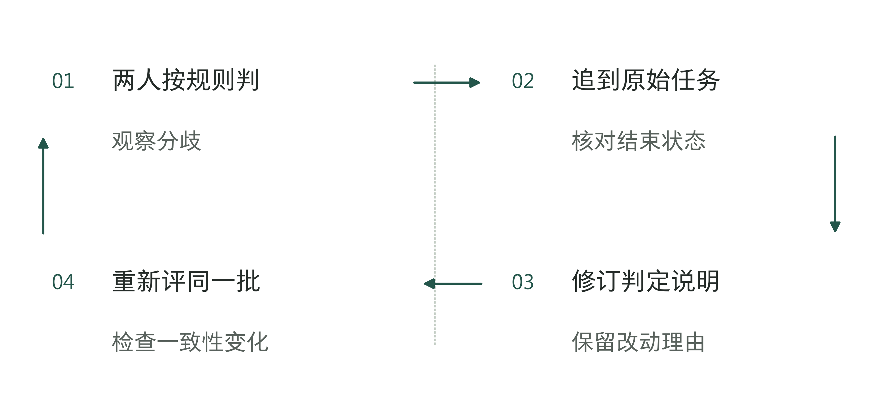

图10-9｜评分规则也要经过回放。作者分析工具；规则变化应版本化，不能悄悄重算旧分数。

## 分阶段试用，逐步查清实际表现

离线评测在受控材料和环境中检查能力。它能让失败更容易复现，但无法充分展示现场到达节奏、资料分布和人工配合。因此，通过离线评测后，通常还需要观察真实工作条件；这并不意味着马上允许系统影响真实业务。

影子运行让系统接收获准的真实输入，在隔离路径中生成结果，与现行流程作比较，输出不用于业务决定，也不产生真实写入。外发消息、创建正式待办、更新记录等副作用必须确实被隔离。仅在界面上标注“测试”，而工具仍连着生产写入接口，不能算影子运行。

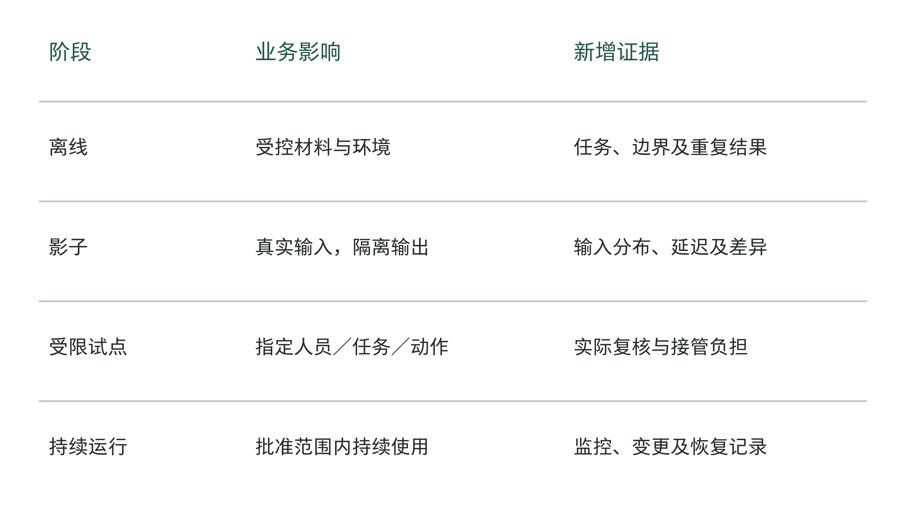

图10-10｜渐进放行与不同证据。作者准入路径。每阶段的权限和影响范围分别限定；进入下一阶段需有相应证据，日历到期不自动放行。

影子运行可以暴露输入缺失、规则变化和处理延迟，却仍无法证明员工愿意依赖结果。受限试点才开始让指定人员在限定任务中使用系统，并明确哪些输出必须复核、哪些动作仍禁用。范围可以按任务类型、门店、用户或时间窗口限制，具体选择取决于哪种方式能控制后果和方便接管。

试点范围小，不等于影响一定小。一次后果严重的操作，即使只占很少流量，也可能造成严重问题。限定任务类型往往比只限定流量比例更能说明边界。团队应写出本轮允许的动作、最大待办量、复核人和停止条件；尚未验证的任务继续沿用既有流程。

每个阶段都要写清三件事：通过什么检查才能开始，满足什么条件才可以扩大范围，出现什么问题必须暂停。条件不满足，就修复后再测、缩小范围，或补充记录。不能因为已经安排了“上线仪式”，就把尚未解决的问题带进正式运行。

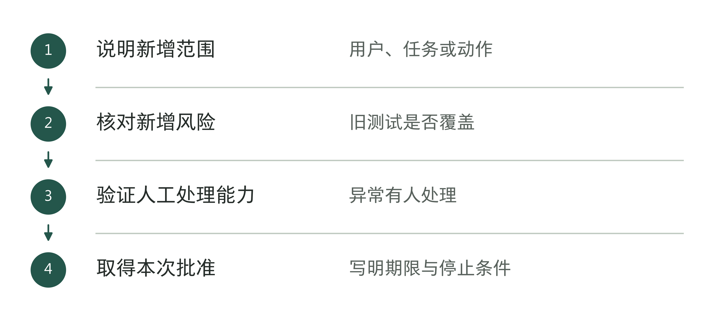

图10-11｜每次扩大运行范围前。作者分析工具；每次放行只覆盖本次明确的范围。

## 人工接管需要怎样的安排

“有人复核”不能自动补齐系统缺陷。复核人如果看不到原文、无法定位差异、没有时间处理，或者没有权限纠正结果，实际上很难接住任务。设计人工接管时，应把所需材料、处理动作、时限和升级路径一起交付。

对于结算教学任务，复核界面至少要让财务知道：哪笔记录需要决定，候选变化是什么，依据在哪里，系统为什么停在这里。资料冲突和参数错误不应混成同一种“失败”。前者可能需要业务负责人裁定，后者可能由工程团队修复；接管路径应根据问题转给有能力处理的人。

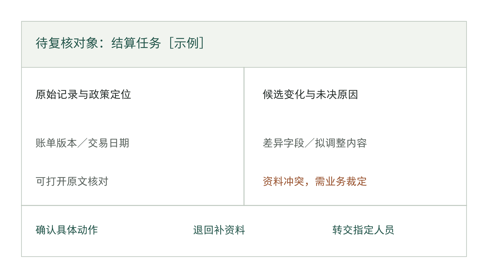

图10-12｜复核工作台应呈现什么。作者界面线框示意，非真实产品截图。对象、依据、差异、未决原因与决定动作同屏对应，避免复核人重新寻找上下文。

系统已经放行的结果，也要另外抽查。若只抽查系统主动标出的低置信度结果，可能错过自信但错误的回答；可以按任务后果，对已放行结果另外抽样，并记录复核发现。抽样不能代替必须逐笔审批的高后果动作，两者服务于不同控制目的。

还要测人员是否处理得过来。系统把大量任务转人工，评分可能没有下降，员工却不得不加班清理待办。应记录每天增加多少、处理多少、积压多少，以及最长等了多久。忙不过来时，就减少进入新流程的任务，或恢复原有流程。“成功转人工”只完成了交接，任务本身还没完成。

人员不在场时也应有安排。谁是替补，何时升级，长时间无人接收后系统能否继续，必须提前确定。只把通知发到一个群里，仍可能没有任何人真正承担处理。这些细节决定系统发生异常后，业务能否保持可控。

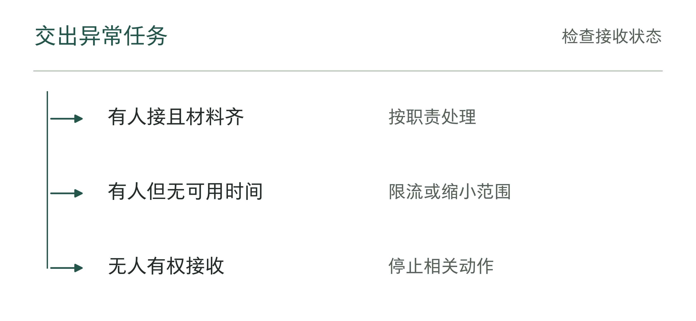

图10-13｜人工接管是否真正成立。作者分析工具；设置按钮只是入口，接收与处理才完成接管。

## 运行检查要覆盖慢、贵和不确定

进入试点后，质量分数只是运行看板的一部分。服务是否按时返回、是否出现失败重试、一次任务用了多少资源、异常能否被及时发现，都可能影响业务。平均响应时间很短，也可能掩盖少量长时间挂起的任务；应结合业务截止时间看慢任务，而不只看平均数。

延迟检查也需要确定终点。模型开始输出第一个字，与一笔待办真正处理完，是不同的计时终点。成本同样要按完整任务记录，包括检索、工具调用、重试和必要复核。第5章的预算假设应在试点中被这些记录检验，但本章不据此提前宣称经营收益已经实现。

故障演练可以在隔离环境中制造可控条件：资料暂时不可用、接口返回超时、批准之后对象发生变化、接管人没有响应。检查系统是否及时停止、是否留下可追踪状态，以及指定人员能否依照说明处理。若演练本身可能影响真实数据，就应改用测试对象和隔离接口，不能为了验证控制而制造业务事故。

告警也必须经过验证。让一次已知异常触发，确认谁收到、能否看懂、是否有操作权限、多久确认接收。告警发出不等于恢复开始，仪表盘出现红色也不等于有人接管。老板不必审每条技术日志，但可以要求看一份完整演练记录，从触发一直看到恢复与核对。

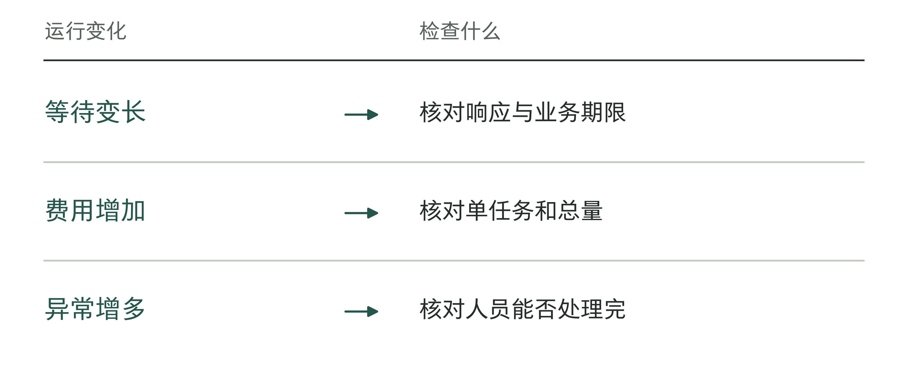

图10-14｜运行中要检查的三种负担。作者分析工具；任务量增加，等待、费用和人工处理量都可能增加。

## 回滚软件之后，业务可能还没有恢复

亚马逊云科技（AWS）的智能体架构指南Agentic AI Lens强调行为配置版本化、分阶段发布和实际演练回滚；恢复目标应是已确认稳定的基线，而不只是最近一次旧版本。[3] 对企业来说，模型、提示、规则、权限和工具配置需要能对应到一次发布，才能知道要退回什么。

恢复还存在另一层问题。退回旧程序，不能自动撤回已经发送的消息、删除对方已经看到的内容，或抵消已经写入的业务变化。必须区分停止新增影响、恢复系统配置和处理已发生的业务结果。前两步可能由工程团队执行，最后一步往往需要业务负责人核对并决定补救。

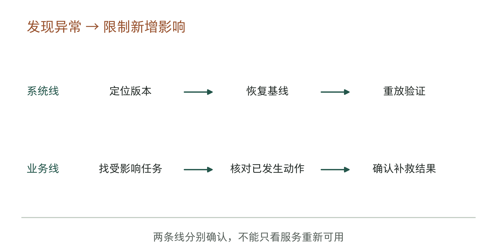

图10-15｜恢复要走完两条线。作者恢复演练示意，时间轴仅表示先后，不编码分钟。恢复配置与核对受影响业务同时推进，完成条件分别确认。

沿用结算助手，如果新版规则把一批正常记录列成候选差异，首先限制新增任务，再找出受影响任务编号及版本。随后恢复已验证配置，重放必要样本，并核对错误候选是否已经被人工采用。仅生成待办与已经改账，补救办法不同，不能一律写“回滚完成”。

恢复演练还应检查依赖。旧版本能否读取现在的数据结构，旧规则是否仍适用于新的交易，已过期凭证是否能恢复，都不能靠保留一份代码解决。无法安全回退时，应有暂停、只读或人工流程作为替代，并提前验证其处理能力。

演练结束需要留下记录：触发条件、停止动作、影响范围、恢复版本、业务核对与确认人。记录的目的，是在真正出问题时减少临时猜测。若团队只能口头保证“随时能切回去”，老板仍应把恢复能力视为未验证。

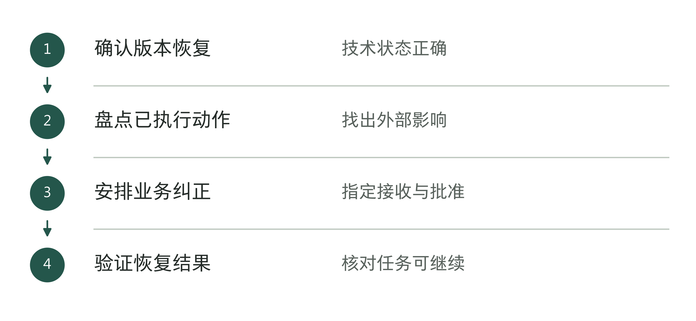

图10-16｜软件回滚后的业务核对。作者分析工具；回滚不自动撤销已经发生的业务动作。

## 老板批准的是一个范围，不是一个分数

准入会议可以从具体版本、具体任务和具体权限开始。团队先展示代表性样本与难例结果，再呈现人工接管和恢复演练。尚未满足的条件，应明确影响哪部分工作，而不笼统写成“后续优化”。

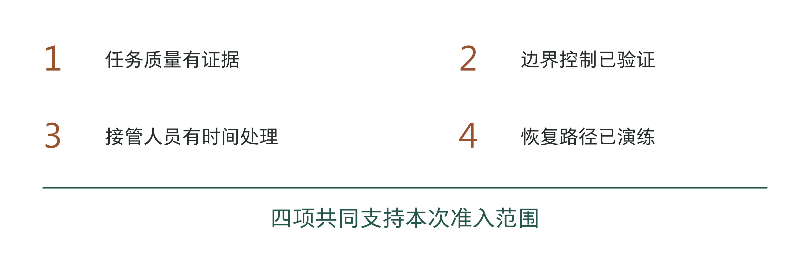

图10-17｜准入条件不能互相抵消。作者准入检查。任务质量、边界控制、人工处理能力和恢复能力均须支持本次范围；任一关键条件缺少依据，就修复、补查或缩小范围。

表10-3｜作者准入决策示例。不是通用监管门槛，具体条件由任务后果、既有制度和已确认的交付约定确定。

| 当前证据 | 可以作出的决定 | 应保留的限制 |
|---|---|---|
| 常见任务通过，关键例外尚未验证 | 只有获准任务可在处理前识别、未验证例外可隔离时，才限定试用 | 识别与隔离也须验证；做不到则继续离线补测 |
| 内容质量可用，写入控制未通过 | 只读路径的权限、资料与输出边界独立通过验证后，才可保留候选辅助 | 禁用写入；共同权限或数据隔离有缺陷时，不据此放行只读 |
| 系统可用，接管队列已积压 | 缩小进入量或暂停扩围 | 增加接管能力后再验证 |
| 关键越权或恢复失败 | 暂停相关路径并修复 | 重新通过测试及演练再放行 |

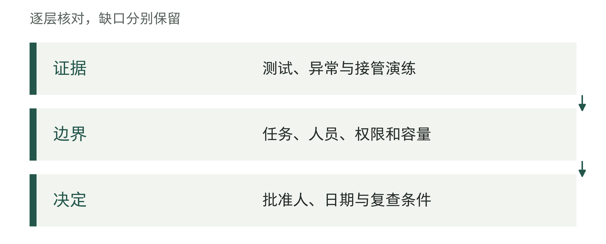

图10-18｜一次准入决定应同时保留。作者分析工具；以后比较运行变化时，需要回到这份准入基线。

下面用一份教学记录，说明怎样决定一个版本能否试运行。T10组与前面的1,000笔异常识别算例分别设置，不表示实际生产成功率。本次只考虑指定门店的候选差异清单，写入和付款始终禁用。还有一个必要条件：系统在开始处理前，就能识别门店和任务类型，拒绝无权请求，把无法确认的任务转给人工。验证集H1也要检查这一点。如果必须完整处理后才知道任务超出已验证范围，就不能靠“限定范围”批准试运行。

表10-4｜一次失败到有限放行的记录（作者教学示例）

| 阶段与记录 | 发现或处理 | 本阶段决定 |
|---|---|---|
| 开发回放D1、V0.1 | 账单变化后仍沿用旧候选；缺政策样本没有正确转人工 | 两项均不通过，禁止进入试运行 |
| 修复V0.2 | 将源版本校验和缺证转人工落实到程序及流程，重测已知失败的任务 | 原例通过只说明修复有效，尚未批准上线 |
| 保留验证集H1 | 本轮未用于调整的完整任务，按来源订单去重；业务人员依据预定标准复核 | 逐项记录普通、缺证、旧规则和无权任务；本次未见约定关键错误 |
| 恢复演练R1 | 接管者在工具不可用时用原流程接住任务，恢复旧版候选生成功能不会改动业务账 | 生产负责人确认接管路径，遗留限制继续保留 |
| 准入A1 | 业务与技术分别确认V0.2、H1和R1；两名获准复核人参与10个工作日 | 仅开放候选辅助，记录所有进入与转人工任务；试用期结束时复查 |

H1若因发现问题而被拿来调试，就不能继续称为未参与调试的验证集；应修复后补新的验证材料。表中“本次未见”只适用于实际列入清单的教学任务，未给出能证明罕见错误消失的样本规模。任务、权限、资料或人工处理能力改变时，A1不自动延伸；运行负责人遇到关键错误立即停止受影响的任务，并报告有权处理的负责人。

批准文件应说明本次允许谁在什么任务中使用哪个版本，允许哪些动作，谁负责监控，何时复查，以及什么情况立即停止。发现新资料类型、改变模型或增加工具权限，都可能让原来的证据失去适用性。变更应按实际影响补测，不能因名称仍叫“同一个助手”就沿用全部批准。

这些条件具备后，才能让指定人员开始真实试用。接下来还要看员工是否用得顺、会不会绕开系统、遇到问题是否愿意反馈。第11章讨论这些问题。本章保存的版本、范围和测试记录，也会成为后续比较的依据。

## 资料与说明

[1] S033/S034，C025。CLA与Databricks，[会议介绍](https://www.databricks.com/dataaisummit/session/stop-guessing-start-scoring-llm-extraction-evaluation-databricks)及[2026年6月幻灯片](https://microsites.databricks.com/sites/default/files/dais/2026/D26B2127.pdf)，第8—10、22—29、31页。2026-09-07核查。第9页展示耗时与F1，未充分说明样本、观察期及端到端人工复核口径；不作ROI或长期生产表现证明。本章无原图复制。

[2] S067。Anthropic，[Demystifying evals for AI agents](https://www.anthropic.com/engineering/demystifying-evals-for-ai-agents)，2026-01-09，任务、试验、结果及评分器小节，2026-09-07核查。引用评测区分；本章结算数字、重复记录和检查表为作者教学设计。

[3] S070。AWS，[Agentic AI Lens](https://docs.aws.amazon.com/pdfs/wellarchitected/latest/agentic-ai-lens/agentic-ai-lens.pdf)，AGENTOPS02-BP03、AGENTOPS03-BP02，PDF物理页56—58、73—74，2026-09-07核查。引用版本、渐进发布与演练原则；不把指南中的流量比例、恢复时限当作所有企业的统一标准。
