# 第11章 让员工真正用起来

一张申请表，有时比一场发布会更接近AI部署的日常。

得克萨斯大学里奥格兰德河谷分校（UTRGV）的ChatGPT Edu试点面向教师和员工，许可数量有限。申请人需要说明角色、部门、用途、预计使用频率及时间，并确认敏感数据事项。申请不保证获得许可；不活跃的许可可以重新分配。[1]

这份申请表把工具分配后的工作说得很具体：谁需要，用在哪里，分配之后怎样管理。公开页面没有披露获配人数、活跃率或工作成效，因此不能据此判断试点成功与否。企业可以借鉴这些管理安排，再用自己的实际记录检查效果。

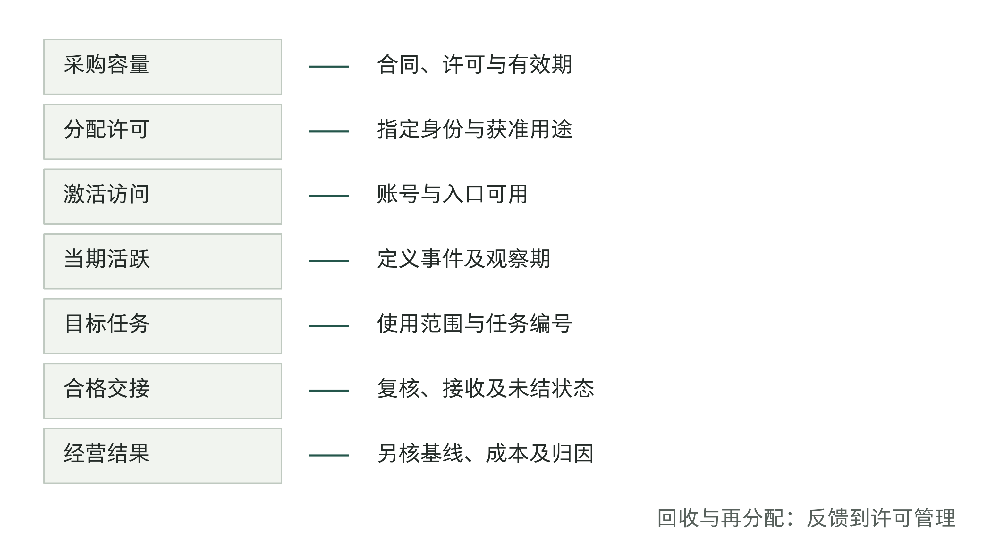

图11-1｜怎样判断员工是否真正用起来。作者分析框架。等宽各层表示不同证据，不表示人数比例；采购单位、人数与任务数不能直接相除。许可回收属于反馈管理。

企业也会遇到相似问题。系统已经通过测试，账号已经开通，员工处理任务时却仍然打开原来的表格。此时再安排一场产品介绍，未必能解决问题。员工可能没有合适任务，可能不知道哪些材料能输入，也可能试过之后发现核对比重做更费时间。几种情况都会表现为“不活跃”，需要的处理却完全不同。

第10章回答系统在什么范围内可以进入生产。本章检查员工开始使用系统后的实际情况：能否用它持续完成获准任务，并做好必要的复核和交接。经营结果怎样归因，留到第12章讨论。

## 先确定用AI完成哪项工作

“全员使用AI”很容易传达，也很难验收。有人每天问一个无关紧要的问题，有人每月用一次，却完成了原本需要多人核对的准备工作。用登录次数给两人排名，会把真正的工作差异抹掉。

试点应先写清目标任务。例如，采购部门可以选择“根据获准资料形成供应商会议纪要草稿，经负责人核对后进入项目记录”。这个定义包括输入、产出、复核及去向。只写“帮助采购提效”，既无法判断员工是否用了正确方式，也无法发现工作在哪一步停住。

随后确定谁在观察期内确实有机会做这项工作。季度任务不适合用周活跃率判断个人是否采用；调岗、休假和没有任务的人，应在记录中注明状态。统计口径可以调整，但不能为了使曲线好看，悄悄从分母里删去没有用起来的人。保留最初试点群体，再另报当期有任务群体，读者才能看清变化的原因。

表11-1｜用记录检查员工是否用起来（作者方法）

| 要判断什么 | 分子与分母 | 必须同时说明 |
|---|---|---|
| 许可是否分配出去 | 已分配许可／可分配许可 | 许可单位、有效期及回收情况 |
| 获配员工是否使用 | 当期活跃人数／指定获配群体人数 | 活跃事件定义、角色及观察期 |
| 目标工作是否进入流程 | 使用AI流程的任务／符合纳入条件的任务 | 任务范围、例外及重复任务去重 |
| 工作是否完成交接 | 合格且已交接任务／使用AI流程的任务 | 验收标准、退回及未结任务 |

这些数字各自回答一个问题。获配率高，可能说明申请分配顺畅；任务交接率低，则可能说明产出不合用，或者接收部门仍要求另一套材料。把几项数字平均成一个“AI采用指数”，会掩盖需要处理的具体位置。

管理层还要约定何时认为某项任务不适合继续推广。若材料获取成本很高、频率很低，保留人工处理可能比持续培训更合算。推动使用也包括停止推广不合适的任务，把支持资源移到有实际需求的岗位。

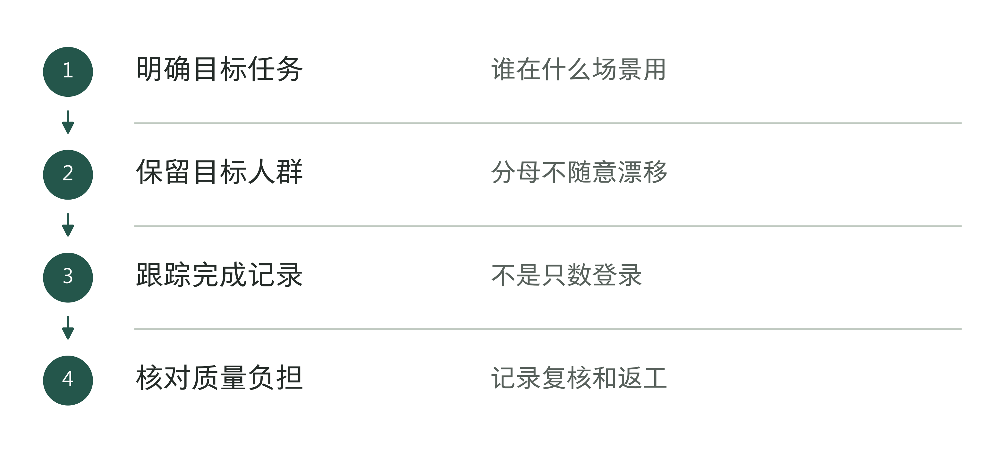

图11-2｜从具体任务统计使用情况。作者分析工具；统计使用情况，要看任务是否完成。

## 使用总人数增加，原来的人却可能停用了

下面是一组教学数据，与前述学校无关。最初向100名员工分配许可，第一周有60人使用。到第四周，这100人中有45人使用，其中36人第一周也使用过，另外9人是后来开始使用的。同一时期又向30名新员工分配许可，其中20人在第四周使用。

如果只看总周活，数字从60变成65，似乎在增长。但原100人的当周活跃率从60%变成45%；第一周60名活跃者中，第四周仍活跃的只有36人，占60%。新增群体的20名活跃者遮住了原群体的下降。

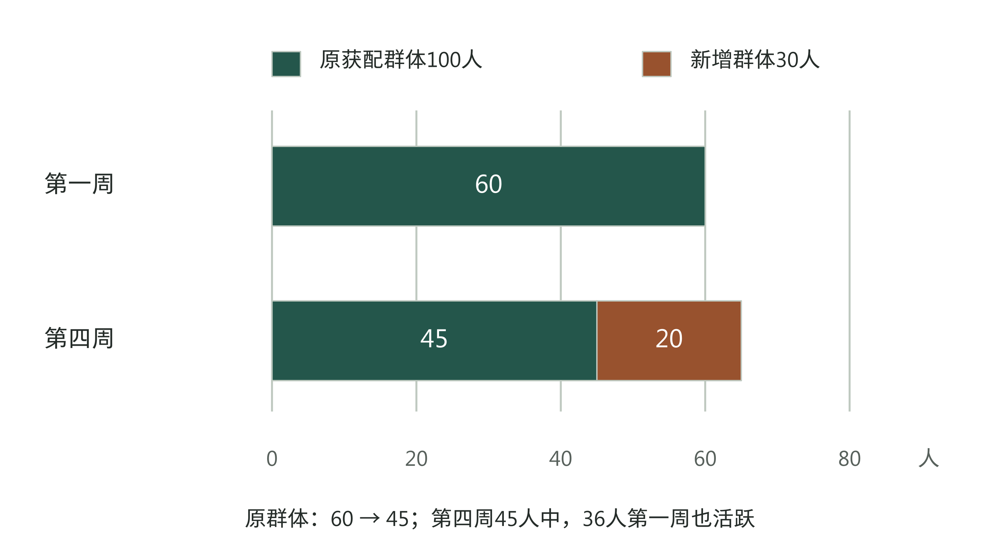

图11-3｜把新加入的人与原群体分开。教学数据，单位为人。原群体固定100人；第四周另有30名新获配者。36/60表示两个观察周均活跃的比例，不代表中间每周连续使用。

发现这种变化，下一步应找原因。第一周的高使用量可能来自集体培训，第四周才接近日常；也可能恰逢任务淡季。没有这些背景，下降既不能直接证明项目失败，也不能被新增用户冲淡后当成成功。

可以从三组人中各选适量样本核对具体任务：持续使用的人，试过后停用的人，以及有任务却尚未开始的人。抽样人数取决于团队规模与差异，不把几次访谈当作全员结论。问题要围绕最近一件实际工作：在哪个入口开始，带了什么材料，哪一步返回旧工具，最后怎样交付。少问“你对AI满意吗”，多看一件工作走完的记录。

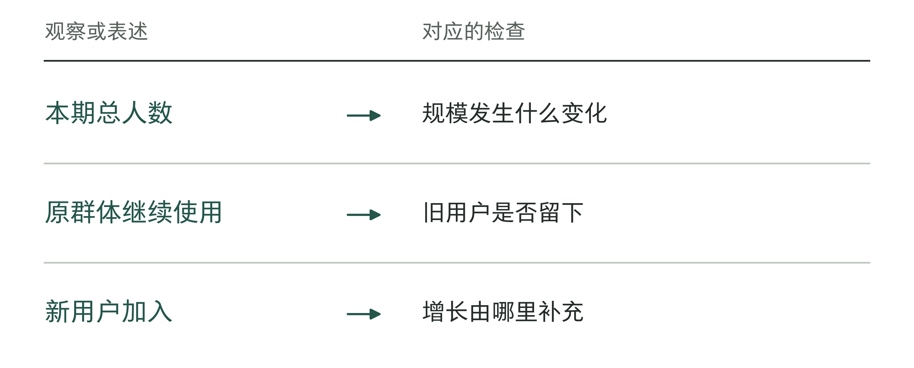

图11-4｜总人数和同一批员工的持续使用各回答什么。作者分析工具；总量增长与原用户流失可以同时发生。

表11-2｜跟踪同一批员工时怎样统计（作者检查工具）

| 记录项 | 写法要求 |
|---|---|
| 群体 | 固定本轮开始时的目标人群 |
| 任务 | 定义计入完成的目标工作 |
| 期间 | 明确开始、结束和可比周期 |
| 流入与流出 | 新加入者与原群体分开记录 |

## 找出员工返回旧工具的那一步

设想一个教学场景：客户经理需要把走访记录整理成内部跟进摘要。新工具能快速起草，但原始记录在另一个系统，客户字段需要手动删除，输出还要重新粘进固定表格。负责人看不到原文，只好退回让客户经理补上依据。模型生成很快，员工完成交接却多走了几段路。

这种情况下，“员工不会写提示词”只是一个待检验的解释。FDE应跟随一件任务走过现有路径，记录转录、等待、判断和返工的位置。若主要时间花在登录与权限，增加提示词课程帮助有限；若返工来自关键字段缺失，则应调整输入和验收，而不是只把回答写得更流畅。

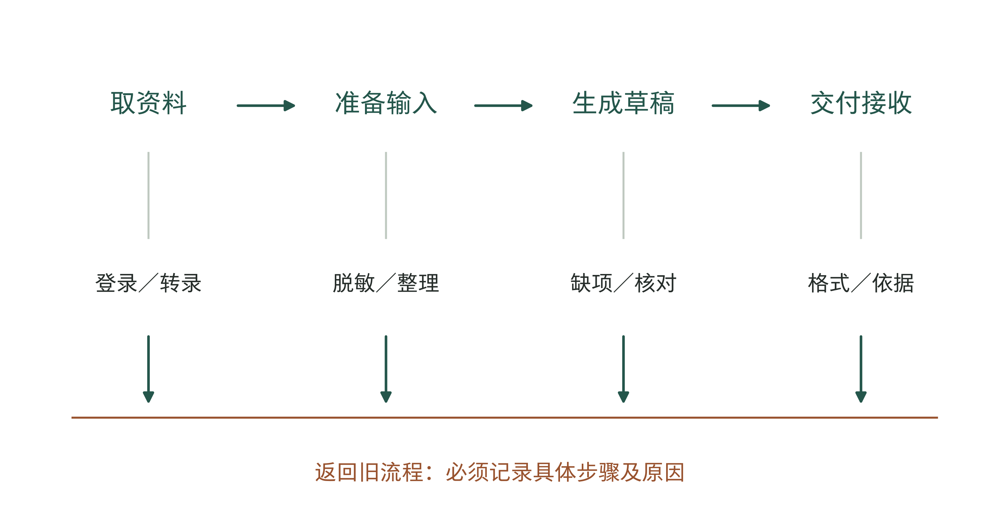

图11-5｜一件任务怎样绕回旧工具。作者教学路径图。上方为工作步骤，下方标出可能返回旧流程的位置；不代表真实客户耗时或故障频率。

把这次问题记为F11-08，仍是教学情景。旧版摘要缺少“原始记录位置”和“待确认事项”，主管无法复核，只好退回。客户经理于是另发原文，再抄一遍说明。流程负责人可以先和主管确定交接要求：正文列必要摘要，另附有权查阅的原文位置、疑点及下一位负责人。访问原文需要正式授权，模型不能替员工授予权限。

教学方案V0.2先使用标准输入表和固定输出栏，不必等跨系统接口开发完。原文接收者没有访问权限时，由有权批准的业务人员决定能提供哪些摘要，或改交给谁处理，不能复制全文来绕过权限。复核时间要排进工作计划；员工提出疑点，不算操作失败，未解决的任务也要继续记录。

复查时，先重做原来的任务，再让普通使用者独立处理一笔同类新任务N11-09。在这份教学记录中，主管找到了获准查看的依据，确认一个疑点后完成接收，不再要求重抄整份材料；另一种无法获得原文权限的情况，仍转交人工处理。这只能说明，所测任务的交接问题已解决，还不能证明员工普遍愿意使用，更不能给出节时比例。后续要继续跟踪同一批人的完成、退回和人工整理情况，再决定是否值得开发接口。

改进也有成本。打通接口可能需要业务系统团队排期；暂时用标准输入表，实施较快，却仍需要员工整理材料。两种办法可以分阶段采用，前提是明确临时方案会增加多少操作，以及什么证据出现后值得做接口。不能因为“以后会打通”，就把今天的人工搬运从新增工作量中删掉。

修复以后应回到同类任务观察。入口变化是否减少了放弃？接收部门是否仍在退回？支持工单关闭只能说明有人处理过问题，不能替代员工完成工作。一个好的改动记录，应同时留下问题、修改版本、验证任务及接收人的确认。

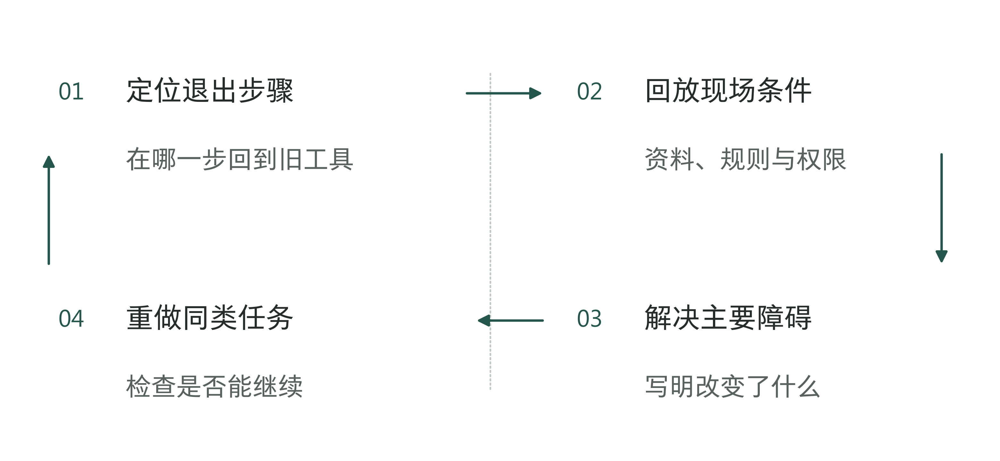

图11-6｜沿回到旧工具的路径找原因。作者分析工具；不要把每次退出都解释成员工抗拒。

## 有账号，还要有这项任务的许可

员工有时停住，是因为不知道能不能用。得克萨斯州立大学英语系的教学资源页提供三种课程AI声明选项：禁止使用、有限允许，以及按作业要求允许。学校提供某种工具，并不自动使它在每项课程作业中都获准使用。[2]

这个材料揭示的是两层决定：机构提供访问条件，具体工作仍有自己的规则。企业可以据此检查自己的授权说明。市场文案、内部分析与对客户作出的承诺，所需的材料边界和复核责任可能不同。笼统写“公司支持使用AI”，很难帮助员工在实际任务上判断。

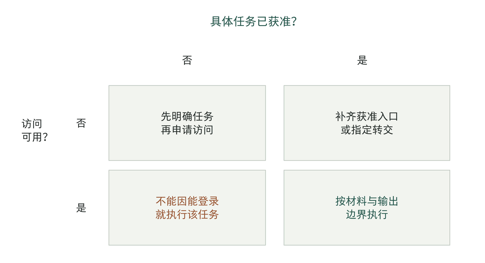

图11-7｜访问条件与任务许可要同时满足。作者企业授权矩阵。以课程选项启发一般管理分析，不是任何学校或企业的实际权限配置；任务许可还须覆盖材料与输出去向。

在目标流程旁放一份短说明，比要求员工凭记忆回想长篇政策更有用。说明应指向获准工具与账号、可用材料、产出用途，以及必须交给谁复核。遇到未列明的情形时，员工需要一个能答复的责任人和临时处理办法；“请自行确保合规”没有解决谁来判断的问题。

权限说明还必须与系统表现一致。说明写着员工可读取某类内部资料，工具却反复报无权访问，员工会把政策视为不可执行。反过来，系统允许打开的资料也不应被理解为任何用途均可使用。技术访问与业务许可要分别核对，再把差异交给有权处理的人。

检查使用情况，不必变成逐人阅读所有提示词。可以先收集任务事件、时间、状态和错误类别，遇到具体故障时按获准流程调取必要记录。需要采集哪些内容、由谁查看和保留多久，应事先说明。否则，员工可能为了避免暴露尚未完成的思考而绕开正式工具，使用记录也随之失真。

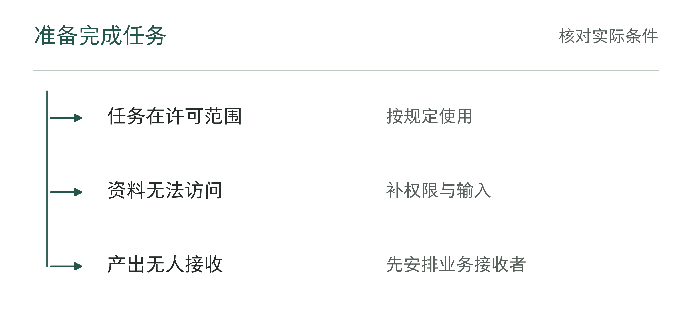

图11-8｜账号开通之后还缺什么。作者分析工具；账号、任务许可和接收安排分别确认。

## 培训结束时，员工要能独立完成工作

产品演示让员工知道工具会做什么；岗位训练要让员工完成自己负责的工作。前者可以面向多人统一讲解，后者必须处理任务差异。

仍以会议纪要草稿为例，训练可以从一份脱敏材料开始。先让员工按原流程完成，再使用获准的AI流程，逐项比较遗漏、错误和复核负担。接着换一份带有材料冲突的记录，观察员工是否会保留疑点并转交判断。最后由员工独立完成另一份任务，把结果交给实际接收角色核对。通过这些动作，团队才能知道问题发生在操作、业务判断还是工作交接。

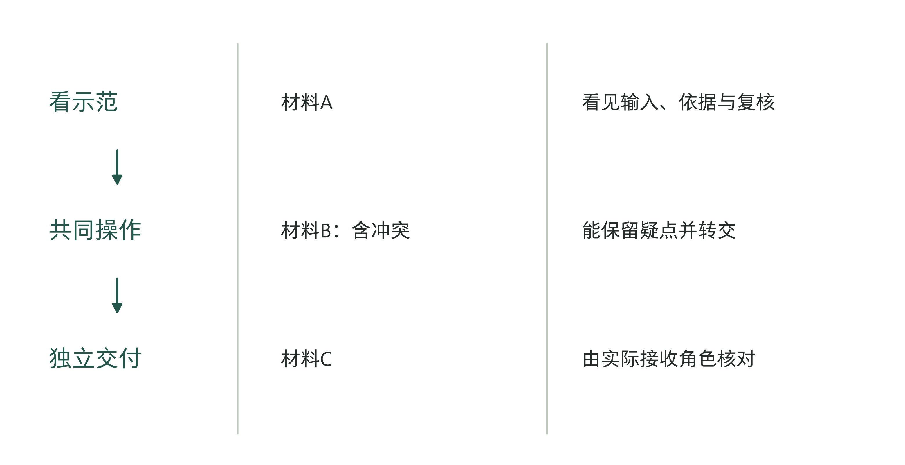

图11-9｜训练的终点是独立完成工作。作者岗位训练设计。示范、共同操作和独立交付使用不同材料；每一步保留可观察产物，避免只记录听课人数。

早期积极使用者适合协助训练，但不能代替普通员工的检验。熟悉业务又愿意探索的人，往往能自行补齐输入，识别含糊输出；推广到新手时，这些隐含能力可能成为新的门槛。至少应检查不同熟练度的员工能否理解同一份任务说明，再决定支持材料是否够用。

培训以后，员工遇到问题要能找到人。复杂问题可安排固定答疑时间，常见操作问题则写在任务入口旁。只建一个热闹的聊天群，会让几位热心同事长期承担答疑。FDE应把反复出现的问题整理成使用说明、程序修复或待确认的业务规则，并安排后续负责人。

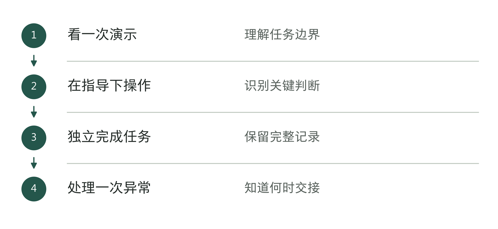

图11-10｜训练走到独立交付的路径。作者分析工具；通过训练需要任务表现作为依据。

## 处理负担与利益，才有持续反馈

员工可能愿意节省起草时间，却不愿意承担新增的隐性责任。比如原来由主管决定材料是否足够，新流程要求员工先判断AI输出是否可靠，考核却仍只看处理量。工作边界改变了，复核时间没有进入排班，出错后责任又不清楚。这类问题无法只靠鼓励员工使用来解决。

负责人应先把变化写出来：哪个步骤减少了，哪个判断增加了，谁获得了便利，谁承担了额外复核。如果接收部门省了时间，却把校验负担全部推回上游，总流程未必改善。安排试点时应给员工保留学习与反馈时间，也要为复核人员安排足够的时间。

一条有用的反馈可以很短：任务编号、卡住的步骤、造成的后果、当时采用的替代办法。不同问题要送到能处理的人手中。账号问题交给服务支持；资料错误交给资料负责人；输出不符合任务要求交给交付团队；职责或考核冲突则需要业务管理者决定。

表11-3｜反馈闭环需要留下的记录（作者方法）

| 问题信号 | 本次责任人 | 关闭前核对 | 反馈给员工什么 |
|---|---|---|---|
| 登录或权限失败 | 服务支持／权限负责人 | 原任务能够获准继续或明确转交 | 可用入口及受限原因 |
| 草稿反复缺关键字段 | 交付团队与业务验收人 | 同类新任务能通过规定检查 | 新版本与已知限制 |
| 接收部门要求重做 | 流程负责人 | 双方使用同一交接要求 | 调整后的接收标准 |
| 复核负担没有排班 | 业务管理者 | 人员时间与职责已安排 | 新的处理范围及节奏 |

关闭后还要观察问题是否复发。员工提出意见却看不到后续，很容易停止反馈；工单数量下降也可能意味着没人再报。把工单趋势与任务退回、绕行记录一起看，才有机会分辨系统变好了，还是信息渠道失效了。

不要因为员工报告了错误，就认定他不愿使用AI。一面要求大家暴露问题，一面用“零异常”评价试点，会鼓励员工把困难藏到系统外。员工有理由拒绝一项不合适的任务时，应记下原因，用来调整使用范围。是否改变岗位或考核，由有权的管理者明确说明，不要让员工从使用排名里猜。

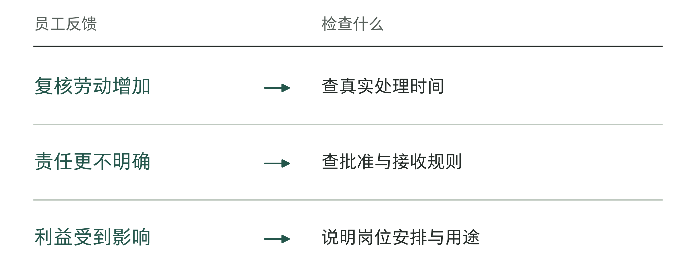

图11-11｜反馈背后可能是哪一种负担。作者分析工具；负担不同，需要的处理也不同。

## 用量上涨后，额度怎样处理

使用增加会带来新的管理问题。对按额度或调用计量的功能，高用量可能来自有价值的工作，也可能来自失败重试、重复提交或不合适的处理方式。总量只能提示需要查看，不能自行给出结论。

OpenAI Academy关于ChatGPT Edu的指南建议先利用预警观察使用模式，再根据预算和群体情况选择硬限额，并提前明确监控负责人、例外批准和触限支持。[4]这是厂商提供的部署建议，不表示所有企业都应放开额度。固定预算、明确高风险用途或试验环境，可能从开始就需要硬约束。

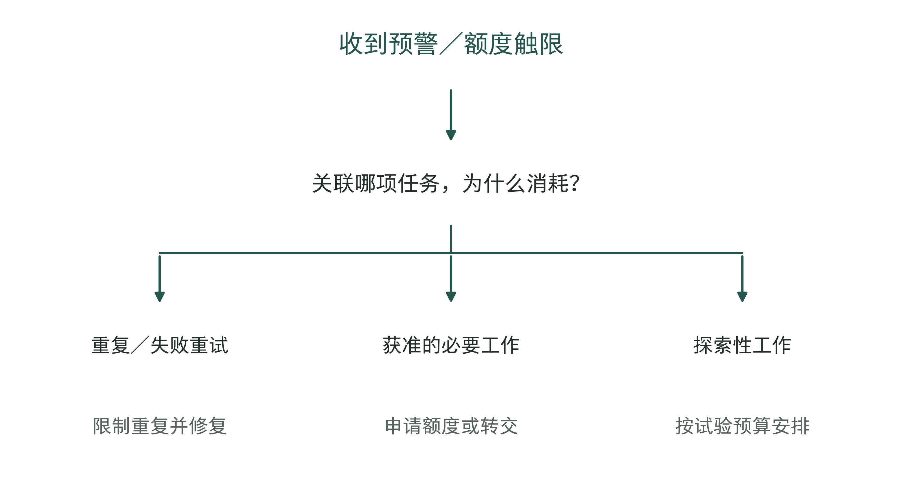

图11-12｜触限以后先看工作处于什么状态。作者额度响应分支。额度增加须由授权人决定；任务重要也不自动获得追加预算。接管路径应在触限前准备。

企业可以给常规工作设置可预期的额度，为探索任务单列有限预算，并为重要任务保留获批后的处理路径。触限提示至少应告诉员工：哪些工作受影响、已有结果是否保存、怎样继续或转交。突然出现一条“额度不足”，会把预算控制变成业务中断。

判断是否增加额度，需要回到任务。若大量调用来自同一处失败，应先限制重复和修复原因；若员工已能持续完成合格交接，却因额度不足产生排队，再比较追加费用与可接受的替代流程。财务人员核的是新增支出及其对应工作量，业务人员确认工作是否必要，技术人员解释消耗为何发生。几方使用同一个任务口径，才不至于分别争论一张用量图。

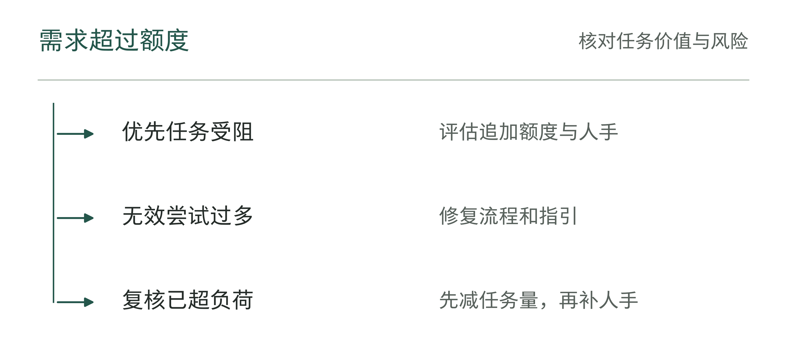

图11-13｜额度不足时先决定什么。作者分析工具；增加额度必须同时核对后续处理能力。

## 用一张看板决定下一轮动作

OpenAI Academy的另一份指南把周活、不同群体、支持问题和调查等信号放在一起观察，并列出工作区创建后第120天与第240天的调查节点。[3]它提醒部署负责人，开通之后还需要持续调整。调查中的节时估计可以提供线索，不能直接写成已实现的财务收益。

本书建议企业试点另设30、60、120天复盘，时间点属于作者方案，可随任务周期调整。第30天优先检查获准入口、任务机会与首次完成；第60天观察同一群体能否重复完成、主要摩擦是否减少；第120天再根据任务质量、支持负担与成本，决定扩展、保持、缩小或结束。低频任务应按足够的业务周期观察，不能为了赶日历节点强作结论。

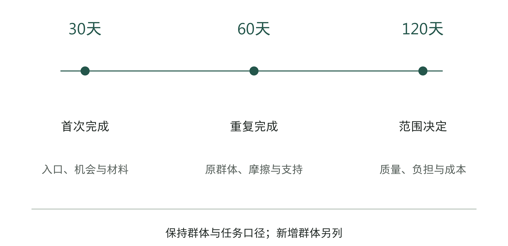

图11-14｜同一份使用情况看板的三个复盘点。作者30/60/120天安排。三个节点沿用同一群体与任务定义，同时单列新增群体；节点间距为示意，不是等比例时间刻度或来源方的产品功能时间表。

看板应把任务量放到人数旁边。假设一周有80件符合纳入条件的任务，其中60件使用AI流程，45件通过规定验收并完成交接。任务覆盖率为60/80，即75%；已使用任务中的合格交接率为45/60，也是75%；总体合格交接覆盖率则为45/80，即56.25%。三个数的分母不同，不能选择其中最好看的一个宣称部署已完成。

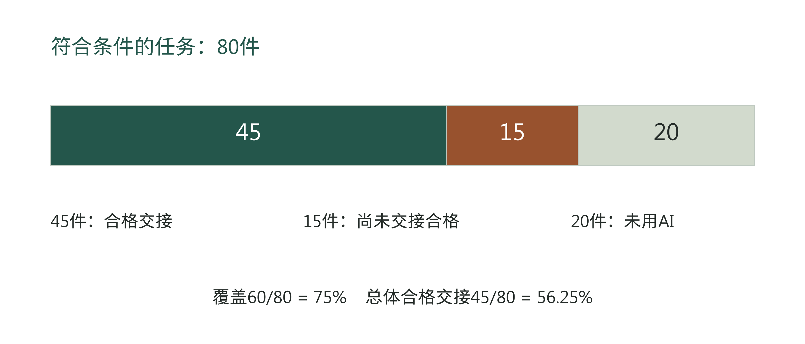

图11-15｜从任务覆盖到合格交接。教学算例，单位为件。45件合格交接、15件尚未合格交接、20件未使用AI流程，共80件；不与图11-3的人数混用，尚未交接也不一概判作最终失败。

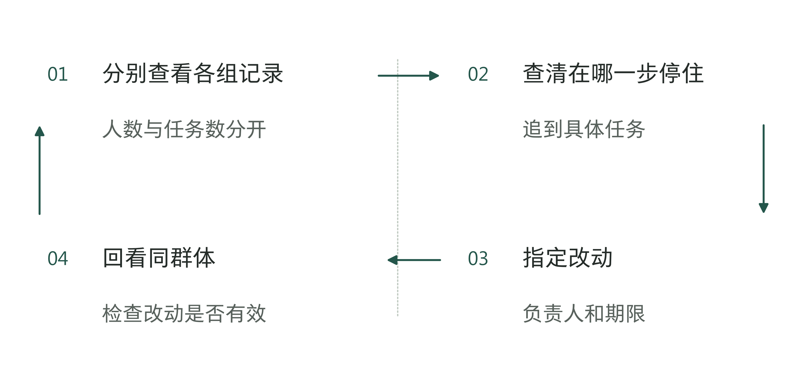

图11-16｜根据使用记录决定下一步。作者分析工具；看板结论必须产生可复查的动作。

表11-4｜在哪一步停住，就从哪里查起（作者检查工具）

| 观察线索 | 先查什么 | 处理人 |
|---|---|---|
| 登录后未完成 | 任务许可和输入条件 | 业务与权限维护者 |
| 频繁回旧工具 | 失败步骤与恢复成本 | 流程与交付负责人 |
| 复核积压 | 异常量和可用时间 | 运行负责人 |

这份记录会把讨论引向不同动作。未进入AI流程的20件，需要查明是员工绕行还是合理例外；已进入但尚未合格交接的15件，需要分开处理中、退回和放弃。若只催促更多员工登录，后一类问题可能继续堆积。

章末工具把群体、观察期、任务数量、主要阻力及下一步责任人放在同一页。复盘要说明准备改变什么、用哪些后续记录判断变化。结果记录应从开工基线延续下来，与实际使用记录一起收集；工作能够稳定完成后，再按第12章核对改善了多少、哪些改善来自这次部署、是否带来实际经营收益。

## 资料与说明

[1] UTRGV，ChatGPT Edu License Pilot，服务目录How to apply、Important notes及FAQ，2026-09-07核查。https://support.utrgv.edu/TDClient/1849/Portal/Requests/Service/55277/ChatGPT-Edu-License 。研究来源S304。本文仅据页面描述许可运营，不推算实际使用或成效。

[2] Texas State University Department of English，Teaching First-Year English，Required Syllabus Statements re: Student AI Use，2026-09-07核查。https://www.english.txst.edu/faculty-resources/fye.html 。研究来源S308。三种声明是课程选项，不能当作全校统一执行结果。

[3] OpenAI Academy，Use Impact Data To Improve Your ChatGPT Edu Rollout，2026-05-06，2026-09-07核查。https://academy.openai.com/public/clubs/higher-education-05x4z/blogs/use-impact-data-to-improve-your-chatgpt-edu-rollout-2026-05-06 。研究来源S312。来源120/240天与本书作者方案30/60/120天分别记载。

[4] OpenAI Academy，Set Credit Guardrails Before Your ChatGPT Edu Rollout，2026-05-06，2026-09-07核查。https://academy.openai.com/public/clubs/higher-education-05x4z/blogs/set-credit-guardrails-before-your-chatgpt-edu-rollout-2026-05-06 。研究来源S313。本文不提供产品当前价格或账户设置操作指引。

本章人数、任务数及企业操作场景均为教学设计，不代表学校试点数据或作者客户经历。图表及工具由作者设计；采用情况的观察不能替代经营结果的归因分析。
