# 第12章 验证结果：AI究竟创造了多少经营价值

约两小时、96%、45.8万英镑。这三个数字出现在同一个地方政府的AI项目及相关服务材料中，却不能直接组成一笔投资回报。

英国北萨默塞特地方议会（North Somerset Council）与技术服务商Agilisys共同试点教育、健康与照护计划（EHCP）评估工具。采购公告称，每次评估约节省两小时；合同金额为45.8万英镑，不含税。[1] 后来发布的官方年度统计显示，2025年排除例外的计划中，约96%在20周内签发。[2]

这足以让人认真研究项目，但还不足以回答老板最关心的问题：钱花得值不值，接下来是否扩大投入？两小时是某项评估工作的节时说明，96%是特定分母下的年度及时率，合同金额则包括研发及相关服务。三者的工作范围、观察期和证据性质尚未对齐。

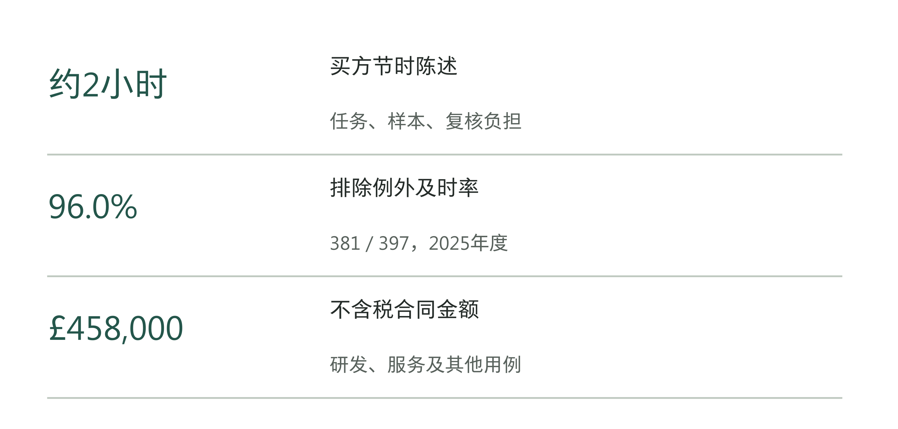

图12-1｜三组数字分别回答什么。依据采购公告及英国教育部（DfE）年度统计重新绘制。[1][2] 并列表示三类记录；没有将工时、及时率和合同价连成已证实的收益链。

第5章讨论投入前怎样定预算，第11章检查员工是否持续用系统完成工作。现在要判断投入之后的结果：实际改善了什么，AI参与的这套流程贡献了多少，又有多少已变成收入、支出或服务上的变化。老板不必亲自建立统计模型，但要知道报告中的每个结论依据什么记录。

## 先把96%的分母写出来

同一份年度数据里，还能算出另一个数：90.9%。它并不与96%矛盾。2025年含例外的493份计划中，448份在20周内签发；排除例外后，397份中有381份及时签发。两种口径分别回答总体情况与排除例外后的情况。[2]

读报告时，不能只问96%是否真实，还要问96%代表哪些工作。若前一年使用含例外口径，后一年改用排除例外口径，展示出来的改善就同时包含业务变化和统计范围变化。即使两个百分比都计算正确，比较仍可能失真。

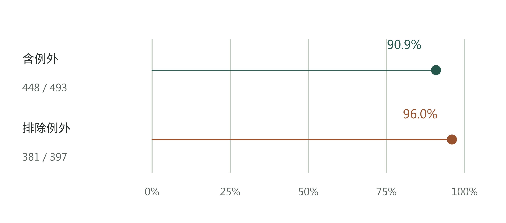

图12-2｜同一年有两个及时率。North Somerset，2025日历年；448/493约90.9%，381/397约96.0%。[2] 共用0—100%刻度，不截断坐标夸大差距。

企业里的分母更容易悄悄变动。试点刚开始，只接收材料齐全的标准任务；扩围后，缺附件、跨部门和需要例外批准的任务也进来了。此时平均完成时间变长，可能是系统退步，也可能是承担了更难的工作。反过来，若把失败后转回人工的任务移出统计，AI流程的表现就会变得格外漂亮。

结果核验应从一份纳入规则开始。规定哪些任务有资格进入观察，什么时候开始计时，什么状态才算完成，失败、撤回和转人工怎样记。复杂任务可以另列，不能在看到结果以后才决定排除。规则改变时，保留旧口径与新口径的并列表，让读者看见变化发生在哪里。

表12-1｜同一项任务的结果登记口径，作者建议

| 要素 | 应记录的内容 | 常见误判 |
|---|---|---|
| 对象 | 任务编号、类型、纳入条件 | 把容易任务当作全部任务 |
| 起止 | 收件、可处理、首次交付、最终接收时间 | 把草稿生成当作工作完成 |
| 路径 | AI参与步骤、版本、转人工与重试 | 只保留成功调用 |
| 结果 | 质量等级、返工、接收和未结状态 | 未结任务直接消失 |
| 范围 | 观察期、单位、分母和排除原因 | 将人数、件数与调用数互除 |

这张表也能防止一种看似细小的偏差：只统计观察期内完成的工作。新流程可能迅速处理了简单任务，却留下少量棘手任务。报告截止时，已完成任务的平均时间很短，积压却在增加。因此，完成耗时之外，还要列出期初未结、新增、完成、撤回及期末未结，核对流入流出。对尚未完成的任务，至少报告已经等待多久。

系统日志和员工自报各有用途。日志可以定位提交、生成和接收时点，却未必知道员工期间处理了多少其他工作；两次点击相隔十分钟，不等于投入十分钟。员工能说明检查和改写负担，但事后回忆容易遗漏零散步骤。可以先用一小段连续任务记录，把工作计时与系统事件对应，再决定哪些指标能够长期由日志取得。第三方出具报告也要检查测量方法：换了报告署名，不会自动补齐缺失的基线。

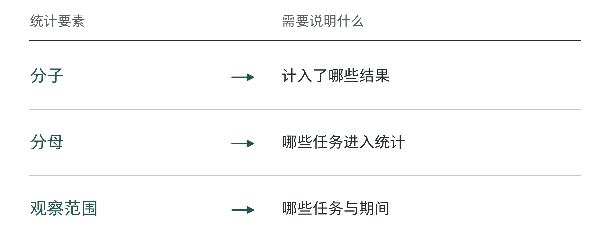

图12-3｜报告百分比时还要说明什么。作者分析工具；必要信息缺失时，先说明尚不能判断什么。

## 改善发生在什么时候

把年度数字放回时间里，判断会更稳妥。统一采用2026年发布的同一版DfE数据，North Somerset含例外的年度及时率在2023—2025年分别为36.6%、63.0%和90.9%。这说明这三年间服务及时性有明显改善；它还没有解释改善由什么造成。[2]

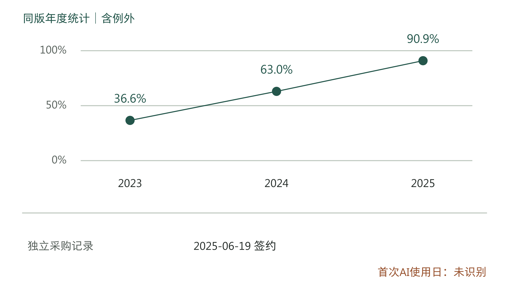

图12-4｜年度改善与采购节点分开记录。上栏为同版年度数据；下栏为独立采购节点。[1][2] 年度点不代表年末当日表现。未标出AI首次使用线，因为现有材料不能确定该日期。

合同公告登记的签约日是2025年6月19日，同时明确此前已经共同试点。[1] 因而，不能把签约日当成首次使用日，再把更早的改善称为“没有AI时也在改善”。这个说法看似谨慎，实际上又补进了一条材料没有给出的事实。

地方政府2025年5月的特殊教育需要与残障（SEND）简报，把服务进步归于团队和伙伴机构的共同工作。[3] 这提示我们追踪其他改变：人员补充、积压清理、资料准备、跨机构配合，都可能影响结果。它没有证明AI不起作用，也没有提供把各项贡献拆开的数据。

复核还发现，简报中的部分历史及时率，与后来年度统计不同。原因尚未查明，不能挑各份材料里最顺眼的数，拼成一条连续上升的线。本章年度比较只用同一数据版本；地方简报用于说明当时的组织工作。企业内部周报与财务年结也可能经历修订，保留发布日期、提取日期和原始文件，才能在事后解释差异。

对FDE团队，真正有用的交付记录应比合同时间更细：哪个工作单元何时开始使用，哪些任务使用了哪个版本，复核规则什么时候调整，同期是否更换人员或清理积压。没有这条实际运行时间线，事后再漂亮的统计图，也很难把变化与具体改动对应起来。

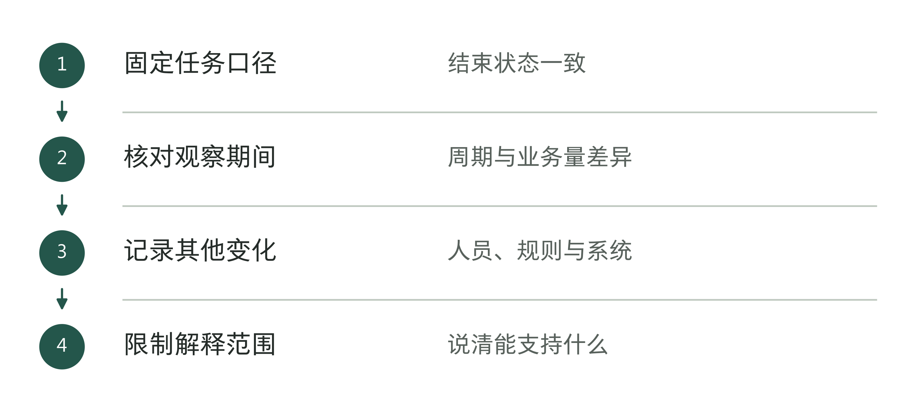

图12-5｜前后变化怎样检查可比性。作者分析工具；时间先后本身不能完成因果归因。

## 用对照追问“本来会怎样”

现在离开真实案例，看一个教学算例。甲组开始使用AI，单件任务平均耗时从60分钟降到40分钟。报告若写“AI节省20分钟”，就默认除了AI，其他事情都没有改变。这个默认往往没有被检查。

同期，未使用AI的乙组从60分钟降到50分钟。若两组承担可比工作，此前趋势相近，期间受到相同外部变化，而甲组没有额外获得其他帮助，就可以把乙组的10分钟改善作为两组共同变化的线索。甲组多改善的10分钟，才是进一步研究AI贡献的起点。

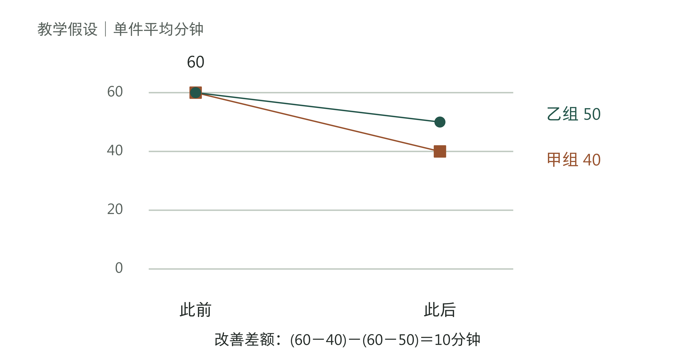

图12-6｜先扣除共同变化的线索。教学假设，不是North Somerset数据。甲组改善20分钟，乙组改善10分钟，差额10分钟；四个均值只能演示计算，不能独立证明因果。

英国财政部《Magenta Book》的方法说明要求时间序列评估考虑其他同期干预、季节性等影响，也说明历史趋势相近的未受干预对照，可以帮助辨认共同变化。[4] 实际评估仍需足够的观察记录与适用假设；给两列数据加上“实验组”“对照组”标题，并不会自动获得可信结论。

甲组若由最熟练的员工组成，乙组多是新人，两个均值的差异就可能含有人群差异。甲组若顺便获得新模板和专人支持，观察到的也是整套部署安排的效果。老板可以决定投资这套安排，但不应把全部改善写成模型单独的贡献。

可行时，在上线前确定分批顺序和比较办法，比上线后临时寻找对照更好。若必须让所有团队同时使用，就收集更长的运行记录，标出每次流程与版本变化，并追查典型任务的处理过程。证据强度会受限制，报告应停在能够支持的层次：观察到改善、部署可能有贡献，或在指定条件下估计出增量效果。

小企业也需要这种纪律，只是测量方式可以简单。固定一类任务，连续保留输入条件、处理路径、人工核对和最终接收记录；把失败和慢任务一起拿出来看。不要凭两位积极使用者的感受，把结论推广给整个部门。也不要为了得到漂亮均值，事后删除本来应当纳入的例外。

这里还有一个管理取舍：测量越严格，可能需要越多记录和等待时间。一个可随时撤回的内部草稿工具，可以先做范围有限的验证；涉及不可逆后果的工作，则需要更强的证据和复核。测量投入应与下一步决定的风险相称，但“暂时不值得做完整评估”不能被写成“已经证明有效”。

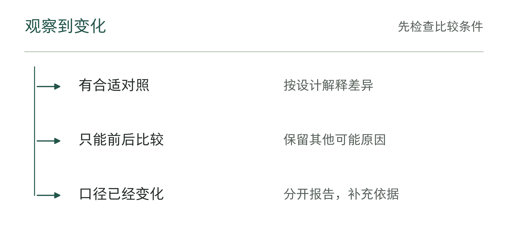

图12-7｜对照证据不够时怎样表述。作者分析工具；结论强度应跟随证据强度。

表12-2｜结果结论的强度标注（作者检查工具）

| 证据条件 | 适合保留的表述 |
|---|---|
| 供应方披露指标 | 明确标为供应方披露并保留范围 |
| 同口径前后记录 | 报告观察到的变化，说明其他变化 |
| 有可解释的对照设计 | 按设计说明差异及剩余限制 |
| 只有预测或合同阈值 | 标为假设或承诺，不写成实际结果 |

## 速度旁边，还要放什么

North Somerset另一份官方统计给出了不同方向的信号。特殊教育需要与残障审裁处（SEND Tribunal）登记的上诉从2024年的94件增至2025年的128件，公布的上诉率从4.6%升至5.4%；对应的可上诉决定统计分母分别为2,055与2,352。[5]

这些上诉涉及的决定范围，与当年新签发计划的493份分母不同。不能用128除以493，也不能据此断言AI降低了计划质量。现有汇总表没有把上诉与具体AI参与记录连接起来。但当及时性改善而争议信号上升时，管理者有理由进一步查看争议类型、发生时间和处理结果。

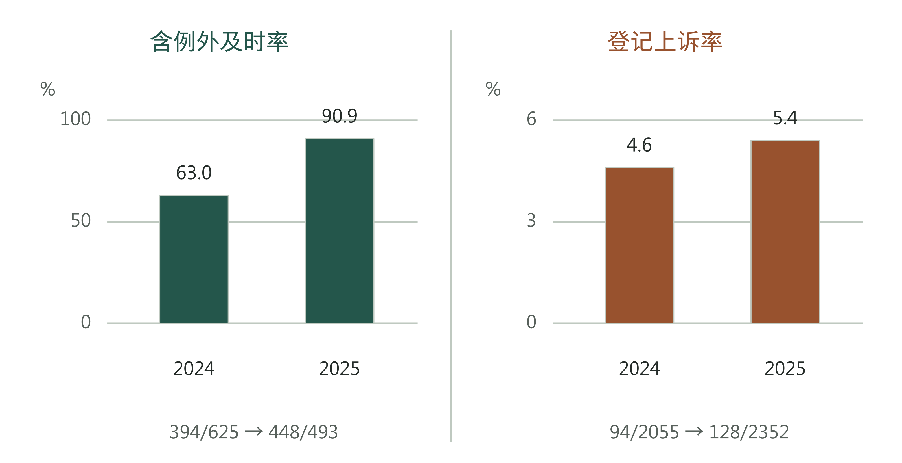

图12-8｜两种结果各自保留分母。2024—2025年含例外及时率与登记上诉率。[2][5] 两栏使用不同刻度和不同群体，不能相减或按图形斜率比较；这里只呈现各自变化。

这也是企业选择指标的方法。客服回复更快，就同时看问题是否解决、是否重复来电、是否需要升级；资料整理更快，就看证据遗漏与人工返工；销售建议增加，就看客户是否采纳，以及后续收入和履约成本。后面的结果往往出现得更慢，不能在短期试点里假装已经看见。

North Somerset已有一般质量保证框架，包含抽样、人员复核及多机构审查，也关注儿童与家庭声音、可理解性和结果表述。[6] 框架提供了检查的方向，却没有公开证明AI生成内容已经按这些要求被专项审计，更没有给出AI样本的错误率。制度文件与实际执行记录，需要分别取得。

企业的质量抽样也要避免只看被系统顺利处理的任务。建议同时查看正常完成、人工大幅改写、转人工及投诉任务；记录谁抽样、按什么规则抽取、评价者是否知道使用了AI。严重错误应单独列出，不能被大量小任务的合格率冲淡。若质量尚未验收，节时只能作为待核结果进入报告。

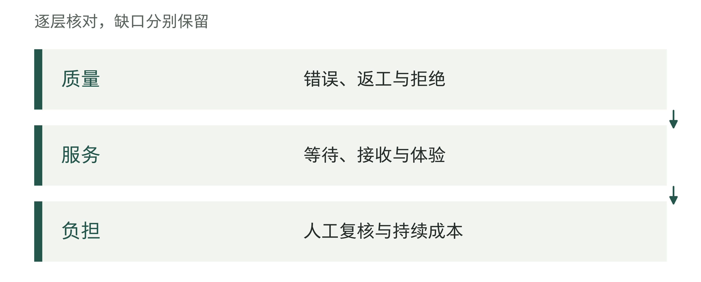

图12-9｜速度旁边的结果约束。作者分析工具；更快必须在其他约束仍成立时才有意义。

## 两小时怎样走到现金账上

买方说每次评估约节省两小时，是值得追踪的使用信号。[1] 要把它变成经营判断，还需要知道测了多少件、在哪段时间、是否包含准备和复核，以及不同任务之间差异多大。用这两小时直接乘全年计划数，再乘员工时薪，会连续跨过几个尚未核实的环节。

下面另设一个完整的教学账。一个月有600件符合条件且完成接收的任务，经可比测量，每件在原步骤上少用12分钟，共120小时。新增的材料准备、复核和返工合计30小时，净释放90小时。30小时包括相关失败与转人工所增加的负担，不能只统计成功任务的节省，遗漏失败任务增加的劳动。

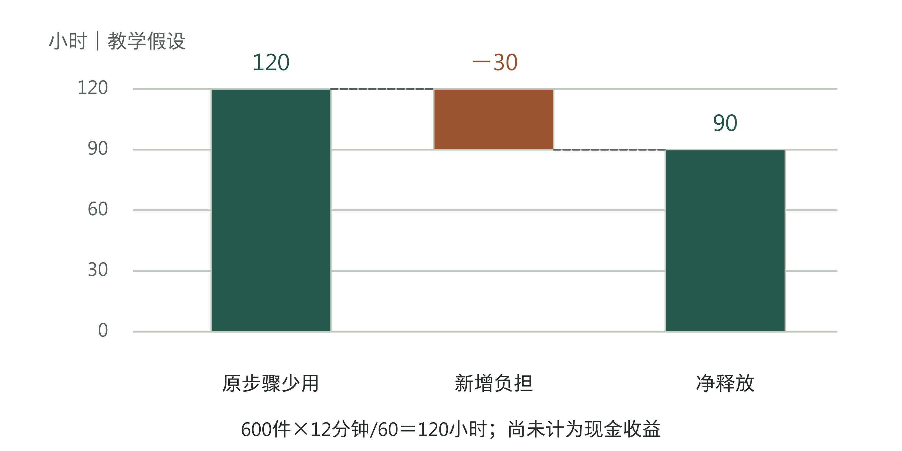

图12-10｜先算净工时，再追踪去向。教学假设。600×12/60＝120小时；120−30＝90小时。净释放工时尚未乘时薪，也未记为现金节省。

90小时可以有几种去向。若员工用它处理积压，价值表现为更多任务完成与更短等待；若用于更充分的复核，价值应由质量记录体现；若没有新的工作承接，可能只是负担降低。每种结果都可以有意义，但需要各自的证据。

只有在原本需要支付的加班、外包或其他支出确实减少时，才能讨论对应的现金节省。员工工资照常发放，释放90小时不会自动让当月支出减少。把90小时按内部人力成本估值，可以辅助资源配置，栏目应写“可用工时估值”，与现金收益分开。

假设上述90小时中，有40小时确实替代了原本需采购的外部工作，并且没有转移到别处采购。按教学假设每小时300元，避免的支出为12,000元。同月新增工具费用5,000元、外部支持费用2,000元，则这三项口径下的净现金改善是5,000元。剩余50小时去向另记，不再折成现金加一次。

表12-3｜教学月度账：工时、现金与一次性投入分列

| 项目 | 计算或金额 | 进入哪一栏 |
|---|---|---|
| 净释放工时 | 120−30＝90小时 | 可用工时 |
| 替代外购工作 | 40×300＝12,000元 | 避免现金支出 |
| 新增工具与外部支持 | 5,000＋2,000＝7,000元 | 新增现金支出 |
| 本月上述净额 | 12,000−7,000＝5,000元 | 月度现金改善 |
| 上线一次性投入 | 假设30,000元 | 另列项目累计投入 |

5,000元还不是整个项目已经收回投资。如果上线前另付30,000元，在月度净改善保持不变、没有其他增量支出的教学假设下，需要六个月的净改善累计覆盖这笔初始投入。真实项目可能有淡旺季、续费、需求不足及维护变化；不能把这个算术结果当成回本承诺。第5章讨论预算假设，本章要求逐月用实际记录替换假设。

对收入型项目也一样。销售额增加，不等于现金等额增加，还要看退款、回款时间与为这些订单新增的履约支出。若同一批释放工时被用于承接新订单，就不能一边把全部工时算成节省，一边再把全部收入当作额外净收益。报告需要清楚说明价值在哪个环节兑现，避免一份资源计算两次。

风险降低与服务质量有时是投资的主要理由。对于这类项目，可以明确每完成一件合格工作需要多少资源，哪种严重错误必须避免，以及愿意为改善承担多大成本。若尚无可信的事故概率，就不要把假想损失乘上主观概率，包装成已经实现的财务收益。没有现金节省的项目仍可能值得继续，批准理由应写成经核验的服务改善及可接受成本。

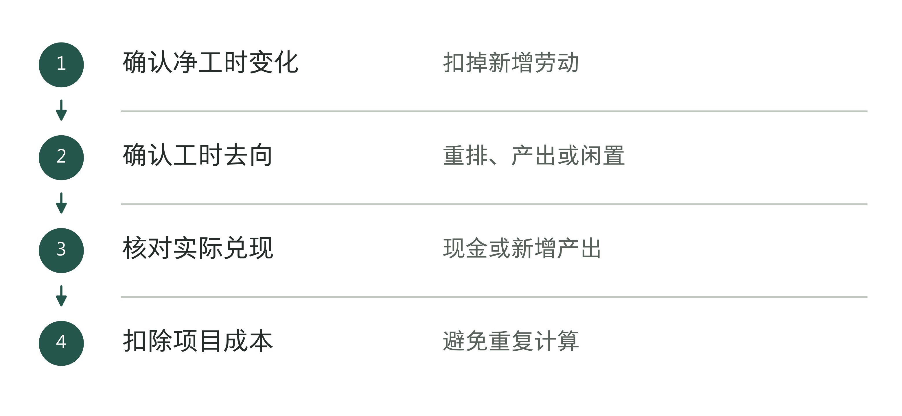

图12-11｜从可用工时到经营账。作者分析工具；不同兑现路径使用不同证据，不能混加。

## 成本必须能追到这个项目

45.8万英镑的合同价不能直接充当某一年EHCP处理的实际成本。合同描述还涉及研发、相关咨询及其他用例，采购范围与一项任务的年度统计并不重合。[1] 同一家供应商的其他付款，也只有在合同编号、发票、服务期与交付范围能够对应时，才能分配给这个项目。

企业核验成本时，可以把总账旁边再放一张项目成本表。许可按实际服务期和获准用途记录；共享平台费用说明分配依据；外部支持追到具体工单；内部投入另记工时及估值。尚未付款的已发生义务、已经预付但尚未使用的服务，也应说明状态，避免把付款时点当作成本发生时点。

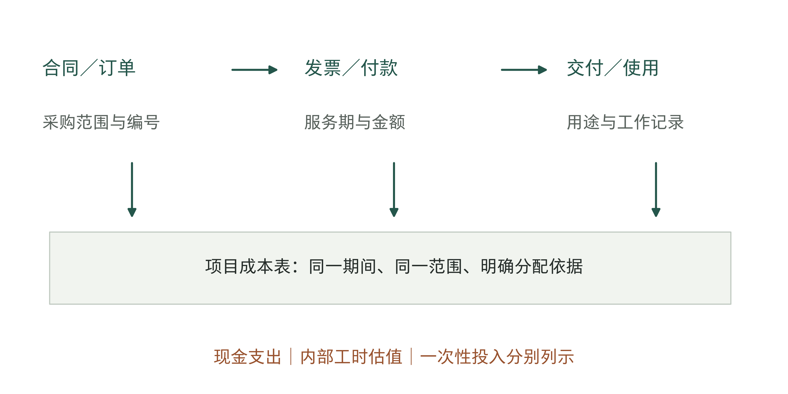

图12-12｜从总额追到可比较的成本。作者成本追踪框架。连线表示需要核对的关联，不表示现有North Somerset付款已经完成对账；共享费用保留分配依据。

分配不必追求虚假的精确。一个平台服务多个团队，如果缺少可靠使用量，就说明暂用人数或服务范围分摊，并检查换一种合理分配法会不会改变投资结论。两种分法都显示收益远小于成本，继续争论小数点意义有限；若结论高度依赖分摊方式，就应先补使用和支持记录。

经营上还有两种不同问题：过去这笔投入是否达到预期，以及从今天起继续投入是否划算。前者要把启动投入和已发生损失完整列出；后者要比较下一阶段新增成本、可避免成本和预期增量结果。已经花掉的钱不能证明应该继续，过去尚未回本也不能单独证明下一阶段一定不值得做。

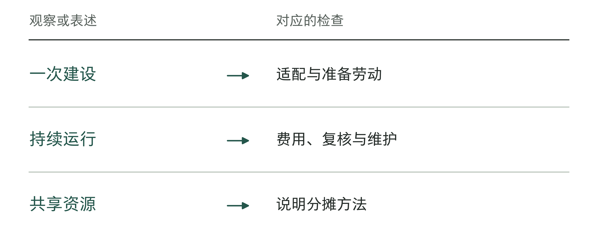

图12-13｜哪些成本应追到同一个项目。作者分析工具；成本归属不清会使项目之间失去可比性。

## 证据还不够时，怎样作决定

证据不够，不必立刻在“相信”和“停止”之间二选一。先查清缺什么，以及查清后会改变哪项决定。只有员工自报节时，就测一段完整任务；已经确认腾出了时间，却没安排后续工作，就由业务负责人决定怎样使用；支出确实减少，但质量变差，就先限制使用范围并查原因。

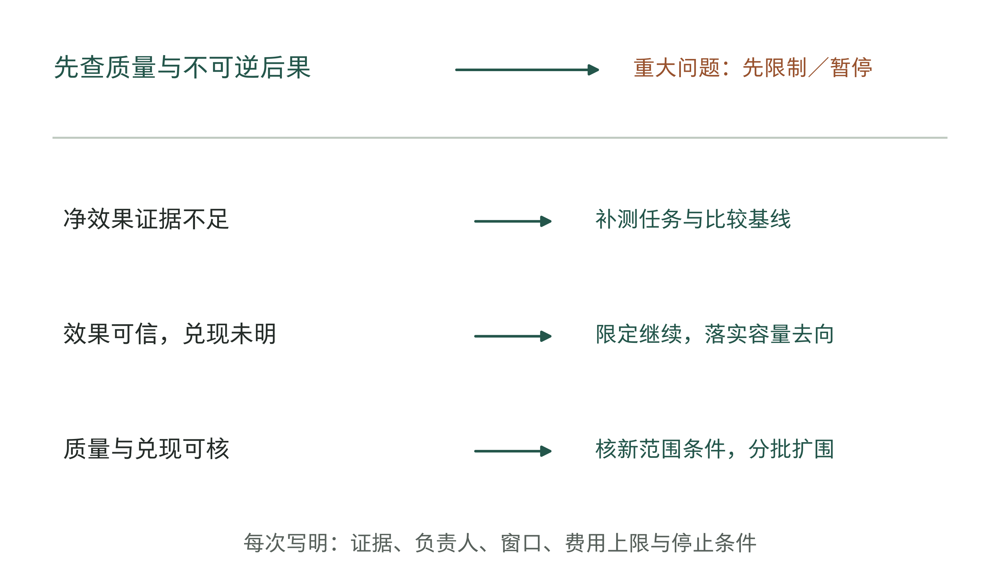

图12-14｜按缺口选择下一步。作者决策框架。严重质量问题先处理；没有重大问题时，再按缺失证据决定补测、限定继续或分批扩围。不是通用于所有项目的数值门槛。

决定继续验证时，要明确观察多久、最多花多少，以及什么情况下停止。例如，只保留一种获准任务，记录全部进入任务及最终状态；由实际接收角色检查质量，由财务核对可避免支出。这里的关键不是把试点再延长一个月，而是这一个月结束时，原来缺失的哪份证据会出现。

回到600件任务的教学账，再编一份月度报告M12-01，供负责人决定是否继续投入。为演示核验过程，再假设本月期初没有未结任务，600件符合预先纳入条件的任务全部被最终接收，其中40件曾转人工；这40件没有被移出分母。新增30小时已包含准备、复核、返工和转人工负担。教学质量记录另假设全部任务经过既定复核，未发现约定的严重错误；这些都是演练输入，不是客户实测成绩。

财务在演练中取得外购工作取消及新增费用的对应记录，因此允许把40小时替代的12,000元列为避免支出。业务负责人把余下50小时安排给既有积压，不再把它计入现金。即使这些记录成立，报告仍只能说明本轮部署安排的变化；若同期也统一了模板，没有独立对照，就不能单独给模型分配功劳。

表12-4｜月度结果与下一阶段决定（已填教学示例）

| 核验项 | 本月结论 | 对下一步的约束 |
|---|---|---|
| 对象与质量 | 600件最终接收，含40件转人工；教学设定无严重错误 | 继续保留转人工和未结任务；新范围另验 |
| 净工时 | 120−30＝90小时；40小时替代外购，50小时处理积压 | 工时与现金分列，不重复估值 |
| 现金与累计投入 | 本月12,000−7,000＝5,000元；含启动投入累计为−25,000元 | 尚未回本；六个月是上述简化假设不变时的总回收期 |
| 保持原范围 | 假设下月同类需求和外购替代仍成立，新增现金上限7,000元 | 批准30天观察，财务按实际费用复核 |
| 立即扩围 | 新团队质量、任务构成与支持费用未验证 | 本次不批准，先取得新范围证据 |
| 立即停止 | 同等工作若恢复原外购，少付7,000元但多付12,000元 | 在该假设下比保持原范围多支出5,000元；条件变了要重算 |

因此，这次教学决定是：原团队在原任务范围内再运行30天，由业务负责人负责。工具与外部支持的新增现金支出合计不超过7,000元，由财务核对；内部复核时间另记，并安排到人。每天登记任务进入、接收、转人工和未完成状态。30天后，按实际取消的外购支出和全部新增费用重算，不能预先把5,000元当作下月已取得的收益。这次批准只限上述范围，不包括第二个团队或更复杂的任务。

提前复查也写具体：出现约定的严重质量错误，先暂停受影响范围并由业务负责人接管；预计支出将超上限，先取得追加批准；外购工作没有实际减少或新增劳动明显超出原估计，财务重新核算。若已无法继续减少12,000元外购支出，就不能照抄表中“停止更贵”的结论。第13章再处理修复与退出；本章先把何种新证据会改变决定交代清楚。

真实月报还要处理跨月任务。M12-01的期初与期末未结均为零，不能把这个方便的假设带到每个月。先按唯一任务编号核对：期初未结＋本期新进入＋其他调入＝本期接收＋其他关闭或调出＋期末未结。各项使用同一范围和截止时点，每件任务按届时状态只归一类。本期开始前已关闭、本期重开的任务，若尚未纳入本期群体，单列其他调入；当期已经纳入的任务重开，只更新状态，不再加一件。撤销与调出保留理由，不充作已接收，转人工也不另算一件新任务。

另设独立教学记录M12-X1：期初10件未结，本期新进入100件，没有其他调入；本期接收90件，其中10件来自期初、80件本期新进入；另有5件撤销、期末15件未结。总量10＋100＝90＋5＋15对得上，但“本期新进入任务中，当期已接收的比例”应记80/100，不能用90/100。5件撤销仍留在进入群体记录里，并列原因，不为提高比例临时剔除。这张表解释任务去向，不能单凭接收数量计算节时或现金；跨期任务的本期劳动及支出仍按发生期间另记。

报告M12-01可按工具12-1填写，计算底稿放进工具12-2。它把“本月观察到了什么”“哪些是假设”“下月允许做什么”分开：既不因尚未回本就机械停止，也不因首月现金为正就直接扩围。

扩围则要检查条件是否仍然成立。熟练小组的结果能否用于普通员工，标准任务的结果能否用于复杂任务，专人驻场支持撤走以后是否仍有效，都需要重新观察。可以保留分批扩围、阶段复核和退出安排。扩大的是已经说明条件的工作方法，而不能只是复制上一批的收益百分比。

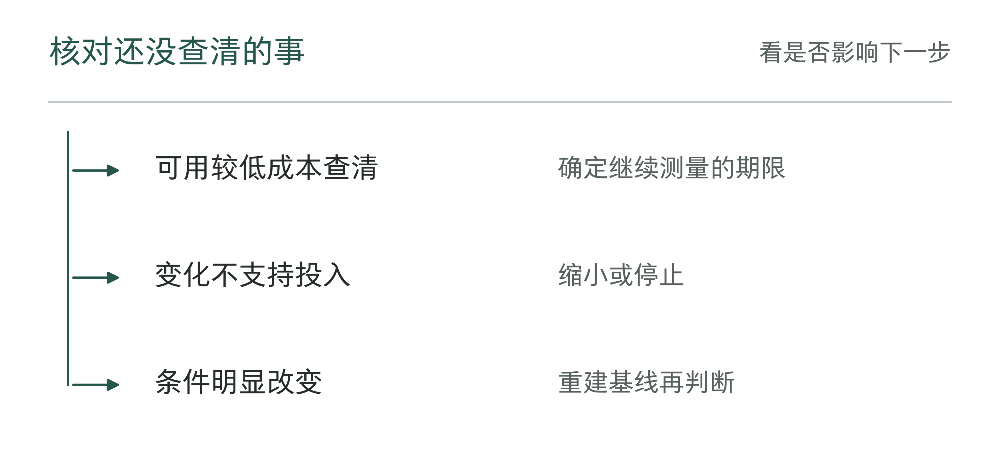

图12-15｜结果尚不确定时的资源决定。作者分析工具；没查清的事，应对应明确的核查投入和期限。

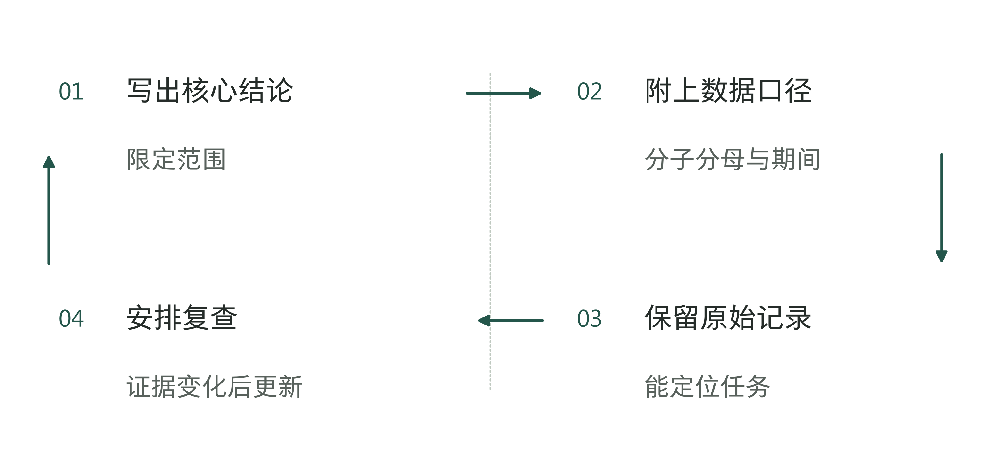

图12-16｜结果报告怎样保留可复算性。作者分析工具；复查可以修正结论，旧版本仍应可追溯。

回到North Somerset案例，目前能确认的是：买方披露了工具交付和节时情况，官方年度数据也显示服务及时性改善。但AI单独贡献了多少、使用AI后的质量怎样、项目实际净现金变化多少，现有记录还无法回答。继续核查时，应当去找这些缺少的记录。

老板最终需要的结果报告，可以从一句可复查的话开始：在什么任务、什么期间、什么质量条件下，相比哪个基线，观察到多少变化；其中多少可能来自部署，多少已兑现，下一步批准什么范围。章末工具把这些内容放在同一页上。暂时填不出的栏目，先安排人补查，不急着填成成功结论。

## 资料与说明

[1] North Somerset Council，UK7合同详情公告2025/S000-061149，2025年10月1日，第1—4页。2026年9月7日官网访问受限，依据此前保存的完整5页PDF核对。节时为买方陈述，未披露样本与独立归因；签约日不等于首次使用AI的日期。 https://www.find-tender.service.gov.uk/Notice/061149-2025

[2] Department for Education，Timeliness—assessment and EHC plans issued，2026年6月25日发布、6月30日更新，年度数据。筛选地区North Somerset和计划类别All EHC plans，并同时限定两处总体字段；下载CSV与已有归档一致。本章展示2023—2025年窗口，不表示2019年以来持续单调改善。 https://explore-education-statistics.service.gov.uk/data-catalogue/data-set/90d7c9d3-d811-46f1-ae61-39ea674d4654

[3] North Somerset，SEND Newsletter，2025年5月，第5页；S168。[简报](https://n-somerset.gov.uk/sites/default/files/2025-05/SEND%20Newsletter%20May%202025.pdf)。地方时点材料与后来年度数据存在数值差异，未查明原因，不拼接同比。

[4] HM Treasury，Magenta Book Annex A，A2.4；S318。[评估方法](https://www.gov.uk/government/publications/the-magenta-book/magenta-book-annex-a-analytical-methods-for-use-within-an-evaluation-html)。2026-09-07核查。只用于解释方法条件；本章四均值、工时及现金账均为独立教学假设，无真实客户结果含义。

[5] DfE，SEND Tribunal appeal rate，2024及2025日历年；S173。[原始CSV](https://content.explore-education-statistics.service.gov.uk/api/releases/fcf02cd2-8330-4a2c-87e7-76b684391c45/files/330e4c5f-158a-41d5-97aa-76204facc80c)。使用公布率及分母；表注披露方法调整与提取时点差异，不重构为新计划上诉概率，也不作AI因果判断。

[6] North Somerset，Quality Assurance Framework，第3、6页；S169。[质量框架](https://n-somerset.gov.uk/sites/default/files/2025-02/North%20Somerset%20quality%20assurance%20framework.pdf)。一般治理设计，不等于AI专项审计结果。
