# 第13章 面对失败：何时修复，何时暂停，何时退出

一份修订后的报告，为什么还不能让客户放心接受？

2025年9月30日，澳大利亚就业与劳资关系部（DEWR）在致德勤（Deloitte）的函件中确认收到修订报告，同时表示，接受之前还要做进一步质量检查（QA）。双方也在办理最后一期款项的退还。此前，部门要求退回97,587.11澳元，含税。[2] 报告已经改过，质量问题是否已经解决、款项如何处理，仍是不同的事情。

本案涉及Targeted Compliance Framework（TCF，针对性合规框架）的保证审查；该框架用于管理就业服务参与者履行相应义务的情况。供应商使用生成式AI整理摘要与引文，错误未被充分检出，进入了交付报告。[1] 现有材料没有说明参与者担任FDE，但所有AI实施团队都可能遇到同样的问题：交付物出了错，怎样阻止影响扩大，又保留已经验证、仍然有用的部分？

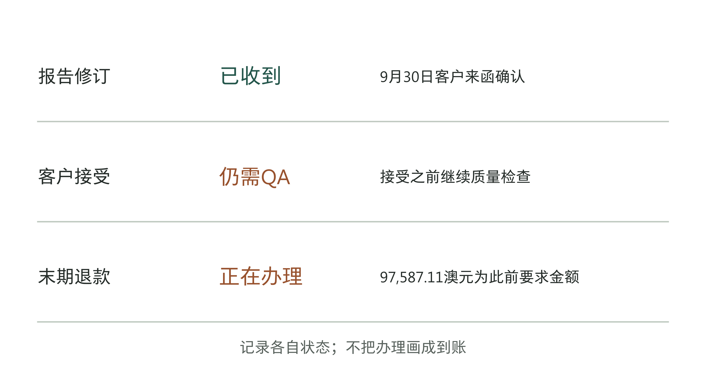

图13-1｜修订、接受与退款分别需要证据。依据DEWR与Deloitte往来函件整理。[2] 图中只标明可核实的状态；退款办理不是到账凭证，收到修订稿也不是最终接受。

第12章讨论怎样核验结果。本章继续看结果不理想时该怎么办：先查哪里出了问题，限制影响，再决定是否修复、花多少时间和钱，什么情况下退出。团队交给老板的方案，应当有明确的负责人、期限、费用和验证方法。

## 错误怎样穿过了已有复核

表13-1｜报告出错后的公开处置顺序，依据说明信与往来函件[1][2]

| 时间（2025年） | 可核实的事件 | 所处状态 |
|---|---|---|
| 7月4日 | 说明信所列原报告日期 | 原报告日期已确认 |
| 8月22日 | 媒体提出四项来源疑问 | 发现线索，进一步调查 |
| 9月上旬 | 客户要求更正及末期退款 | 提出整改与退款要求 |
| 9月26日 | 供应商提交修订说明 | 供方修订与复核声明 |
| 9月30日 | 客户继续质量检查，联系退款办理 | 尚不能据此认定结案 |
| 10月14日 | 承认复核监督未依规执行 | 对控制执行的后续说明 |

Deloitte在2025年9月2日的说明信中，将代码分析与报告发布工作分开描述。前者的工具链部署在客户的微软Azure云环境中，得到客户同意；后者又使用MyAssist和ChatGPT两种AI辅助工具进一步压缩已有的法院程序摘要，并补全、格式化引文。信中称，人员接受过负责任AI培训，输出经过复核，部分错误被纠正，仍有错误漏过。[1]

读到这里，很容易得出“控制都有了，AI还是不可靠”的结论。这个结论跳得太快。记录只说明某些复核确实发生过，并未证明复核覆盖了所有应查项目，也没有证明检查方法足以发现这些错误。到10月14日，供应商又在致客户的道歉信中承认，应有的复核和监督流程没有按要求执行。[2] 两份说明放在一起看，问题更具体了：有人检查过，与规定的检查得到充分执行，不能画等号。

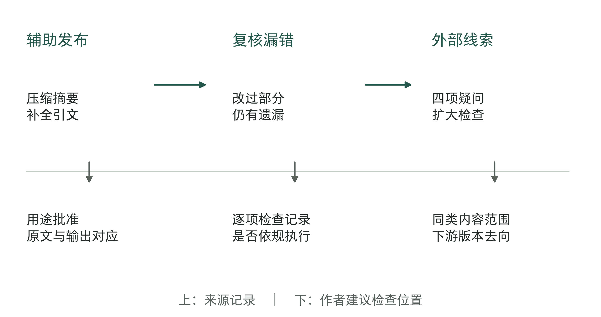

图13-2｜从辅助编辑到交付缺陷。上栏依供应商说明重构用途与发现过程；下栏为作者建议核对的控制位置。[1] 下栏不是该项目已经实施的操作记录。

生成式AI处理引文时，输出可能同时包含真实的人名、熟悉的主题和格式整齐的书目信息。只看文风和格式，未必容易发现问题。检查必须回到对应来源：文献是否存在，作者、标题、年份是否匹配，所引段落是否真正支持正文判断。这是三个逐渐深入的任务。找到一本真实的书，不能替代核对书中是否有相应论述。

对摘要也一样。摘要可能没有捏造新的专有名词，却删掉了决定适用范围的条件，或者把当事人的主张压缩成了法院的认定。复核者需要把摘要与原段落并排，检查主体、动作、条件和结论之间的关系。把原文再交给同一个模型评价“总结得是否准确”，可以提供检查线索，却不能自动补足独立证据。

私有部署在这里有明确用途：限定数据存放、访问和处理的环境。但它不能单独保证每条引文真实。类似地，培训证明人员获得过指导，无法代替一份具体交付物的检查记录。老板审阅事故复盘时，可以把“我们使用了合规工具”“员工都参加了培训”留在背景部分，再追问本次错误对应的检查项目、检查人和留下的证据。

还应检查批准是否覆盖实际用途。客户同意一种代码分析工具链，并不能被解释成其他摘要、编辑和发布用途也自动得到同意。DEWR后续函件就要求供应商进一步说明这些工具和用途。[2] 对实施团队，批准记录至少应能回答：处理什么材料、做什么操作、输出进入哪一步、由谁接受。只登记软件名称，容易在用途逐步增加时丢失边界。

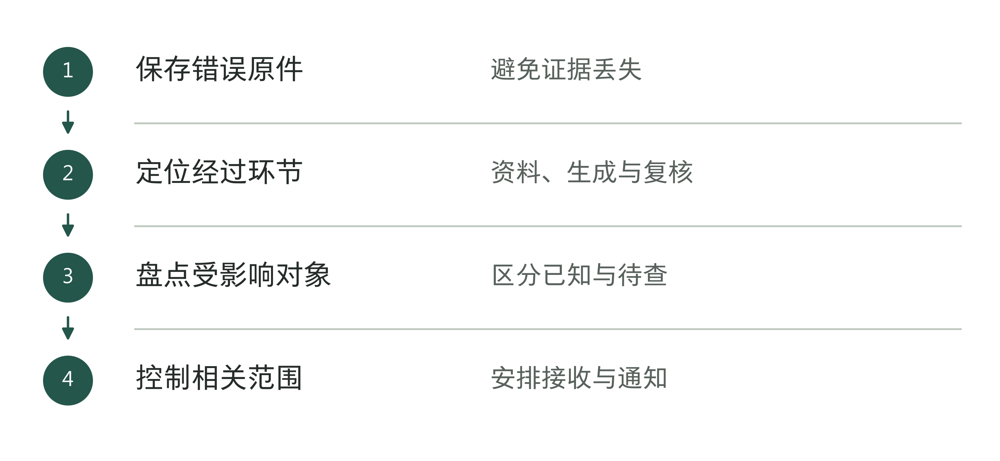

图13-3｜从发现错误到控制影响。作者分析工具；先明确已知影响，不提前宣布全部有效或无效。

## 从一个错误扩大检查，但不要先宣布全部无效

供应商说明信记载，8月22日媒体提出四项学术来源疑问，进一步调查发现生成式AI导致的不准确输出，随后扩大复核又发现其他错误。[1] 四项是调查的起点，不能写成报告错误总数。这段经过提示了一种有用的处理方式：把已确认的错误当作寻找同类问题的线索。

扩大检查需要一个边界。若同一工具处理了整章引文，只更正被指出的四条显然不足；若某张数据表来自另一套可追溯流程，也不能仅因同处一本报告，就直接宣布数据全部失效。先按共同生成条件划出可能受影响的集合，再核实其中哪些内容被使用、复制或转交。

可以从错误所在位置向两个方向追踪。向上找原始材料、提示、工具版本、操作者与复核记录；向下找交付版本、接收者，以及依赖该内容的判断。向上查有助于找原因，向下查有助于决定通知和补救范围。只做前者，团队可能写出一份技术复盘，却漏掉已经使用旧报告的人。

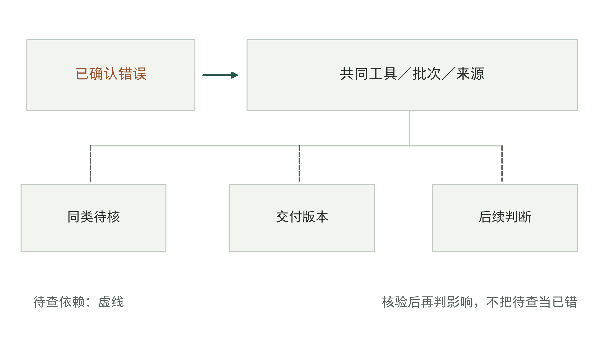

图13-4｜沿共同来源与下游用途界定检查范围。作者方法示意。虚线表示待查依赖，实线表示已识别的关系；不以连线推定所有对象已经出错。

调查记录最好把三种状态分开：已确认错误、同类待核、已核无该类问题。“尚未发现错误”需要注明查了什么，不能直接改成“没有影响”。临时不能完成全量核对时，可以先停止可疑版本继续外发，保留已经验证的部分，同时告知使用者哪些结论暂不应依赖。

这里的控制要考虑业务能否承受。暂停一个报告的发布，与关闭整个业务系统的影响不同；停用自动提交，保留人工起草，可能足以限制当前风险。若错误正在影响不可逆的决定，等待完整根因报告再采取动作就太晚。先限制具体高风险操作，再查清范围，是对信息不足的回应，不要求先证明整个系统已经失败。

处置过程中要保留原始输出和版本。直接覆盖错误文件，虽然让目录看起来干净，却可能切断后续核验。保留哪些记录、保存多久、谁可访问，应按项目现有要求处理；不要为了调查另行扩散敏感材料。面向使用者的更正则需要能找到旧版本的接收者，并说明变更影响，而不只是发出一个没有上下文的新附件。

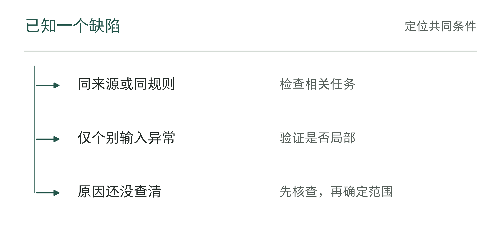

图13-5｜扩大检查范围的依据。作者分析工具；检查范围跟随共同原因线索调整。

表13-2｜受影响任务的盘点字段（作者检查工具）

| 字段 | 为什么保留 |
|---|---|
| 任务与版本 | 找出共同触发条件 |
| 执行到哪一步 | 区分建议、写入与下游动作 |
| 当前接收者 | 安排后续处理，不让任务悬空 |
| 已知与待查 | 避免过早扩大或缩小影响范围 |

## 暂停之前，先说清暂停什么

“项目没有按时上线”与“模型已经产生错误”需要不同的处置。科罗拉多大学2026年3月19日的联合公告，把学生访问ChatGPT Edu的安排推迟至8月14日，同时保留教职工3月31日的原定安排。公告提到教师对学习环境的顾虑和课堂自主权。[3] 这支持一项按人群调整的治理安排，不能写成技术故障，也不能说所有用户都被推迟。

企业也可以按工作范围处置。财务部门可能继续用AI整理内部材料，同时暂停向外部提交；客服系统可以继续检索，暂停自动承诺；总部可以保留已完成授权的流程，暂缓需要地方部门确认的场景。这些是作者提出的处置示例。它们共同要求暂停决定能够落到具体的功能、人员和权限上。

表13-3｜先辨认失败对象，再选择检查方向，作者建议

| 观察到的问题 | 先核对什么 | 可能的第一步 | 不能直接推出 |
|---|---|---|---|
| 输出有错 | 原文、版本、下游使用 | 限制受影响输出，扩大核查 | 全部结果都无效 |
| 复核漏错 | 检查项目、证据、执行人 | 重做检查并修复复核流程 | 培训即可解决 |
| 上线延期 | 哪类用户、哪项批准未完成 | 调整范围和批准安排 | 技术已经失败 |
| 员工长期很少使用 | 真实任务、替代流程、额外负担 | 查任务适配与工作安排 | 员工拒绝改变 |
| 效果未证实 | 基线、分母、成本与观察期 | 限期补测并控制投入 | 已证明没有价值 |

先分清问题，才能决定接下来的钱和人手用在哪里。缺少授权，增加模型测试未必有用；复核太慢导致员工不用，继续培训也可能只是让更多人了解一个难用的流程。团队应先说明当前最需要解决的障碍，以及查到什么、改好什么，才有理由继续。

多个问题可以同时存在。输出质量不稳定可能增加复核负担，让员工更不愿使用；使用量不足，又让可供检验的任务样本变少。此时无需争论只能归入哪一类，应先处理可能扩大损害的部分，再追踪其他条件。分类表用于安排调查和责任，不是给复杂项目贴一个永久标签。

暂停还需要复查日期和负责人。没有期限的“暂缓观察”，容易让费用继续发生，业务部门却以为项目已经停止。暂停决定应写明保留什么能力、继续发生哪些费用、谁负责补充核查，以及到期后由谁决定恢复或退出。不能确定恢复条件时，至少应说明下一次要消除哪项不确定性。

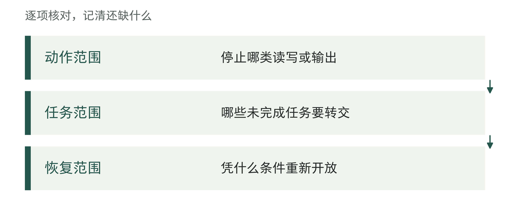

图13-6｜暂停决定需要写清的层次。作者分析工具；暂停不能只留下一个没有边界的状态标签。

## 修复是否值得，要比较从今天起的选择

过去花掉的钱值得复盘，却不能自动构成继续花钱的理由。决定修复时，要把仍可选择的几条路径放在同一张未来费用表上：限定范围继续、暂停后修复、转回人工，或更换方案。各路径要服务于可比较的业务量和质量要求，否则“便宜”可能只是因为少做了工作。

下面是一笔教学账，金额单位为人民币万元，不是Deloitte项目费用。假设未来12周必须处理同一批业务。转回人工需要12万元；修复方案需要一次性修复6万元、后续运行3万元，并为12周结束时的退出准备保留1万元，合计10万元。此前已经投入的20万元单列，不重复加进某一个选择。

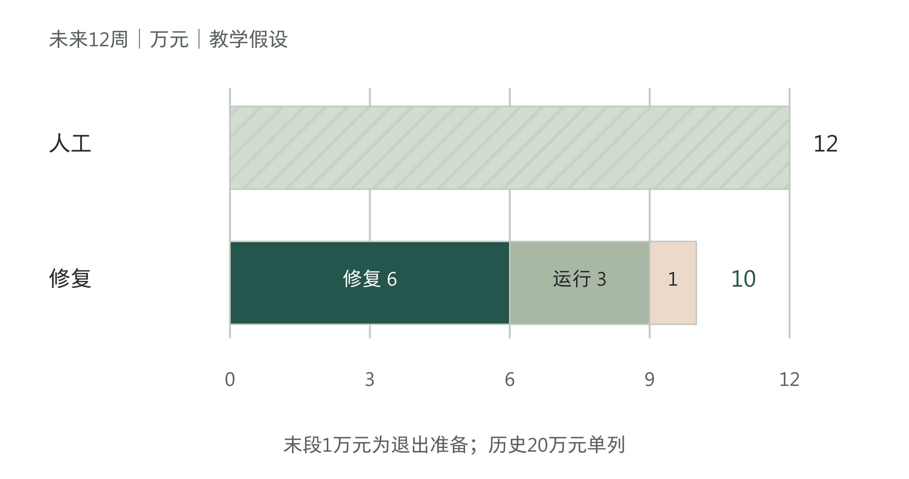

图13-7｜按同一期间比较修复与人工方案。教学假设，未来12周、同等业务量与质量目标，单位：万元。修复路径6＋3＋1＝10；历史20万元不进入未来支出柱。仅比较已列费用，不代表完整投资估值。

在这组假设下，修复路径的所列费用少2万元。这2万元的余地并不大：若修复额外花3万元，总额变成13万元，就高于人工路径。更关键的是，团队能否在需要交付业务之前完成修复？修复期间谁承接任务？如果这些负担没有包含在6万元的估计中，原表就少算了成本，需要重列。

因此，费用比较必须带一份估计说明。修复6万元覆盖哪些工作，谁给出的估计，有没有验证所需的时间和资源？运行3万元是否包含人工复核及失败转人工？保留的1万元是不是足以完成交接？如果它只是一笔暂列预算，应明确标为待验证，不能用精确小数制造确定感。

表13-4｜同一教学账中，修复超支怎样改变选择

| 修复额外支出 | 修复路径总额 | 人工路径总额 | 仅按所列费用比较 |
|---|---:|---:|---|
| 0万元 | 10万元 | 12万元 | 修复少2万元 |
| 2万元 | 12万元 | 12万元 | 持平 |
| 3万元 | 13万元 | 12万元 | 修复多1万元 |

这张表没有给各情景编造概率，也没有把声誉损失折成一个随意的金额。对难以可靠估价的后果，应单独写出业务约束：不能继续错误外发、不能超过服务截止日、不能失去关键记录等。某条路径无法满足这些要求，即使名义费用较低，也不应据此放行。

已经发生的20万元，仍要进入项目总账和复盘。它帮助企业判断最初选择哪里有偏差、哪项成本估计遗漏，以及同类项目是否应调整。但从今天起比较选择时，不能因“已经投了20万，再花6万就能救回来”而忽略其他费用和失败可能。相反，已经形成且可继续使用的资产，应按各路径的实际用途处理；尚未支付、可避免的合同义务也不能一概算成沉没成本。

退款同样需要保守登记。供应商愿意讨论退费，可能改善谈判前景，却不能直接抵减修复预算。先记录要求、对方回应、办理和实际收款；只有取得对应证据后，才按适当口径进入财务记录。章内教学账不预设退款收入，避免用一笔尚未确认的回款把修复方案算得更便宜。

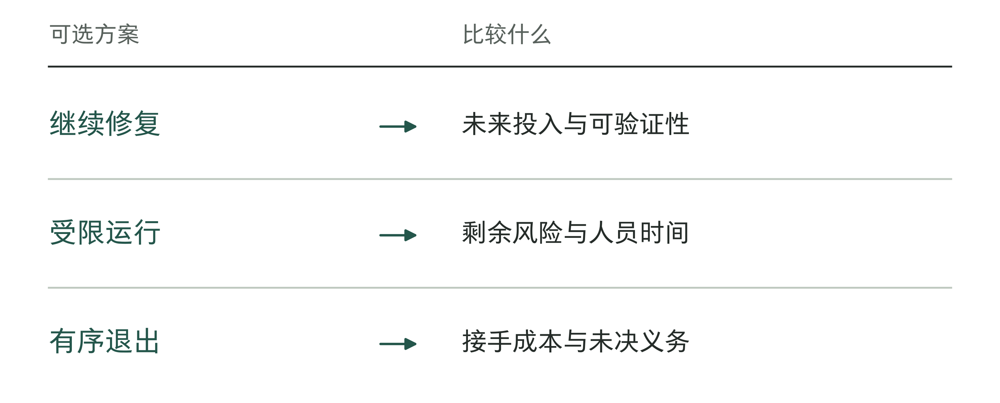

图13-8｜从今天起比较三个选项。作者分析工具；已经花掉的成本记录在历史账，不替代未来比较。

表13-5｜未来选项比较底稿（作者检查工具）

| 选项 | 新增投入 | 必须验证的条件 |
|---|---|---|
| 修复后恢复 | 本轮修复与复验资源 | 缺陷消除且正常任务仍可完成 |
| 受限继续 | 控制与人工接管劳动 | 风险可控，人员有时间处理 |
| 有序退出 | 接手与义务处理投入 | 未完成的任务和资料有人接手 |

把这组选择写成教学决定D13-01：先暂停有缺陷的对外发送功能，业务主管负责尚未完成的任务；交付负责人在10个工作日内提交修复版v0.2，以及原失败任务和新任务的复测记录。修复与验证的现金上限为6万元；未来12周的运行及人工支持为3万元，退出移交预留1万元，仍按合计10万元核对。

第10个工作日，由业务和技术负责人分别确认是否可以恢复限定范围。验证未通过，业务继续由人工处理，不因已经花了20万元就自动延长修复期。预计修复费超过6万元时，先重新与人工方案的12万元比较，再决定是否追加。旧版输出、受影响任务和处理结果都要保留。技术版本恢复后，业务主管还须核对旧输出造成的影响是否已经处理，不能只签一份“恢复完成”。

## 恢复需要证明两件事

修好已知错误，是恢复的必要工作；还要验证让错误穿过的流程是否改变。若只改正文而没有改复核方式，下一份相似交付可能重走旧路。若只改流程而不追查已外发内容，使用者仍可能依赖错误的旧内容。

在Deloitte案例中，供应商9月26日提交修订并维持其报告结论，客户9月30日仍表示要在接受前进一步检查。[2] 供方的修订声明与客户的接受决定，是两个主体作出的不同判断。客户有理由索取足以支持接受的材料；供应商则需要说明修了哪里、为何这样修、对其他结论有何影响。

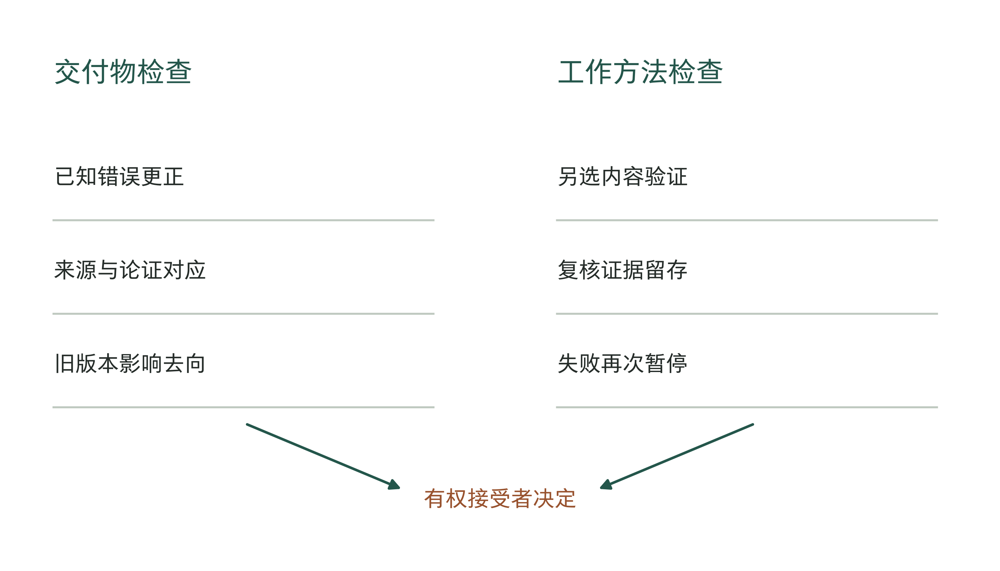

图13-9｜已知错误和复核流程分别验证。作者建议的恢复验证分工。左路检查交付物，右路检查工作方法，最后由有权接受的一方作出决定；不是客户实际验收步骤的还原。

对于引文问题，交付物检查可以包括更正清单、来源对应和受影响论证的重新审读。工作方法检查则需要另选未用于修复的内容，观察新的流程是否能找到问题，是否留下有效依据。若仍由原团队参与复核，要清楚区分制作、检查和接受的职责，并保留交叉核查安排；不能只在报告标题上加“独立”二字。

这里的独立首先是判断不被原先结论锁住。可以由未参与制作且具备相应能力的人检查关键部分，也可以按风险请外部人员复核。但外部身份本身不是充分条件，仍要看他们获得了什么资料、采用什么检查方法。案例中的一轮复核由供应商首席风险官领导，不应被改写成外部第三方已验证。[2]

恢复条件最好在重新测试前确定。比如明确哪些交付项必须逐条回到原件、哪些失败会重新触发暂停、需要观察哪一批真实任务。这些条件按业务风险制定，不套一个通用“正确率达到某百分比”。少数错误若集中在不能容忍的类别，总平均再好也不足以恢复相关功能。

恢复也可以分步。先在受控范围验证，再开放低风险操作，保留人工接管和监测；到下一观察点再决定是否扩大。每一步都说明范围和停止触发条件。若验证仍失败，不能无限改写原来的通过标准，直到项目勉强过关。新的事实可以促成新标准，但修改理由和接受人必须留下记录。

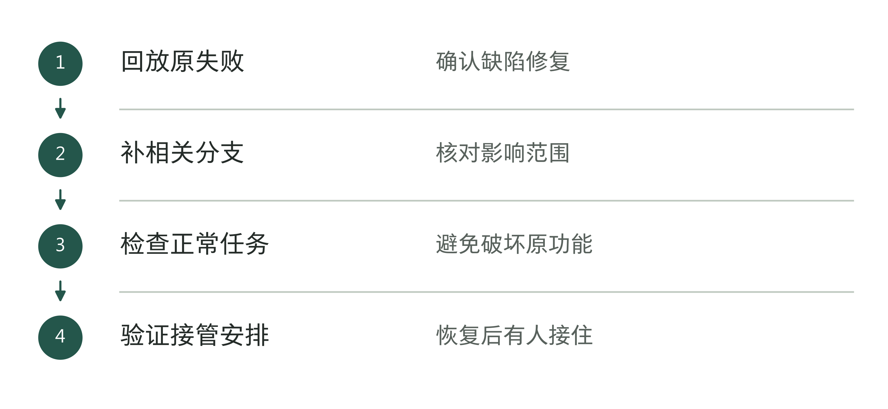

图13-10｜恢复运行的两次验证。作者分析工具；修好一个样本与恢复整体运行是不同判断。

## 退出也有交付物

有些问题能修，却不值得在当前时间和成本条件下继续修。已经错过业务需要的时间、所需数据无法取得，或者保留系统的负担长期高于替代路径，都可能让退出成为合理选择。这些是需要项目证据支持的判断，不意味着AI在其他范围没有价值。

退出决定应说明停止哪个项目或功能，业务由谁承接，以及哪些义务仍需处理。第7章讨论了合同中怎样提前约定退出；到实际执行时，要核实约定变成了哪些动作。发出终止通知、完成交接、撤销访问和完成费用结算，不能共用一个“已结束”状态。

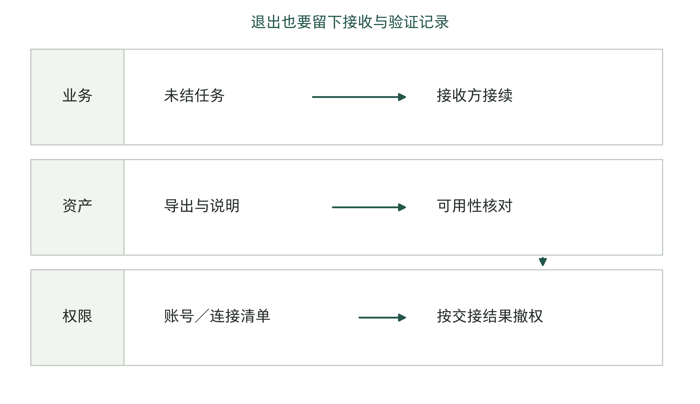

图13-11｜退出时，业务、资产与权限分别移交。作者设计的退出交接流程。先确认接收与业务连续性，再完成相应权限处置；具体顺序需结合合同、记录保存和系统依赖。

业务交接先处理未结任务。哪些已经交付但尚未接受，哪些必须补做，哪些需要通知使用者？接收方要能辨认这些状态，并取得继续处理所需的资料。一个写着“数据已导出”的文件夹，不等于可用的交接：还应核对格式、字段解释、版本和必要的来源关联。

技术退出则要逐项处理账号、访问令牌、连接、定时任务和外部依赖。访问令牌是供系统验证身份或访问权限的凭据。某个界面不再使用，不代表后台调用已经停止。撤权也要与交接协调，避免先关掉唯一的导出通道。处置记录说明谁接收、谁验证、哪些访问保留及其理由；数据保存和删除按已经适用的要求执行，不能简单以“全部删掉”代表完成。

退出时要分别清点费用和可保留的成果。费用清单列明哪些尚未支付、仍有争议、已经退回，以及哪些还会继续发生。成果清单则列出可以合法继续使用的接口、流程说明、测试材料和经验。这些成果以后可能有用，但未经后续验证，不能把预计复用价值记成已经取得的收益。

对老板而言，退出验收最有用的证据，是接收方确实能够接着工作，已知问题有明确去向，残留费用和权限有人负责。只有一个“项目关闭”的签字，无法回答这些问题。第1章所讨论的试点退役也提醒我们，停止一项应用不能被扩大解释为整个机构放弃AI。

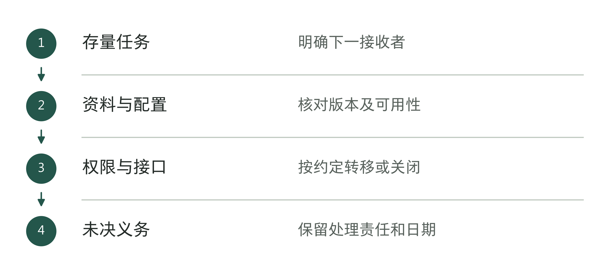

图13-12｜退出时先交接什么。作者分析工具；退出完成以实际接手与义务安排为依据。

## 让一次失败改变下一次决策

事故复盘的结尾常写“加强培训、完善流程”。下一次预算会上，这些话很难帮助人们识别相同问题。更有效的结尾应说明一条具体条件怎样改变了：以后哪些交付必须附原件对应，哪个用途变更需要重新确认，谁有权在什么情况下暂停外发。

项目组合层面，还要查错误是否可能跨项目重复。若多个项目共用同一个引文处理环节，当前问题就值得触发对应检查；若只是行业标签相同，不能直接推断其他项目也有相同缺陷。扩大管理动作的依据，应是共同的工具、数据、流程或责任安排，而不是对AI的笼统乐观或悲观。

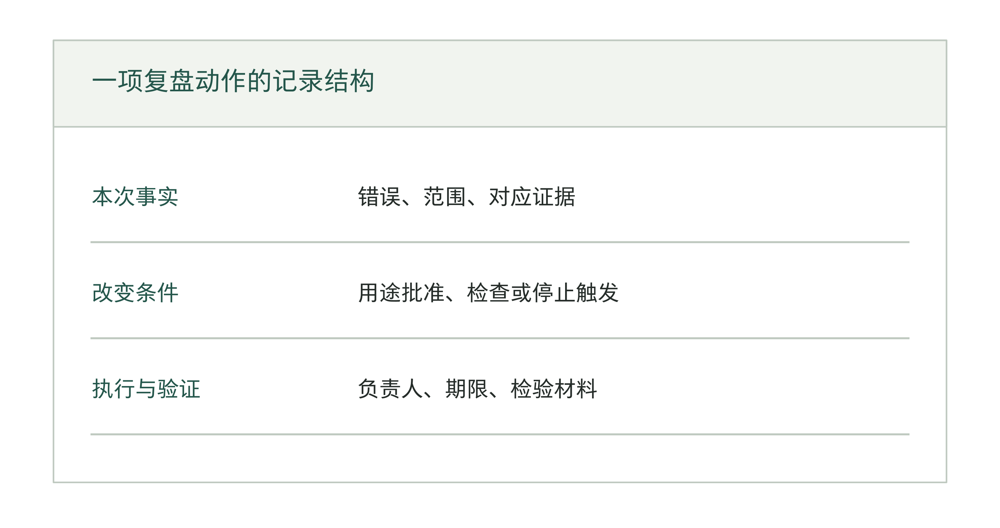

图13-13｜把复盘结论变成下一次可查的条件。作者设计的复盘记录结构。区分本次事实、判断依据和后续动作；没有填写证据编号的事项仍是待办。

同时管理多个项目时，还要看继续等待会影响谁。几个项目可能共用一批工程师和业务骨干，一个项目多修两周，另一个项目的测试就可能推迟。因此，追加方案除了费用，还要写明占用哪些人的时间、哪些工作因此延后。暂时算不出金额，也可以先列出受影响的任务和日期。

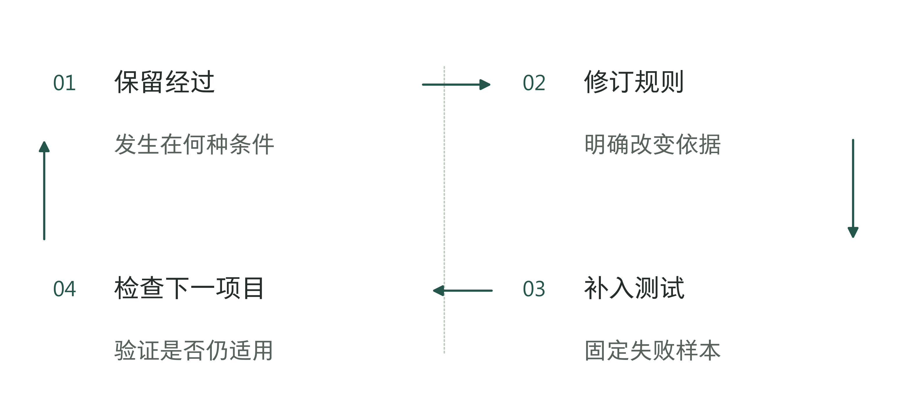

图13-14｜让失败进入下一次决策。作者分析工具；复盘产物应改变规则、测试或责任中的具体一项。

表13-6｜复盘结论进入哪里（作者检查工具）

| 发现 | 应改变的正式产物 |
|---|---|
| 资料或规则有误 | 资料版本、适用条件与批准记录 |
| 测试漏掉分支 | 回归样本及判定说明 |
| 交接没有完成 | 接收标准、演练和升级路径 |
| 预算忽略支持 | 持续成本和人员安排 |

章末工作表用于一次具体处置讨论。先填已确认事实与受影响范围，再比较可行路径，最后写决定、费用上限、复查日期和接受人。不要先选“继续”或“退出”，再反向搜集支持材料。也不必等所有疑问清零才采取临时措施；先把不可继续扩大的风险限制住，其余问题按约定时间继续核查。

项目出现错误以后，老板最需要看到的，是团队能否准确说出哪里有问题、什么尚未查清，以及下一步如何接受检验。修复、暂停和退出都可能是合适选择。将每条路径写成可以检查的责任与交付物，才能让一次失败真正改变后续投入。下一章讨论怎样把已经验证的做法交给其他人，并用到下一个项目中。

## 资料与说明

[1] Deloitte，2025年9月2日致澳大利亚财政部说明信，FOI 25-26-084 Document 1，第2—3页。代码分析获批、发布用途、培训和部分复核等为供应商陈述。[官方公开PDF](https://www.finance.gov.au/sites/default/files/foi-25-26-084-document-1.pdf)。来源S140。

[2] DEWR与Deloitte，TCF Assurance Review往来函件，议会公开PDF，共11页，重点第6—11页。退款要求函落款与目录日期相差一天，正文因此写“9月上旬”。所核函件不能单独证明款项到账、最终接受或合同终止；退款听证原文尚未补齐，不采用实际到账日期及退款占合同金额的比例。 https://www.aph.gov.au/-/media/Estimates/eet/supp2526/TCF_Assurance_Review_-_correspondence_between_Deloitte_and_DEWR.pdf

[3] CU President and campus Chancellors，Update on planned ChatGPT Edu launch，2026年3月19日。[校方联合公告](https://www.cuanschutz.edu/chancellor/messages/communiques/update-on-planned-chatgpt-edu-launch-3-19-26)。来源S319。记录当时分人群安排，不证明实际上线结果。

章内方法、教学账和工具为作者设计，不代表Deloitte或科罗拉多大学的实际内部操作、财务结果或特定法域法律意见。资料核查时点为2026年9月7日；本章注2所引材料使用此前保存的有效原件核对。
