# 第14章 复制能力：让下一次交付不再从零开始

交付文件夹里有代码、操作说明、测试结果，还有一段从头到尾运行成功的录像。第二支团队照着说明装好系统，第一份新材料却让它给出了错误的待补清单。

下面是一项虚构的维修受理演练，用来检验交付能力怎样迁移。甲团队原先为直营服务站A制作了材料核对组件：读取申请与附件，找出受理所需材料，起草一份内部待补清单，由受理员确认。组件不诊断设备，不决定保修资格，也不自动向客户发信。现在，乙团队要把它用于渠道服务站B，承担相同层次的工作。假设本次返修受理要求核对上一次维修的完工材料，两站都需要确认这一点。

两边材料都出现“签收日期”。A站的表单把这个字段用于客户完工签认，B站的物流单却用它记录设备到仓。乙团队沿用原字段映射，组件便把一张到仓签收单当成完工证明，漏列了真正需要补交的材料。文件读出来了，日期也没抄错，系统却误解了这个日期代表的业务事件。

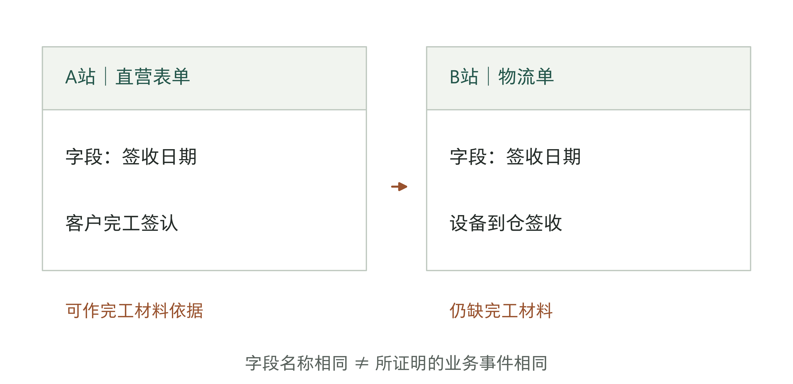

图14-1｜同名字段背后的工作已经变了。虚构教学场景。相同字段名连接不同事件，沿用旧映射会改变材料核对结论；图中不涉及真实企业的维修或保修规则。

第13章结束时，我们已经知道项目应留下可以继续使用的成果，以及有适用条件的经验。本章再往前走一步：这些产物换了使用者和工作条件，还能支持交付吗？老板需要据此决定，下一项目可以从哪里接着做，哪些工作还要重新做。

## 文件交齐了，下一团队就能用吗

乙团队遇到的问题，不能靠再录一遍操作视频解决。视频能演示点击顺序，却未必解释A站为何把一个签收字段视为完工证据。原作者可能早已熟悉这个背景，从未意识到它也是组件的输入条件。对他而言显而易见的关系，恰好是使用团队最需要知道的部分。

本书把能用于后续项目的组件、测试方法、配置模板和故障排查办法，统称为“交付资产”。整理这些成果时，要同时写清适用条件、使用方法和维护负责人。别的团队还没用过、没验证过的，先记为候选，不能只因为放进公共目录就认定可以复用。

资产也不宜按文件夹大小划分。把整个A站项目打包，乙团队必须从客户专属内容里重新寻找公共部分；拆得过细，只留下一个字段读取函数，又可能把必须一起使用的规则和测试拆散。合适的单元应围绕一个能独立解释、验证和维护的用途。本例可以留下“按已确认材料目录核对缺项”的组件，而将直营站的完工定义与字段映射作为单独配置。

整理时要追溯组件使用了什么。读取规则依赖哪个文档格式，材料目录由谁确认，测试样本来自什么范围，输出交给哪个角色？所谓“可配置”，应当意味着使用团队能找到配置位置、理解其含义，并验证改动后的行为。若每次改一个站点名称，都必须请原作者进入代码查隐藏分支，这部分还没有真正成为可配置资产。

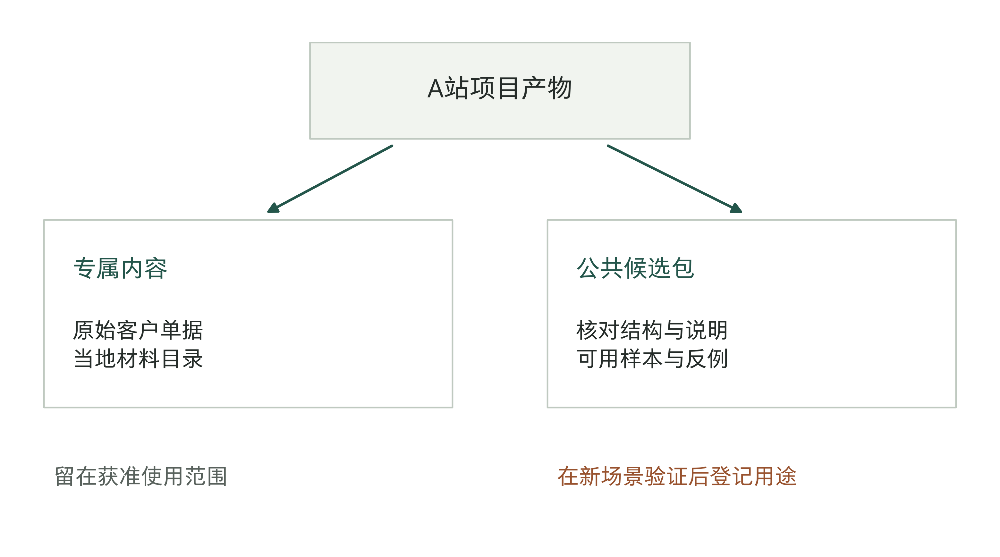

图14-2｜从项目产物中分出可复用的部分。作者绘制的项目成果分类与依赖图。连线表示依赖或派生关系；原始客户材料留在获准范围内，公共候选包保留结构、说明与经过处理的验证材料。

原始材料能否移出项目，是另一项独立判断。可以抽象出“同名字段不等义”的反例结构，不等于可以把客户单据直接放进公共测试库。即使换了姓名，业务条款、系统标识或附件内容仍可能受使用范围限制。复用包应标出哪些材料可提供，哪些只能在原环境检查；必要时制作明确标注的合成样本，并保留它不能代表真实任务分布的说明。

从失败项目中也能筛出有用部分，但要写清保留理由。字段读取经过验证，材料解释却失败，可以保留读取方法，把失败条件加入反例；不能给整个包盖上“已验证”的章。相反，一项高度专属的做法即使很好，也可能只值得留在原客户环境。没有第二个合理用途时，继续投入抽象和维护，未必比下次按具体要求重新实现更合适。

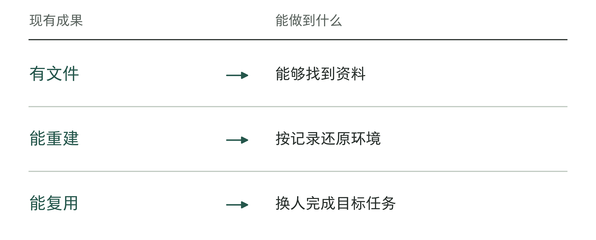

图14-3｜文件交齐和资产可用怎样区分。作者分析工具；三个状态各自需要验证记录。

## 把适用条件写具体，才能看出哪里不适用

“适用于售后服务”太宽，无法帮助乙团队判断B站能否复用。更有用的说明是：读取哪些格式的申请，按哪份已确认材料目录检查，哪些字段可以作为什么事件的证据，输出只到内部待补清单；材料含义冲突时保持未决，由指定受理员确认。读者拿到这些条件，才能找到不符合之处。

这些条件共同限定了资产的适用范围：能处理什么任务和资料，依据哪些规则，由哪些人使用，对应哪个版本。条件要具体到可以拿一张单据核对；遇到不符合的情形，就重新验证。不能笼统宣称“通用”，出问题后又一概归因于客户特殊。

表14-1｜A站产物迁往B站时，五类内容分别处理，作者设计

| 内容 | 可以带走什么 | 在B站还要做什么 |
|---|---|---|
| 材料缺项检查结构 | 检查步骤与输出格式 | 核对B站材料目录和结束状态 |
| 字段映射与规则 | 原配置及选择理由 | 重配字段含义，确认适用依据 |
| 旧样本与测试方法 | 样本结构、反例、判定依据 | 增补B站新材料，校准预期结果 |
| 旧分数与放行决定 | 原范围的历史记录 | 形成新范围证据与新接受决定 |
| 账号及访问安排 | 角色需求说明 | 按B站实际安排取得访问和批准 |

迁移节省的应是重新发现方法、重复编写结构的劳动。它不会让B站凭空拥有A站的业务前提。表中第三行尤其容易被误用：旧测试可以帮助找到过去出过的问题，却不能证明新材料没有新的问题。用同一批旧单据再跑一遍，只证明变化后仍能处理那些单据，回答不了渠道签收与完工签认的差别。

乙团队需要找B站尚未用于调试的材料，让业务接收者先说明正确的处理结果。有些材料应列出缺项，有些已经完整，还有些单据彼此冲突，必须保留未决。组件若把所有冲突都改成“材料齐全”，即使清单看起来更短，也没有完成职责。这里可以复用判定思路，具体应补什么、由谁接受，仍取决于B站工作。

适用范围还能帮助拒绝不合适的迁移。假设C站希望把同一组件直接用于决定保修资格。这个任务的结束状态、依据和后果都改变了，不能只给旧组件加一个“是否保修”字段就算扩展完成。可以继承部分材料读取能力，但保修判断应另行定义和验证。在资产目录里保留“未覆盖保修决定”，比模糊写成“支持维修全流程”更能节省下一团队的试错。

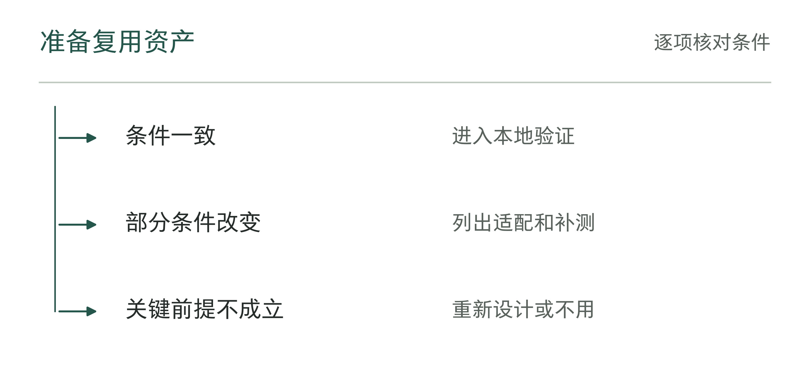

图14-4｜下一场景是否落在适用范围内。作者分析工具；“相似客户”不能替代逐项条件核对。

表14-2｜检查是否存在不适用的情形（作者检查工具）

| 声称可复用的条件 | 寻找的反例 |
|---|---|
| 资料结构相同 | 字段缺失、版本差异和对象定义不同 |
| 业务规则相近 | 批准边界、例外和结束状态不同 |
| 环境兼容 | 权限、接口和依赖版本不一致 |

## 先换人，再换场景，才知道卡在哪里

如果乙团队第一次接触组件，就同时换客户、换模型、换接口，最后遇到错误，很难知道问题来自哪里。为了定位依赖，可以先让乙团队在获准的A站验证环境中，处理未用于教学演示的一组材料。这个环节检查说明与产物能否支持换人复用，随后再把条件逐项迁到B站。最终仍须验证乙团队在B站的实际目标组合；拆开诊断不能替代最后这一关。

原作者可以提供支持，但每次介入都应留痕。解释公开说明中的术语，与临时补写一段从未记录的规则，不是同一种帮助；回答环境安装问题，与替乙团队完成关键设计，也不相同。只有记录支持内容，才能判断应补文档、改资产，还是承认这次仍依赖原作者的专属劳动。

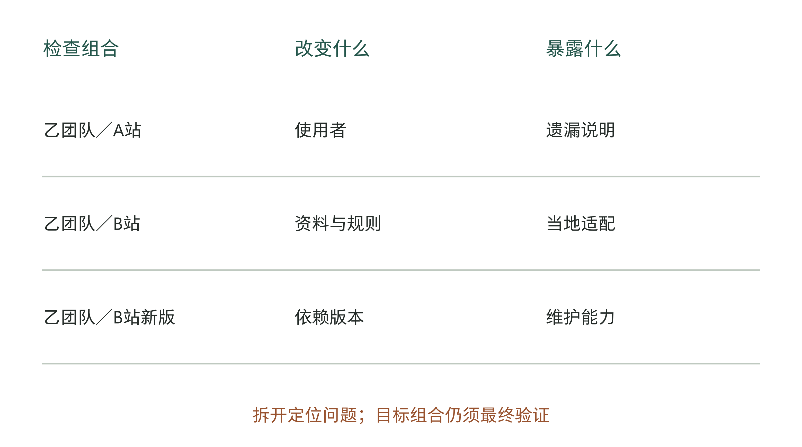

图14-5｜三种变化分别暴露不同依赖。作者验证方案。逐步改变条件用于定位问题，最后检查目标组合；连线表示检查顺序，不表示必然通过或统一认证等级。

在这项教学演练中，可以安排乙团队先按说明运行，再处理一份含冲突附件的材料，最后说明自己会在什么情况下停止核对。若他们必须询问原作者才知道何时应停下，资产说明就遗漏了重要条件。补齐后应换一组材料再检验，而不是把原作者现场带做的那一遍直接登记为独立完成。

这里的“独立”不等于断开所有帮助。真实交付本来就会使用平台支持、同事复核和业务解释。验收前应写清允许使用哪些支持、哪些决定必须由复用团队完成，再按这一安排观察。完全不许求助，可能把测试变成记忆考试；无限允许原作者代做，又会把能力仍集中在一人身上的事实藏起来。

表14-3｜一份迁移记录怎样改变结论，以下均为教学设计

| 检查 | 观察到什么 | 对资产的处理 |
|---|---|---|
| 乙在A站环境复用 | 原作者补讲了一条未写出的映射理由 | 补说明，换新材料复验 |
| 乙迁往B站 | 到仓签收被误当完工签认 | 撤下该映射，重配并增补反例 |
| B站新材料复验 | 正确列缺项，冲突留给受理员 | 可形成限于该范围的接受记录 |
| C站要求决定保修 | 任务后果超出原用途 | 仅保留读取部分，另立判断任务 |

不能只报告“迁移成功一次”。记录还应包含资产版本、使用团队先前经验、材料范围、失败与未决项、原作者介入，以及接受人认可的用途。乙团队可能本来就熟悉B站系统，材料也可能恰好只覆盖简单业务。把这些条件留下，下一支团队才知道自己的起点与本次相差多远。

如果同时评估省工，还需要说明比较依据。原项目较慢，可能因为第一次要取得资料、建立规则和等待确认；第二次较快，可能因为业务已经准备好，而非组件本身减少了同等劳动。能够完成迁移是一种可用性证据；能够合理归因节省了多少，是更强的效果判断。没有可比记录时，先报实际工作与支持用时，不用一个漂亮的下降百分比代替解释。

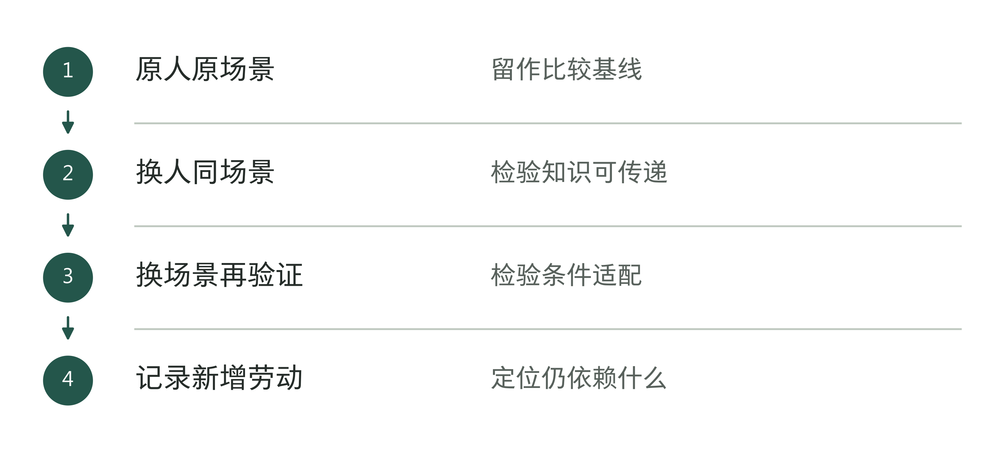

图14-6｜怎样分开检验人员与场景依赖。作者分析工具；一次同时改变太多条件，会难以解释失败来源。

## 升级会暴露另一种依赖

乙团队在B站完成一次复用，仍没有回答下次版本变化会怎样。假设文档读取组件升级后，把多页表单的字段合并方式改了：同名字段只保留最后出现的值。安装能成功，旧的单页样本也能通过，但含两次签收记录的附件可能丢掉事件对应。这里变化的是读取行为，受影响的却是后面的材料判断。

维护者需要从变更点沿依赖往下查。哪些字段映射依赖原来的合并方式，哪些测试含多页重复字段，哪些部署仍使用旧版？这张依赖图可以帮助确定通知哪些团队、重测哪些任务、暂缓哪些升级。若不知道谁在用这一版本，共享得越广，发现问题后越难找齐受影响的使用团队。

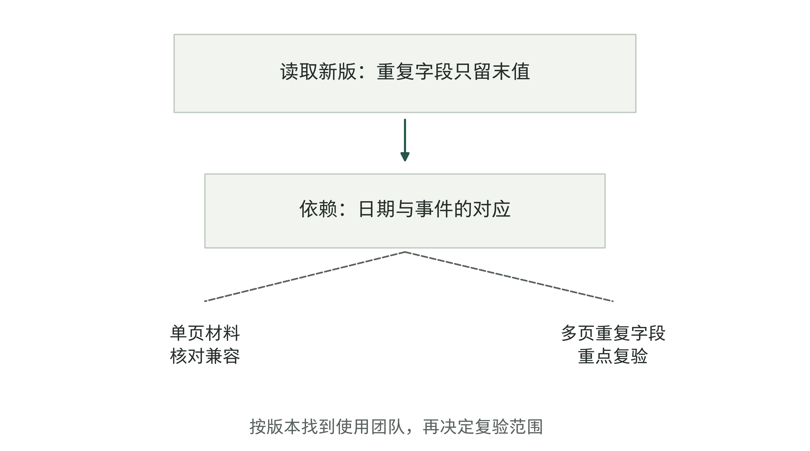

图14-7｜版本变化沿依赖传播到具体用途。虚构升级示意。实线为已知依赖，虚线为须核查的影响；受影响并不等于已经出错。检查集中于变化能够触及的用途。

复验范围也不宜只有两个极端：所有项目全量重做，或者只测改过的函数。前者可能让公共维护无法承担，后者可能漏掉下游行为。应说明变化影响哪些假设，再选择对应样本、配置和目标环境；说不清影响范围时，才需要扩大检查或暂缓升级。局部复验成立的前提，是依赖关系足够清楚，而非维护者希望少做测试。

升级后的通过记录还应区分两种结果。某个组合已经重新验证，另一组合因缺材料仍待核，不能共用“新版可用”的标签。可以继续维护已验证的旧组合，给未完成验证的部署保留明确期限和负责者。如果旧版本已经无法安全运行，则按项目既定路径限制使用或接管业务；资产负责人不能为维持兼容而自行降低放行要求。

每次复用，都要记清公共组件版本、本站配置版本、测试材料和验收记录。它们不必使用同一版本号，但应能相互对应。业务规则变了，配置可能已经失效，即使组件代码一行没改，也需要检查。

资产也需要退役。有的公共分支只剩一个站点使用，维护者每次升级都要为它修补；另一分支长期没有使用团队，只有目录里保留着“通用”的名称。此时可以将前者转为专属支持，将后者标为停止推荐，并说明现有使用者如何继续。停止推荐与立即删除不同，不能为清理目录切断尚在运行的项目。

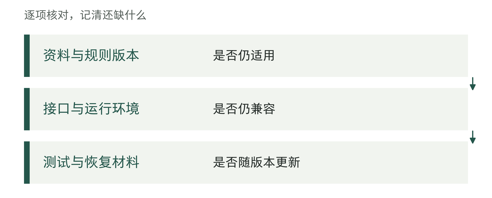

图14-8｜升级时需要一起核对的依赖。作者分析工具；只升级软件会留下其他层的旧假设。

## 把交付之后的劳动也记下来

复制能力最容易在首轮验收之后被高估。项目按期交给乙团队，原作者却在接下来几周不断回答映射、兼容和升级问题。如果这些工时只记在公共支持费用里，没有关联到具体项目，新项目的用时会显得很低；实际上，需要完成的工作只是被记到了别处。

下面用一笔独立教学账观察这一点。假设两条路径承担相同范围、质量与业务量的一次交付，并观察其后8周。重新实现路径需要80小时交付劳动，后续支持16小时，合计96小时。复用资产路径需要48小时适配交付，后续支持先估为28小时，合计76小时。两条路径都包含实施方与业务方的相关人工劳动，不含等待历时。

仅比较首轮，会得到少32小时。加入基准支持假设以后，差额缩为20小时。如果复用路径的后续支持增至48小时，两条路径同为96小时；增至60小时，则复用路径合计108小时，比重新实现多12小时。这不是对某种技术的预测，而是提醒验收记录保留一个可能改变判断的变量。

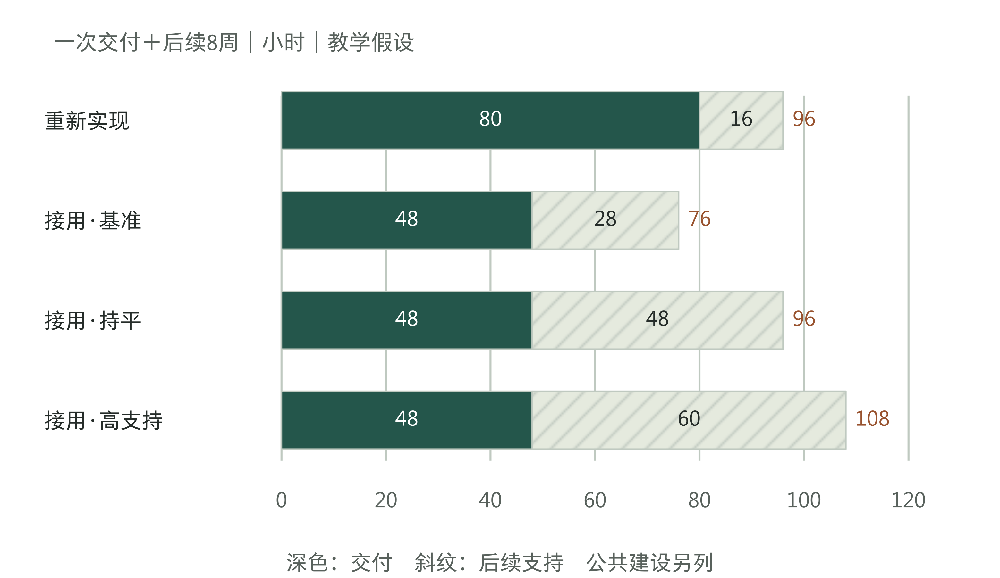

图14-9｜首轮少做的劳动可能在后续出现。独立教学假设，单位：小时。各行覆盖一次可比交付及其后8周；公共资产建设另列。48＋28＝76，48＋48＝96，48＋60＝108。

还要追问支持由谁承担。28小时中可以有原作者解释、公共维护者修补，也可以有乙团队排查和业务受理员复核。记录应按活动分配一次，避免同一次联调既进入“适配交付”，又进入“维护支持”。对多人同时参与的会议，计入各人的实际劳动；对等待一封回复经过的一整天，不直接记成一天工时。

公共部分的建设费用也不能漏掉。第一次整理通用组件、编写说明、准备反例和搭建验证环境，都要另行记录。这些工作可能服务多个项目，不宜全部计在某一个项目上，更不能从总账里消失。本节先把交付和后续支持所需的劳动算完整；怎样分摊公共投入、收入能否覆盖支持，下一章继续讨论。

8周是教学设定的观察期，不是足够证明长期稳定的通用期限。如果某项规则半年才更新一次，这段时间没有发生升级，只能写“尚未观察到该类维护”。把未发生的工作计为零成本，会误导后续判断。验收时应将未经历的变化列为后续观察义务，或安排有边界的升级演练；演练结果与真实运行记录分别保存。

维护并非只有负担。如果乙团队发现B站字段的含义差异，并把这个反例交回公共包，下一团队可能更早发现类似问题。但回收时应把B站专属映射与“字段同名时仍须确认含义”的公共检查分开。把所有地方补丁直接并进公共版本，可能让原本清晰的资产积累互相冲突的分支，反而增加复用难度。

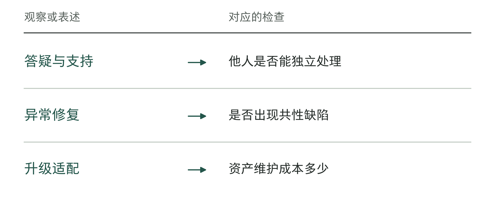

图14-10｜部署后劳动怎样进入复用判断。作者分析工具；初次交付变快不等于后续总劳动已经下降。

## 平台和认证提供哪一段支持

大型服务公司已经在尝试把内部实践、平台和工程人才培养连起来。技术服务公司DXC Technology（下文简称DXC）在2026年6月11日与Anthropic公布联盟，描述先在自身运营中使用AI助手Claude，再向客户推进的“零号客户”（Customer Zero）做法。[2] Anthropic公告则说明，从DXC现有工程人才中选人，结合伙伴课程与DXC补充课程培养。[1] 内部先用提供了发现问题的场所，课程让这些认识有机会被更多工程师理解。

DXC公告提出90天培训认证路径，面向数万名工程师和应用构建者（builders）的培养仍是双方的计划。[2] 同日投资者逐字稿还将首期7月培训写为后续安排。[3] 这些材料能说明企业打算如何组织人才，不能据此填出已经认证人数、通过率或第二团队独立交付的成功率。

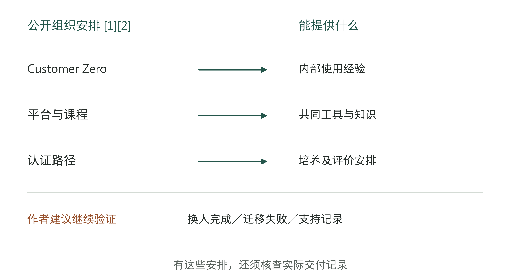

图14-11｜组织安排与交付证据各自回答什么。上半依据DXC／Anthropic公开安排整理[1][2]；下半为作者建议取得的验证记录。两者不是该公司已完成的连续验收阶梯。

生产部署披露值得关注，但仍须看计数对象。同日公告使用“50多个”，投资者逐字稿给出57，并明确其中包括DXC自身。[2][3] 两个数不能拼成增长曲线，也不能把57全部当成外部客户。即使部署数量准确，仍需进一步知道哪些团队复用了什么、处理哪些任务，以及后续改动由谁承担，才能回答本章的问题。

指标材料也有层次。DXC投资者演示中的一组效率和准确率图，脚注说明其依据包括关键绩效指标（KPI）目标与定时工作流分析；实际生产运行中自动采集的监测数据，即生产遥测，仍将在部署扩大时验证这些结果。[4] 因此，本章不把它用作跨团队长期效果证据。双方公告和公司投资者材料具有共同商业立场，来源数量增加不会自动补出独立验证。

这些限制并不使组织安排失去用途。一个公共平台可以提供一致的打包、运行和记录方式，减少复用团队重复搭环境；课程可以让工程师学会解释组件为何这样工作；合作伙伴可以帮助解决本地团队处理不了的问题。老板需要辨认自己购买或建设的是哪一段支持，再要求相应证据。平台操作熟练，不必然意味着能判断当地材料含义；懂业务的人，也未必能够维护平台版本。

认证因此可以成为分配任务的参考，但应与实际职责对应。能按说明完成配置的人，可以承担有范围的复用工作；能识别新场景前提、修改验证方法并解释失败的人，才能承担更广的迁移设计。这里是作者建议的任务分配方法，不是对任何厂商认证等级的重新定义。更换资产版本、扩大任务后，先前表现也只是一部分依据。

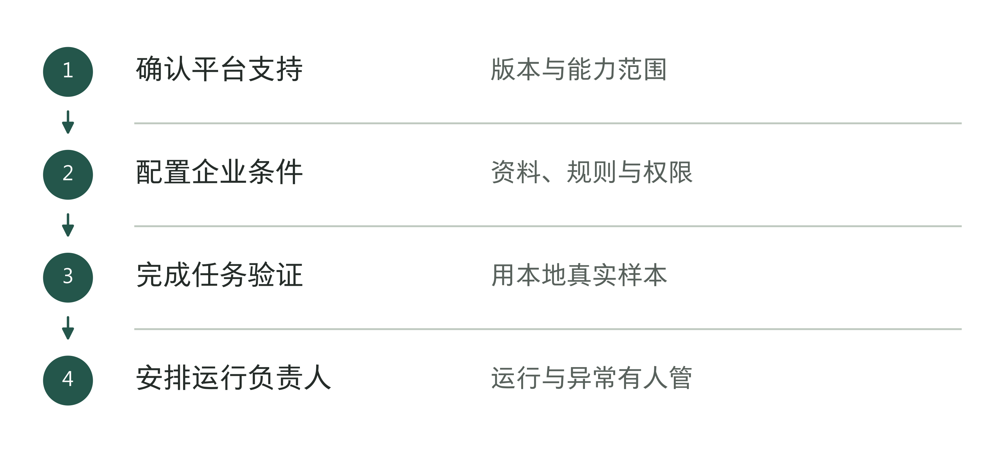

图14-12｜怎样把平台用于本地项目。作者分析工具；认证或平台功能不能自动证明本地结果。

## 批准下一次复用，而不是宣布全面复制

回到乙团队。老板现在可以要求一项范围清楚的决定：B站能否用某一版本起草内部待补清单，依赖哪份材料目录，谁接收未决项，哪些改变会触发复验，以及后续支持由谁安排。若这些条件已经有证据，可以批准该范围复用；若字段映射仍靠原作者口头解释，就把补齐说明和重新验证列为下一步，不用等待整个平台“成熟”才行动。

章末工作表一次只检查一项资产。先比较原用途与新用途，再列出使用记录、失败情况和处理结果。写“已复用”，要有新团队用新材料完成任务的记录；写“待验证”，要说明还缺什么、由谁补查。不适用就明确不用，仍需专门开发和维护的部分就另作安排，不能只追求资产目录越来越长。

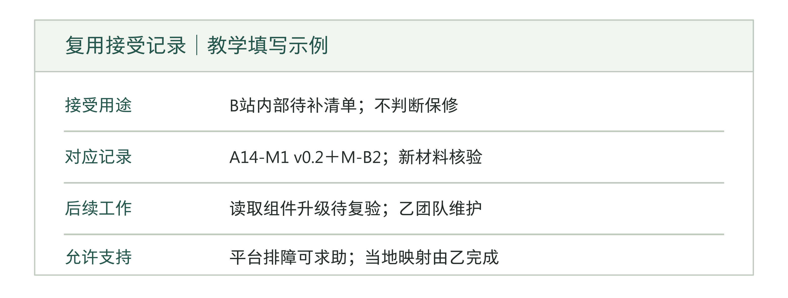

图14-13｜一项复用决定应当留下的依据。作者设计的填写示例。接受的是具体版本和用途；示例中的观察结果、人员角色及后续义务均属教学设计。

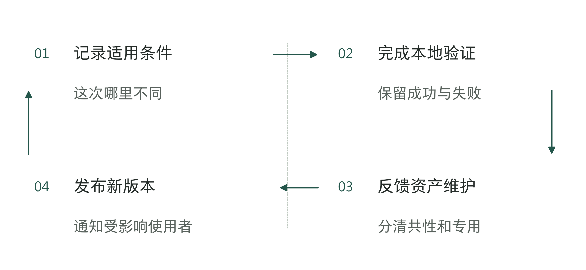

图14-14｜每次复用怎样更新资产。作者分析工具；复制能力需要维护与反馈过程。

表14-4｜材料核对资产的版本卡（已填教学示例）

| 字段 | B站本次复用记录 |
|---|---|
| 资产与版本 | A14-M1 v0.2：内部材料缺项清单生成组件；不决定保修资格 |
| 适用依据 | B站材料目录与映射M-B2；到仓签收不当作完工签认 |
| 复用证据 | 乙团队按说明处理新材料；缺项正确列出，冲突交受理员；关联表14-3回放 |
| 原作者支持 | 曾补映射理由，已写回说明；该次带做不计独立完成，换材料后再核 |
| 变更与维护 | 材料目录、字段含义或接口变化触发复验；乙团队维护，原团队支持范围另记 |
| 拒用范围 | C站保修决定不在本版本内；读取能力可另用，判断任务重新立项 |

可以先选择一个用途清楚、有人复用的产物，分别记录换人、换场景和版本变化后的剩余依赖。哪些步骤已由使用团队完成，哪些仍须原团队支持，都会成为下一次复用决定的条件。

当另一支团队能在明确条件下完成工作，就可以继续算一笔经营账：后续项目的收入，能否覆盖公共建设和持续维护的成本；项目越多，开发、排障和支持的工作量会怎样变化？第15章将沿着这些记录，讨论定制、毛利、续约与规模化。

## 资料与说明

[1] Anthropic，DXC will integrate Claude into the systems banks, airlines, and other regulated industries rely on，2026年6月11日，Building a team of Claude-certified engineers小节。[官方公告](https://www.anthropic.com/news/dxc-anthropic-alliance)。S204，C495。人才选取、补充课程与计划身份为公开安排，不是独立成效。

[2] DXC，DXC and Anthropic Announce Multi-Year Global Alliance to Bring AI into Mission-Critical Enterprise Systems，2026年6月11日，正文及Forward-Deployed Engineers小节。[官方公告](https://dxc.com/newsroom/06112026-dxc-and-anthropic-announce-multi-year-global-alliance-to-bring-ai-into-mission-critical-enterprise-systems)。S209，C493—C495。90天为当时培训认证路径；Customer Zero为该公司表述。

[3] DXC Investor Day 2026 Transcript，2026年6月11日，PDF第5、7、60页。[官方逐字稿](https://s27.q4cdn.com/120381974/files/doc_downloads/Investor-Day-2026-Transcript.pdf)。S213，C511。第60页明确57包含DXC自身；首期7月培训为当日计划，本文不判断其后来实际执行。

[4] DXC，Investor Day 2026 Presentation，PDF第72页及第75页脚注。投资者演示资料；2026年9月9日已重新取得官方PDF。目标、定时分析与生产遥测按不同证据口径理解。 https://s27.q4cdn.com/120381974/files/doc_presentation/2026/06/DXC-Investor-Day-2026-Presentation.pdf

维修受理场景、迁移结果、工时账、验证方案及行动表均为作者教学设计，不代表DXC或作者客户实绩；不同章节的算例不构成同一企业的连续账目。“交付资产”为工程与组织管理用语，不表示已经满足会计资产确认条件。
