# 第15章 看懂生意：定制、毛利、续约与规模化

一个AI平台已经部署到客户那里，供应商却说，现有合同短期不会因此增加收入。这算不算一门好生意？

DXC在2026年6月11日投资者日问答中，说明其企业AI平台OASIS的基础版按现有合同条款进入存量客户，这些合同的短期收入大体不变；后续另有分层升级与独立许可的商业路径。管理层还举例，可以由四五名获得认证的FDE进入其他服务商运维的环境，帮助客户重新设计流程，再单独许可OASIS。[1] 这几种安排使用同一平台，收入从哪里来却各不相同。

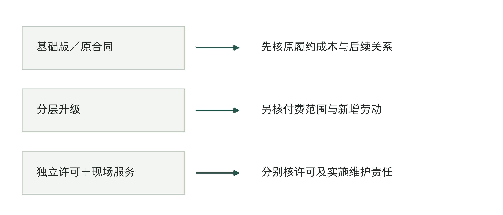

图15-1｜同一平台进入三种收入安排。据DXC投资者日商业安排整理[1]。线条表示商业路径，不表示已经实现销售或利润；基础版、升级与独立许可不可按部署数量统一计价。

第14章检查一项成果交给别人后能否继续使用。本章接着算账：收入能不能覆盖开发、交付和后续维护？实施公司的经营者要知道，多接项目会不会反而忙得更多、赚得更少；采购方也要判断，供应商能否长期提供承诺的服务。双方的账有关联，但供应商有收入，不等于客户已经获得收益。

买方读者可先看收费对应的劳动，再看本章末尾的持续服务判断；经营交付公司的读者可按成本、项目批次、人手配置、续约顺序复算。以下教学账分成A组项目账、B组人手配置账和C组续约账，不能跨组拼成一家公司的利润表。

## 部署以后，钱从哪里来

基础版进入原合同，不必然是一项失败的商业安排。假如它减少原有服务的交付成本，在收入不变时也可能增加收入扣除成本后的余额；假如它让客户更愿意续约，也可能保护未来收入。这些都是需要验证的路径。仅知道已经部署，无法判断成本有没有下降，更不能提前把原本就会续约的收入全部归给平台。

付费升级又提出了另一组问题。客户额外付钱购买的是更大使用范围、更多处理量、特定能力，还是更强的服务承诺？增加一个收费模块，若同时承诺更多接口和全天候支持，新增收入就有自己的交付负担。不能一边把它全部计作软件收入增长，一边把实施人员留在另一个成本中心，随后宣称软件天然具有高毛利。

独立许可也未必意味着独立于服务。客户可能需要FDE进入现场完成工作，也可能由原服务商或其他伙伴接手维护。供应商应说明工程人员在何时参与、何时退出，以及超出标准能力的工作由谁收费和交付。买方需要知道许可费覆盖到哪里，才能判断报价之外还缺什么。

把收入按实际承诺拆开，是经营分析的第一步。项目可能有一次性实施费、年度服务费、按使用量计费和追加改造费；也可能只有一笔总价，包含上述几种义务。本章的拆分用于看清工作与经济关系，具体财务确认仍须依据实际合同和适用口径，不能把一张管理分析表直接当作会计分录。

表15-1｜将收费项目与实际劳动对上，作者建议

| 收费安排 | 需要追踪的劳动或支出 | 容易漏掉的部分 |
|---|---|---|
| 一次性实施 | 调查需求、适配、验证与交付 | 未签约售前、返工 |
| 持续服务 | 云资源、复核、故障与升级 | 非工作时段覆盖、低频大变更 |
| 使用量计费 | 每类任务的调用和处理成本 | 重试、复杂任务、人工接管 |
| 追加改造 | 新增范围与新接受条件 | 销售承诺附送的专属分支 |

这张表还揭示了定价与劳动之间的错位。按账号收费，成本可能主要由少数高频用户产生；按任务收费，不同任务的人工接管难度可能差很多；按结果收费，结果又可能依赖客户自己掌握的资料和业务决定。选择计价单位时，要检查它是否足以解释主要成本变化。计价单位容易统计，收款或许方便，但还要说清双方各承担什么工作和风险。

定制并非都应取消。客户专属劳动如果有明确范围、合适价格和足够能力承担，可以是一项合理业务。有问题的是明知每次都要重新做，却按几乎无需劳动的模式承诺价格和服务；或者把免费定制当作获客手段，又从未记录它带来的后续义务。

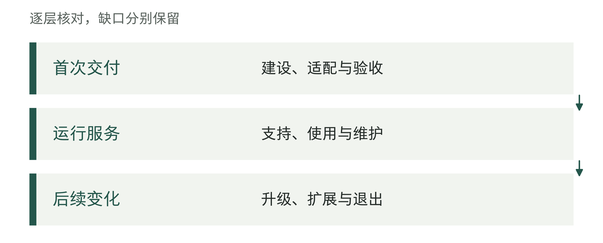

图15-2｜部署收入下面的持续工作。作者分析工具；收入名称之外，应核对承担了哪些劳动。

## 买工程师，还是买一支负责交付的团队

同样是请FDE进入客户环境，有的公司按工程师的工作时间收费，有的承接一个范围清楚的交付任务。两种报价即使金额相近，服务商承担的管理工作也可能不同。先分清这一点，才知道便宜的报价是否意味着自己要多安排一位工程负责人。

Uvik公开的服务安排是，将自有高级工程师加入客户团队，由客户管理日常工作；服务页列有小时费率、月度工作说明书和人员替换安排。[2] 这种方式能补充工程能力，客户则需要有人排定任务、检查成果、协调依赖。如果内部已经有能够带队的人，缺的是某项技能或一段工程时间，这种采购有明确用途。若连项目该怎样推进都还不清楚，人员到位以后，等待决定的时间仍可能照常计费，具体要看双方约定。

Optywise则把带队工作也放进自己的服务：工程小组由它雇用和管理，围绕一个用例，在工作说明书中约定交付范围、周期和价格。其公开方案以六周为一轮推进生产交付。[3] 这说明它怎样销售和组织服务，不能当作所有项目都已在六周内完成的成绩。对买方，更值得追问的是：这一轮交什么，未通过检查怎样返工，哪些客户条件不到位时需要调整计划？

两者的差别不在于工程师是否优秀，而在于谁把几个人的工作组织成一项可接收的交付。前一种安排下，客户购买外部能力，并自己承担较多工程管理；后一种安排下，服务商承担约定范围内的带队工作，客户仍须确认业务规则、提供必要条件并验收。按交付物报价，也不等于按客户利润分成。

表15-2｜三种采购安排，分别先查什么，作者依据公开服务说明归纳[2][3][4]

| 购买安排 | 日常工作由谁组织 | 买方仍要安排 | 报价前先核对 |
|---|---|---|---|
| 工程师加入客户团队 | 客户负责人 | 任务排序、工程检查与业务确认 | 可计费时间、替换及交接 |
| 服务商带队交付 | 服务商交付负责人 | 业务规则、资料权限与验收 | 交付物、返工及变更范围 |
| 平台与工程服务组合 | 按约定分配 | 业务确认、使用与运行接口 | 许可、实施及支持各覆盖什么 |

还有服务商把FDE与平台一起提供。Turing的企业AI服务就同时介绍工程团队和自有平台，覆盖建设、部署及运行。[4] 它的公开页面没有给出平台与服务各自的收费和利润。买方比较这类方案时，应把软件能力、实施工作和长期支持拆开问；供方也要分别记录相应成本，才能知道收入增长究竟来自软件使用增加，还是更多工程师持续投入。

### 跨国交付的机会，先看谁能把工作接起来

这种服务已经有跨国供给。Uvik的服务页列出爱沙尼亚总部、英国商务办公室，以及与美东和欧洲时区协作的安排；Optywise列出印度浦那地址，并明确面向美国和加拿大客户。[2][3] 这些材料足以说明服务商正在跨国提供工程能力，尚不能证明这一模式普遍盈利。

对准备进入海外市场的中国团队，我更看重一种可先小范围验证的分工：由熟悉客户行业、能与客户及时沟通的负责人确认需求和推进验收，工程小组在客户允许的地点与访问范围内完成构建。客户侧负责人可以来自服务商或当地合作伙伴；他的价值在于把业务问题说明白、把分歧交给有权决定的人，并让交付继续推进。仅有一个会转发消息的联系人，远程组仍会反复猜客户的意思。

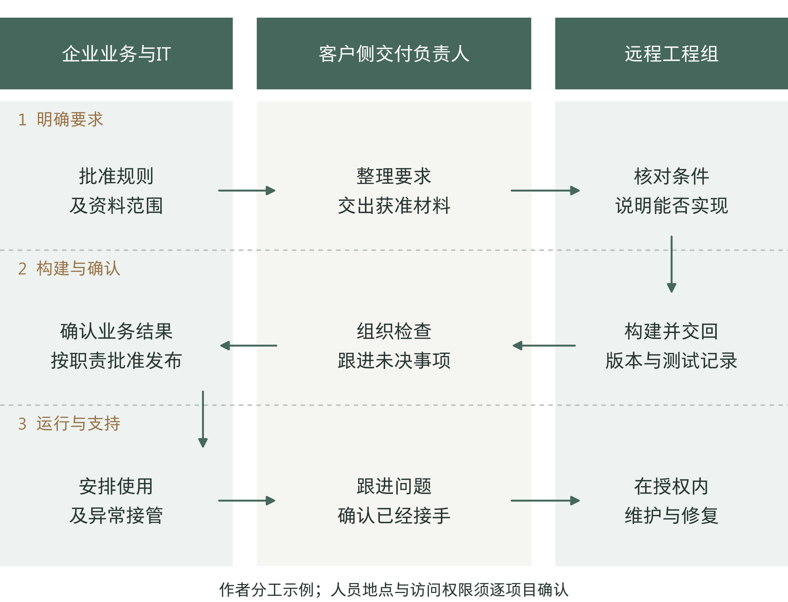

图15-3｜跨国交付怎样完成一次交接。作者提出的分工示例，不是已验证的客户项目。客户侧负责人负责组织交付，不代替企业批准规则和发布；远程组只取得获准的资料与访问权限。人员所在地及现场要求须逐项目确认，具体交接检查见第16章。

这类生意不能只用客户小时价减去工程师工资。客户侧负责人的时间、未成交的售前工作、项目之间的空档、人员替换与交接、差旅、返工和后续支持，都可能占用这笔差额。远程工程师的成本下降，也可能被客户侧负责人反复解释需求的时间抵消。报价能覆盖哪些劳动，需要用实际记录回答。

如果要试做，可以从熟悉行业的一项小任务开始，把诊断、交付和后续支持分别约定范围与费用，再记录每一段实际花了多少时间。尤其要看：负责人是否每次都得重新解释同类规则，客户能否按约定提供资料，下一位工程师能否接手。客户愿意为持续可靠的交付付钱，这支团队才有继续经营的基础。

买方也可以据此判断两份报价：一份单价较低，但要求自己带队；另一份总价较高，却包含工程管理和约定的返工。应把内部投入补进比较，再核实服务商是否真的有人承担这些工作。收入对应的工作分清以后，下一步就是查成本记到了哪里。

## 毛利率之前，先看成本放在哪里

读到一个毛利率，先找它的收入范围和扣减项目。通常，毛利讨论收入扣除相应营业成本后的部分；项目贡献、分部利润与公司净利润，还可能分别包含或排除不同费用。它们回答不同问题，名称接近不能直接横比。

DXC截至2026年6月30日季度的10-Q就在分部利润定义中列入服务成本、销售及一般管理费用、折旧摊销等，并另外调节至公司层面的利润。该文件未单列OASIS收入与利润。[5] 因而，不能拿一个分部利润率填进产品毛利栏，也不能把未单列理解为产品没有贡献。

实际管理中，可以先建立一张能够回到活动记录的账。实施人员为某客户重配接口，进入该项目的交付劳动；维护者修补多个项目共用的组件，进入公共维护；售前团队为三个未成交机会做了验证，也要进入获客活动。一个人可以分时承担几种工作，成本归属应随活动改变，不能只按他的部门名称判断。

A组：项目及批次账。以下为教学假设，金额为人民币万元，与前章工时账无换算关系。假设某类项目从开始交付起的12个月收入为20万元，范围包括约定的实施及服务。第一批项目平均需要交付劳动8万元，云与第三方服务2万元，后续专属支持3万元。扣除这三项后，剩7万元；再扣按同批获客活动分配的2万元，剩5万元，供公共能力和其他费用使用。

这里的人工金额是假设的实际劳动成本，包括相应雇用负担，不能由“节省了多少小时”倒推。获客2万元也包含失败机会的合理分配，不只计入成交后的销售工作。若失败售前全部丢到表外，成交项目会显得越来越好看，整个销售体系却可能越来越贵。

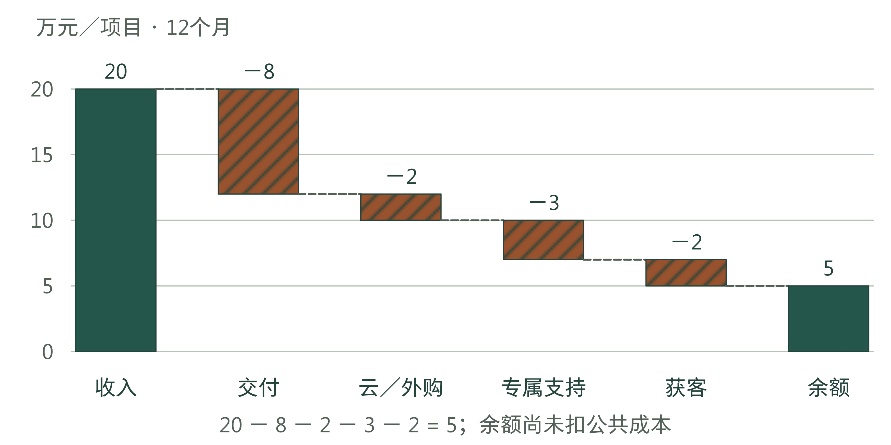

图15-4｜二十万元收入经过哪些扣减。独立教学假设，每项目自开始交付起12个月，单位：万元。20−8−2−3−2＝5；余额尚未扣公共投入及其他未列费用，不称净利润。

项目支持与公共维护之间需要一条能复核的边界。为一个客户改当地字段映射，是该客户的工作；修复公共解析组件，是公共工作。一次排障可能先诊断当地问题，再发现公共缺陷，可以按实际活动拆开，但不能把同一小时在两处各记一次。把代码合入主分支，也不会自动使此前所有客户劳动都变为公共投入。

公共建设又有自己的期限。搭建验证环境、编写说明和抽象共同接口，会在首批项目之前或期间发生。它们可能服务未来客户，但未来会来多少客户仍是一个假设。管理者可以先把总额另列，再检查现有与新增项目分别承担多少；不能为了让首批账好看，直接除以尚未签约的几十个客户。

决定短期是否接下一单，要看这单增加哪些收入和成本；评估整项业务，还要算上公共建设和长期维护。两种分析都需要。财务报表怎样分期列报，另按适用规则处理；本章的管理算例不规定研发资本化或收入确认办法。

图15-5｜毛利比较前先统一什么。作者分析工具；三个口径不同，毛利率不能直接横比。

## 第二批项目，是否真的更好做

单个项目留下5万元，还不能判断平台投入是否值得。假设第一批有4个同类项目，每个收入20万元，交付、运行、支持和获客合计15万元。另有公共建设24万元、公共维护8万元，合计32万元。第一批总收入80万元，所列成本92万元，余额为负12万元。

第二批增加到8个项目。假设复用资产后，每项目交付成本从8降到5万元；云与第三方仍为2万元，获客仍为2万元，专属支持反而从3增至4万元。这可以用来模拟一种经营判断难题：首轮适配减少了，后续兼容问题却增加。每项目所列成本为13万元，收入扣减后剩7万元。

两批都要统计到各项目开始交付后的第12个月，并保证服务范围、业务量和质量要求可比。不能拿第一批一整年的支持费用，和第二批刚上线三周的费用相比。本章按开始交付的时间将项目分批，再比较服务了同样长时间的记录。实际分析还要区分项目复杂度，退出或失败项目的成本也要保留。

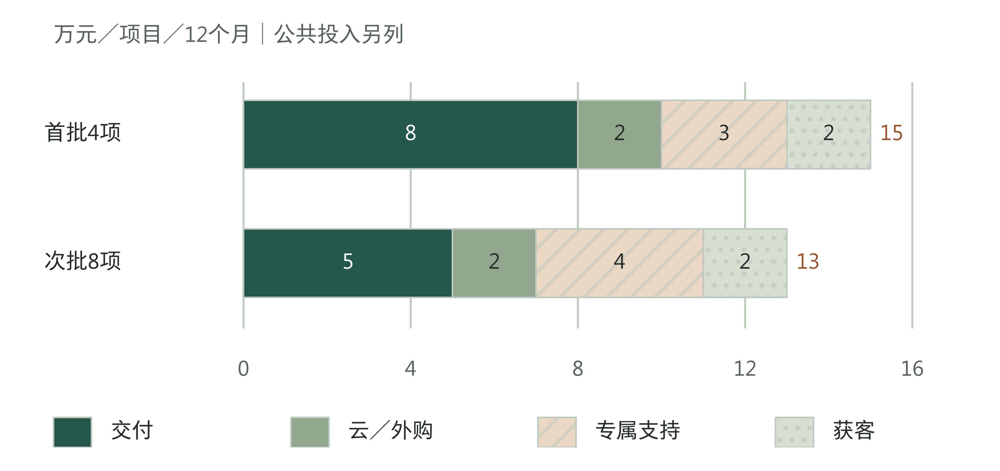

图15-6｜交付成本下降，支持费用增加，要合起来算。独立教学假设，每项目12个月，单位：万元。首批8＋2＋3＋2＝15；次批5＋2＋4＋2＝13。两批均含获客，公共投入另列。

为了把公共费用也算清，进一步假设两批各在不同年度开始，首批全部约定服务已在第一个年度结束，没有续约或遗留义务带入第二个年度。第二批不再发生新的公共建设，公共维护为16万元。于是第二批收入160万元，项目相关成本104万元，再扣公共维护16万元，余额40万元。两批所列收入合计240万元，成本212万元，累计余额28万元。

这个结果说明，在设定的价格、范围和成本条件下，第二批能够承担更多公共投入。它没有证明一家真实企业已经盈利，也不是对未来客户数的预测。总部未分配费用、税费、融资以及其他未列支出，还要按分析目的补入。若首批客户继续服务，第二个年度就必须加入其收入和支持，不能计入这部分收入，却漏掉相应工作。

表15-3｜两批项目怎样承担公共投入，教学假设，单位：万元

| 项目 | 首批4项 | 次批8项 | 两批合计 |
|---|---:|---:|---:|
| 收入 | 80 | 160 | 240 |
| 项目及获客成本 | 60 | 104 | 164 |
| 公共建设 | 24 | 0 | 24 |
| 公共维护 | 8 | 16 | 24 |
| 扣所列成本后的余额 | −12 | 40 | 28 |

若只看平均数，还会漏掉客户之间的差异。第二批8个项目中，也许有6个几乎不用支持，另2个需要资深工程师长期介入。平均4万元可以用于总账，却不能解释再接一个相似大客户需要谁来做。应进一步列出最耗费支持的项目、问题类型和人员，让销售承诺面对真实的交付限制。

公共费用分摊也应保留总额校验。按项目数均分，适用于教学中的同类项目；实际客户使用量、专属版本或维护要求差异大时，应先检查什么活动驱动成本。更换分摊方法会改变谁看起来盈利，却不会改变整体花了多少钱。一次分摊调整若让所有项目的利润同时变好，就要查有没有费用被遗失。

同样不能把第二批改善全部归因于资产。客户资料更完整、团队更熟练、任务更简单，都会影响交付成本。经营账能告诉我们这一批是否改善；要解释为何改善，还需记录这些条件。即使无法分离每项因素，企业也可以据已有范围安排下一批，但应避免许诺未经验证的单位成本会无限下降。

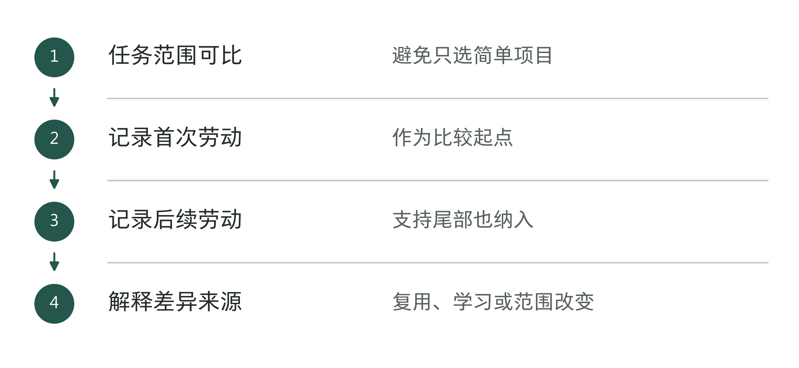

图15-7｜第二批项目更好做的证据。作者分析工具；劳动下降需要同口径记录支持。

表15-4｜跨批次比较的最小账本（作者检查工具）

| 记录项 | 保持可比的要求 |
|---|---|
| 任务范围 | 标明新增或减少的交付内容 |
| 首次劳动 | 按同样口径记录建设与适配 |
| 后续劳动 | 覆盖同样长度的支持观察期 |
| 质量与返工 | 不能以少记录服务换取低成本 |

## 后续支持和增加人手，会怎样影响利润

回到第二批的账。在其他条件不变时，每项目支持成本若由4万元升到9万元，就多出5万元，8个项目合计多40万元，恰好耗尽原来的40万元余额。首轮实施所需的劳动虽然减少了，后续支持仍可能耗尽本批项目的全部余额。决定是否扩张时，这个变量比复用组件数量更直接。

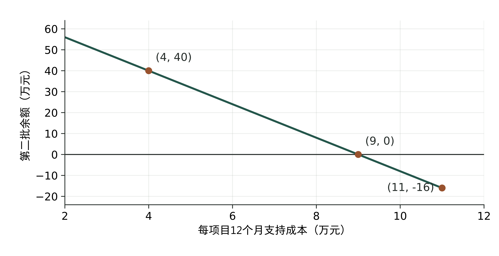

图15-8｜后续支持增加，会耗掉第二批的余额。沿用第二批教学参数，横轴为每项目12个月支持成本，纵轴为8项目扣所列成本后的余额，均为万元。余额＝72−8×支持成本；9万元处为零，其他参数保持不变。

交付后的支持工作未必会自然减少。接口升级、规则调整、少见异常和关键人员更换，可能过了一段时间才集中出现。项目还没经历过这些变化，就只能估计相应费用，并注明依据和下次核查时间。如果拿新项目的短期记录代表完整服务期，就会低估后续责任。

除了总成本，还要看关键能力是否够用。一个熟悉旧系统的工程师不能同时处理所有客户的紧急问题；团队每增加一人，也不一定立刻获得等量独立交付能力。部分业务需要成组补充值守、复核和替补，成本会出现台阶。平均每客户成本下降的趋势，可能在下一组人员加入时暂时反转。

B组：独立的年度人手配置账，不与A组项目账合并。假设每客户年度服务收入6万元，云资源及外购变动成本2万元；每组支持团队一年成本30万元，最多服务10个同等负荷客户。为观察增加人手对成本的影响，假设客户全年占用，团队必须整组增加，人员成本只记在团队项，不再放进每客户2万元。

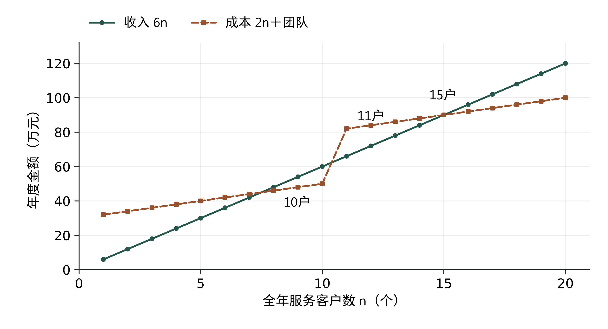

图15-9｜新增客户可能先触发一组团队成本。独立教学模型，横轴为全年服务客户数，纵轴为年度金额，单位：万元。收入＝6n；所列成本＝2n＋30×向上取整(n÷10)。点与折线仅连接整数客户数，不表示客户可连续分割。

服务10个客户时，收入60万元、成本50万元，余额10万元；第11个客户触发第二组团队，收入66万元、成本82万元，余额降至负16万元。到15个客户时再次持平，20个客户时余额20万元。接第11个客户的决定，应当同时安排新增需求、团队到位和过渡资金。

年度余额还没有回答钱何时到位。客户较晚付款，人员与云资源却要先支付，即使全年所列收入高于成本，也可能需要额外资金度过扩张初期。反过来，提前收款并不等于后续服务可以少做。本章算例假设收入可收回，尚未模拟收付款时点；真实扩张须另列资金缺口与维持服务的安排。

实际团队能服务的客户数，通常不会这样整齐。客户可能分批进入，工作峰值也未必重合，外部伙伴可能承接部分高峰。模型的作用是要求管理者说明人手配置的假设：当前团队还能接多少同类负荷，下一次补人何时发生，新团队能独立工作之前由谁处理任务。不能把团队一直满负荷当成理所当然，也不能假设增加客户永远无需新增人员。

定制比例下降，不一定意味着项目多了就更赚钱。少量定制如果长期占用稀缺专家，可能比大量标准实施更难扩张；收费明确的专属服务，只要能覆盖人员和管理成本，也可以稳定经营。应当检查每笔新增收入带来多少开发和支持工作、收费是否足够、有没有人能长期承担。

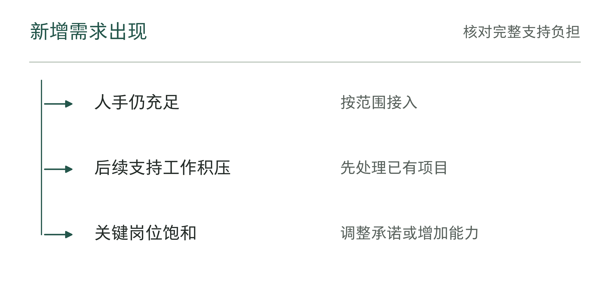

图15-10｜人手不足时，还能接多少新项目。作者分析工具；签下更多项目之前，要确认谁负责上线后的支持。

## 续约增长，还要看谁留下以及为什么

续约给出了一项有分量的信号：客户愿意继续承担某种承诺。但留下可能因为任务价值稳定，也可能因为替换困难、预算周期未结束，或尚未找到合适替代。原因会改变下一期的经营预期。仅在表里填“已续费”，还不足以判断客户关系的质量。

先固定原客户群，再核对两段等长期间的可比经常性收入。C组：独立续约账。原客户群第一年收入100万元，第二年因退出减少20万元、因收缩减少10万元，同时留下的客户扩张带来40万元，最终为110万元。新客户收入全部排除，也不把一次性实施费混进经常性收入。

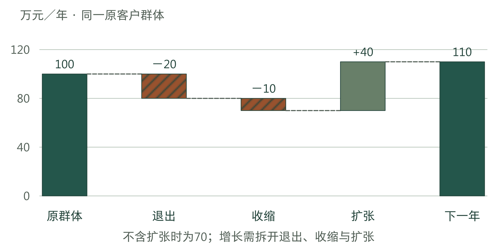

图15-11｜原客户收入增长，也可能伴随退出与收缩。独立教学假设，同一原客户群、两段等长年度，单位：万元。100−20−10＋40＝110；不含扩张时剩70。图中变化不是客户人数。

按这个明确口径，包含扩张的收入留存为110%，不含扩张的部分为70%。不同企业披露类似指标时，可能采用期末年化金额、实际期间收入或不同排除项，比较之前仍须读定义。这里的两条比例只是把退出、收缩和扩张分开看，不设一个通用的“优秀续约率”。

接着核成本。假设原群体对应的直接服务成本由60万元升至85万元，收入虽然增加，扣这些成本后的余额却从40万元降为25万元。新增范围可能需要新的接口、更多复核，也可能发生折扣或承诺变更。扩张收入有价值，但需要与扩张义务一起判断，不能仅用留存比例替代利润分析。

退出的客户也值得追问。如果退出集中在某种资料条件差、长期依赖人工接管的任务，剩下的客户可能更适合当前能力；如果退出集中在已经完成深度集成的客户，则需要核对价值、价格和服务是否出了问题。两种解释都需要客户与任务记录支持，不能只凭收入变化图猜原因。

客户续约时愿意说明哪些任务继续使用、哪些结果值得保留、哪些范围想缩小，比笼统满意度更接近经营证据。供方还应记录为了续约做了什么：降价、赠送改造、增加响应时段，还是减少范围。让收入保持不变的附送承诺，也可能增加下一年的成本。

长期留存的可信基础，是客户知道继续购买的理由，供应商也有能力履行相应承诺。迁移成本本来就是经营选择的一部分，但依赖程度加深，不能自动代替价值改善的证明。

图15-12｜续约增长需要拆开的变化。作者分析工具；总收入增长不等于原客户都实现了可持续收益。

表15-5｜续约解释的证据分层（作者检查工具）

| 准备作的判断 | 先找到什么 |
|---|---|
| 原客户继续购买 | 合同或交易记录与群体口径 |
| 使用范围扩大 | 实际新增任务与投入 |
| 客户获得价值 | 客户侧结果记录与成本口径 |
| 服务能够持续 | 供应方的支持人手与责任安排 |

## 买方怎样判断这段关系能否继续

买方通常拿不到供应商的完整产品利润表，也不需要先算出一个精确毛利率才可以采购。更实际的做法，是把影响本次工作的条件逐项问清：报价覆盖哪些服务，谁负责日常维护，哪些需求另行计费，关键人员离开后怎样接手，以及服务中断时自己要承担什么。

供应商价格低，可能来自能力成熟、公共成本已经由较大业务量承担，也可能来自试图进入新市场的补贴。买方可以接受有期限的优惠，但应看期限结束后的价格与服务安排。把试点期间资深人员随叫随到，默认为正式运行的长期条件，会低估之后需要购买或自己承担的劳动。

还要检查更换供应商有多难。合同允许导出资料，只说明一项权利；另一团队能否理解规则、接入接口并完成任务，需要实际准备。可以在有限范围核对资料清单、版本说明和接手使用的条件，估计切换期间的重复运行、人工补位和重新验证。第7、13章已经说明退出安排，本章关注的是：这些负担会怎样影响续约判断，以及是否应提前投入以保留选择。

图15-13｜同一笔服务关系，需要两侧各自的依据。作者分析框架。供方记录收入与履约能力，买方记录任务价值与承担的负担；两侧证据在服务范围处对齐，不能相互替代。

保留选择不等于每年强制更换服务商。稳定合作可以减少反复学习和协调，客户也可能愿意为可靠服务付费。应比较的是继续、缩范围、改变分工和替换这几种可行路径，分别会留下什么价值和义务。对于确实难以替换的核心服务，更应让费用、维护范围和接手能力可见。

供方则可以用同样的记录改进报价。某类专属分支连续两批都需要额外维护，就检查它应当单独计费、缩小承诺，还是值得建设公共能力。不能为了维持“产品化”的外观，继续把必需的人工工作当作偶发例外。让客户知道价格对应的服务边界，也有助于减少成交以后才暴露的争议。

图15-14｜买方怎样检查长期服务能力。作者分析工具；经营检查服务于采购判断，不替代财务审计。

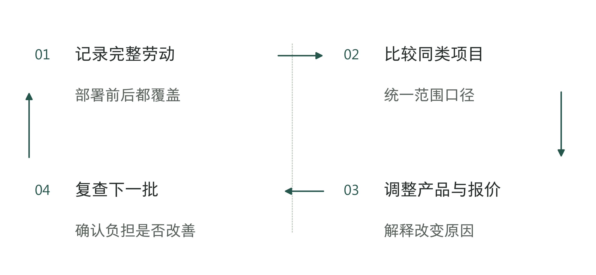

图15-15｜让服务承诺跟随真实成本修订。作者分析工具；不要仅用销售规模证明服务已经可复制。

章末工作表一次检查一类服务：收入承诺了什么工作，同批项目做了多久、花了多少，公共建设还有多少投入，何时必须增加人手，再看客户为什么续约、买方还要承担什么。拿不到供应商的产品利润数据，就说明哪些条件尚未核实；有内部记录，则据此决定保持、扩大、缩小、暂缓还是退出，并写清哪些成本或人员变化会要求重新作决定。

第14章提出的复用记录，用来判断一项能力在什么条件下可由别人使用；本章的经营账再检查，收入是否足以覆盖这些能力和持续工作的成本。下一笔扩张不必等待所有不确定性消失，但应说明收入从何而来、最紧缺的劳动由谁承担，以及什么变化会使判断失效。落实到一家中国企业，销售、实施和维护还可能分属不同机构。下一章将沿这条服务链，检查每项责任究竟落到谁手里。

## 资料与说明

[1] DXC Investor Day 2026 Transcript，2026年6月11日，PDF第15、59—60、68—69页。[官方逐字稿](https://s27.q4cdn.com/120381974/files/doc_downloads/Investor-Day-2026-Transcript.pdf)。S213，C513—C515、C528。商业路径为管理层陈述，四五人属于举例；不证明已实现销售、毛利或续约成效。

[2] Uvik，Forward Deployed Engineering，[官方服务说明](https://uvik.net/services/forward-deployed-engineering/)，2026年9月17日核查。S320，C894。团队管理、计费与合同安排、办公地点及时区条目；为供应商公开服务说明，非成交合同或客户结果记录。

[3] Optywise，[FDE服务说明](https://optywise.com/hire-forward-deployed-engineer)及[公司介绍](https://optywise.com/about)，2026年9月17日核查。S321、S322，C895—C896。用于核对受管理工程小组、六周周期、浦那地址及北美市场定位；六周属于服务承诺，未取得实际周期、利润或客户验收记录。

[4] Turing，Enterprise AI，[官方服务说明](https://www.turing.com/enterprise-ai)，2026年9月17日核查。S323，C897。FDE与Turing Intelligence Platform组合的服务定位；页面未披露平台与服务的收费拆分及利润，不以宣传中的效果数字证明客户经营结果。

[5] DXC，Form 10-Q，季度截至2026年6月30日，Note16印刷第23—25页及MD&A第31页。[SEC原件](https://www.sec.gov/Archives/edgar/data/1688568/000168856826000069/dxc-20260630.htm)。S212，C522—C523。用于核对分部利润定义、调节及产品披露缺口，不以公司或分部数字推产品利润。

项目批次、人手配置与续约模型均为独立教学假设，相互之间及与前章不构成连续企业业绩。金额单位、观察期与排除项见相应图表；管理分析余额不等于财务净利润，模型不规定特定会计处理，也不预测供应商真实毛利。行动表为作者设计。
