# 第16章 中国企业的AI交付：分清多方责任

第五部分讨论中国企业怎样组织AI项目。我们会从公开采购文件和岗位要求中找线索，再用教学场景推演具体决定。采购文件写了什么、团队实际做了什么、企业最后得到什么，是三件需要分别核实的事。

一份安全测试报告交上来，谁可以宣布项目完成？

梧州社保RPA数字员工服务采购文件把答案分在不同条目里：系统需要第三方安全测试报告；验收方案和系统验收工作完成后，还要经采购人确认。另一张功能表规定，业务管理人员配置授权范围，市本级控制流程下发。[2] 测试者、采购确认者和日常业务授权者，各有不同的工作。

2025年5月的成交公告列明，采购人为梧州市社会保险事业管理中心，成交供应商为珠海金智维信息科技有限公司，另列采购代理机构。[1] 只记住软件名字，会漏掉这些关系；只找到合同上的联系人，也未必知道一项具体业务由谁批准。

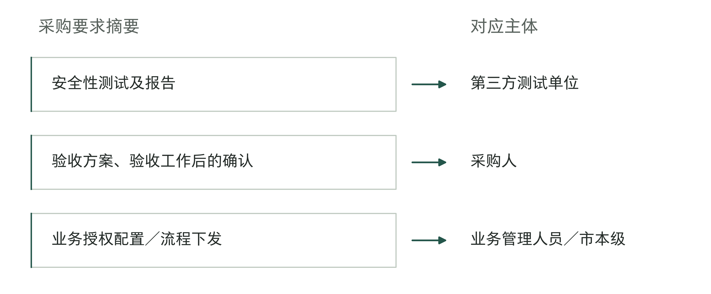

图16-1｜从采购条目找到不同确认者。据梧州采购文件整理[2]，左侧为要求的摘要，右侧为对应主体。这些确认各有用途，不能由一份报告代替。图示采购设计，不代表已经实际执行。

第3章已用这个项目区分软件许可和岗位，本章不再数许可证。这里要追踪的是：一段工作经过几个主体，每次交接后，接手方是否拿到了所需材料，也有权继续处理。这个RPA项目提供了可观察的采购设计；它没有使用FDE职位名称，也不能证明大模型已经达到某种质量。可借鉴的是责任分析的方法，生成式能力仍须针对自己的任务另行验证。

## 签约、产品和使用，要分别找到人

中国企业寻找AI交付团队时，可能先接触软件厂商，也可能接触经销商、集成服务商或已有IT供应商。一个名字出现在方案封面，只能帮助找到入口。实际承诺由哪个主体作出、谁派人实施、谁能修改依赖系统，还要继续向下核对。

一份智能体平台采购公告把这种区别写得很直观。2025年11月，公安部第一研究所的AI模型与智能体统一研发平台软件采购中，中标供应商列为中关村科学城城市大脑股份有限公司，主要标的信息中的产品品牌则是百度智能云。[3] 公告证明供应主体与产品品牌分列；它没有说明原厂工程师是否进场，更没有公开两家公司怎样分配应用开发和持续支持。

因此，买到某品牌产品，不自动等于买到该品牌团队为本项目提供全部工程服务。原厂可以解释产品能力，成交供应商要按适用约定组织交付；如果一项修复必须由原厂处理，还应核实进入原厂支持的路径、服务范围和谁负责跟进。宣传中说双方有合作，并不等于已经承诺为本项目安排哪些人。

采购代理又是另一种主体。在这些公告中，采购代理机构与成交供应商分别列示。公告上的代理联系人，是采购事项的联络入口，不能据此认定其负责应用开发、运行维护或业务确认。销售渠道和采购代理可能都被口头简称为“代理”，但在责任图中必须分开。

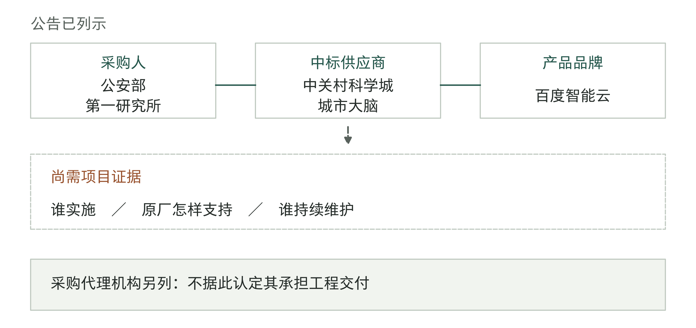

图16-2｜公告中的主体，不等于完整交付关系。上部关系据平台采购公告[3]；下部为需要继续取得的项目证据。虚线表示尚待核实的支持安排，不表示已存在分包合同。采购代理与产品服务链分列。

再把目光转回企业内部。总部可能集中采购，工厂或门店实际使用；IT部门管理账号和接口，业务部门判断输出能否进入工作。集中购买可以减少重复采购和平台维护，但各单位的规则、设备和接收方式未必相同。一个总部项目通过技术检查，不代表每个使用单位都已经具备运行条件。

企业可以按规模合并岗位。同一个人可以兼任几项职责，小企业也可能由老板、业务骨干和外部服务商共同完成。需要拆开的是决定：谁代表公司作出采购承诺，谁确认业务处理方法，谁批准系统接入，谁接收最终工作。人员可以合并，决定的依据仍要分得清。

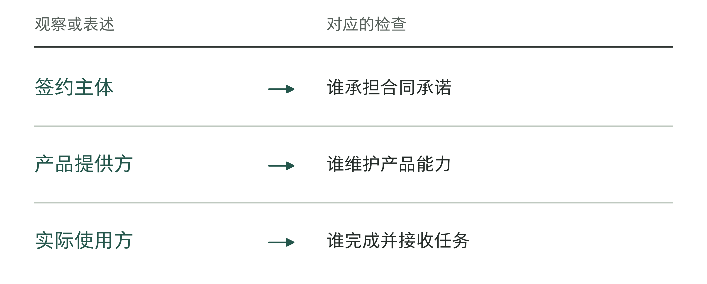

图16-3｜三类主体分别回答什么。作者分析工具；逐项确认各方负责什么，不能只记公司名称。

## 用一次交接，检查职责是否完整

岗位名称能帮助招聘和沟通，却很难单独说明一项任务会怎样完成。百度的“AI算力与大模型产品解决方案工程师”岗位描述包含客户需求、方案设计实施、项目推进，以及把需求转为标准产品功能；任职要求另列Python编程语言、PyTorch机器学习框架等实操能力。[4] 另一份“港澳琼桂解决方案架构师”描述则主要围绕标准产品推荐、演示、简单概念验证（POC，即先用小范围试验判断方案是否可行）、销售协同，并与内部技术和交付团队协调。[5]

两份材料说明，同属客户技术工作，承担的环节仍有差别。前者的工程要求不能证明每个项目都由一个人包办；后者没有明确写明由谁负责正式运行的系统，也不说明该人员没有工程能力。它们给老板的帮助，是把下一轮沟通从“你是不是FDE”变成“这段工作由谁完成，交给谁检查”。

表16-1｜把岗位描述转成项目核对，前两行为官方描述摘要，末行为作者建议

| 核对对象 | 材料已经写明 | 本项目仍须补证 |
|---|---|---|
| 产品解决方案工程师[4] | 设计实施、项目推进、产品反馈及实操要求 | 谁改实际系统，谁处理生产异常 |
| 区域解决方案架构师[5] | 标准产品售前、简单POC、协调交付团队 | 团队何时进入、接哪些材料 |
| 企业内部接口 | 依本企业授权与分工填写 | 谁确认规则、接入和业务结果 |

不必让所有人都具有同一套能力。售前人员准确筛选需求、说明产品边界，本身就是有价值的工作；危险在于项目已经跨过了其职责范围，下一支团队却没有接收。演示结束、合同签署、账号开通都可能成为交接点，每处都要知道什么材料随工作一起转移。

下面用一个独立教学设计展开，不对应真实客户。某制造企业希望用AI辅助核对设备巡检记录是否缺项，给维修计划员生成待补材料清单，暂不自动下达维修指令。业务规则由企业设备管理人员确认，交付团队负责识别记录、连接台账和实现核对，计划员接收清单并处理例外。

如果交付团队拿到的只是“提高巡检效率”，就需要计划员重新解释哪些缺项重要、哪里取得资料、什么情况下不应报缺。若企业已经交出记录样本、适用规则和未决问题，团队仍须回报哪些能实现、哪些依赖尚未满足，并由接收方确认。发出附件后，还要确认对方能否按其中的内容继续工作。

一种配置是企业有自己的应用团队，外部只提供平台和专项支持；另一种配置是外部承担实现，企业保留业务确认及技术接入。两者都可以成立。前者需要内部持续投入构建和维护能力，后者需要企业有能力说明要求、检查成果，并处理跨供应商依赖。预算买到了外部人力，不能同时假设内部协调劳动为零。

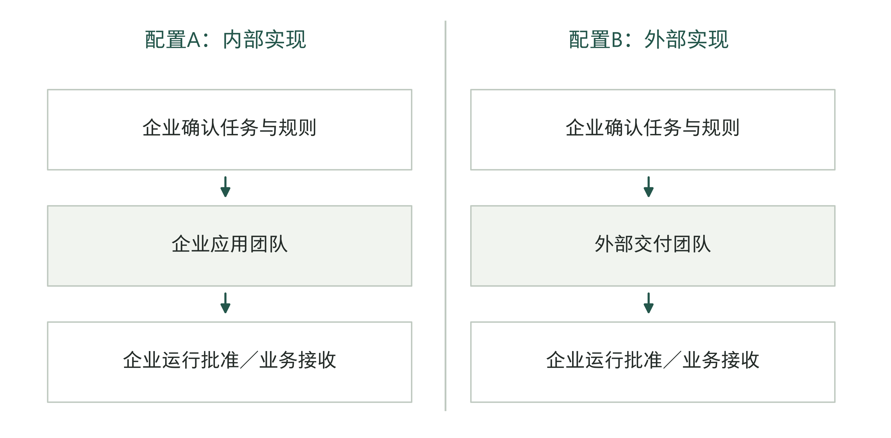

图16-4｜两种配置保留相同的交接责任。作者教学设计，两种配置不是组织优劣排名。实现工作的位置可以变化，业务规则确认、接入批准和工作接收仍须落实。每条线都需要说明交什么材料、由谁确认接收。

本章用“责任接口”记录一次交接：前一方交什么，后一方凭什么接受或退回，有争议时由谁决定。通讯录只能告诉我们联系谁，这份记录还要说明找他做什么。供应商说已经交付、内部团队却说不能用时，可以据此查出究竟缺少业务规则、技术条件、验证材料，还是双方对范围尚未达成一致。

有争议或尚不清楚的事，也要规定由谁在什么时间内处理。计划员能说明一条记录为何可疑，却未必有权改变巡检制度；工程师能提出替代实现，却未必有权增加采购范围。协调者负责把问题送到有权决定的人，并记录下一步做什么；协调者不因此取得所有业务和投资决定权。

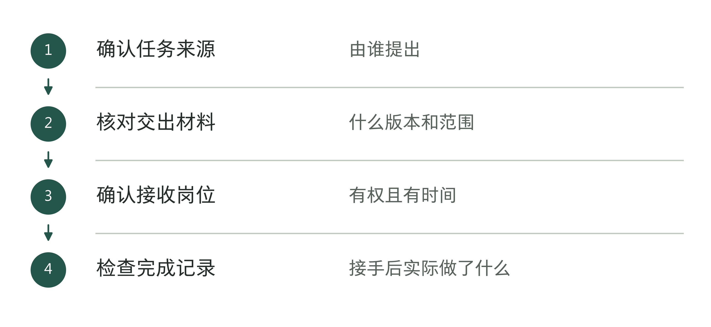

图16-5｜沿一次交接找缺失责任。作者分析工具；组织名称不能代替一次完整交接的证据。

## 部署条件会把工作重新分配

在梧州文件中，兼容要求具体写到操作系统、处理器架构和数据库，安全要求另列国产密码、权限与第三方测试；同时还要求远程协助能力，并限制未经采购人允许向第三方提供项目信息或数据。[2] 这些是该项目的要求，不能外推为中国所有企业统一的部署方式。

对交付团队来说，“支持私有化”或“支持信创”只是谈话起点。需要进入项目计划的是明确的环境和动作：哪个版本与哪种数据库一起测试，谁准备账号和安装窗口，补丁从哪里进入，故障材料能否被支持人员看到。兼容清单还要落实到测试记录，覆盖本次所用接口、文件格式和权限组合。

最容易漏掉的，是几套系统一起工作时谁来检查。原厂可能只验证了标准产品与操作系统的兼容性；集成团队还要测试客户系统的具体接口；企业IT则要批准访问和安排变更时间。各方自己的测试都通过了，整项任务仍可能做不完。实施计划应指定一个负责人，组织各方把这些条件放到实际任务中一并验证。

回到巡检记录的教学例。假设企业要求原始记录保留在指定环境，远程支持不得直接取得含设备位置和员工信息的截图。这个约束不等于供应商从此无法排障，但会改变排障材料的准备方式：企业先生成获准的错误摘要或脱敏样本，交付方在授权范围内定位，确需更多信息时再提出具体申请。

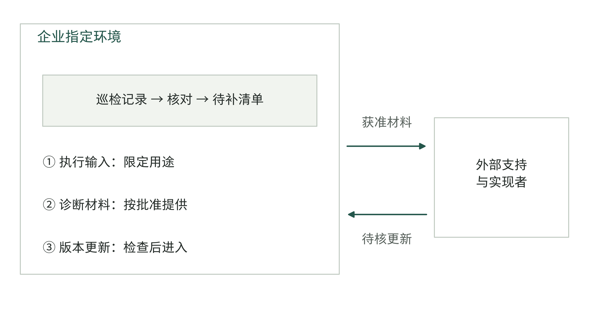

图16-6｜部署边界要覆盖三种信息流。作者教学设计。执行输入、运维材料和版本更新是不同的信息流，分别标明接收方及批准。图不规定某种通用合规部署，也不表示所有信息均可出域。

仅检查模型推理的位置，会漏掉日志、截图、备份和支持会话；仅检查数据外发，又会漏掉软件更新和远程操作如何进入。每条路径都要问：实际会带什么内容，谁能读取或改变，按什么依据允许，以及需要保留什么记录。这里是在核对项目条件；具体适用的法律、行业要求和企业制度，仍由相应负责人逐项确定。

如果参与交付的人分布在不同国家，还要把人员所在地写进这份安排。“远程工作”并不表示可以从任何国家接入。Turing平台的一则FDE岗位就要求美国公民、位于华盛顿都会区，并每周到办公室或客户现场两至三天。[6] 这是具体岗位的条件，却足以提醒我们：报价前要核实客户接受哪些地点的人员、允许他们看什么资料，以及哪些工作必须在现场完成。

沿用巡检教学例，若由客户侧负责人协调、另一国家的工程组实现功能，就应先拿一项小任务试走交接。客户侧负责人取得获准的样本和规则说明，远程组据此构建并交回版本及测试记录，企业按原有职责确认业务结果、批准发布。再模拟一次故障，检查双方不同时上班时由谁先接管、哪些排障材料可以提供。若定位故障必须等远程组上班，就把等待时间和临时人工处理纳入支持安排。普通远程会议开通了，不能据此认定生产支持也已具备条件。

部署条件也会给客户增加工作。交付方无法开通企业账号，IT需要安排；业务系统由另一家公司维护，接口修改要由有权者协调；现场设备不能随时停机，测试窗口也要与生产计划相容。把这些都写成“甲方配合”，会让每个未完成条件看起来都已有人负责，直到计划日期到了才暴露空档。

表16-2｜把部署条件落实到具体工作，作者教学设计

| 条件 | 送出方应提供 | 接收方要确认 | 不满足时的下一步 |
|---|---|---|---|
| 台账只读接入 | IT提供获准账号与接口范围 | 实现者验证所需字段可取 | 登记缺字段，交业务决定范围 |
| 含敏感信息的排障 | 企业提供获准材料 | 支持方确认足以定位 | 说明仍缺什么，再申请补充 |
| 现场版本更新 | 实现者提供变更与验证材料 | IT和业务按各自职责确认 | 确认仍适用的范围，重新安排时间 |
| 跨供应商接口 | 系统维护方给出修改及兼容说明 | 交付方完成组合验证 | 协调者召集有关负责人决定调整范围 |

约束清楚也可能减少成本。供应商提前知道只能使用只读接口，就不必先做一套后来无法获准的自动写入；支持方知道可以取得哪些诊断材料，也更容易安排排障方法。相反，若采购阶段把资料权限当作已经具备，实施阶段才发现无权提供，时间与费用的争议就会集中出现。

接口或资料尚未到位，就应把它列为未满足的条件，不能默认到了计划日期自然会有。团队可以先做不依赖它的验证，也可以缩小范围或调整顺序；需要改变承诺时，由有权决定的人确认。不能为了赶进度，让工程师自行扩大访问范围，再要求企业补签。

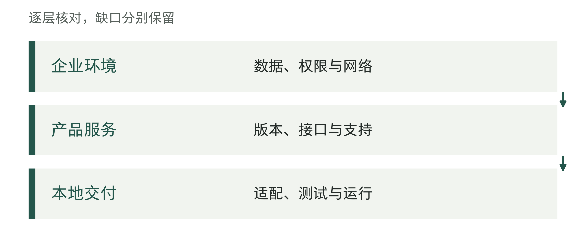

图16-7｜部署条件如何重新分配工作。作者分析工具；工作分配跟随实际条件，不按品牌名称推断。

表16-3｜部署条件变化后的接口复查（作者检查工具）

| 变化 | 需要重新确认 |
|---|---|
| 数据访问范围改变 | 资料准备、权限批准和日志责任 |
| 产品版本升级 | 兼容验证、恢复路径和维护窗口 |
| 本地交付者更换 | 材料移交、接手演练与存量任务 |

## 验收结论要有各自的依据

梧州采购文件要求先初验，再试运行并终验；测试或试运行中出现的问题要解决，技术资料、交付清单和运行维护人员培训也进入交付要求。[2] 本章关心的不只是这些步骤，而是哪些结论需要不同主体提供证据。

安全测试单位可以就其测试范围出具报告，不能因此替业务人员确认一项处理规则正确；业务使用者认可清单有用，也不能代替IT确认接入权限和运行恢复条件。采购人组织最终确认时，应能看到这些不同结论怎样对应本次承诺，而不只是把报告数量相加。

在巡检教学例中，假设抽取字段的测试已经通过，但清单仍把两类记录混在一起：一类确实缺少必填项目，另一类设备在本次巡检范围之外。这时，重新调整识别模型可能解决不了问题，需要业务负责人确认适用范围及其表示方式。测试结果把问题暴露出来，后续决定必须回到掌握规则的人。

反过来，业务规则已经说明白，系统却因接口版本不一致而取不到记录，也不能让业务部门重新表态“同意使用”来代替修复。把缺陷、尚未完成的依赖和新增需求分开，是为了找到正确处理路径，不是提前替任何一方免除责任；最终怎样承担仍须依据实际约定与事实。

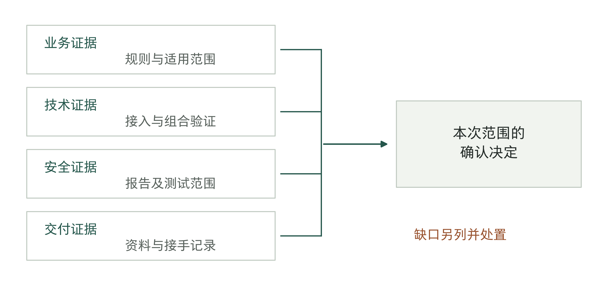

图16-8｜验收需要哪些证据。作者分析框架，受梧州采购要求启发[2]。业务、技术、安全和交付证据分别形成，共同用于确认本次交付范围；缺一类所需证据时，记录缺口及处置，不能用另一类结论抵消。

企业内部宜有人维护一份未决事项记录：问题影响哪个交付物，已有证据是什么，下一决定由谁作出，何时复查。对有争议的条目，可以先共同固定事实，再讨论处理方案。比如实际接口未提供，双方可以先确认缺的字段和受影响任务；至于是补接口、改为人工输入还是缩减范围，需要进一步按承诺和资源作决定。

这份记录还能避免各团队说的“已完成”不是同一件事。平台方说账号已开通，实施方说程序已提交，使用方却还在等业务规则确认。这三个描述可能都是真的，但整项工作仍未完成。协调者需要按同一任务、版本和使用范围核对，明确还有谁没有接收、为什么不能接收。

验收时也不应删除已经发现的限制。只在特定设备类型和记录格式下通过，就记录这个范围；另一工厂还未验证，可以保持未开放。这样，采购接受、业务使用和后续扩围有各自的依据，企业不会把一次局部通过误读为所有单位已准备妥当。

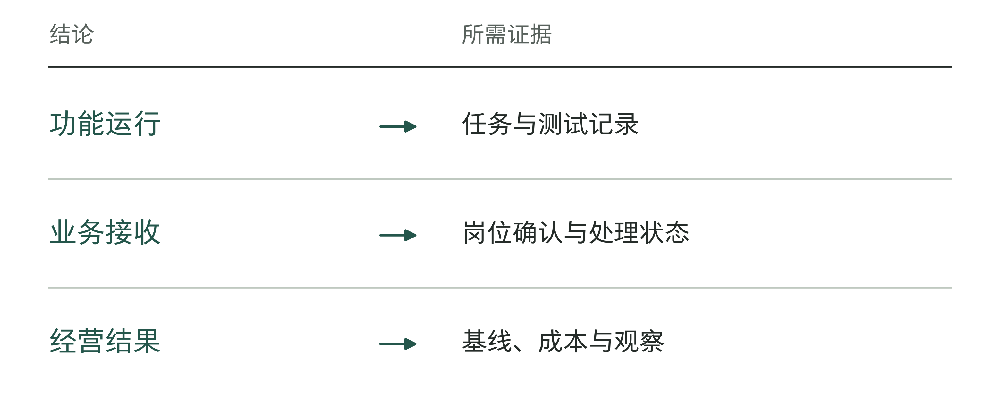

图16-9｜验收结论分别对应哪些证据。作者分析工具；不同主体签字不能自动证明同一种结论。

## 付款之后，谁处理下一次变更

梧州采购文件列明，无预付款，项目验收合格后全额支付，并按财政支付程序办理；平台维护期从验收合格起计算三年。[2] 这些条款使验收、付款与维护相连，但没有把它们变成同一个事件。公告和采购要求也不能证明款项已经支付，或三年服务已经有效执行。

对供应商，验收后的支持需要有持续人员安排；对买方，支付合同款也不等于可以撤去内部负责接收成果的业务人员。一项规则改变，外部工程师仍要知道新规则由谁确认、从哪天适用、影响哪些任务。谁掌握系统实现与谁掌握经营依据，可能一直是两个主体。

采购文件所附合同文本还要求，项目负责人及团队与响应文件保持一致，人员补换取得甲方书面同意，重要活动和在岗时间须得到保证。[2] 这是一种约束人员连续性的纸面安排，不能由此声称真实人员从未更换。企业进一步要检查的是：换人时，未决事项、版本、支持入口和权限是否一起接过去。

约定一个统一受理入口，可以减少使用者反复猜测应该联系谁。但统一入口必须能把问题送到有能力处理的一方，并持续保留处理状态。它不意味着所有问题都由同一团队亲自解决，也不意味着受理者可以替产品方或企业业务负责人作出承诺。

涉及多家供应商的支持，最好在第一次需要它之前就核对一次：应用方是否有权取得必要产品支持，原系统维护方是否提供接口变更通知，企业是否安排业务确认者，恢复需要哪些证据。如果当前服务只涵盖既有接口，新增接口所需的费用和窗口就要另行安排。销售时口头说“都能协调”，不足以解释某一方没有服务义务时谁补上这段工作。

在巡检教学例中，假设原台账供应商更改了设备状态字段，巡检辅助程序由另一家服务商维护。前者知道字段为何改变，后者掌握核对逻辑，设备管理人员知道哪些设备本来就不应进入本轮任务。任何一方单独修改，都可能遗漏另一段条件。

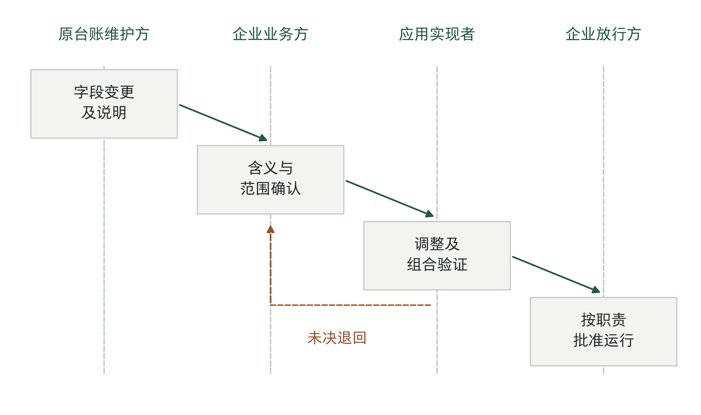

图16-10｜一次跨方变更怎样走完。作者教学设计。台账变化先形成说明，企业确认业务含义与范围，应用实现者调整并验证，再由企业按职责批准运行。退回路径保留未决问题，不代表真实客户曾发生该事件。

同样需要核对供应商留给企业的材料。梧州所附合同文本对报告、资料、文件和服务成果写有权属要求。[2] 这不能直接说明底层商业软件的所有代码都已交给采购人，更不证明另一团队已能接手。第14、15章分别讨论了交给别人使用后的验证和替换负担；在本章的责任图上，要把这些材料的保管者、更新者和使用条件落实下来。

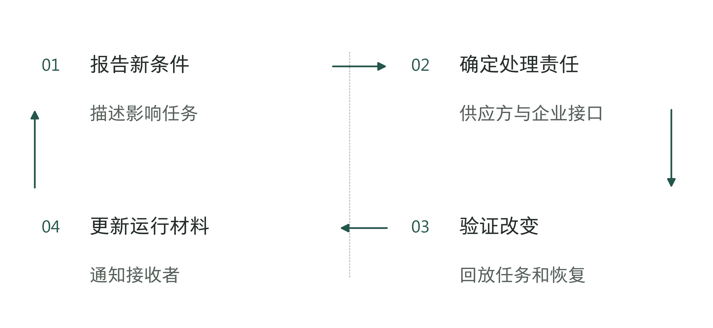

图16-11｜付款之后的变更由谁处理。作者分析工具；运行期间仍要定期确认各方负责什么。

## 老板怎样检查这条链

老板不必亲自主持每场技术会议，但应当能够找到一项工作从要求到接收的完整依据。可以从最近一次交接抽查：接收方拿到了什么，哪些条件尚未满足，谁作出了下一决定。若得到的只是几个团队各自的完成报告，就让协调者把它们对齐到同一个任务、版本和使用范围。

章末工作表用于记录一项真实交付，沿需求确认、资料授权、构建集成、验证、业务接收、采购付款、运行维护和经验反馈八个接口填写。每项都写承接者与接收依据；采购付款一行还要把验收确认与实际付款状态分开记录，不能用合同中的付款条件代替已经发生的付款。没有独立部门的，由实际兼任者填写。留空并指定补齐动作，比凭职位名称推定有人负责更有用。

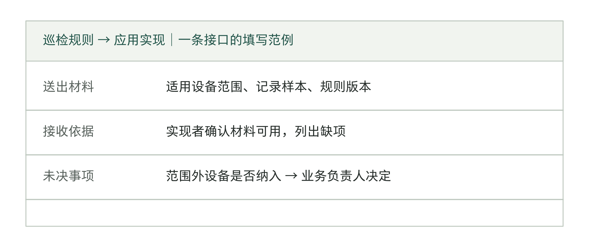

图16-12｜交接记录要比联系人名单多写什么。作者填写范例，沿用巡检教学设计。只填岗位名称还不够，记录还要写清交什么材料、凭什么确认接收、未决事项由谁决定。这张表用来追查实际工作，不用于评定岗位资质。

这也给出选择交付组织的依据。如果企业已有工程团队和稳定的平台运维，外部力量可以集中补充专项能力；如果企业依赖集成商，应重点检查其能否协调产品方、原系统维护方和业务人员；如果只是购买标准工具，就确认本次任务确实能在已有能力和授权内完成。选择应随任务依赖改变，不能由“自建先进”或“外包省事”提前决定。

渠道能够带来客户现场知识、集成能力和支持覆盖，也会增加需要协调的接口。判断一层中间服务是否有用，应看它实际承担了哪些原本无人负责的工作，以及是否为这些工作提供了可验证的承诺。公开采购中的某一种安排，只是一个可分析样本，不足以代表所有中国企业的最佳路径。

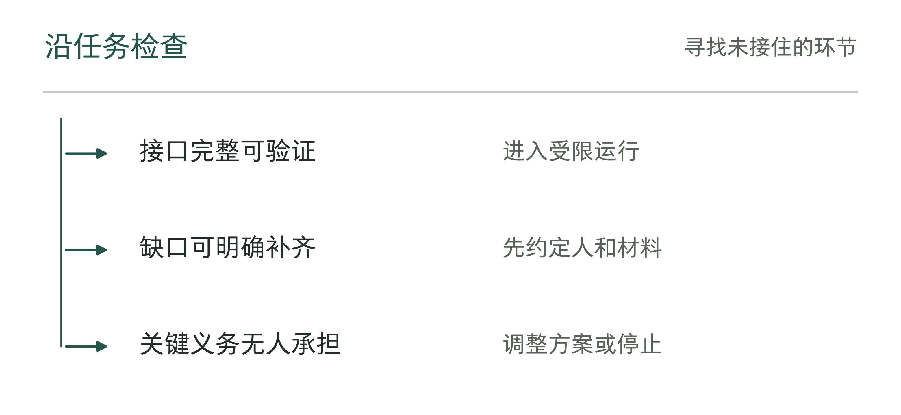

图16-13｜责任链核对后怎样决定。作者分析工具；责任链的终点是实际接手，而不是联系人名单。

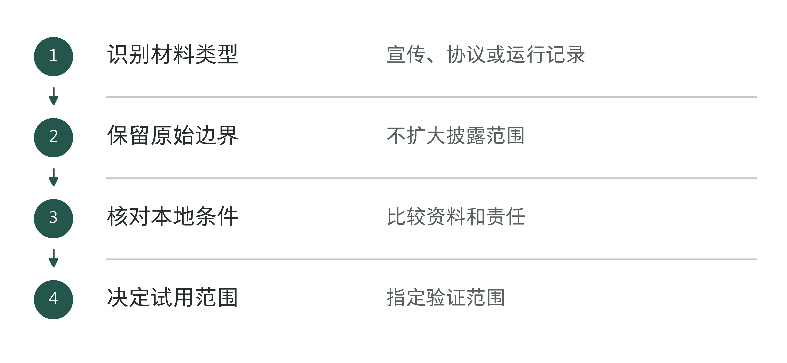

图16-14｜中国实践材料怎样支持本企业判断。作者分析工具；外部案例提供线索，本地条件仍须核验。

表16-4｜三方会议的任务回放单（作者检查工具）

| 回放位置 | 指定哪个回答者 |
|---|---|
| 任务是什么、怎样算完成 | 实际业务负责人 |
| 功能与版本限制 | 产品或技术维护者 |
| 适配与交接经过 | 实际交付负责人 |
| 异常与后续工作 | 获准负责运行的人员 |

无论采用哪种组织方式，都需要有人查清任务、在授权范围内实现功能、检查成果，并处理后续变更。职位名称可以不变，人员也可以来自不同机构；要明确的是每一步谁来做、交出什么、由谁确认。

分清外部团队的责任后，企业还要回答一个内部问题：过去的经验现在还适用吗？谁能修改它，后来接手的人又该怎样使用？供应商可以维护系统，但经验背后的业务依据需要企业自己保管和核对。下一章讨论怎样把个人经验记录下来，让别人能够理解、检验和更新。

## 资料与说明

[1] 中国政府采购网，梧州社保RPA数字员工服务采购成交结果公告，2025年5月20日，[官方公告](https://www.ccgp.gov.cn/cggg/dfgg/cjgg/202505/t20250520_24621872.htm)。S181，C434。用采购人、成交供应商及采购代理分栏，不将成交或服务期限当实际履约。

[2] 梧州市社会保险事业管理中心，社保RPA数字员工服务采购竞争性磋商文件，2025年5月，项目编号WZZC2025-C3-990088-GXSL，[官方DOC附件](https://oss-gxhlw.unicloudgov.com/guangxi-gov-open-doc/1023FP/undefined/450406/10007282919/20255/d3a6b151-9124-4e3a-b81d-c02860bb0557.doc)。S182，C433—C438、C890、C892。定位：第二章1.1、1.6及商务条款二至五、九、十一；第六章第二条。该章为合同文本模板，非已取得的签署合同；正文以条目定位，重排页数会变化。

[3] 中国政府采购网，某研究所AI模型与智能体统一研发平台软件采购项目中标公告，2025年11月27日，[官方公告](https://www.ccgp.gov.cn/cggg/zygg/zbgg/202511/t20251127_25777050.htm)。S058，C891。定位三、四、九；只支持公告列示的主体与品牌，不推定分包关系或原厂人员投入。

[4] 百度，AI算力与大模型产品解决方案工程师J58750，[官方岗位](https://talent.baidu.com/jobs/detail/SOCIAL/8152efe0-e609-4eda-95fc-cc23a32f1074)。S114，C188。工作职责及任职要求，页面日期2026年7月21日。

[5] 百度，港澳琼桂解决方案架构师J103970，[官方岗位](https://talent.baidu.com/jobs/detail/SOCIAL/5b98e726-e3ac-4aa4-ac04-d350fce31c97)。S118，C192。工作职责及任职要求；本次页面日期2026年9月4日，较旧归档变化，不据此推断新增岗位。

[6] Turing，Forward Deployed Engineer，[官方岗位](https://work.turing.com/r/Wrq8XwixRE)，2026年9月17日核查。S324，C898。Citizenship、Location及工作方式条目明确美国公民、华盛顿都会区与每周两至三天到场；仅说明该岗位条件，不推定其他岗位或美国项目的一般要求。

梧州案例依据官方公告与采购文件，尚未取得签署合同、验收报告、付款和实际维护记录。岗位描述不证明人员实际工作或市场规模。

巡检场景、配置比较、图16-4、图16-6、图16-8、图16-10、图16-12及行动工具均为作者设计，不代表真实客户经历。部署核对表用于组织工作，不构成对任一企业适用法规的完整判断。
