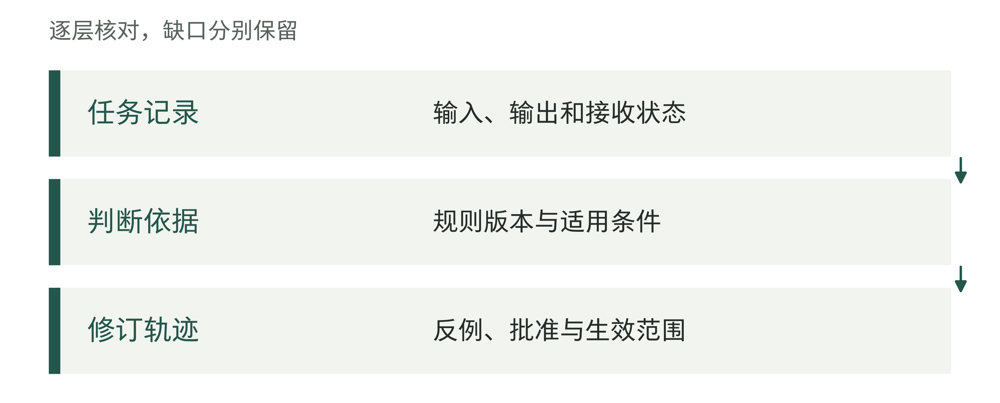
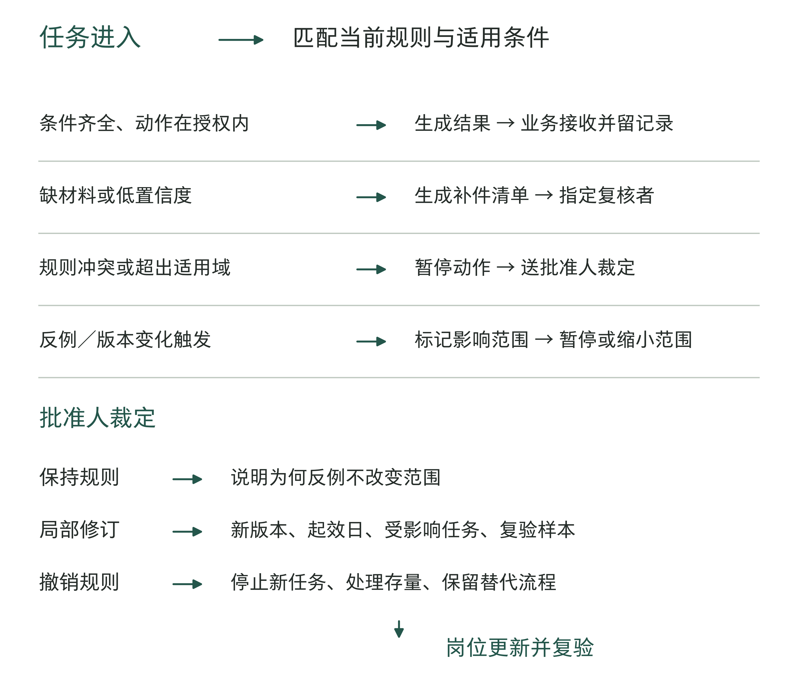
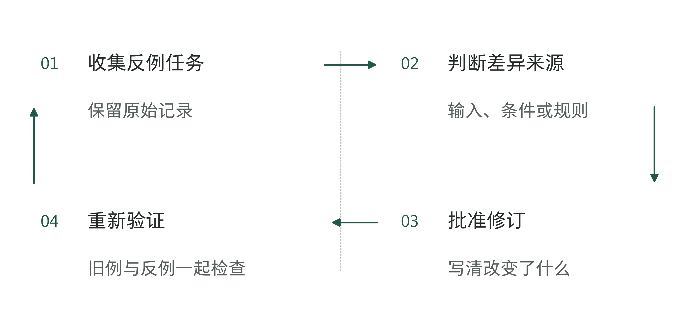
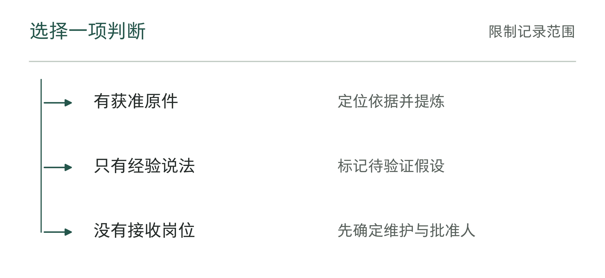

# 第17章 从老板经验到数字岗位：把实践变成组织能力

采购、业务、IT和供应商之间的接收责任明确以后，企业还要回答：接收者依据什么判断工作做得对？这涉及经验从哪里来、谁确认它，以及条件变化后谁修订它。

老板可能说过一句很有用的话：“这类客户，月底前可以灵活处理。”熟练员工也许知道这句话只适用于某种客户、某个时期和某种付款风险。若把这句话直接塞进数字岗位，系统可能把它理解为一条没有范围限制的授权。它可能在下一笔订单中替老板放宽条件，也可能把一条过时的例外规则当成当前政策。

一句经验之谈，要经过哪些检查，才能成为大家遵守的规则？先问清当时的情况，再检查反例，最后由有权决定的人批准，并写明适用范围。数字岗位只能按获准的版本工作；遇到材料不足或规则冲突，就交给负责人处理。条件变了，还要重新检查，必要时修改或撤销。

## 先别把老板说过的话当成规则

设想一家制造企业的财务团队使用一个数字岗位，协助检查订单是否可以采用月底结算。过去，老板曾在客户临时遇到现金周转困难时口头同意过一次延期。几个月后，一名熟练员工遇到新客户，也把这句话转述给系统：“老板说过，大客户可以灵活处理。”

但财务系统中的现行规则写得更窄：只有完成信用评估、已有履约记录，并由财务负责人在订单上确认，才可以进入例外流程。新客户没有履约记录，所谓“大客户”也没有定义。此时数字岗位若直接给出“可以延期”，就把个人记忆变成了未经批准的业务动作；若只回答“老板以前同意过”，则把出处误当适用依据。

这时应先暂停对这笔订单的例外处理，保留订单和冲突记录，由有权者确认。系统仍可列出缺少的信用材料、标记当前规则版本、准备付款条件的影响说明；例外范围须经批准后才能扩大。

这里至少有四种状态，不能混在一个“知识库答案”里：

表17-1｜一条经验在组织中的四种状态（作者框架）

| 状态 | 它说明什么 | 数字岗位可以做什么 | 不能据此做什么 |
|---|---|---|---|
| 个人线索 | 某人记得过去发生过某种处理 | 记录来源、任务和待核问题 | 当作现行政策执行 |
| 候选经验 | 已补充条件、依据、例外和可能后果，仍待批准 | 提醒适用条件，安排复核 | 自动改变订单或规则 |
| 现行规则 | 有权角色批准了具体版本和适用范围 | 在范围内执行、解释、留痕 | 推广到未覆盖客户或新版本 |
| 失效／争议项 | 条件变化、反例或批准撤回使依据不足 | 暂停相关动作、转负责人、记录影响 | 在依据不清时沿用旧答案 |

第9章区分资料的用途，这里还要区分经验的状态。同一份材料可以被正确取回，却仍处于待确认或已失效状态。岗位据此决定当前动作能否继续。

图17-1｜经验材料在规则形成中的地位。作者分析工具；三个层次应分别保存，不能直接画等号。

表17-2｜经验原话转规则前的保留项（作者检查工具）

| 保留项 | 记录方式 |
|---|---|
| 原始材料 | 位置、日期与获准使用范围 |
| 事件条件 | 对象、输入、参与者和结果 |
| 材料性质 | 原话、编辑提炼和已批准规则分别标记 |

## 把一次判断拆成可以检查的经验

“老板通常会同意”不是可交接的经营依据。要把它变成候选经验，至少需要回答六个问题：当时处理的是什么任务？哪些条件使判断成立？依据是哪一份规则、事实或风险信息？哪些情形被排除？谁能批准例外？何时需要重新检查？

可以把原来的口头话改写成一份带批注的规则草案：

表17-3｜把口头经验写成规则草案

| 原句或补充 | 规则草案 | 为什么要改 |
|---|---|---|
| “大客户可以灵活处理。” | “对已完成信用评估、过去两个结算周期无逾期且订单金额低于本级限额的客户，可申请一次月底结算；不含新客户、逾期客户和预付款未确认订单。” | 把模糊对象换成可检查条件与排除项 |
| “老板以前同意过。” | “该例外源于2026年×月订单A-017；当时由老板确认，财务负责人记录理由；该记录只能作为候选经验，不自动覆盖现行规则。” | 把记忆与授权状态分开 |
| “系统可以判断是否放宽。” | “系统仅检查材料、匹配条件并生成申请；财务负责人确认后，系统才可生成待执行付款条件。” | 把建议、批准和执行分开 |
| “以后都按这个做。” | “本版本适用于华东工厂的B类客户，试行至2026年×月×日；出现逾期、规则变更或两次退回即复查。” | 写明适用范围、期限和何时失效 |

改写后的草案分清了各方职责：老板过去的决定是可追溯的线索，财务负责人确认适用范围并批准例外申请，数字岗位检查材料、提示缺项和记录依据。草案经有权者确认后，才成为可执行的规则。

经验材料还应保留三类反例：同一条件下结果不同，条件已经改变，以及原判断依赖了未记录的信息。它们帮助确认适用范围；个别顺利结果不足以支持无条件沿用。

这份付款例外规则稿是作者教学设计，展示从口头经验到候选规则的改写；它不对应真实客户制度。作者材料的使用与证据边界见章末说明。

图17-2｜把一句判断改写为可核对规则。作者分析工具；规则是待检验的表达，原始材料仍要保留。

表17-4｜候选规则的反例检查单（作者检查工具）

| 问题 | 本次填写 |
|---|---|
| 什么条件必须同时成立？ | 待写明并附依据 |
| 出现哪一事实就应改判？ | 待列反例及原始任务 |
| 依据不足时交给谁？ | 待写明有权接收者 |

## 数字岗位应留下哪些工作产物

如果岗位的唯一产物是“可以”或“不可以”，组织很快会失去判断依据。一个有真实职责的数字岗位，至少要交出四类东西：当前任务的处理结果、所依据的规则或事实、尚未解决的争议、下一位接手者需要做什么。

以刚才的付款例外为例，岗位收到订单后，应该形成如下记录：订单属于什么客户类别；使用的是哪一版规则；信用材料是否齐全；历史案例是否与当前条件相同；是否触发例外；若不能自动处理，缺什么材料、谁批准、何时复查。它可以生成申请，也可以把订单留在待确认状态，但不能把“待确认”伪装成“已通过”。

岗位职责还须明确：产物何时使用、交给谁、谁可以修改，以及修改会影响哪些任务。表17-5将这些条件与每个环节留下的记录对应。

表17-5｜数字岗位要完成工作，企业需要准备什么（作者框架）

| 岗位环节 | 必须留下的产物 | 对应组织条件 | 缺失时的处理 |
|---|---|---|---|
| 接收任务 | 任务对象、客户类别、输入版本 | 有明确接收者和任务范围 | 不进入自动处理，补齐任务卡 |
| 检查依据 | 规则版本、事实来源、匹配条件 | 资料有用途和适用日期 | 标记依据不足，转人工核对 |
| 生成建议 | 建议、例外理由、预计影响 | 允许的动作和输出范围已批准 | 只保存草稿，不产生业务写入 |
| 处理争议 | 冲突双方、缺少事实、升级对象 | 指定裁定人，并安排处理时间 | 进入未决事项队列 |
| 完成交接 | 结果、批准记录、接收确认 | 业务接收者有时间和替补 | 保留为待处理，不宣布完成 |
| 反馈修订 | 反例、影响范围、复查日期 | 有规则维护者和撤销路径 | 暂停受影响版本并重审 |

其中最容易被删掉的是“处理争议”。企业常把它看成系统不够聪明的失败，但在经验尚未稳定、规则互相冲突或条件变化时，争议本身就是重要信息。岗位如果能准确指出“当前材料支持不了这个动作”，就已经替组织避免了一次无依据的扩大授权。

这些职责都占用人员时间：转交人工的订单需要复核，规则修订需要确认影响，被撤销版本可能留下补处理任务。若财务负责人每周只有一小时，却有一百笔例外申请，就要调整范围或安排更多复核人手，否则未决事项会持续积压。

替补接手时，需要知道当前规则版本、未决事项、已经发生的动作和仍不能处理的事项。外部交付方可以搭建流程，企业保留规则、批准和接收责任。这是责任交接中的记忆部分：交出程序，也交出适用依据与限制。

图17-3｜数字岗位留下的三层产物。作者分析工具；记录要能供人使用，也要能查来源、作修正。

## 让反例真正改变规则

一种常见的敷衍做法，是把反例放进案例库就算处理完了，既不复查规则，也不调整处理方法。案例越来越多，岗位仍按旧规则回答；或者为了保持表面准确率，干脆把反例从统计分母中排除。两种做法都会遮住需要复查的信号，使团队无法判断旧规则是否仍适用。

以付款例外为例，出现下面三种事件时，岗位应采取不同动作：

1. **条件变化。** 公司把信用等级规则从三级改为四级。即使模型、接口和提示词没有变化，原候选规则也不应自动继续适用。先标出受影响客户和订单，再由财务负责人确认映射或暂停。
2. **同条件反例。** 两笔都满足旧条件的订单，一笔正常结算，另一笔发生严重逾期。岗位不能只保留正常样本；应检查还有哪些条件不同，必要时缩小适用范围，并把风险决定交给批准人。
3. **重复异常。** 多次出现资料齐全却被业务退回，或岗位频繁要求人工补同一字段。这可能不是员工“不配合”，而是规则表达、输入字段或接收流程出了问题。先统计影响范围，再决定修订规则、补字段、改变岗位输出或撤销自动建议。

这三类事件都要求企业重新检查：原来的经验还适用于当前任务吗？未必是模型出错，也未必需要修改规则，但不能未经复查就沿用旧结论。记录中要分清旧规则的适用期、新规则的批准和生效日期，以及尚未完成的任务按哪一版处理。否则，系统可能用新规则重新判断旧订单，却说不清为什么结果变了。

图17-4｜争议裁定路径（作者教学设计）

日常裁定交给获授权的业务批准人，超出授权的范围、风险或预算事项再升级。岗位负责准备材料并保留裁定记录；一次历史批准只适用于当时确认的范围。

撤销也应被视为一种正常的组织动作。若一条规则只在某工厂、某客户类别或某版本接口中成立，企业可以保留它的历史记录，同时停止在新任务中自动使用它。关闭并不等于删除：历史订单仍需按当时有效版本解释，受影响的未决任务要有接收者，替代流程的成本和期限要被记录。第13章已经区分修复、暂停和退出；本章把同样的区分用于经验本身。

图17-5｜反例怎样真正改变规则。作者分析工具；本图适用于经复查确认需要修订的情形。反例应先形成处理决定，需要修订时再更新版本并复验；若维持原规则，也须记录理由。

沿用付款例外，把这次复查写完整。以下R1、R2、客户、日期、金额和记录均为作者教学设定；限额用来演示判断，不是授信建议。R1已获批准，只允许岗位核材料、生成申请；客户须符合既有信用条件，过去两个周期无逾期，单笔订单低于5万元，财务仍逐单批准。客户授信记录另有10万元的总限额，但R1没有把累计占用写入检查条件。

9月10日，订单T17-204申请4万元月底结算。它单笔未超限，另外两笔尚未结清的订单却已占用4万元和3.5万元；若再批准本单，总占用将是11.5万元。岗位按R1列出了“单笔条件符合”，业务接收者在批准前发现累计约束被遗漏，将其退回。原始输入、R1检查结果和退回理由一起保留，不能把这笔困难订单从记录里删去。

财务复查的结论是：已批准的R1漏掉了已有授信约束，模型按这版规则运行仍会遗漏累计占用。先暂停受影响的新增例外申请，其他资料检查继续；由规则维护者补充累计占用字段及其来源，再将修订稿交财务负责人批准。

表17-6｜规则复核与修订的版本账（已填教学示例）

| 记录对象 | 决定与依据 | 后续怎样处理 |
|---|---|---|
| R1与T17-204 | 4＜5万元，但4＋3.5＋4＝11.5万元，超过10万元总限额 | 保留R1和退回记录；受影响申请先转人工 |
| 另一条“逾期”反馈 | 银行到账凭据证实按期付款，只是内部登账迟到 | 保留无逾期条件，修正事实并记录理由；不因反馈自动改规则 |
| R2批准 | 9月12日由财务负责人批准，13日零时起限原工厂、原客户类 | 新增“累计占用加本单不得超过核定总额”；缺字段转人工 |
| 过渡中的订单 | 已提出但未执行的例外申请按R2复核，旧批准不自动续用 | 通知接收者；已执行历史订单保留原依据，风险另行评估 |
| 新任务T17-205 | 同一75,000元其他占用下，本单20,000元，总计95,000元 | 满足此项条件，仍须其余条件齐全并由财务逐单批准 |
| 回放反例 | 以R2重放T17-204，115,000元触发限额限制 | 不再生成可继续送批的普通申请；记录转人工原因 |

R2中的“其他占用”包括未结清款项与已批准但尚未执行的承诺，按订单编号去重，并排除正在计算的本单，最后再加本单一次。这样才能避免漏算待执行承诺，或将同一订单算两遍。信用记录缺失、过期或总额口径未确认时，不把空值当零；并发申请还须由同一额度管理机制在批准时核对并登记占用，执行时核对承诺及当前有效条件，避免两笔申请各自看见旧余额而重复占用。没有可靠的登记与控制机制，就由财务统一受理，不能仅凭生成申请时检查通过便继续执行。

决定保留原规则时，同样需要记录：反馈编号、核过的到账凭据、修正字段和批准人。它保留了“反馈确实被处理”的证据，而不是用“不改规则”结束讨论。规则修订则要同时回放原正常任务、触发反例和一笔新任务；只看新任务通过，无法确认旧缺陷是否消失。

这个例子也说明了各方的分工：模型帮助提取原话、定位冲突和整理申请，确定的限额计算与状态检查交给程序，组织决定哪些条件有效。新增规则得到批准，不等于模型获得扩大授信或改写付款条件的权力。读者可以按工具17-2保存本次复核决定：保留规则时记录纠正的事实与理由，修订时再填新版本、生效与过渡安排；两种决定都要有接收者。再用工具17-1核对新接手者是否知道当前版本和尚未完成的任务。

## 最小范围也能建立组织记忆

企业不必先整理全部聊天记录、所有制度和每个员工的经验，才开始建立数字岗位。一开始就整理全公司的知识，可能忙了很久仍没帮业务解决问题；只记下一句老板的原话，又不足以让别人照着处理。较稳妥的起点，是选择一类低风险、频率足够观察、条件相对稳定但确实存在例外的判断。

一个最小范围至少包括：一项完整任务；一名实际批准人；一名业务接收者及替补；一版带适用范围的候选规则；一组故意保留的反例；一条升级路径；一次规则修订或撤销演练。验收时，应选一次具体争议，检查系统能否找到依据、交给有权决定的人，并把决定交付执行。仅统计能回答多少问题，还不够。

表17-7｜老板启动一项最小组织记忆任务

| 先确认 | 具体填写 | 如果填不出来 |
|---|---|---|
| 任务范围 | 哪类订单、哪个单位、什么输入和结束状态 | 缩小对象，不先做全公司 |
| 经验来源 | 哪次真实处理、谁参与、依据和例外 | 只登记线索，不作为规则 |
| 现行规则 | 当前版本、批准人、起效日 | 保持人工确认，禁止自动动作 |
| 争议路径 | 哪些情形必须升级，谁在多久内接收 | 先设计队列与替补，再扩围 |
| 反例集合 | 至少包括条件变化、同条件差异或退回记录 | 延后放行，不把缺失样本当稳定 |
| 复查触发 | 规则变化、重复异常、范围扩张或期限到期 | 给候选规则加临时有效期 |
| 交接证据 | 接收者能否解释依据并处理一个异常 | 保留外部支持，不宣布已接手 |

老板要确认范围、指定批准人，并为处理争议安排时间和人手。业务负责人在授权内维护规则，数字岗位按规则工作，技术团队维护系统。决定是否继续投入之前，分别检查这些工作是否完成。

作者设计的付款例外练习可以在这个最小范围内运行：先不自动修改付款条件，只做材料检查和申请生成；保留一笔符合条件但被退回的订单，观察岗位是否能指出冲突；再改变信用规则版本，检查它是否暂停受影响任务；最后由财务负责人批准局部修订，并由接收者用一笔新订单复核。这个演练可以证明流程是否可检查，不能证明企业已经获得现金收益，也不能代替长期采用和结果测量。

图17-6｜材料有限时从哪里建立记忆。作者分析工具；小范围仍要保留权限、依据和更新责任。

## 让后来的人看得懂、用得上，也能修正

一条经验留给后来者时，需要连同情境、批准和失效条件一起保存。面对新任务，接手者才能判断哪些依据仍成立，哪些必须重新确认。

表17-8｜经验记录能否交给别人使用（作者检查工具）

| 检查动作 | 接手者应能做到 |
|---|---|
| 寻找依据 | 从规则回到获准原始材料 |
| 判断适用 | 说清当前任务是否在范围内 |
| 发现反例 | 留下记录并找到维护者 |
| 修正规则 | 按批准路径更新而非覆盖历史 |

一个数字岗位要让后来的人能接手，至少应做到四件事：在批准范围内完成重复工作，说清所用规则的版本，遇到争议时暂停相关动作并交给负责人，以及记录反例、协助复查。这样留下来的经验，才不只是一句“老板以前这么说过”。接手者能查清当时为什么这样决定、现在是否仍适用，以及需要修改时找谁处理。

有了可修正的依据和明确的接收者，企业才能把这些职责安排进第一个项目。第18章将按时间、所需条件和可用人手安排行动，并说明90天后哪些结论仍须继续观察。

## 资料与说明

付款例外、规则草案、图表和行动工具均为作者教学设计，不对应真实客户执行记录或已验证的经营成效。

现场观察、系统设计、持续采用与跨组织交接的方法，分别参阅第8、9、11和16章。
