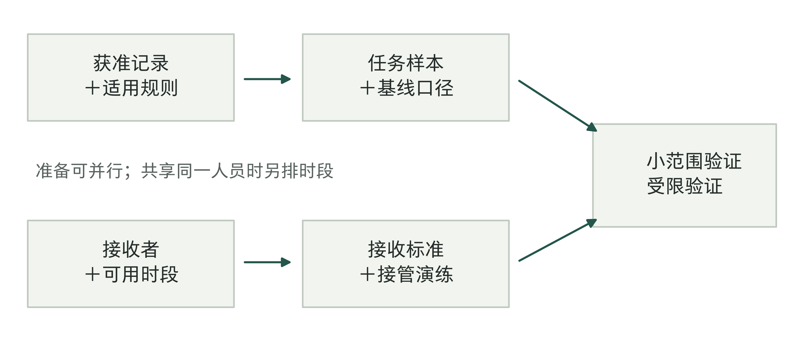
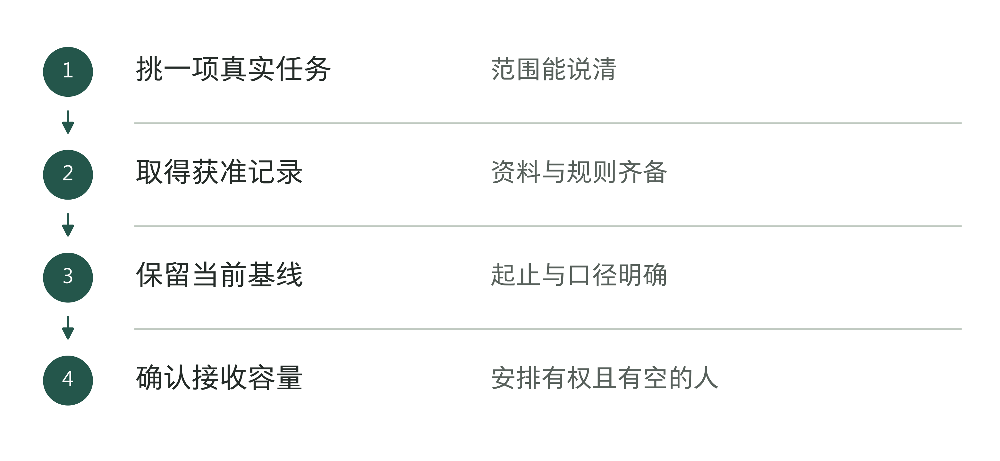
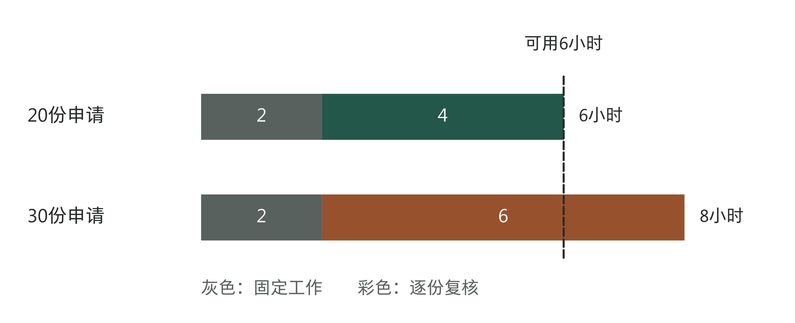
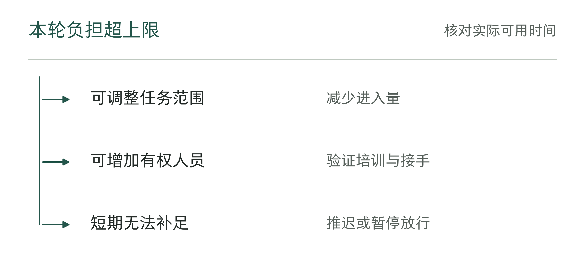
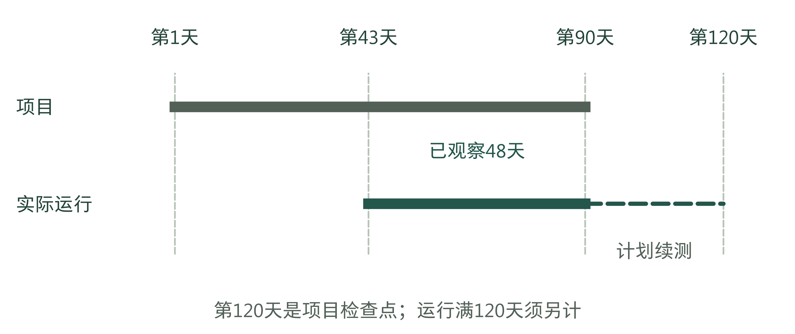
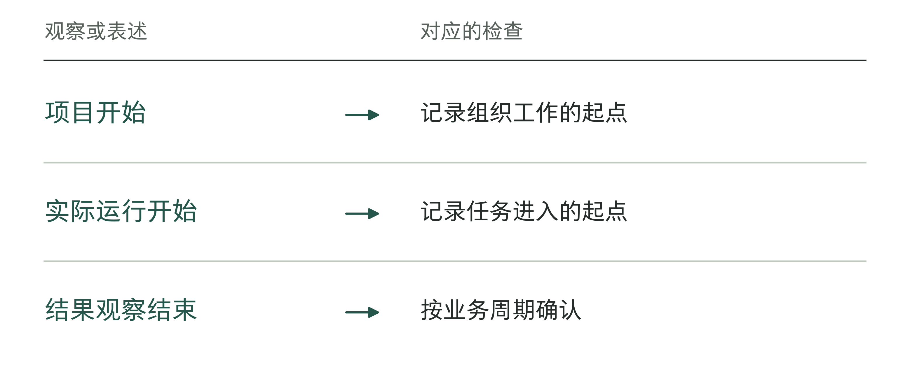
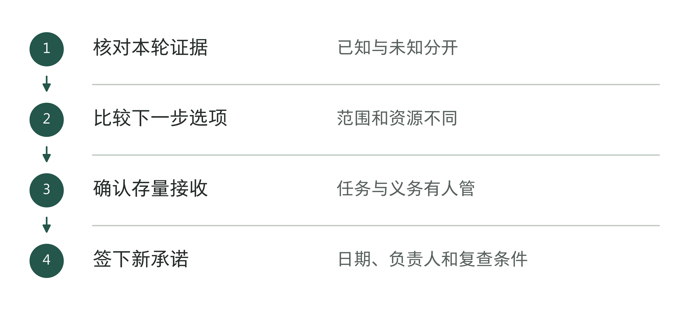
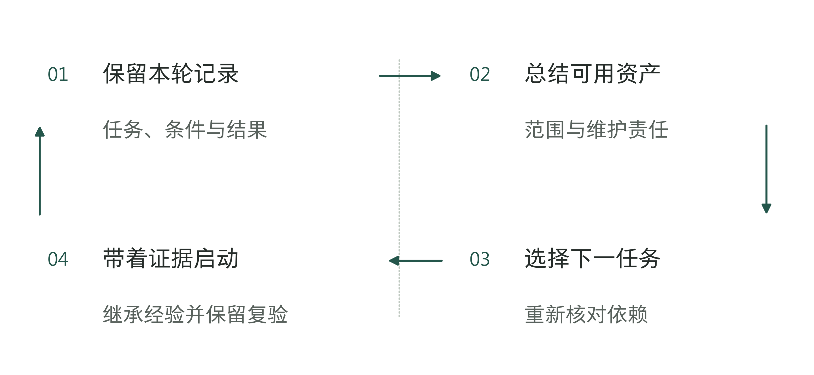

# 第18章 老板的90天行动方案：做成第一个项目

如果明天就启动第一个AI项目，第90天应该交出什么？一套能演示的系统容易辨认，一项有依据的经营决定却常被遗漏：哪些工作可以继续交给它，哪些仍由人完成，接下来还值得投入多少时间和资源？

把上一章的职责排进日程，就会发现有些工作必须先做：材料确认后才能验证，有人留出时间接收，产出才能进入业务。扩大范围还要等实际任务积累到足够数量，并经历相应的结果观察期。因此，到了计划日期，应检查条件是否满足；不能只因日期到了就进入下一步。

本章把90天设为首轮决策期：在获准范围内验证一项工作，依据记录决定继续、调整或结束。发现条件不成立并及时结束，也可以是负责任的首轮结果。这个窗口不保证按期上线、盈利或扩大部署；尚未形成的条件要留下后续安排，低频任务与收益兑现仍按各自的观察周期判断。

先把终点写成一句可以核对的话：“到第90天，由指定负责人依据本轮记录，决定下一阶段允许的任务范围、资源上限、接收安排和复查条件。”有了这个终点，五个阶段才有共同方向。

表18-1｜90天分支日历：日期触发核对，证据决定去向（作者方案）

| 建议时段 | 谁交出什么 | 本次决定与不满足时的去向 |
|---|---|---|
| 1—14天 | 业务负责人交问题、基线及材料清单；批准人确认范围、人员和可用时间 | 批准小范围验证；材料缺失则限时补条件或换题 |
| 15—28天 | 交付负责人交限定范围的设计、离线验证与接管演练记录 | 批准下一种运行方式；缺陷未解则留在验证 |
| 29—56天 | 运行负责人交实际任务状态、异常及新增人工劳动 | 依据证据保持、缩小或逐步放行；异常立即处置 |
| 57—84天 | 业务负责人会同技术、财务核对质量、采用、成本与未决义务 | 形成下一阶段选项；观察不足则限定续测 |
| 85—90天 | 决定人核对依据；接收者确认存量工作与后续责任 | 签下继续、调整或结束的决定；无人接手则保留支持 |

前四段合计12周、84天，最后6天专门留给核对、交接和下一阶段安排。各单位应按真实工作日、节假日和业务周期安排人员。表中没有给出一个行业通用工期，也不要求所有工作等到下一阶段才启动；已经满足依赖的准备可以并行，任何时点触发停止条件，都应立即处理。

## 先批准取得证据的工作

第1天最有价值的承诺，往往还不是采购整套系统，而是让业务负责人带着一项真实任务，拿出可验证的输入和结束状态。第4章的问题卡与第5章的投入、基线工具已经说明这些内容怎样填写。此时需要据此作出决定：为了判断这项任务能否进入小范围验证，本轮允许谁做哪些工作，最多用多少资源，什么时候回来说明结果？

以一家设备服务企业为例。以下全过程都是教学演练，日期、工时和决定均为假设，不对应真实客户。团队选择“备件询价材料核对”：接收内部询价申请，核对设备型号、所需部件和附件是否齐全，生成带依据的缺项单，由业务人员接收。首轮不报价格、不替客户选兼容件、不创建采购订单，也不向外发送承诺。

这个范围看起来很小，却有真正的结束状态：业务接收者能够据缺项单补齐材料，或者将无法判断的申请送给指定技术人员。系统只输出一串“可能缺少的信息”，没人知道补什么、向谁补，任务就没有完成。老板要确认做哪些工作、怎样验证，而不是“让AI接管备件业务”。

第1—14天需要先查清一条依赖链。获准使用的申请记录在哪里？型号的有效写法由谁确认？谁判断一张缺项单是否可用？接收者在本月是否有时间参加？在这些问题解决之前，工程师可以试做结构或使用明确的合成材料调试，但不能把合成数据上的顺利运行当成真实业务已通过。

图18-1｜证据依赖图。两条准备线汇合以后，才有条件验证完整任务。箭头表示依赖，不表示预计工期；作者方案。

一种常见卡点是旧申请只存了最终结果，没有当时的附件和人工补件记录。团队无法据此还原原流程，便不能填出可靠基线。此时可以先批准一项记录工作：由业务负责人在获准范围内收集接下来发生的申请，记录输入、补件、处理劳动和接收状态，并按约定方式记录结果和成本；资料负责人同步确认这些记录能否用于本次验证。生产自动动作继续保持关闭。

补条件也应有上限。例如这次演练将复查安排在第14天：若合法可用的记录仍无法取得，或业务方仍不能指定接收者，决定人选择换题、结束本轮，或为已有明确办法补齐的材料另定期限和资源上限。不能只把日期顺延，再让接口开发持续消耗资源。换题也要重新检查问题和基线，不能把原项目已经花掉的时间当成新项目取得的证据。

有些准备确实可以并行：资料负责人整理可用记录时，交付负责人可以确认内部只读环境和现有接口；业务负责人可以安排接收者及替补。它们没有相同的前置输入。不过，三条线上若都要同一位技术主管确认，排期就必须错开。图上的并行箭头不创造这个人的时间。

图18-2｜第一个窗口怎样交出可验证输入。作者分析工具；输入和接收条件一起支持后续验证。

表18-2｜启动前的缺口与去向（作者检查工具）

| 缺口 | 先做的工作 | 仍不满足时 |
|---|---|---|
| 资料未获准 | 确认访问与使用范围 | 缩小任务或换题 |
| 基线不可回放 | 保留一批完整记录 | 先补观察 |
| 负责接收的人手不足 | 核对可用人员与时间 | 限流或推迟 |

## 按实际可用的人手排期

进入第15—28天之前，问题范围、最低可用输入和接收责任应已经形成。交付负责人据此提交限定范围的设计与验证安排；业务负责人确认验证材料所代表的工作，技术人员确认动作边界，获授权的决定人判断能否进入下一种运行方式。第9、10章的工具承担具体技术检查，本章只追问这些工作之间何时可以交接。

离线验证没有通过，就留在离线阶段修正。通过之后，可以先做隔离的影子运行；若已有与后果相称的证据和批准，也可以进入很小的实际使用范围。影子与实际运行的选择取决于未知问题：要看真实输入会怎样变化，可以采用影子；要判断接收者会不会真的使用结果，则最终必须在获准实际任务中观察。影子结果不进入业务决定，因而不能单独证明真实采用。

排程时尤其要把复核劳动放到真实人员名下。设这次演练中，技术主管每周可给项目6小时；固定协调和异常准备占2小时；每份进入首轮实际运行的申请预计需要12分钟复核，而且首轮全部复核。余下4小时对应的规划上限是20份。这个数字来自假设工时，只能用来安排初期任务量，运行中还要按实际劳动修正。

图18-3｜复核所需时间对照。同一位复核者的6小时不能支持30份申请。固定工作2小时，20份复核4小时；30份需要6小时复核，总计8小时。全部为教学假设。

如果计划每周进入30份，需求就比可用时间多2小时。团队有几种选择：先限为20份，其余申请仍按原人工流程处理；安排另一名具备相应判断能力的人承担明确任务并完成接手验证；或者延后这段试点，先释放技术主管的时间。降低复核要求只能来自新的质量证据与批准，不能用来让日历看上去按时完成。

这也解释了为什么“保持原人工流程”不等于没有成本。原流程要继续处理未进入试点的申请，参加复核的技术主管也可能来自同一支队伍。业务负责人需要同时核对两边的排班，不能把试点外的劳动从人员工时表里删掉。若突发异常占用了原预留时间，新接任务量应随之减少；20份是本次假设下的上限，不是必须完成的配额。

第28天的决定因此应带着资源条件：“允许哪些申请进入，用哪版系统，谁接收，最多允许多少进入，什么情况下减少或停止。”仅写“技术测试通过，按计划上线”，遗漏了最可能使下一段失效的人员约束。负责人可以委托具体复核，但要确认接受委托的人确实有空，并知道哪些问题应当升级。

图18-4｜任务超过复核能力时。作者分析工具；不能用日历承诺替代实际处理能力。

表18-3｜什么时候需要重算人员工时（作者检查工具）

| 实际变化 | 重新计算什么 |
|---|---|
| 每份复核变慢 | 逐份劳动与可接入任务量 |
| 固定工作增加 | 剩余可用时间 |
| 关键人员缺席 | 可接收的任务范围 |
| 异常比例变化 | 接管劳动与排期 |

## 运行以后，还要继续查什么

第29—56天，运行负责人记录每份任务的处理状态，业务负责人确认是否接收，交付团队处理问题。每周用同一份记录检查：哪些任务还没处理完，原定条件变了什么，下周需要怎样调整。未决事项写明负责人和期限，重大异常立即处理，不必等周会。第11、12章的工具可以继续使用，分别检查实际使用和经营结果。尽量沿用基线的对象和统计口径；如果变了，就说明原因，以及哪些数据还能比较。

询价材料核对的首轮运行，即使没有自动对外动作，也可能暴露新的困难：缺项单写得正确，业务人员却不知道从哪个附件补；技术主管反复被要求解释同一型号；一类申请被频繁退回。此时应区分输出质量、接收时遇到的困难和范围不适用，分别送回设计、运行安排或业务决定。把所有退回统一写成“员工需要培训”，会使下一轮改错地方。

质量异常不等第56天才处理。若发现系统混淆了两个型号，先停止受影响范围的新自动建议，核查已经产生的缺项单及其去向，由业务人员处理已经进入流程的申请。影响是否仅限一个型号尚未查明时，暂停范围应覆盖这一不确定性，不能先按最小范围宣布问题已控制。

表18-4｜三类偏离，三种下一步（作者方案）

| 发现什么 | 当下由谁做什么 | 下一承诺需要的依据 |
|---|---|---|
| 资料仍不足，验证无法代表真实任务 | 业务与资料负责人限时补记录；交付方停止依赖该记录的放行工作 | 输入可用、范围可判；否则换题或结束本轮 |
| 质量异常或作用范围不明 | 运行负责人限制动作，业务方接手已有任务；交付方查影响并修复 | 受影响任务处置、修复及控制复验，由指定人批准恢复 |
| 实际任务少，结果周期未走完 | 业务负责人保留原范围，登记已观察与未观察部分 | 新观察机会、截止点、容量与停止条件；不足则缩小结论 |

修复后继续运行，并不要求把整张日历重置为第1天；但受影响版本的验证和观察需要重新判断。若只改了缺项单的说明格式，可能只需补对应接收证据；若型号匹配逻辑改了，旧版本的正确率不能无条件并入新版本。第14章已提供判断验证能否沿用的方法，这里将结论落实到排期：哪些证据保留，哪些重取，因此哪一天能够再作什么决定。

第57—84天开始准备下一阶段选项，而不是最后一周才找数据。业务负责人核对同一批任务中有多少被实际接收、为什么留在未决状态；财务人员核对新增支出和劳动去向；技术及服务方说明维护、支持与未经历的变更。若节时尚未形成可避免支出，就报告可用时间增加了多少；若本来追求的是质量或服务改善，也应说明企业愿意为这种价值承担多少持续成本。

这时还容易把项目已经持续多久，误当成实际观察了多久。项目从第1天算起，实际任务却可能到第43天才开始进入。到了第90天，只经历了第43—90天这48个日历日；项目开了三个月，不等于观察了三个月。低频任务即使等待更久，也未必发生了足以支持原定结论的情形。

图18-5｜观察时间图。项目日历与实际观察的起点不同。教学中第43天起实际运行；第90天核对首轮决定，第120天再复查，仍须按实际任务与结果周期判断证据是否够用。

对于每月集中发生的询价或季度才见到结果的工作，历史回放可以补充困难情形，演练可以检查停止和接手路径；它们不能替代新流程中真实用户的采用，也不能提前证明后续经营结果。等待期间仍有运行、支持和机会成本。决定人需要知道延长观察具体会增加哪一类证据，以及这类证据是否可能改变下一阶段的选择。

第11章使用过30、60、120天的复查建议。本章的90天不会取消其后续观察责任，各项目应写明那些日期相对什么起点。在图18-5的例子里，第120天是项目日历上的又一个检查点，从第43天开始只有78个日历日的实际运行窗口；它不是“已观察120天”。若目标是观察实际运行满120天，就应另设相应截止日期，并检查业务周期是否也已覆盖。

“延长到120天再看”仍不够具体。记录中应写明届时要核对什么任务、由谁取证、是否改变当前运行范围，以及证据仍不足时怎么处理。仅因期限到了再次延期，会把一个有限试点变成无人重新批准的长期服务。决定人也可以选择不再为某项难以取得、且不太可能改变选择的证据继续投入，保留人工方式或结束该范围。

图18-6｜项目时间和结果观察时间怎样报告。作者分析工具；三个日期各有用途，不能替换为同一个天数。

表18-5｜运行窗口结束时保留哪些未知（作者检查工具）

| 未知项 | 后续观察怎样安排 |
|---|---|
| 任务数量不足 | 限定续测范围与资源，不扩大结论 |
| 业务结果尚未兑现 | 按真实结果周期继续核对 |
| 新增人工负担不清 | 补任务与工时记录后复算 |

## 最后六天，把下一笔承诺写下来

第85—90天用来核对记录，作出本轮决定。决定人先确认任务范围和版本没有在汇报中被扩大，再将运行记录、采用与结果口径、尚未解决的问题放在一起。继续运行和批准新增范围要分开：一个点位可以使用，不代表第二点位已经具备资料、人员与授权；一支队伍能完成当前任务，不代表外部支持已经可以撤走。

接手也必须发生在这六天之前或期间，而不是以“文件已发送”代替。指定接收者确认尚未完成的任务、异常、版本和支持安排；第16章的责任接口工具、第17章的组织记忆工具分别帮助核对“谁来接手”和“按什么依据工作”。若接收者未能完成必要验证，应保留有上限的支持或回到原人工路径，再记录新的交接日期。停止新增建设不等于停止处理存量工作。

下面是一份缩写的教学决定记录。它不是一家企业的成功公告；“记录支持”的前提也属于演练假设，用来检验作出的决定是否超出了已有证据。

表18-6｜第90天的决定可以这样写（全部为作者教学假设）

| 决定项 | 本次记录 |
|---|---|
| 已有依据 | A点位普通申请在v0.3下有获准实际任务及接收记录；接收者能按规定处理异常。保留原记录链接与任务分母 |
| 当前结论 | 仅支持A点位普通申请的内部缺项单辅助；不含价格、兼容件选择、对外发送或采购动作 |
| 下一承诺 | 保持原范围至项目第120天；技术主管每周仍预留6小时，按实际复核劳动限制任务量；现金不突破另附批准余额 |
| 暂不批准 | B点位扩围：输入条件及接收者未验证；不声称回本、长期采用或独立复制已经成立 |
| 继续观察 | 业务负责人核对低频申请及接收；财务人员核对完整劳动与支出；交付方记录支持负担和版本变化 |
| 提前复查 | 型号规则变更、未决队列超过已约定处理上限或出现重要质量异常时，由授权负责人限制范围并召集复查 |
| 截止处理 | 第120天比较保持、缩小、结束；仍缺决定性证据时不得自动扩围。业务主管及替补接收存量，支持退出另作确认 |

实际使用时，记录链接、任务分母、批准余额、具体人名和队列界限都必须填实。没有这些内容，这张表仍是示范，不能拿去当放行单。完整的证据可以留在已有工具和任务记录中；决定单只保存足够让接收者追查的索引，以及无法从别处读出的取舍理由。

第90天的下一笔承诺可能用于两件事：为消除关键不确定性继续取证，或依据现有价值维持服务。前者写清缺什么证据、为何值得补；后者写清价值与持续成本。同一决定可以兼有两者，但要分别列出理由和期限。

如果结果足以支持扩大范围，也要先列出新增范围的依赖和资源，再按第14章的方法，验证新团队或新场景能否使用，不把本轮总结直接当新点位的许可。如果结果不支持继续，则调用第13章的退出安排，交出存量处理、可保留资料与不能再沿用的条件。一次有依据的结束能避免继续消耗，但仍不能被包装成原定业务目标已经实现。

图18-7｜最后六天要交接哪些工作。作者分析工具；决定完成不等于所有结果已经兑现。

表18-7｜下一笔承诺的三个选项（作者检查工具）

| 选项 | 必须同时写清 |
|---|---|
| 继续 | 允许范围、资源上限、接收者和复查条件 |
| 调整 | 改变了什么，需补哪些验证与授权 |
| 结束 | 存量任务、资料、费用及未决义务的接手 |

## 第一个项目之后，老板还要决定什么

项目结束汇报最容易把老板带回原来的位置：看一组漂亮数字，再问能不能多做几个。真正需要延续的是决定的方式。下一次增加资源之前，要能辨认已有证据的适用范围、下一项未知条件和承担它的人员；条件变化以后，要有权也有习惯撤回旧承诺。

这会把资源问题从单项目带到项目之间。假如A点位仍需要技术主管支持，而B点位申请扩围、另一项维修知识整理也需要同一个人，三份各自合理的计划放在一起可能无法执行。老板或其授权的经营负责人应比较下一段工作的用途，决定优先把人手安排在哪里，而不是让几个负责人分别争取到同一份时间。

表18-8｜接下来的有限人手，优先安排哪些工作（作者决策工具）

| 备选用途 | 这段工作能改变哪项决定 | 获批前需要确认 |
|---|---|---|
| 保持A点位并补观察 | 是否仍值得维持当前服务，低频范围能否判断 | 实际运行负担、下一次观察机会及截止处理 |
| 验证B点位 | 换了输入材料和接收人员后是否仍能使用 | 本地材料和人员齐备，原范围支持仍有人承担 |
| 修正共同依赖 | 多个任务是否被同一规则或字段问题阻塞 | 受影响任务确实共用该依赖，修正有维护者与验证办法 |
| 结束某个范围，释放人员 | 剩余价值是否不足以承担后续劳动 | 已有任务及后续义务已有人接手，可释放的时间确实可用 |

第一次选题主要依据预期，现在已有运行负担、反例、接收记录和维护事实，可以据此改变排序。一个扩围项目可能正挤占解决共同资料问题的人；一个尚未节省现金的任务，也可能因质量价值而值得保留。每次选择都要写明牺牲了什么、保留了什么。

老板不必主持每次版本修订，也不必批准每张缺项单。他要明确谁能决定范围、资源和风险，为接收和复查安排人手，并要求关键条件改变时及时报告。日常工作按授权继续，重要异常立即处理，定期复查则用来检查那些尚未暴露问题的假设是否仍成立。

图18-8｜把第一个项目接到下一次选择。作者分析工具；后续项目复用经过验证的材料，不复制未经检验的结论。

回到本书开头：模型已经很强，为什么企业还没有结果？因为能生成答案，还不等于能完成一项工作，更不等于这项工作值得持续投入。人类FDE可以帮助企业查清任务、实现功能并验证结果，软件可以承担其中获准的动作；企业仍要自己决定做什么、怎样算完成，以及条件变化后是否继续。

现在可以拿出章末的决定单，写下明天能够真正批准的一项工作。未必是上线，也可能是取得获准样本、释放接收者时间或停止一个已经缺乏依据的范围。写清谁交出什么，最多投入多少资源，什么证据会使你继续，什么变化会使你收回承诺。让下一位接收者能够据此行动，第一个项目就有了一个真实的起点。

## 首轮先用哪些工具

书后的41张工具表按任务选用，不必一次填完。第一次推进项目，可以沿六步找到十张主表，并用同一个任务编号连接记录：

1. 选题与投入：工具04-1“首个AI项目选择与访谈表”、工具05-1“投入、基线与继续条件表”，先写问题、证据缺口和资源上限。
2. 责任与接手：工具06-1“一项任务的责任与接手表”，确认谁批准、谁执行、谁接收。
3. 现场流程：工具08-1“现场观察与流程回放单”，保留输入、操作、等待和结束状态。
4. 系统与准入：工具09-1“资料治理项记录”、09-2“动作治理项记录”及10-1“准入项记录”，把可用资料、允许动作和放行证据对应起来。
5. 采用与结果：工具11-1“本期记录”、12-1“经营结果核验单”，分别观察真实使用及资源、现金和经营结果。
6. 下一阶段：工具18-1“下一阶段决定单”，引用已有证据，写清继续、调整或结束的范围、负责人和复查日期。

外购服务时补合同约定；出现异常、考虑退出、复制到新场景或修改经验规则时，再启用相应章节工具。主表也可以合并进企业已有记录，前提是关键证据、责任和版本仍可追踪，不为填表另造一套脱离工作的流程。

## 资料与说明

90天日历、依赖图、备件询价核对演练、工时算例、观察时段及决定记录均为作者方案，不代表企业实测结果或行业规定期限；本章图表不含外部成效数据。

容量复算：6−2＝4小时；4×60÷12＝20份；30×12÷60＋2＝8小时。日期按含首尾日计算：第1—84天为12周，第85—90天为6天；第43—90天为48天，第43—120天为78天。

方法与工具承接第4—17章：问题、投入、责任与合同见第4—7章；设计与验证见第8—10章；采用、结果与异常见第11—13章；复用、经营收支、责任接口与组织记忆见第14—17章。90天是项目决策窗口，不改变各工具的适用边界。真实长期成效、产品级利润、具体采购履约和作者案例授权仍需分别核验。
